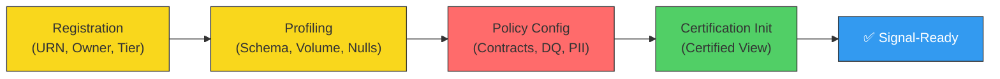
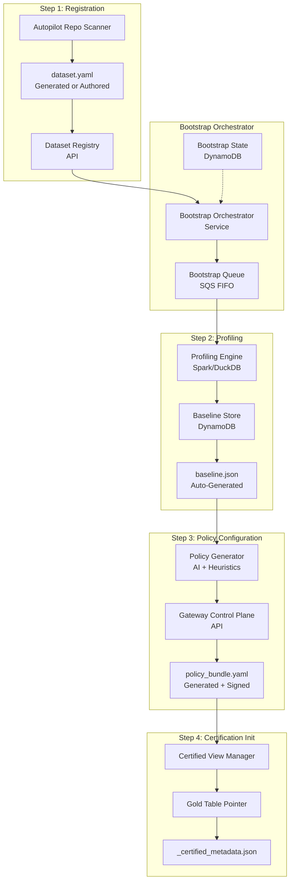
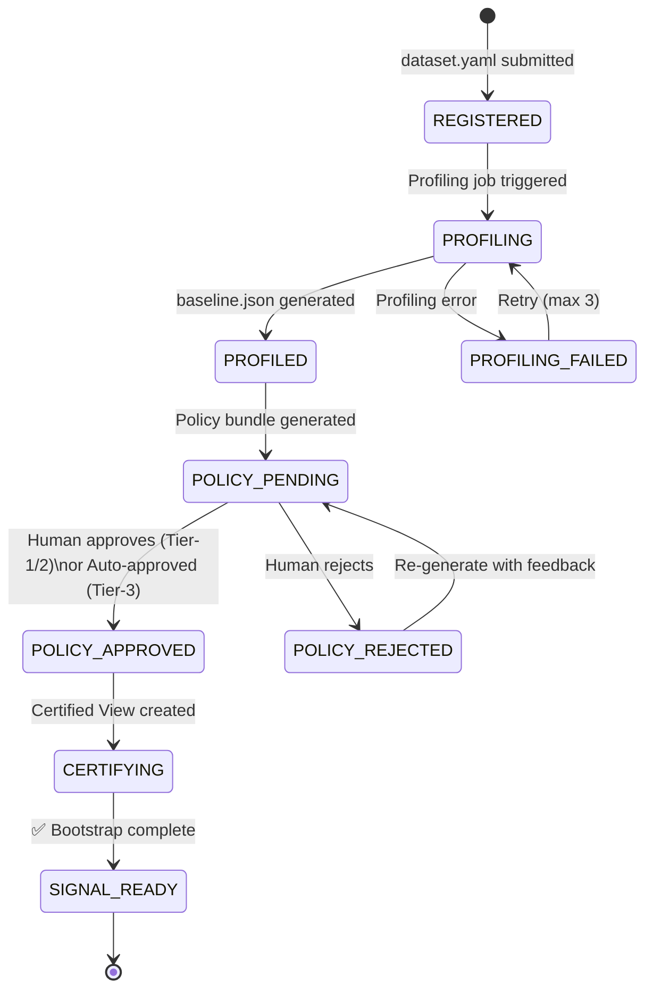
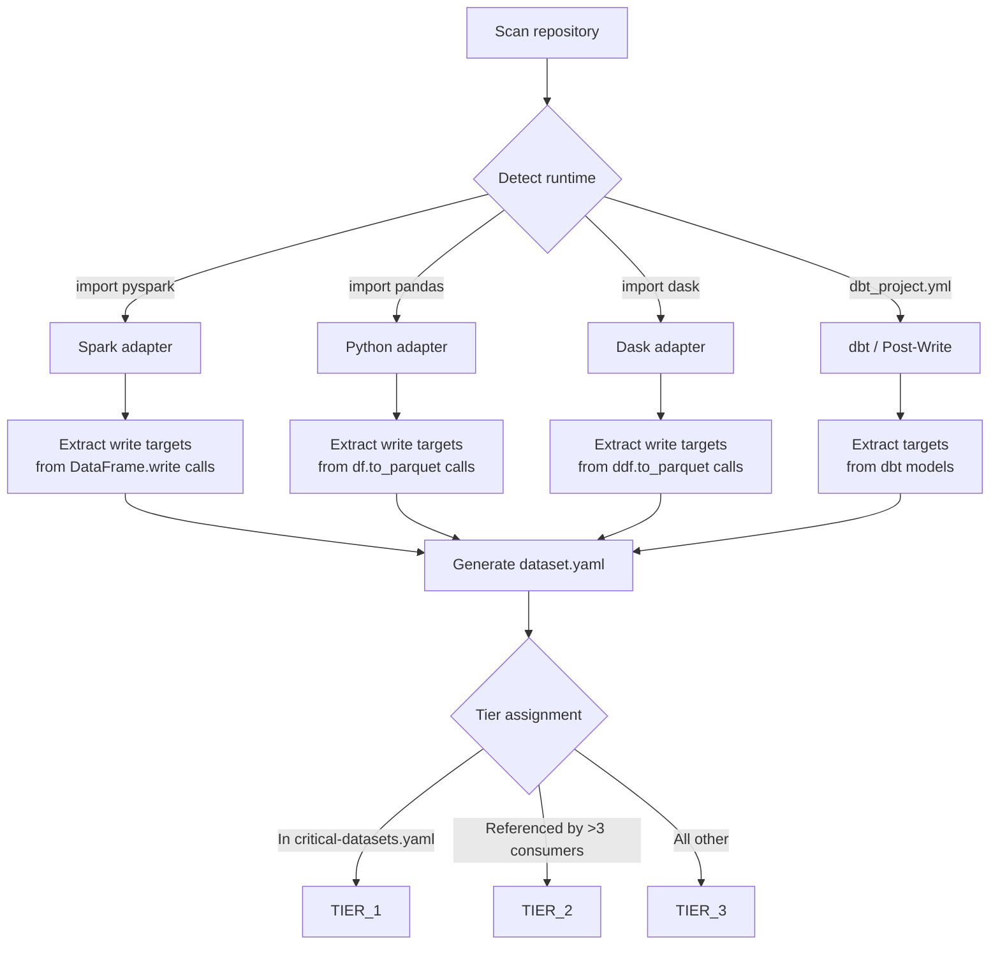
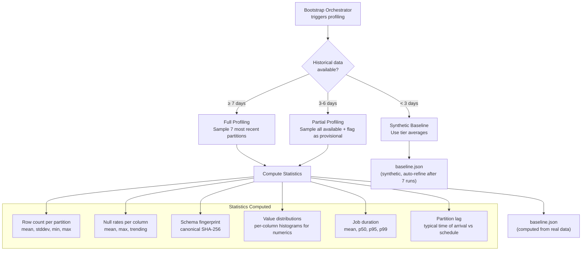
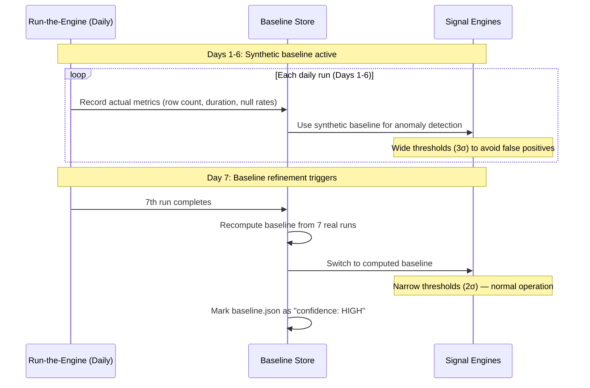
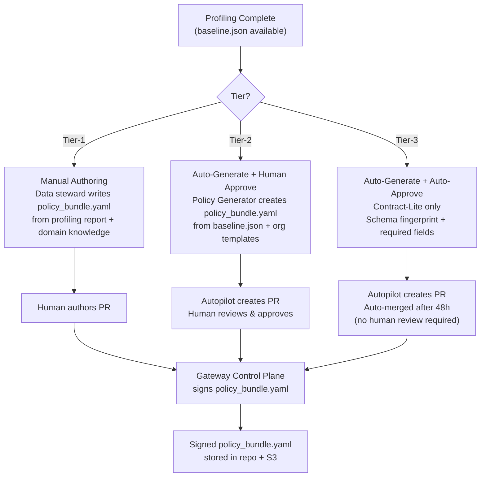
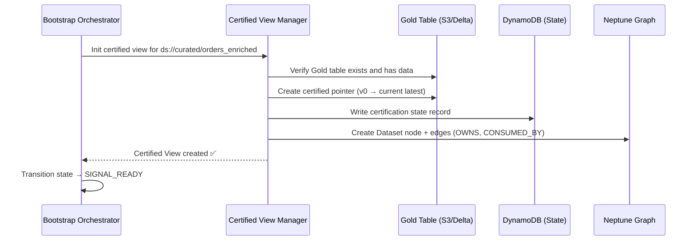
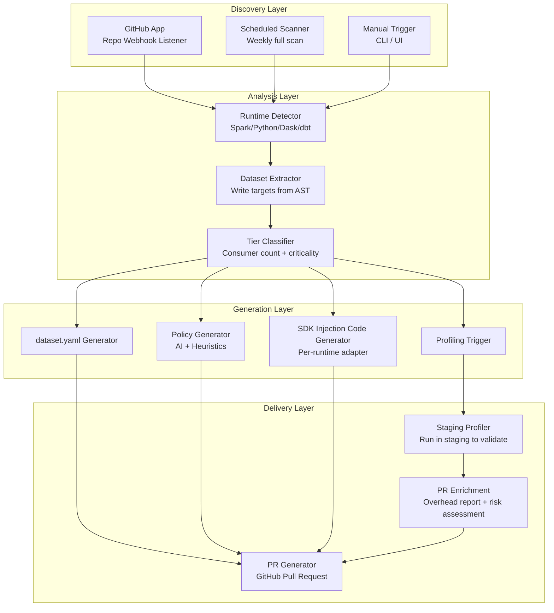

# Signal Factory: Batch Bootstrap & Autopilot — High-Level Design

> **Version:** 1.0  
> **Date:** February 16, 2026  
> **Status:** Draft  
> **Scope:** One-Time Bootstrap Onboarding & Autopilot-Driven Adoption for Batch Observability  
> **Parent Documents:** `batch_observability_prd.md` (v1.1), `batch_observability_hld.md` (v2.0), `batch_observability_postwrite_hld.md` (v1.0)  
> **Challenges Reference:** `batch_observability_challenges.md` (Principal Architect Review)

---

## 1. Executive Summary

This document is a **deep-dive HLD** into the **Bootstrap** phase of batch data observability — the one-time onboarding process that transforms a raw batch dataset into a "signal-ready" asset within the Signal Factory platform. It also covers the **Autopilot** system that automates and accelerates bootstrap at organizational scale.

The Bootstrap phase is the **critical-path enabler** for the entire batch observability platform. Without it, no dataset emits evidence, no signals are computed, and the RCA Copilot has nothing to reason about. Yet the challenges document (R3) identifies bootstrap as a potential **months-long bottleneck**: 500 datasets × 4 steps × ~2 hours per step = 4,000 person-hours of onboarding work.

This HLD defines the architecture, workflows, data models, and automation strategies that reduce that burden to **< 500 person-hours** (an 8× improvement) through tiered automation, progressive policy enrichment, and the Autopilot push model.

### Key Design Principles

| Principle | Description |
|:---|:---|
| **Tiered Automation** | Tier-1 datasets get human-authored policies; Tier-2 gets auto-generated + human-approved; Tier-3 gets fully automated |
| **Progressive Enrichment** | Start with Contract-Lite (schema fingerprint only), progressively add richer policies as data accumulates |
| **Synthetic Baselines** | New datasets with < 7 days of history use organizational tier averages as temporary baselines |
| **Approval, Not Authoring** | For Tier-2/3, the human role shifts from writing policies to reviewing auto-generated ones |
| **Bootstrap → Run-the-Engine Handoff** | Clear, deterministic transition: a dataset is "signal-ready" when it has a valid `policy_bundle.yaml` and a Certified View pointer |

---

## 2. Problem Statement: Why Bootstrap Is Hard

### 2.1 The Bootstrap Paradox (Cold Start)

The Signal Factory's value flywheel depends on instrumented datasets:

```
RCA quality improves → teams adopt richer contracts → signal quality improves → RCA improves further
```

But without initial bootstrap, **the flywheel never starts**. Each dataset requires four sequential steps, each involving human decisions:



**Step C (Policy Configuration)** is the bottleneck — it requires domain expertise and often lives with different people (data engineers, data stewards, security) depending on the policy type (schema, contracts, PII).

### 2.2 Scale Challenge

| Fleet Size | Manual Bootstrap Cost | With Autopilot (Target) |
|:---|:---|:---|
| 50 datasets (pilot) | ~400 person-hours (~2.5 FTE-months) | ~50 person-hours |
| 200 datasets (Phase 2) | ~1,600 person-hours (~10 FTE-months) | ~200 person-hours |
| 500 datasets (full fleet) | ~4,000 person-hours (~25 FTE-months) | ~500 person-hours |

### 2.3 Quality Challenge

Manual bootstrap produces inconsistent results:
- Different engineers create policies with different rigor levels
- Schema fingerprints may use different algorithms across teams
- PII classification is subjective without standardized patterns
- Volume baselines are guesses when historical data isn't analyzed

---

## 3. Bootstrap Architecture Overview



### 3.1 Bootstrap Orchestrator

The Bootstrap Orchestrator is a **stateful workflow service** that manages the four-step lifecycle for each dataset being onboarded. It tracks progress, handles failures, and coordinates human approvals.

| Property | Design |
|:---|:---|
| **Runtime** | AWS Step Functions (state machine per dataset) |
| **State store** | DynamoDB (`bootstrap_state` table) |
| **Concurrency** | Max 20 parallel bootstraps (to limit profiling compute) |
| **Idempotency** | Each step is idempotent — safe to retry on failure |
| **Timeout** | 72 hours end-to-end (configurable per tier) |

#### Bootstrap State Machine



#### Bootstrap State Record (DynamoDB)

```json
{
  "dataset_urn": "ds://curated/orders_enriched",
  "bootstrap_id": "boot-2026-02-15-001",
  "tier": "TIER_1",
  "current_step": "POLICY_PENDING",
  "started_at": "2026-02-15T10:00:00Z",
  "steps": {
    "registration": {
      "status": "COMPLETED",
      "completed_at": "2026-02-15T10:00:05Z",
      "artifact": "s3://sf-config/datasets/orders_enriched/dataset.yaml"
    },
    "profiling": {
      "status": "COMPLETED",
      "completed_at": "2026-02-15T10:35:00Z",
      "artifact": "s3://sf-config/datasets/orders_enriched/baseline.json",
      "profiling_job_id": "emr-profile-abc123",
      "days_sampled": 7,
      "rows_sampled": 996450
    },
    "policy_config": {
      "status": "PENDING_APPROVAL",
      "artifact": "s3://sf-config/datasets/orders_enriched/policy_bundle.yaml",
      "pr_url": "https://github.com/org/data-pipelines/pull/1842",
      "generated_by": "autopilot",
      "awaiting_approval_from": "data-platform-leads"
    },
    "certification_init": {
      "status": "NOT_STARTED"
    }
  },
  "enforcement_model": "inline_sdk",
  "runtime_detected": "spark"
}
```

---

## 4. Step 1 — Registration

### 4.1 Purpose

Registration assigns a **canonical identity** to a batch dataset and captures its ownership, tier, storage locations, and SLO expectations. The output is a `dataset.yaml` file.

### 4.2 Registration Modes

| Mode | Trigger | Tier | Human Effort |
|:---|:---|:---|:---|
| **Manual** | Engineer creates `dataset.yaml` | Tier-1 | Full authoring |
| **Autopilot-Assisted** | Autopilot scans repo, proposes `dataset.yaml` | Tier-2 | Review & approve PR |
| **Autopilot-Auto** | Autopilot scans repo, auto-submits | Tier-3 | None (auto-approved after 48h) |

### 4.3 Autopilot Repo Scanner

The Autopilot Repo Scanner discovers batch datasets by analyzing repository code:



#### Repository Analysis Signals

| Signal | Source | Used For |
|:---|:---|:---|
| Write target paths | `df.write.save("s3://...")` / `df.to_parquet("s3://...")` | `storage.bronze/silver/gold` in `dataset.yaml` |
| Schedule | Airflow DAG `schedule_interval` or cron | `slo.freshness.expected_update_by` |
| Table name | Delta table name / output path | `urn` generation |
| Dependencies | `requirements.txt`, `pyproject.toml` | Runtime detection (Spark/Pandas/Dask) |
| Owning team | `CODEOWNERS`, repo metadata | `owner_team` |
| Consumer count | Neptune graph traversal (if exists) | Tier assignment heuristic |

### 4.4 dataset.yaml Schema

```yaml
# dataset.yaml v1.0 — Dataset Registration Manifest
urn: "ds://curated/orders_enriched"      # Canonical universal resource name
owner_team: "data-platform"              # CODEOWNERS-derived or manual
tier: TIER_1                             # TIER_1 | TIER_2 | TIER_3
runtime: spark                           # spark | python | dask | dbt

storage:
  format: delta                          # delta | iceberg | parquet | csv
  bronze: "s3://lake/bronze/orders/"
  silver: "s3://lake/silver/orders/"
  gold: "s3://lake/gold/orders/"
  staging: "s3://lake/gold/_staging/orders/"     # Post-write model only
  quarantine: "s3://lake/quarantine/orders/"
  partition_key: "dt"

orchestration:
  platform: airflow                      # airflow | step_functions | dagster
  dag_id: "orders_daily_pipeline"
  task_id: "transform_orders"
  schedule: "0 2 * * *"                  # Cron expression

slo:
  freshness:
    expected_update_by: "02:00 ET daily"
    grace_period: "30m"
    max_staleness_hours: 24              # Tier-dependent default
  volume:
    min_rows_per_partition: 100000
    anomaly_threshold_pct: 40

enforcement_model: inline_sdk           # inline_sdk | post_write
openlineage:
  enabled: true
  namespace: "airflow://prod"
  job_name: "orders_daily_pipeline.transform_orders"

metadata:
  created_at: "2026-02-15T10:00:00Z"
  created_by: "autopilot"               # autopilot | human:<username>
  bootstrap_id: "boot-2026-02-15-001"
```

### 4.5 Enforcement Model Selection

The Bootstrap Orchestrator recommends an enforcement model based on dataset profile:

| Dataset Profile | Recommended Model | Rationale |
|:---|:---|:---|
| **Tier-1, Spark/Python/Dask** | Inline SDK | Row-level quarantine, zero consumer exposure |
| **Tier-2, any runtime** | Post-Write Validation | Fast onboarding, staging pattern sufficient |
| **Tier-3, any runtime** | Post-Write + OpenLineage only | Minimal overhead, freshness/lifecycle alerts |
| **dbt models** | Post-Write Validation | Cannot inject SDK into dbt |
| **Legacy Glue / unmodifiable jobs** | Post-Write Validation | Can't change job code |

---

## 5. Step 2 — Profiling & Baselining

### 5.1 Purpose

Profiling collects statistical baselines from existing data so that the Signal Engines can detect anomalies during Run-the-Engine. The output is a `baseline.json` file.

### 5.2 Profiling Engine Architecture



### 5.3 Profiling Compute Strategy

| Data Volume | Profiling Engine | Execution | Estimated Duration |
|:---|:---|:---|:---|
| < 1M rows × 7 days | **DuckDB** (serverless Lambda) | In-memory scan | < 2 min |
| 1M – 100M rows × 7 days | **Spark** (EMR Serverless) | Distributed scan | 5–15 min |
| > 100M rows × 7 days | **Spark** (EMR Serverless) with sampling | 10% sample | 5–15 min |

### 5.4 baseline.json Schema

```json
{
  "dataset_urn": "ds://curated/orders_enriched",
  "bootstrap_id": "boot-2026-02-15-001",
  "profiling_metadata": {
    "profiled_at": "2026-02-15T10:35:00Z",
    "partitions_sampled": 7,
    "date_range": ["2026-02-08", "2026-02-14"],
    "total_rows_sampled": 996450,
    "profiling_engine": "spark",
    "is_synthetic": false,
    "confidence": "HIGH"
  },
  "volume": {
    "avg_row_count": 142350,
    "stddev_row_count": 12800,
    "min_row_count": 118200,
    "max_row_count": 165800,
    "anomaly_lower_bound": 116750,
    "anomaly_upper_bound": 167950
  },
  "schema": {
    "column_count": 12,
    "canonical_fingerprint": "sha256:A1B2C3D4E5F6...",
    "columns": [
      { "name": "order_id", "type": "STRING", "nullable": false, "null_rate": 0.0 },
      { "name": "customer_id", "type": "STRING", "nullable": false, "null_rate": 0.0002 },
      { "name": "order_total", "type": "DECIMAL", "nullable": false, "null_rate": 0.0 },
      { "name": "email", "type": "STRING", "nullable": true, "null_rate": 0.0312 }
    ]
  },
  "timing": {
    "avg_duration_ms": 485000,
    "p50_duration_ms": 472000,
    "p95_duration_ms": 612000,
    "p99_duration_ms": 780000,
    "typical_arrival_offset_min": -8
  },
  "pii_scan": {
    "columns_with_pii": ["email", "phone", "shipping_addr"],
    "pii_patterns_detected": {
      "email": { "pattern": "EMAIL", "confidence": 0.98 },
      "phone": { "pattern": "PHONE", "confidence": 0.95 },
      "shipping_addr": { "pattern": "ADDRESS", "confidence": 0.87 }
    }
  }
}
```

### 5.5 Synthetic Baselines (Cold Start)

For datasets with insufficient history (< 3 days), the system generates synthetic baselines from organizational averages:

| Tier | Synthetic Volume Baseline | Synthetic Freshness | Auto-Refinement Strategy |
|:---|:---|:---|:---|
| Tier-1 | Median of all Tier-1 datasets in same domain | From `dataset.yaml` SLO | Replaced after 7 real runs; wide alert thresholds until then |
| Tier-2 | 50th percentile org-wide | From `dataset.yaml` SLO | Replaced after 7 real runs |
| Tier-3 | **No volume alerting** until 7 runs | From `dataset.yaml` SLO | Volume gates disabled until refined |

#### Auto-Refinement Workflow



---

## 6. Step 3 — Policy Configuration

### 6.1 Purpose

Policy Configuration creates the `policy_bundle.yaml` — the contract that defines what the SDK (or Validation Service) checks during every Run-the-Engine execution. This is the **most complex and highest-judgment step** in bootstrap.

### 6.2 Policy Generation by Tier



### 6.3 Policy Generator (AI + Heuristics)

The Policy Generator produces `policy_bundle.yaml` from `baseline.json` and organizational templates:

| Policy Section | Generation Strategy | Confidence |
|:---|:---|:---|
| **Schema constraints** | Directly from `baseline.json` schema fingerprint | HIGH — deterministic |
| **Required fields** | Columns with null_rate < 0.1% → `required` | HIGH — statistical |
| **Invariants** | Numeric columns → range checks from min/max in profile; string columns → regex from sample values | MEDIUM — may need tuning |
| **PII detection** | From `baseline.json` PII scan results | HIGH for EMAIL/PHONE/SSN patterns |
| **PII remediation** | Org-default actions per pattern (tokenize/mask/redact) | HIGH — policy, not detection |
| **Freshness SLO** | From `dataset.yaml` (already specified) | HIGH — copied |
| **Volume thresholds** | From `baseline.json` volume statistics | HIGH — statistical |

### 6.4 Progressive Policy Enrichment

New datasets don't need a perfect policy on Day 1. Policies start minimal and grow:

```mermaid
gantt
    title Progressive Policy Enrichment Timeline
    dateFormat  X
    axisFormat  Week %s

    section Contract-Lite
    Schema fingerprint + required fields        :done, w1, 0, 7d
    section Volume Baseline
    Computed from 7 real runs                   :active, w2, 7d, 7d
    section Freshness SLO
    Validated against actual schedule            :w3, 14d, 7d
    section Full Contracts
    Invariants + range checks + PII             :w4, 21d, 14d
    section Advanced
    Referential integrity + ML anomaly          :w5, 35d, 30d
```

| Week | Policy Level | Gates Active | Evidence Quality |
|:---|:---|:---|:---|
| **Week 1** | Contract-Lite | G1 (Resolution), G2 (Identity), G3 (Schema) | Basic — schema drift only |
| **Week 2** | + Volume baseline | + Volume Engine | Row count anomalies detected |
| **Week 3** | + Freshness SLO | + Freshness Engine | Late/missing runs detected |
| **Week 4+** | Full contracts (Tier-1 authored, Tier-2 auto-gen) | + G4 (Contract), G5 (PII), DQ | Full observability |

### 6.5 policy_bundle.yaml — Full Schema

```yaml
# policy_bundle.yaml v2.0 — Bootstrap-generated, Gateway-signed
version: "2.0"
dataset_urn: "ds://curated/orders_enriched"
bootstrap_id: "boot-2026-02-15-001"
generated_by: "autopilot"               # autopilot | human:<username>
enrichment_level: "contract_lite"       # contract_lite | volume_baseline | full_contract | advanced

# --- Security (ADR-008) ---
security:
  signature: "sha256:SIGNED_BY_GATEWAY_CONTROL_PLANE"
  minimum_enforcement:
    pii_detection: required
    schema_validation: required
  validation_enabled: true
  
# --- Schema ---
schema:
  mode: strict
  registry: auto
  baseline_fingerprint: "sha256:A1B2C3D4E5F6..."
  constraints:
    - field: order_total
      type: DECIMAL
      nullable: false
    - field: customer_id
      type: STRING
      nullable: false

# --- Contract ---
contract_lite:
  required_fields: [order_id, customer_id, order_total, created_at]
  invariants:
    - "order_total > 0"
    - "created_at IS NOT NULL"

# --- PII ---
pii:
  detection:
    - pattern: EMAIL
      action: tokenize
    - pattern: PHONE
      action: mask
    - pattern: SSN
      action: redact
  scan_columns: [email, phone, ssn, shipping_addr]

# --- Freshness ---
freshness:
  expected_update_by: "02:00 ET daily"
  grace_period: "30m"
  partition_key: "dt"

# --- Performance Budget ---
performance:
  gate_timeout_ms: 10000
  total_validation_budget_pct: 5
  pii_scan_timeout_ms: 10000
  sampling_rate: 1.0

# --- Bootstrap Metadata ---
bootstrap:
  baseline_source: "boot-2026-02-15-001"
  baseline_confidence: "HIGH"
  auto_refine_until: "2026-02-22T00:00:00Z"
  progressive_schedule:
    week_1: [G1_RESOLUTION, G2_IDENTITY, G3_SCHEMA]
    week_2: [G6_VOLUME]
    week_3: [G5_FRESHNESS]
    week_4: [G4_CONTRACT, G5_PII, DQ_CHECKS]
```

---

## 7. Step 4 — Certification Init

### 7.1 Purpose

Certification Init creates the **Certified View** — the permanent, governed consumption surface that downstream consumers use. This is the final bootstrap step and marks the dataset as "signal-ready."

### 7.2 Certification Init Workflow



### 7.3 Certification State Record

```json
{
  "dataset_urn": "ds://curated/orders_enriched",
  "certified_view_name": "gold_certified.orders",
  "current_certified_version": "v0",
  "last_certified_at": "2026-02-15T11:00:00Z",
  "certification_status": "CERTIFIED",
  "staleness_sla_hours": 24,
  "bootstrap_id": "boot-2026-02-15-001",
  "enforcement_model": "inline_sdk",
  "policy_bundle_version": "1.0",
  "policy_bundle_location": "s3://sf-config/datasets/orders_enriched/policy_bundle.yaml"
}
```

### 7.4 Bootstrap → Run-the-Engine Handoff

The handoff occurs when all four steps complete. At this point:

1. **`dataset.yaml`** is registered in the Dataset Registry
2. **`baseline.json`** is stored in the Baseline Store (DynamoDB)
3. **`policy_bundle.yaml`** is signed and stored in the repo + S3
4. **Certified View** pointer exists and points to initial version
5. **Neptune Graph** has a `Dataset` node with ownership and consumer edges

The Run-the-Engine SDK (or Post-Write Validation Service) reads the `policy_bundle.yaml` on every execution and evaluates the active gates according to the progressive schedule.

---

## 8. Autopilot: Fleet-Scale Bootstrap Automation

### 8.1 Autopilot Architecture for Bootstrap



### 8.2 Autopilot PR Contents

Each Autopilot-generated PR includes:

| File/Section | Purpose | Example |
|:---|:---|:---|
| **`dataset.yaml`** | Dataset registration manifest | URN, owner, tier, storage paths, SLOs |
| **`policy_bundle.yaml`** | Policy configuration (Contract-Lite for initial PR) | Schema constraints, required fields |
| **SDK integration code** | Runtime-specific instrumentation | Spark Listener, `@sf.job` decorator, Dask plugin |
| **Staging profiling report** | Proves SDK overhead is within budget | "SDK adds 2.3s to 485s job = 0.47% overhead" |
| **Risk assessment** | Classifies change impact | "LOW: Contract-Lite only, no inline DQ" |
| **Rollback instructions** | One-command revert | `git revert <commit>` or kill-switch toggle |

### 8.3 PR Merge Acceleration

| PR Type | Tier | Merge Strategy | Merge SLA |
|:---|:---|:---|:---|
| **Contract-Lite only** (schema fingerprint) | Tier-3 | Auto-merge after 48h, no human review | 48 hours |
| **Contract-Lite + Volume** | Tier-2 | Human approves; staging profiling report attached | 10 business days |
| **Full contracts + Inline SDK** | Tier-1 | Human reviews + staging validation required | 5 business days |

### 8.4 Fleet Bootstrap Dashboard

| Metric | Target | Alert |
|:---|:---|:---|
| Datasets bootstrapped / total datasets | > 80% within 60 days | Weekly report if < target pace |
| Bootstrap step failure rate | < 5% | Alert if profiling failures spike |
| Autopilot PR merge rate | > 60% auto-merged | Escalate if Tier-3 PRs rejected |
| Time from PR creation to merge | Tier-1: 5d, Tier-2: 10d, Tier-3: 48h | Alert if SLA exceeded |
| Datasets stuck in `POLICY_PENDING` | 0 for > 10 days | Escalate to team lead |

---

## 9. Bootstrap for Both Enforcement Models

The Bootstrap process adapts its final output depending on the chosen enforcement model:

| Bootstrap Step | Inline SDK Model | Post-Write Model |
|:---|:---|:---|
| **Step 1: Registration** | Identical `dataset.yaml` | Adds `staging_path` and `hooks` config |
| **Step 2: Profiling** | Identical `baseline.json` | Identical `baseline.json` |
| **Step 3: Policy Config** | `policy_bundle.yaml` in repo; SDK reads at runtime | `dataset.yaml` contains contracts; Validation Service reads from registry |
| **Step 4: Cert Init** | SDK manages Certified View pointer | Validation Service manages Certified View via staging → certify atomic move |
| **SDK Injection** | Autopilot PR adds Spark Listener / decorator / Dask plugin | Autopilot PR changes write path to `_staging/` (or Airflow config override) |
| **Gate evaluation** | Inside the job (SDK) | Outside the job (Validation Service workers) |

---

## 10. Error Handling & Edge Cases

### 10.1 Bootstrap Failure Recovery

| Failure Scenario | Recovery Strategy |
|:---|:---|
| **Profiling job OOM** | Retry with 10% sampling; if still fails, use synthetic baseline |
| **No historical data at all** | Use synthetic baselines with `confidence: LOW`; disable volume alerting until 7 runs |
| **Policy PR rejected** | Autopilot re-generates with reviewer feedback; max 3 attempts before escalation |
| **Gold table doesn't exist yet** | Defer Certification Init until first successful Run-the-Engine write |
| **Schema changes during bootstrap** | Re-profile if schema fingerprint changes between Step 2 and Step 4 |
| **Dataset decommissioned during bootstrap** | Cancel bootstrap; mark state as `CANCELLED` |
| **Concurrent bootstrap attempts** | Idempotency check on `dataset_urn`; reject duplicate bootstrap |

### 10.2 Bootstrap Rollback

If a bootstrapped dataset causes issues during initial Run-the-Engine, the rollback procedure is:

1. **Kill-switch**: Set `validation_enabled: false` in `policy_bundle.yaml` (immediate, no redeploy)
2. **Revert PR**: `git revert` the Autopilot PR to remove SDK integration
3. **Archive bootstrap**: Mark bootstrap state as `ROLLED_BACK` with reason
4. **Preserve baseline**: Keep `baseline.json` for future re-bootstrap attempt

---

## 11. Implementation Phases

### Phase 1: Manual Bootstrap Tooling (Month 1–2)

| Deliverable | Owner |
|:---|:---|
| Bootstrap Orchestrator (Step Functions) | Platform Core |
| Profiling Engine (DuckDB + Spark) | Signal Processing |
| `dataset.yaml` and `baseline.json` schema definitions | Platform Core |
| Manual `policy_bundle.yaml` authoring guide | Autopilot |
| Certified View Manager | Platform Core |
| Bootstrap CLI tool (`sf bootstrap init --urn ...`) | Autopilot |

**Exit Criteria:** 5 Tier-1 datasets successfully bootstrapped end-to-end manually.

### Phase 2: Autopilot Auto-Bootstrap (Month 3–4)

| Deliverable | Owner |
|:---|:---|
| Autopilot Repo Scanner (runtime detection) | Autopilot |
| Policy Generator (AI + heuristics) | Autopilot |
| Staging profiling infrastructure | Autopilot |
| Autopilot PR generation (Contract-Lite) | Autopilot |
| Auto-approve workflow for Tier-3 | Platform Core |
| Fleet Bootstrap Dashboard | AI & Intelligence |

**Exit Criteria:** 50 Tier-2/3 datasets auto-bootstrapped with < 2 hours human effort each.

### Phase 3: Scale & Optimize (Month 5–6)

| Deliverable | Owner |
|:---|:---|
| Full contract auto-generation for Tier-2 | Autopilot |
| Progressive policy enrichment automation | Autopilot + Signal Processing |
| Baseline auto-refinement (synthetic → computed) | Signal Processing |
| Bootstrap self-service portal | AI & Intelligence |
| Fleet-wide bootstrap coverage reporting | AI & Intelligence |

**Exit Criteria:** 80%+ of batch fleet bootstrapped; < 500 person-hours total investment.

---

## 12. Success Metrics

| Metric | Baseline (No Autopilot) | Target (With Autopilot) |
|:---|:---|:---|
| **Time to bootstrap Tier-1 dataset** | 8–16 hours | 4–6 hours |
| **Time to bootstrap Tier-2 dataset** | 4–8 hours | 30–60 min (review only) |
| **Time to bootstrap Tier-3 dataset** | 2–4 hours | 0 min (fully automated) |
| **Fleet coverage at 60 days** | ~50 datasets | 400+ datasets |
| **Total person-hours for 500 datasets** | 4,000 hrs | < 500 hrs |
| **Profiling failure rate** | N/A | < 5% |
| **Policy PR merge SLA adherence** | N/A | > 90% |
| **Datasets stuck in bootstrap > 7 days** | N/A | < 5% |

---

## 13. Glossary

| Term | Definition |
|:---|:---|
| **Bootstrap** | One-time onboarding process: registration, profiling, policy config, certification init |
| **Autopilot** | Agent system that auto-generates instrumentation PRs and policy bundles |
| **Contract-Lite** | Minimum viable contract: schema fingerprint + required fields (no invariants) |
| **Policy Bundle** | Signed YAML config defining schema, contract, PII, freshness, and volume rules |
| **Certified View** | Governed consumption surface pointing to last-known-good data version |
| **Synthetic Baseline** | Temporary baseline using org-wide tier averages for new datasets with < 7 days history |
| **Progressive Enrichment** | Strategy of starting with minimal policies and adding richer checks over time |
| **Signal-Ready** | A dataset that has completed all 4 bootstrap steps and can be monitored by Signal Engines |
| **Profiling Engine** | Service that samples historical data to compute statistical baselines |
| **Bootstrap Orchestrator** | Step Functions state machine managing the 4-step bootstrap lifecycle |
| **Fleet Bootstrap** | The process of onboarding all 500+ batch datasets in an organization |
| **Auto-Refinement** | Automatic replacement of synthetic baselines with computed ones after 7 real runs |
