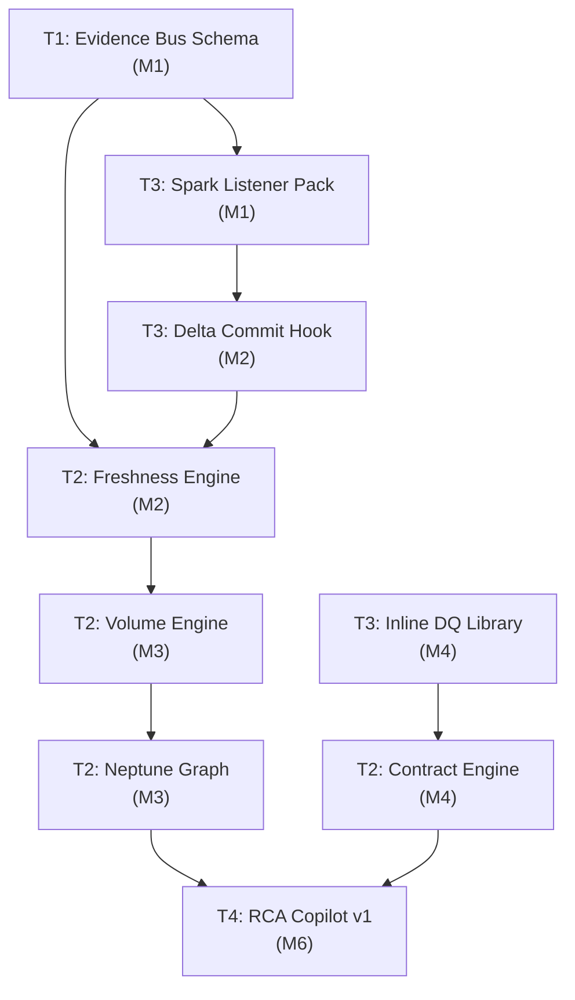

# Batch Data Observability — Challenges, Risks & Architectural Review

**Author Persona:** Principal Solution Architect  
**Date:** February 16, 2026  
**Status:** Architecture Review — For Discussion  
**Inputs:** `batch_observability_prd.md` (v1.1), `batch_observability_hld.md` (v1.0), Signal Factory HLD v2.0 (NotebookLM)

---

## Executive Assessment

Having reviewed the Batch Observability PRD and HLD in the context of the broader Signal Factory architecture, this document provides a comprehensive assessment of **challenges, risks, and architectural concerns** that must be addressed before and during implementation. These findings are organized into seven domains: *Architectural*, *Operational*, *Scale & Performance*, *Cross-Team Coordination*, *Adoption & Cultural*, *Security & Compliance*, and *Strategic & Business*.

The overall design is sound — reusing the Evidence Bus and Signal Engines while adapting enforcement for batch semantics is architecturally elegant. However, the shift from **out-of-band (sidecar) to inline enforcement** introduces a fundamentally different failure domain that permeates every layer of the system. This document unpacks what that means in practice.

> [!WARNING]
> **The single most critical risk** is that inline validation — unlike sidecar enforcement — runs inside the production job. If the Signal Factory SDK crashes, the batch job crashes. This reverses the streaming model's safety guarantee and must be treated as a Tier-0 architectural concern.

---

## 1. Architectural Challenges

### 1.1 The Inline Enforcement Paradox

**Challenge:** The streaming architecture's greatest strength is its out-of-band model: the Policy Enforcer runs as a sidecar, and if it crashes, data still flows. The batch architecture **inverts this guarantee**. The SDK validates DataFrames inline — meaning SDK failures become job failures.

| Property | Streaming (Sidecar) | Batch (Inline) |
|:---|:---|:---|
| SDK crash impact | Data flows; observability gap | **Job fails; data doesn't flow** |
| Latency impact | Zero (reads a copy) | Adds validation overhead to critical path |
| Kill-switch recovery | Restart sidecar | Redeploy job config or SDK version |

**Risks:**
- A bug in the Signal Factory SDK (Python, Spark, or Dask adapter) can **take down production batch jobs** across the fleet
- SDK memory overhead compounds on already memory-constrained Spark executors or Python ECS tasks
- Dask distributed validation introduces per-worker failure modes not present in Spark's centralized driver model

**Recommendations:**
1. **Mandatory fail-open mode**: The SDK must catch all internal exceptions and degrade to `WARN` (emit evidence with `SDK_DEGRADED` reason code) rather than throwing. This must be an architectural invariant, not a configuration option.
2. **Resource isolation**: SDK validation should run in a separate thread pool with bounded memory allocation (e.g., max 5% of executor heap on Spark, max 256MB on Python)
3. **Canary deployments**: SDK version upgrades must roll out job-by-job with automated blast-radius monitoring before fleet-wide rollout
4. **Kill-switch at every layer**: Job-level, cluster-level, and fleet-level kill-switches to disable validation without redeploying code

### 1.2 The Bootstrap Paradox (Cold Start)

**Challenge:** The system relies on a flywheel: the RCA Copilot provides value → teams adopt richer contracts → signal quality improves → Copilot becomes more accurate. But without initial instrumentation, the Copilot has nothing to reason about. The flywheel never starts.

**The Deeper Problem:** Bootstrap Phase A requires four sequential steps (Registration → Profiling → Policy Config → Certification Init) — each requiring human decisions and approvals. For an organization with 500+ batch datasets, this creates a **months-long bottleneck** even with automation.

```
Scenario: 500 datasets × 4 bootstrap steps × avg 2 hours per step = 4,000 person-hours
Even with 50% automation: 2,000 person-hours = ~12 FTE-months of onboarding work
```

**Risks:**
- Teams will resist manual bootstrap effort, especially for Tier-2/3 datasets
- Profiling & Baselining (Step 2) requires 3–7 days of historical data — new datasets have no history
- Policy Bundle creation requires domain expertise that may not exist in centralized platform teams

**Recommendations:**
1. **Auto-bootstrap for Tier-2/3**: Autopilot should auto-generate `dataset.yaml` and `policy_bundle.yaml` from repository analysis + schema inference, requiring only a human **approval** (not authoring)
2. **Progressive bootstrap**: Start with Contract-Lite (schema fingerprint only) and progressively add invariants as the system learns the dataset's behavior
3. **Baseline bootstrapping**: For new datasets, use synthetic baselines (organizational averages by tier) until 7 days of real data accumulates

### 1.3 Neptune Graph Cardinality Explosion

**Challenge:** The Neptune graph is the **backbone of RCA** — every deterministic explanation traverses it. Batch workloads generate fundamentally more lineage metadata than streaming: each DAGRun contains multiple SparkRuns/PythonRuns/DaskRuns, each producing multiple datasets with multiple partitions.

**The Math:**
```
100 DAG runs/day × 5 tasks/DAG × 3 datasets/task × 365 days = 547,500 nodes/year
Add edges (CONTAINS, WROTE_TO, READS, CONSUMED_BY): ~2.7M edges/year
Add FailureSignatures and Incidents: ~3M+ total graph elements/year
```

**Risks:**
- Graph query latency degrades non-linearly as node/edge count grows (Neptune's Gremlin engine is single-threaded for reads)
- TTL-based cleanup (90 days for Run nodes) creates periodic bulk-delete storms that can spike Neptune response times
- If Failure Signatures aren't properly bucketed, each unique error message creates a new node — leading to **high-cardinality explosion**

**Recommendations:**
1. **Strict write filters**: Only write topology (Service, Dataset, Team), RCA nodes (Deployment, Incident, FailureSignature), and causal edges. Never per-record or per-partition nodes
2. **Failure Signature normalization**: Implement a canonicalization layer that maps raw error messages to bucketed signatures (e.g., all `NullPointerException` variants → `NULL_REF:classname`)
3. **Graph tiering**: Hot (< 30 days, full graph), Warm (30–90 days, compressed), Cold (> 90 days, archived to S3 for ad-hoc query only)
4. **Load testing at target scale**: Simulate 12 months of batch + streaming graph growth and validate p95 Gremlin query latency stays under 3s

### 1.4 Evidence Bus Contention (Shared Topic Risk)

**Challenge:** The PRD specifies a shared `signal_factory.evidence` Kafka topic for both batch and streaming evidence. This is architecturally elegant but creates a contention risk.

**The Problem:** Batch jobs are bursty — they emit evidence in concentrated windows (e.g., 02:00–03:00 ET daily). Streaming is continuous. A batch burst can spike Evidence Bus latency for streaming consumers.

```
Scenario: 200 batch jobs complete between 02:00–02:30 ET
Each emits ~50 evidence events = 10,000 evidence events in 30 minutes
+ normal streaming load of ~50,000 events/min
= 60,000 events/min during peak batch window (20% surge)
```

**Risks:**
- Consumer lag on Signal Engines during batch burst windows
- Partition hot-spotting if batch events are keyed by `dataset_urn` (many datasets written by few producers)
- Reprocessing after consumer lag creates false freshness breach alerts

**Recommendations:**
1. **Separate partitioning strategy**: Use composite keys (`runtime_type:dataset_urn`) to distribute batch vs. streaming evidence across partitions
2. **Burst budgets**: Pre-allocate Kafka partition capacity for the batch burst window based on historical patterns
3. **Consumer group isolation**: Dedicate separate consumer groups for batch-sensitive engines (Freshness, Volume) vs. streaming-sensitive engines (Schema Drift)
4. **Consider a separate topic** (`signal_factory.evidence.batch`) with a fan-in aggregator — this directly addresses Open Question #1 in the PRD

### 1.5 Multi-Runtime SDK Consistency

**Challenge:** The HLD specifies three runtime adapters (Spark, Python/Pandas, Dask), each with different instrumentation mechanisms (Spark Listeners, Python decorators, Dask scheduler plugins). Ensuring consistent behavior across runtimes is a significant engineering challenge.

| Dimension | Spark Adapter | Python Adapter | Dask Adapter |
|:---|:---|:---|:---|
| Lifecycle capture | SparkListener callbacks | `@sf.job` decorator | Scheduler plugin |
| Write hook | Delta post-commit | `sf.write()` wrapper | `sf.write()` wrapper |
| Validation model | Spark DataFrame (lazy) | Pandas DataFrame (eager) | Dask DataFrame (lazy + distributed) |
| Failure mode | Driver crash | Process crash | Worker crash (partial) |
| Quarantine | Delta table | File-based | Distributed file-based |

**Risks:**
- Semantic drift: Same gate evaluation (`G4_CONTRACT`) produces different results on Spark vs. Pandas vs. Dask due to type coercion differences
- Dask's distributed validation runs on workers — aggregating per-worker evidence into a single coherent PASS/FAIL is non-trivial (what if 6/8 workers pass but 2 fail?)
- Python decorator approach (`@sf.job`) doesn't capture unhandled exceptions before they propagate

**Recommendations:**
1. **Canonical validation core**: Implement validation logic in a runtime-agnostic core (pure Python) with thin adapter layers for each runtime
2. **Cross-runtime conformance tests**: Maintain a suite of identical test cases validated against all three adapters, with mandatory parity before release
3. **Dask aggregation policy**: Define clear semantics — a Dask job PASSES only if ALL worker partitions pass (not majority)

---

## 2. Operational Challenges

### 2.1 Certified View Staleness

**Challenge:** The Certified View pattern is the crown jewel safety mechanism — but it creates an inherent tension: **safety vs. freshness**. When a gate fails and the view is held at the previous version, downstream consumers technically receive **stale data**.

**Scenario:**
```
Day 1: Job passes all gates → Certified View → v43 (data: Feb 14)
Day 2: Job fails G4_CONTRACT → View held at v43 (consumers still see Feb 14 data)
Day 3: Job still failing → View still at v43 (consumers now see 2-day-old data)
Day 4: Job fixed → View advances to v46 (data: Feb 17)
```

**Risks:**
- Multi-day staleness for downstream dashboards and ML models
- Executive escalations due to "stale data" even though the system is working as designed
- No clear SLA for how long a view can remain in `HELD_AT_PREVIOUS` state before requiring intervention
- BI dashboards may not indicate they're showing stale data — consumers assume data is current

**Recommendations:**
1. **Staleness SLA per tier**: Tier-1 datasets: max 24h in `HELD_AT_PREVIOUS` before escalation; Tier-2: 48h; Tier-3: 72h
2. **Consumer-facing freshness indicator**: Expose a `last_certified_at` timestamp via API/metadata so dashboards can display "Data as of: Feb 14" warnings
3. **Graceful degradation policy**: Define per-dataset whether to show stale-certified or raw-uncertified after staleness SLA expires (this is a product decision, not an engineering one)
4. **Automated re-run triggers**: After quarantine, automatically re-trigger the job with the latest upstream data (requires Airflow/orchestrator integration)

### 2.2 Quarantine Table Proliferation

**Challenge:** Every failed batch run creates a new quarantine table (e.g., `quarantine.orders_20260215_run_abc123`). In a fleet with 500+ datasets and a 5% daily failure rate, quarantine tables accumulate rapidly.

```
500 datasets × 5% failure rate × 365 days = 9,125 quarantine tables/year
Average quarantine table size: ~1,000 rows × 100 columns × 100 bytes = ~10 MB
Total quarantine storage: ~91 GB/year (manageable, but metadata overhead grows)
```

**Risks:**
- **Metadata catalog pollution**: Thousands of quarantine tables in Glue/Hive catalog create noise
- **No lifecycle management**: The PRD/HLD don't specify TTLs for quarantine data — who cleans it up?
- **Replay complexity**: The HLD includes a `replay_id` in quarantine evidence, but the replay mechanism is undefined
- **Cost**: S3 storage costs are minor, but Glue catalog API throttling and Neptune graph edges to quarantine events add up

**Recommendations:**
1. **Quarantine lifecycle policy**: 7-day hot (queryable), 30-day warm (compressed), 90-day cold (archived), then auto-delete
2. **Partition-based quarantine**: Instead of per-run tables, use a single `quarantine.{dataset}` table with `run_id` and `dt` partitions — reduces catalog pollution from 9,125 tables to 500
3. **Automated replay**: Define a "quarantine-and-retry" pattern where the SDK automatically schedules a re-run after quarantine (with human-in-the-loop approval for Hard-Fail gates)
4. **Quarantine dashboard**: Expose aged quarantine data (> 3 days) as an operational metric to prevent silent data loss

### 2.3 Failure Mode: SDK Down vs. Evidence Gap vs. No Data

**Challenge:** The Signal Engines must distinguish between three very different situations, all of which look like "no evidence received":

| Situation | Root Cause | Correct Response |
|:---|:---|:---|
| **SDK down** | SDK crashed; job failed | Alert team; quarantine may not have fired |
| **Evidence gap** | SDK ran but Evidence Bus was unreachable | Retry evidence emission; don't alert falsely |
| **No data today** | Upstream had no data; job correctly wrote 0 rows | No alert (unless volume SLO requires minimum) |

**Risks:**
- False positives: Alerting "FRESHNESS_BREACH" because the SDK failed to emit evidence, not because the job didn't run
- False negatives: Assuming "no evidence = no problems" when the SDK silently failed
- Dask partial failures: 6 of 8 workers emit evidence, 2 crash — the system sees partial evidence and must reason about completeness

**Recommendations:**
1. **Heartbeat evidence**: The SDK should emit periodic `HEARTBEAT` events during job execution (every 60s) so that an abrupt stop in heartbeats is distinguishable from normal completion
2. **Evidence completeness model**: For each `run_id`, expect exactly N evidence events (one per gate per stage). If fewer arrive after job completion, emit `EVIDENCE_INCOMPLETE` signal
3. **Correlation with orchestrator**: Cross-reference `JobRunCompleted`/`Failed` events from Airflow/Step Functions with Evidence Bus events to detect SDK-level failures

### 2.4 Schema Registry Fragmentation

**Challenge:** The batch ecosystem spans multiple schema registries (Glue Schema Registry, Delta Lake's internal schema, Hive Metastore, Iceberg manifests). The SDK must fingerprint schemas across all of these, and the baselines stored during Bootstrap must remain valid as teams migrate between storage formats.

**Risks:**
- Same logical schema produces different fingerprints across registries (e.g., Glue uses Avro schema; Delta uses Parquet schema; Iceberg uses its own)
- Schema evolution rules differ: Delta allows column reordering; Parquet doesn't; Iceberg allows hidden partitioning
- The PRD specifies "strict | compatible | breaking" schema modes, but the semantics differ per storage format

**Recommendations:**
1. **Canonical schema model**: Define a Signal Factory canonical schema representation (column name, type, nullable, position) independent of storage format, and fingerprint that
2. **Registry abstraction layer**: Build adapters that normalize Glue/Delta/Iceberg/Hive schemas into the canonical model before fingerprinting
3. **Migration detection**: When a dataset migrates from Parquet to Delta, the fingerprint changes — the SDK should detect this as a "registry migration" rather than "schema break"

---

## 3. Scale & Performance Challenges

### 3.1 Evidence Bus Throughput Under Load

The Evidence Bus is the **sole integration point** for all downstream systems. Its failure domains are:

| Failure Mode | Trigger | Impact | Mitigation |
|:---|:---|:---|:---|
| **Partition hot-spotting** | Large DAGs emit evidence keyed by 1-2 `dataset_urn` values | Single partition overloaded; consumer lag | Composite partition keys; round-robin for non-keyed events |
| **Burst saturation** | 200+ batch jobs complete in 30-min window | Evidence backlog; delayed freshness alerts | Pre-provisioned burst capacity; autoscaling consumers |
| **Replayability gap** | Consumer group offset lost during upgrade | Evidence gap → false breach alerts | Idempotent evidence IDs; at-least-once delivery with dedup |
| **Schema evolution** | Batch evidence events add fields not in streaming schema | Deserialization failures downstream | Schema registry for Evidence Bus itself; backward-compatible evolution only |

### 3.2 Inline Validation Performance Budget

**Rule of thumb:** The SDK must add **< 5% overhead** to job wall-clock time. For a 10-minute Spark job, that's 30 seconds max for all gate evaluations.

```
Gate evaluation budget for a typical batch job:
  G1 Resolution:  ~50ms  (lookup table)
  G2 Identity:    ~100ms (header/config parsing)
  G3 Schema:      ~200ms (fingerprint compute on 100-column DataFrame)
  G4 Contract:    ~2-5s  (full DataFrame scan for invariant checks)
  G5 PII:         ~5-15s (regex + ML classifier scan across all string columns)
  DQ Checks:      ~2-5s  (null rates, format validation)

  Total: ~10-25s for a 50K-row DataFrame
  For 2.4M rows (Dask): ~3-5 minutes (distributed across workers)
```

**Risks:**
- PII detection is the most expensive gate — ML classifiers on large text fields can dominate runtime
- Dask's lazy evaluation model means validation must either force materialization (expensive) or sample (less accurate)
- Spark's columnar format means per-row invariant checks (`order_total > 0`) require row-level iteration — expensive on wide tables

**Recommendations:**
1. **Sampling for Tier-2/3**: Validate a 10% sample for non-critical datasets; validate 100% for Tier-1
2. **Lazy PII**: Run PII detection only on columns explicitly flagged in the policy bundle, not all string columns
3. **Cached fingerprints**: Schema fingerprints should be cached per-partition and recomputed only when the schema metadata changes
4. **Performance budget per gate**: Set per-gate timeouts (e.g., G5 PII: max 10s) with automatic degradation to sampling if exceeded

### 3.3 Neptune Write Path Bottleneck

**Challenge:** Neptune's write throughput is lower than its read throughput. Batch lineage generates write-heavy patterns (many `WROTE_TO`, `CONTAINS`, `READS` edges per DAGRun).

**Recommendations:**
1. **Batch Neptune writes**: Buffer graph mutations and flush in batches (every 30s or 1,000 edges, whichever comes first)
2. **Async writes**: Graph writes must be fully async — never block evidence processing
3. **Write coalescing**: If the same edge already exists (e.g., `SparkRun → orders_silver` from a retry), skip the write

---

## 4. Cross-Team Coordination Challenges

### 4.1 The Four-Team Dependency Chain

The implementation requires coordinated delivery across four teams, each with competing priorities:

```
Team 1 (Platform Core) ←→ Team 2 (Signal Processing) ←→ Team 3 (Autopilot) ←→ Team 4 (AI & Intel)
       Evidence Bus Schema          Signal Engines                  SDK               RCA Copilot
       Gate Enforcement             Neptune Graph              Repo Scanning          Dashboards
```

**Critical Path Analysis:**



**Risks:**
- **Team 1 is the bottleneck**: Evidence Bus schema extension is a prerequisite for everything. A 2-week delay here cascades across all teams
- **Team 3 (Autopilot) has the widest scope**: SDK for Spark, Python, AND Dask, plus repo scanning, plus PR generation — this is 3-4 engineers' worth of work compressed into one team
- **Team 4 waits 6 months**: The RCA Copilot and dashboards can't be validated until the upstream signal path is complete. Risk of building the wrong thing
- **No dedicated QA team**: Cross-team integration testing (SDK → Evidence Bus → Signal Engine → Neptune → Copilot) requires coordinated end-to-end testing that no single team owns

**Recommendations:**
1. **Integration testing pod**: Form a cross-team "Steel Thread" pod (1 engineer/team) responsible for end-to-end testing from M1 through M6
2. **Contract-first development**: Teams 1/2/3 agree on Evidence Bus event schemas, Neptune node/edge schemas, and SDK interface contracts in M1 — before any implementation
3. **Team 3 staffing**: Allocate additional engineers to Autopilot for the batch SDK push — three runtime adapters + repo scanning is a force multiplier constraint
4. **Team 4 early engagement**: Have Team 4 start building RCA traversal queries against a mock Neptune graph from M2, not M6

### 4.2 Ownership Ambiguity: Contracts

**Challenge:** Who owns the data contract? The document is ambiguous:

- The **Policy Bundle** is stored in the producer's repo → implies producer ownership
- The **Gateway Control Plane** manages policies → implies platform ownership
- **Downstream consumers** are the ones hurt by contract violations → implies consumer-driven requirements

**Risk:** Without clear ownership, contracts become stale. Producers won't update contracts they don't feel accountable for.

**Recommendation:** Adopt a **"Producer authors, consumer validates, platform enforces"** model:
- Producers own `policy_bundle.yaml` in their repo
- Consumers register their expectations (required fields, freshness SLOs) with the Gateway Control Plane
- Platform enforces the intersection and alerts on gaps

### 4.3 The "PR Merge" Bottleneck

**Challenge:** Autopilot generates PRs, but humans must merge them. The PRD assumes 60% auto-merge rate, but this is optimistic for batch repos where engineers are protective of job performance.

**Risks:**
- PRs languish in review queues for weeks, especially during hack weeks, holidays, or reorgs
- Engineers may reject PRs due to perceived performance risk without profiling evidence
- Rate-limiting (max 2 PRs/repo/week) slows coverage but is necessary to avoid "PR storm" fatigue

**Recommendations:**
1. **Executive mandate**: Include Autopilot PR merge SLAs in quarterly OKRs (e.g., "95% of Tier-1 batch repos merge instrumentation PR within 5 business days")
2. **Performance proof**: Each Autopilot PR should include profiling data from a staging run showing actual overhead (e.g., "This PR adds 2.3s to a 485s job = 0.47% overhead")
3. **Auto-merge for Contract-Lite**: If the PR only adds schema fingerprinting (no inline validation), auto-merge with a 48h rollback window

---

## 5. Adoption & Cultural Challenges

### 5.1 Progressive Gate Fatigue

**Challenge:** The G0 → G3 progressive gate model spans ~6 months. During G0/G1 (Visibility + Warn), teams receive dashboards and warnings but **no enforcement**. Risk: teams ignore warnings because there are no consequences.

**Risks:**
- "Warning fatigue" — teams become desensitized to CI warnings by Week 5
- Gap between G1 (Warn) and G2 (Soft-Fail) is 60 days — too long for momentum
- G3 (Hard-Fail) at Week 17 creates a "cliff" — teams that ignored warnings suddenly face production blocks

**Recommendations:**
1. **Compress timeline**: G0 (2 weeks) → G1 (3 weeks) → G2 (6 weeks) → G3 (rolling by tier)
2. **Gamification**: Publish a "Data Quality Leaderboard" showing per-team compliance rates during G0/G1 to create positive peer pressure
3. **Tier-based G3**: Tier-1 datasets hit G3 at Week 12; Tier-2 at Week 20; Tier-3 opt-in only
4. **Consequence at G1**: Instead of just CI warnings, add a Slack notification to the team channel for every contract violation (social accountability)

### 5.2 Trust Calibration

**Challenge:** The system's value proposition ("RCA Copilot explains 70% of incidents in < 2 min") requires teams to trust the system's explanations. But early-stage explanations will be incomplete (limited graph data) and occasionally wrong (correlation ≠ causation).

**Risks:**
- A single incorrect RCA explanation early on can destroy trust ("the system blamed my deployment, but it was an upstream issue")
- Teams may resist Autopilot PRs if they don't trust the system's accuracy
- False positive volume anomaly alerts (predicted: High likelihood) will erode confidence in the entire platform

**Recommendations:**
1. **Confidence scores**: Every RCA explanation should include a confidence score (HIGH/MEDIUM/LOW) based on graph completeness
2. **"Explain the explanation"**: Show the Gremlin traversal path taken, so engineers can verify the logic
3. **Feedback loop**: Add a 👍/👎 rating to every RCA explanation to calibrate accuracy and build a training set
4. **False positive budget**: Commit to < 5% false positive rate for volume anomalies; halt rollout if exceeded

---

## 6. Security & Compliance Challenges

### 6.1 PII in Evidence Events

**Challenge:** The SDK scans for PII and remediates it (tokenize/mask/redact) in the data. But what about PII in the **evidence events themselves**? If a contract failure includes a `sample_record_id: "ORD-55555"`, does the Evidence Bus now contain PII-adjacent data?

**Risks:**
- Evidence Bus retains data for indefinite periods — PII in evidence violates GDPR's "purpose limitation" principle
- Stack traces in `JobRunFailed` events may contain PII from exception messages
- `quarantine_table` paths in evidence events are effectively pointers to PII data

**Recommendations:**
1. **Evidence PII policy**: Define what fields in evidence events can contain raw values vs. must be anonymized
2. **Stack trace sanitization**: Before emitting `JobRunFailed`, strip sensitive values from stack traces
3. **Quarantine access controls**: Quarantine tables must inherit (or exceed) the PII access controls of the source dataset
4. **Evidence Bus retention**: Set evidence topic retention to 90 days (not indefinite) with archival to encrypted S3

### 6.2 Policy Bundle Security

**Challenge:** `policy_bundle.yaml` files are stored in application repos. They define PII detection patterns, contract invariants, and schema constraints. These are effectively **security policies in code**.

**Risks:**
- A malicious or negligent developer could disable PII detection by modifying the policy bundle
- No audit trail for policy bundle changes (beyond Git history)
- Policy bundles in different repos may conflict (e.g., one dataset expects `strict` schema, another in the same DAG expects `compatible`)

**Recommendations:**
1. **Policy bundle signing**: The Gateway Control Plane should sign approved policy bundles; the SDK should validate the signature before evaluating gates
2. **Policy bundle CI checks**: Add a CI step that validates policy bundle changes against organizational minimums (e.g., PII detection cannot be disabled for Tier-1)
3. **Centralized policy override**: The platform should be able to enforce minimum policy regardless of repo-level configuration

---

## 7. Strategic & Business Challenges

### 7.1 ROI Justification Timeline

**Challenge:** The PRD promises MTTD < 15 min and MTTR < 30 min at 12 months. But the first 6 months produce limited measurable value: G0/G1 gates don't prevent incidents, only detect them. The Steel Thread (Phase 1) covers only ONE pipeline.

**Timeline to measurable ROI:**
```
Months 1-3:  Investment only (Steel Thread on 1 pipeline)
Months 4-6:  50% Tier-1 coverage (partial value)
Months 7-9:  Scaled coverage + automation (breakeven)
Months 10-12: Full production hardening (ROI positive)
```

**Risk:** Executive sponsorship may waver at Month 4–6 when investment is high but measurable incident reduction is marginal (most incidents still involve non-instrumented pipelines).

**Recommendations:**
1. **Quick wins in Phase 1**: Target the pilot Steel Thread at the organization's most problematic batch pipeline (highest incident count) to demonstrate dramatic MTTR improvement immediately
2. **Value dashboard from Day 1**: Track and publish "incidents that WOULD have been detected faster" even during G0 phase (shadow-mode value attribution)
3. **Monthly stakeholder updates**: Report coverage %, MTTD trends, and RCA Copilot accuracy to maintain executive confidence

### 7.2 Vendor Lock-in

**Challenge:** The architecture is deeply coupled to AWS services: Neptune (graph), DynamoDB (state), MSK (Kafka), Glue (schema registry), S3 (storage), EMR (compute). A multi-cloud or cloud-migration initiative would require significant rework.

**Recommendations:**
1. **Wrap AWS SDK calls**: Use internal abstraction layers (e.g., `GraphStore`, `StateStore`, `EventBus` interfaces) that can be re-implemented for other clouds
2. **OpenLineage as abstraction**: Continue using OpenLineage as the standard integration point — it's cloud-agnostic by design
3. **Document cloud-specific vs. cloud-agnostic components**: Make it clear which components require AWS and which are portable

---

## 8. Consolidated Risk Matrix

| # | Risk | Likelihood | Impact | Priority | Mitigation |
|:--|:---|:---|:---|:---|:---|
| R1 | **SDK crash kills production job** | Medium | 🔴 Critical | P0 | Fail-open mode; resource isolation; kill-switch |
| R2 | **Neptune graph explosion** | High | 🔴 Critical | P0 | Failure Signature bucketing; strict write filters |
| R3 | **Bootstrap onboarding bottleneck** | High | 🟠 High | P1 | Auto-bootstrap; progressive policy; synthetic baselines |
| R4 | **Evidence Bus burst saturation** | Medium | 🟠 High | P1 | Separate partitioning; burst budgets; consumer group isolation |
| R5 | **Multi-runtime SDK inconsistency** | Medium | 🟠 High | P1 | Canonical core; cross-runtime conformance tests |
| R6 | **Certified View staleness** | High | 🟡 Medium | P2 | Staleness SLAs; consumer-facing freshness indicators |
| R7 | **Quarantine table proliferation** | Medium | 🟡 Medium | P2 | Partition-based quarantine; lifecycle policies |
| R8 | **PR merge bottleneck** | High | 🟡 Medium | P2 | Executive mandate; performance proof; auto-merge for Contract-Lite |
| R9 | **False positive volume alerts** | High | 🟡 Medium | P2 | ML seasonal baselines; configurable thresholds; < 5% false positive budget |
| R10 | **Cross-team coordination delays** | Medium | 🟠 High | P1 | Integration pod; contract-first development |
| R11 | **PII in evidence events** | Low | 🔴 Critical | P1 | Evidence PII policy; stack trace sanitization |
| R12 | **Schema registry fragmentation** | Medium | 🟠 High | P1 | Canonical schema model; registry abstraction layer |
| R13 | **Trust erosion from bad RCA** | Medium | 🟡 Medium | P2 | Confidence scores; feedback loops; explain-the-explanation |
| R14 | **Progressive gate fatigue** | Medium | 🟡 Medium | P2 | Compress timeline; gamification; tier-based G3 |
| R15 | **ROI justification gap** | Medium | 🟡 Medium | P2 | Target worst pipeline first; shadow-mode value attribution |

---

## 9. Recommended Pre-Implementation Actions

Before writing code for Phase 1, I recommend the following **architecture and alignment activities**:

### Week 0: Architecture Decision Records (ADRs)

| ADR | Decision Needed |
|:---|:---|
| ADR-001 | Shared vs. separate Evidence Bus topic for batch |
| ADR-002 | SDK fail-open semantics and kill-switch design |
| ADR-003 | Canonical schema model and fingerprinting algorithm |
| ADR-004 | Quarantine table strategy (per-run vs. partitioned) |
| ADR-005 | Neptune write buffer and TTL strategy |
| ADR-006 | Dask distributed validation aggregation policy |
| ADR-007 | Evidence PII sanitization policy |
| ADR-008 | Policy bundle signing and governance model |

### Week 1: Cross-Team API Contracts

Define and freeze the following contracts before implementation begins:

1. **Evidence Bus event schemas** (JSON schema for all batch event types)
2. **Neptune node/edge type definitions** (property names, TTLs, cardinality limits)
3. **SDK public API** (interface for Spark/Python/Dask adapters — method signatures, error handling semantics)
4. **Gateway Control Plane API** (endpoints for policy bundle CRUD, certification state management)

### Week 2: Steel Thread Selection & Baseline

1. Select the pilot Tier-1 batch pipeline (highest incident count + simplest DAG)
2. Establish baseline MTTD/MTTR for that pipeline from the last 90 days of incidents
3. Set up monitoring for SDK overhead profiling in staging

---

## 10. Conclusion

The Batch Data Observability design is architecturally ambitious and well-conceived. The reuse of Signal Factory primitives and the Bootstrap/Run-the-Engine lifecycle are sound innovations. However, the shift to inline enforcement introduces systemic risks that must be treated as P0 concerns before implementation begins.

The three most critical items requiring immediate resolution are:

1. **SDK fail-safety** (R1): The inline model must be fail-open by design — this is non-negotiable
2. **Neptune graph control** (R2): Without strict cardinality controls, the RCA backbone collapses under batch lineage volume
3. **Cross-team alignment** (R10): Four teams building in parallel without frozen API contracts will produce integration failures at Month 3

With these addressed, the 12-month roadmap is achievable and the platform will deliver significant value to the organization's batch data reliability posture.

---

*— Principal Solution Architect Review*
