# Signal Factory: Batch Data Observability — High-Level Design

> **Version:** 2.0  
> **Date:** February 16, 2026  
> **Status:** Architecture Review Complete  
> **Reference:** [Signal Factory HLD v2.0 (NotebookLM)](https://notebooklm.google.com/notebook/d4818680-4804-4c18-8773-0830a5c450c2) • `batch_workflow_data_observability_prd.md`  
> **Changelog:** v2.0 addresses all challenges from `batch_observability_challenges.md` (Principal Architect Review)

---

## 1. Executive Summary

This document specifies the **High-Level Design (HLD)** for extending the Signal Factory data observability platform to **batch workflows** — including **PySpark / Spark**, **Python scripts**, **Python Dask**, Airflow, Glue, EMR, and scheduled ETL/ELT jobs.

The Signal Factory's streaming architecture relies on an **Out-of-Band Policy Enforcer** (sidecar) that observes Kafka events *after* publication. Batch workloads, however, write directly to storage (Delta Lake, Parquet, Iceberg). This means enforcement must happen **inline** — within the processing job itself — using Autopilot-injected validation libraries.

The key design innovations for batch are:

| Innovation | Description |
|:---|:---|
| **Inline Enforcement** | Validation runs *inside* the batch job (Spark, Python, Dask) via SDK, not as a sidecar |
| **Fail-Open Safety Model** | SDK crash never kills production; three-tier kill-switch for fleet-wide disable (v2.0) |
| **Bootstrap → Run-the-Engine** | One-time profiling & policy setup decoupled from daily light-touch execution |
| **Auto-Bootstrap** | Tier-2/3 datasets onboarded automatically with progressive gate rollout (v2.0) |
| **Certified View Pattern** | Downstream consumers always see the "last known good" data version |
| **Staleness SLAs** | Max hold-at-previous duration per tier with automated re-run + escalation (v2.0) |
| **Quarantine Mechanism** | Failed data routed to partitioned isolation tables — never touches Gold |
| **Evidence Disambiguation** | Heartbeat + completeness model distinguishes SDK crash / evidence gap / no data (v2.0) |
| **Watermark-Based Freshness** | Partition-aware freshness replaces streaming latency-based model |
| **Tier-Split Evidence Bus** | Separate Kafka topics per tier to prevent head-of-line blocking at scale (v2.0) |

> [!IMPORTANT]
> Despite different enforcement models (inline vs. sidecar), batch and streaming converge at the **Evidence Bus**, ensuring a single pane of glass for all data observability.

---

## 2. Architecture Context: The Five-Plane Model

The Signal Factory operates on a **Five-Plane Model** where each plane has distinct responsibilities. The batch module adapts Planes 1 and 2 while sharing Planes 3–5 with streaming.


### Plane-by-Plane Breakdown

| Plane | Streaming Behavior | Batch Adaptation |
|:---|:---|:---|
| **1 — Production** | Microservices publish to Kafka topics | Spark/Glue/Python/Dask jobs write to Delta/Parquet/CSV in S3 |
| **2 — Enforcement** | Sidecar Policy Enforcer reads Kafka out-of-band | Inline SDK validates DataFrames/Dask DataFrames/Pandas DataFrames inside job |
| **3 — Processing** | Signal Engines consume Evidence Bus | **Shared** — identical engines for batch & streaming |
| **4 — Knowledge** | Neptune stores Service → Dataset → Deployment edges | Extends graph with `SparkRun`, `PythonRun`, `DaskRun`, `DAGRun`, `BatchDataset` nodes |
| **5 — Consumption** | RCA Copilot traverses graph for streaming incidents | Extends traversal with `run_id`/`dag_run_id` correlation |

---

## 3. Batch Enforcement Model: Inline Validation

### 3.1 Why Inline (Not Sidecar)?

```
┌─────────────────────────────────────────────────────────┐
│ STREAMING (Out-of-Band)                                 │
│                                                         │
│  Producer → Kafka Topic → Policy Enforcer (sidecar)     │
│                               ↓                         │
│                        Evidence Bus                      │
│  Data flows freely; enforcer observes a copy             │
└─────────────────────────────────────────────────────────┘

┌─────────────────────────────────────────────────────────┐
│ BATCH — SPARK (Inline)                                  │
│                                                         │
│  Spark Job reads → Validates (SDK) → Writes to Delta    │
│                        ↓                                │
│                 Evidence Bus                             │
│  SDK validates DataFrames BEFORE write to storage        │
└─────────────────────────────────────────────────────────┘

┌─────────────────────────────────────────────────────────┐
│ BATCH — PYTHON (Inline)                                 │
│                                                         │
│  Python Script reads → Validates (SDK) → Writes Parquet │
│                            ↓                            │
│                     Evidence Bus                         │
│  SDK validates Pandas DataFrames BEFORE write to storage │
└─────────────────────────────────────────────────────────┘

┌─────────────────────────────────────────────────────────┐
│ BATCH — DASK (Inline)                                   │
│                                                         │
│  Dask Job reads → Validates (SDK) → Writes to Parquet   │
│                        ↓                                │
│                 Evidence Bus                             │
│  SDK validates Dask DataFrames BEFORE write to storage   │
└─────────────────────────────────────────────────────────┘
```

Batch data is **at-rest** once written. There is no streaming bus to "tap". The SDK therefore:

1. **Intercepts** DataFrame writes at stage boundaries (Bronze → Silver → Gold)
2. **Evaluates** the policy bundle gates against the data
3. **Emits** evidence asynchronously to the Evidence Bus (non-blocking)
4. **Routes** failed data to quarantine tables before it reaches Gold

### 3.2 Fail-Open Safety Design (ADR-002)

> [!CRITICAL]
> **Architectural Invariant:** The Signal Factory SDK MUST operate in **fail-open mode** by default. An SDK crash, timeout, or internal error must NEVER cause a production batch job to fail. This is the inverse of streaming's sidecar model and is treated as a Tier-0 design constraint.

The inline model creates a fundamentally different failure domain than streaming:

| Property | Streaming (Sidecar) | Batch (Inline) — v1.0 Risk | Batch (Inline) — v2.0 Mitigation |
|:---|:---|:---|:---|
| SDK crash impact | Data flows; observability gap | ~~Job fails; data doesn't flow~~ | **Job continues; evidence gap emitted** |
| Latency impact | Zero (reads a copy) | Adds validation overhead | **< 5% overhead budget enforced** |
| Kill-switch recovery | Restart sidecar | ~~Redeploy job config~~ | **Runtime kill-switch; no redeploy needed** |

#### Fail-Open Exception Handler

Every SDK entry point wraps validation in a safety envelope:

```python
# Internal SDK safety wrapper — NOT user-facing code
class SignalFactorySafetyEnvelope:
    """All SDK operations execute inside this envelope.
    Any uncaught exception degrades to WARN, never crashes the job."""
    
    def execute_gate(self, gate_fn, gate_name, **kwargs):
        try:
            if self.kill_switch.is_active():
                return GateResult(status="SKIPPED", reason="KILL_SWITCH_ACTIVE")
            
            with timeout(self.config.gate_timeout_ms):
                return gate_fn(**kwargs)
        
        except TimeoutError:
            self._emit_degradation_evidence(gate_name, "GATE_TIMEOUT")
            return GateResult(status="WARN", reason="GATE_TIMEOUT")
        
        except Exception as e:
            self._emit_degradation_evidence(gate_name, "SDK_INTERNAL_ERROR", str(e))
            return GateResult(status="WARN", reason="SDK_DEGRADED")
    
    def _emit_degradation_evidence(self, gate, reason, detail=""):
        """Best-effort evidence emission — even this must not throw."""
        try:
            self.evidence_emitter.emit({
                "event_type": "SDKDegradation",
                "gate": gate,
                "reason": reason,
                "detail": detail[:500],  # Truncate to prevent memory issues
                "run_id": self.run_id
            })
        except Exception:
            pass  # Absolute last resort — silently continue
```

#### Kill-Switch Hierarchy

The SDK supports a **three-tier kill-switch** that can disable validation without redeploying code:


| Kill-Switch Level | Mechanism | Who Toggles | Latency to Effect |
|:---|:---|:---|:---|
| **Fleet** | DynamoDB config flag | Platform SRE | < 30s (poll interval) |
| **Cluster** | Environment variable | Cluster Admin | Next job restart |
| **Job** | `policy_bundle.yaml` | Job Owner | Next job run |

#### Resource Isolation

The SDK must not compete with the batch job for compute resources:

| Runtime | SDK Memory Budget | SDK CPU Budget | Enforcement |
|:---|:---|:---|:---|
| **Spark** | Max 5% of executor heap (or 256MB, whichever is less) | Validation runs in driver only; never on executors | `spark.sf.memory.limit.mb=256` |
| **Python** | Max 256MB per process | Async evidence emission; non-blocking validation thread | Process memory monitoring + OOM guard |
| **Dask** | Max 128MB per worker | Validation piggybacks on existing worker task scheduling | Worker plugin memory accounting |

#### SDK Canary Deployment

SDK version upgrades follow a canary pattern to prevent fleet-wide failures:

```
Day 1: Deploy to 1 canary job (lowest-risk Tier-3)
Day 2: Monitor overhead metrics (wall-clock delta, memory delta)
Day 3: If < 5% overhead → deploy to 10% of Tier-3 jobs
Day 5: If stable → deploy to all Tier-3 + 10% Tier-2
Day 7: If stable → deploy to all Tier-2 + canary Tier-1
Day 10: If stable → deploy to all Tier-1
```

> [!NOTE]
> **Evidence during canary:** Jobs running the old SDK version continue to emit evidence normally. The canary deployment does NOT affect evidence continuity.

### 3.3 Multi-Runtime SDK Architecture

The Signal Factory SDK is **runtime-aware** — it adapts its instrumentation pattern to the batch engine being used while emitting the same canonical evidence events to the Evidence Bus.

#### Canonical Validation Core (ADR-006)

> [!IMPORTANT]
> **Design Decision:** All validation logic is implemented in a **runtime-agnostic core** (pure Python). Runtime adapters are thin wrappers that convert between runtime-specific DataFrames and the core's canonical format. This ensures gate evaluation semantics are identical across Spark, Pandas, and Dask.


#### Cross-Runtime Conformance Testing

A mandatory conformance test suite validates that all three adapters produce identical evidence for the same logical data:

```python
# Conformance test template — runs in CI for every SDK release
@pytest.mark.parametrize("adapter", [SparkAdapter, PandasAdapter, DaskAdapter])
def test_g4_contract_identical_results(adapter, sample_data):
    """Same data → same gate result → same evidence payload, regardless of runtime."""
    result = adapter.evaluate_gate("G4_CONTRACT", sample_data, policy_bundle)
    assert result.status == expected_status
    assert result.failure_signatures == expected_signatures
    assert result.compliance_rate == pytest.approx(expected_rate, abs=0.001)
```

| Conformance Dimension | Requirement |
|:---|:---|
| **Gate results** | Identical PASS/FAIL/WARN for same data |
| **Failure signatures** | Same reason codes across runtimes |
| **Compliance rates** | Within 0.1% tolerance (float precision) |
| **Evidence payloads** | Same JSON schema, same field names |
| **Type coercion** | Documented canonical types (e.g., Spark DecimalType → Python Decimal) |

#### Dask Distributed Validation Policy (ADR-006)

> [!WARNING]
> **Dask validation runs per-partition on workers.** The aggregation policy is: A Dask job **PASSES** only if ALL worker partitions pass. If any partition fails, the entire job result is FAIL and all failed partitions are routed to quarantine.


**Worker failure handling:** If a worker crashes during validation:
- The scheduler retries the partition on another worker (up to 3 retries)
- If all retries exhausted: the partition is marked `VALIDATION_INCOMPLETE`
- Evidence emitted with `reason: WORKER_CRASH` — not treated as contract failure

### 3.4 SDK Injection via Autopilot

The Autopilot agent scans batch repositories, detects the runtime type, and generates Pull Requests to inject the appropriate adapter:

#### Spark Jobs

| Component | Purpose | Injected How |
|:---|:---|:---|
| **Spark Listener** | Captures `JobRunStarted`, `JobRunCompleted`, `JobRunFailed` lifecycle events | `SparkContext.addSparkListener(new SignalFactoryListener())` |
| **Delta Commit Hook** | Captures `DatasetWriteCommitted` with partition watermark | Post-commit callback on Delta `DeltaTable.forPath(…)` |
| **OpenLineage Integration** | Emits run facets, inputs, outputs for lineage | `spark.conf.set("spark.openlineage.transport.type", "kafka")` |
| **Contract-Lite Validator** | Inline DQ checks on Spark DataFrames | `SignalFactory.validate(df, policyBundle)` call |

#### Python Scripts

| Component | Purpose | Injected How |
|:---|:---|:---|
| **`@signal_factory.job` Decorator** | Captures `JobRunStarted`, `JobRunCompleted`, `JobRunFailed` automatically | `@sf.job(urn="job:python:orders_daily_agg")` wrapping `main()` |
| **Pandas Write Hook** | Captures `DatasetWriteCommitted` on `df.to_parquet()` / `df.to_csv()` | `sf.write(df, path, format="parquet", partition_cols=["dt"])` |
| **Pandas Validator** | Inline DQ checks on Pandas DataFrames | `sf.validate(df, policyBundle)` — validates with Pandas-native checks |
| **OpenLineage Wrapper** | Emits run facets, inputs, outputs | `from signal_factory.lineage import emit_openlineage(…)` |

**Example — Python script with Signal Factory SDK:**

```python
import pandas as pd
from signal_factory import SignalFactory

sf = SignalFactory(policy_bundle="policy_bundle.yaml")

@sf.job(urn="job:python:customer_risk_scoring", scheduled_time="04:00 ET daily")
def main():
    # Read Bronze data
    df = pd.read_parquet("s3://lake/bronze/customers/dt=2026-02-15/")
    sf.emit_gate("G1_RESOLUTION", dataset_urn="ds://curated/customer_risk")
    sf.emit_gate("G3_SCHEMA", schema=df.dtypes.to_dict())

    # Transform → Silver (validate inline)
    result = sf.validate(df, stage="silver")  # Runs G4, G5, DQ gates
    clean_df = result.passed_df
    quarantine_df = result.failed_df

    if len(quarantine_df) > 0:
        sf.quarantine(quarantine_df, table="quarantine.customers_run_001")

    # Write Gold
    sf.write(
        clean_df,
        path="s3://lake/gold/customer_risk/",
        format="parquet",
        partition_cols=["dt"],
        certify=True  # Auto-advances Certified View if all gates pass
    )

if __name__ == "__main__":
    main()
```

#### Python Dask Jobs

| Component | Purpose | Injected How |
|:---|:---|:---|
| **Dask Scheduler Plugin** | Captures `JobRunStarted`, `JobRunCompleted`, `JobRunFailed` at scheduler level | `client.register_scheduler_plugin(SignalFactoryPlugin())` |
| **Dask Worker Callback** | Captures per-partition validation evidence from workers | `client.register_worker_callbacks(sf.worker_callback)` |
| **Dask Write Hook** | Captures `DatasetWriteCommitted` on `ddf.to_parquet()` | `sf.write(ddf, path, format="parquet", partition_on=["dt"])` |
| **Dask Validator** | Inline DQ checks on Dask DataFrames (distributed) | `sf.validate(ddf, policyBundle)` — validates per-partition on workers |

**Example — Dask job with Signal Factory SDK:**

```python
import dask.dataframe as dd
from dask.distributed import Client
from signal_factory import SignalFactory

sf = SignalFactory(policy_bundle="policy_bundle.yaml")

@sf.job(urn="job:dask:transaction_aggregation", scheduled_time="03:00 ET daily")
def main():
    client = Client("tcp://scheduler:8786")
    client.register_scheduler_plugin(sf.scheduler_plugin)

    # Read Bronze (distributed)
    ddf = dd.read_parquet("s3://lake/bronze/transactions/dt=2026-02-15/")
    sf.emit_gate("G1_RESOLUTION", dataset_urn="ds://curated/txn_daily_agg")

    # Transform → Silver (validate per-partition on workers)
    result = sf.validate(ddf, stage="silver")  # Distributed validation
    clean_ddf = result.passed_ddf
    quarantine_ddf = result.failed_ddf

    if quarantine_ddf is not None:
        sf.quarantine(quarantine_ddf, table="quarantine.txn_run_001")

    # Write Gold (distributed)
    sf.write(
        clean_ddf,
        path="s3://lake/gold/txn_daily_agg/",
        format="parquet",
        partition_on=["dt"],
        certify=True
    )

if __name__ == "__main__":
    main()
```

> [!NOTE]
> **Runtime detection is automatic.** Autopilot scans the repo's `requirements.txt`, `setup.py`, or `pyproject.toml` to detect whether the project uses PySpark, Pandas, or Dask, and injects the correct adapter.

---

## 4. Bootstrap vs. Run-the-Engine Lifecycle

All batch datasets pass through a **two-phase lifecycle** that decouples one-time setup complexity from daily execution simplicity.

```mermaid
flowchart LR
    subgraph "Phase A: Bootstrap — One-Time"
        A1["1. Registration<br/>URN, Owner, Tier"] --> A2["2. Profiling<br/>Schema, Volume, Nulls"]
        A2 --> A3["3. Policy Config<br/>Contracts, DQ, PII"]
        A3 --> A4["4. Certification Init<br/>Certified View Created"]
    end

    subgraph "Phase B: Run-the-Engine — Daily"
        B1["Bronze Gates<br/>G1, G2, G3"] --> B2["Silver Gates<br/>G4, G5, DQ"]
        B2 --> B3["Gold Gates<br/>Schema + Contract + Cert"]
        B3 -->|ALL PASS| B4["✅ Certified View Advanced"]
        B3 -->|ANY FAIL| B5["🔴 Quarantine Table"]
    end

    A4 -.->|"policy_bundle.yaml"| B1
```



### Phase A: Bootstrap (One-Time Onboarding)

Each new batch dataset goes through four bootstrap steps to become "signal-ready":

#### Step 1 — Registration (`dataset.yaml`)

```yaml
# dataset.yaml — Defines dataset identity and SLOs
urn: "ds://curated/orders_enriched"
owner_team: "data-platform"
tier: TIER_1
storage:
  bronze: "s3://lake/bronze/orders/"
  silver: "s3://lake/silver/orders/"
  gold:   "s3://lake/gold/orders/"
slo:
  freshness:
    expected_update_by: "02:00 ET daily"
    grace_period: "30m"
  volume:
    min_rows_per_partition: 100000
    anomaly_threshold_pct: 40
```

#### Step 2 — Profiling & Baselining (`baseline.json`)

The system samples between 3–7 days of historical data to generate:

| Baseline Metric | Example Value | Purpose |
|:---|:---|:---|
| `avg_row_count` | 142,350 | Volume anomaly detection (mean ± 2σ) |
| `null_rate.customer_id` | 0.02% | DQ drift detection |
| `schema_fingerprint` | `sha256:A1B2C3…` | Schema drift baseline |
| `avg_duration_ms` | 485,000 | Slow-run detection (p95) |
| `typical_partition_lag` | 0 days | Freshness watermark baseline |

**New Dataset Bootstrapping (Synthetic Baselines):** For datasets with < 3 days of history, the system uses organizational tier averages as temporary baselines:

| Tier | Synthetic Volume Baseline | Synthetic Freshness | Auto-Refinement |
|:---|:---|:---|:---|
| Tier-1 | Median of all Tier-1 datasets | From `dataset.yaml` SLO | Replaced after 7 real runs |
| Tier-2 | 50th percentile org-wide | From `dataset.yaml` SLO | Replaced after 7 real runs |
| Tier-3 | No volume alerting until 7 runs | From `dataset.yaml` SLO | Replaced after 7 real runs |

#### Step 3 — Policy Configuration (`policy_bundle.yaml`)

```yaml
# policy_bundle.yaml — The contract for this dataset
# v2.0: Added security, performance budgets, and kill-switch config

# --- Security (ADR-008) ---
security:
  signature: "sha256:SIGNED_BY_GATEWAY_CONTROL_PLANE"  # Platform-signed
  minimum_enforcement:
    pii_detection: required        # Cannot be disabled for Tier-1/2
    schema_validation: required    # Cannot be disabled
  validation_enabled: true         # Job-level kill-switch

# --- Schema ---
schema:
  mode: strict    # strict | compatible | breaking
  registry: auto  # auto | glue | delta | iceberg | hive (ADR-003)
  constraints:
    - field: order_total
      type: DECIMAL
      nullable: false
    - field: customer_id
      type: STRING
      nullable: false

# --- Contract ---
contract_lite:
  required_fields: [order_id, customer_id, order_total, created_at]
  invariants:
    - "order_total > 0"
    - "created_at IS NOT NULL"

# --- PII ---
pii:
  detection:
    - pattern: EMAIL
      action: tokenize
    - pattern: PHONE
      action: mask
    - pattern: SSN
      action: redact
  scan_columns: [email, phone, ssn, address]  # Explicit column list (v2.0 — ADR-007)

# --- Freshness ---
freshness:
  expected_update_by: "02:00 ET daily"
  grace_period: "30m"
  partition_key: "dt"

# --- Performance Budget (v2.0) ---
performance:
  gate_timeout_ms: 10000          # Per-gate timeout
  total_validation_budget_pct: 5  # Max % of job wall-clock time
  pii_scan_timeout_ms: 10000      # PII-specific timeout
  sampling_rate: 1.0              # 1.0 = validate all; 0.1 = 10% sample (Tier-2/3)
```

#### Step 4 — Certification Init

A **Certified View** is created (e.g., `gold_certified.orders`) pointing to the initial validated version. This becomes the permanent consumption surface.

### Auto-Bootstrap for Tier-2/3 Datasets

> [!IMPORTANT]
> **Challenge Addressed (R3):** Manual bootstrap of 500+ datasets creates a months-long onboarding bottleneck. For Tier-2 and Tier-3 datasets, Autopilot auto-generates `dataset.yaml` and `policy_bundle.yaml` from repository analysis + schema inference, requiring only human **approval** — not authoring.


| Bootstrap Mode | Tier | Manual Effort | Auto-Generated | Approval |
|:---|:---|:---|:---|:---|
| **Full Manual** | Tier-1 | Policy bundle authoring | None | Human review |
| **Auto-Generate** | Tier-2 | Review only | `dataset.yaml` + `policy_bundle.yaml` | Human approval on PR |
| **Auto-Bootstrap** | Tier-3 | None | Everything (Contract-Lite only) | Auto-approved after 48h |

#### Progressive Bootstrap

New datasets start with Contract-Lite and progressively add richer policies:

```
Week 1: Contract-Lite (schema fingerprint + required fields only)
Week 2: + Volume baseline (from 7 real runs)
Week 3: + Freshness SLO (validated against actual schedule)
Week 4+: + Full invariants, PII detection (human-authored for Tier-1)
```

### Autopilot PR Merge Acceleration

> [!NOTE]
> **Challenge Addressed (R8):** Each Autopilot PR now includes staging profiling data to build confidence and accelerate merge velocity.

| PR Inclusion | Purpose | Example |
|:---|:---|:---|
| **Staging profiling report** | Proves overhead is within budget | "SDK adds 2.3s to 485s job = 0.47% overhead" |
| **Risk assessment** | Classifies change impact | "LOW: Contract-Lite only, no inline DQ" |
| **Rollback instructions** | One-command revert | `git revert <commit>` or kill-switch toggle |
| **Merge SLA** | Org-level OKR | Tier-1: 5 days; Tier-2: 10 days |

### Phase B: Run-the-Engine (Daily Execution)

Each scheduled run uses the light-touch SDK to wrap DataFrame writes (Spark, Pandas, or Dask). The SDK:

1. **Evaluates gates** at each medallion stage boundary against the pre-approved policy bundle
2. **Emits evidence** — deterministic PASS/FAIL events to the Evidence Bus
3. **Emits heartbeats** — periodic `HEARTBEAT` events (every 60s) to distinguish "running" from "crashed" (v2.0)
4. **Manages certification** — advances the Certified View only if ALL Gold-layer gates pass
5. **Quarantines on failure** — routes failed data to quarantine table and holds the view

---

## 5. The Evidence Gate Model (Medallion Architecture)

Evidence is emitted at every stage boundary. This enables **partial-run diagnostics** — if Bronze passes but Silver fails, RCA immediately narrows the root cause to the transformation logic.

```mermaid
graph LR
    subgraph "Bronze Stage"
        G1["G1: Resolution<br/>Source → URN Mapping"]
        G2["G2: Identity<br/>Producer Attribution"]
        G3B["G3: Schema<br/>Fingerprint Raw Schema"]
    end

    subgraph "Silver Stage"
        G4["G4: Contract-Lite<br/>Required Fields + Invariants"]
        G5["G5: PII<br/>Detect & Remediate"]
        DQ["DQ: Field-Level<br/>Null Rates, Formats"]
    end

    subgraph "Gold Stage"
        G3G["G3: Schema<br/>Output Compatibility"]
        G4G["G4: Contract<br/>Full Validation"]
        CERT["Certification<br/>All Pass → Advance View"]
    end

    G1 --> G2 --> G3B --> G4 --> G5 --> DQ --> G3G --> G4G --> CERT
```



### Per-Stage Evidence Summary

| Stage | Gate | Check | Evidence on PASS | Evidence on FAIL |
|:---|:---|:---|:---|:---|
| **Bronze** | G1 Resolution | Map source → canonical dataset URN | `PASS` + `dataset_urn` | N/A (mapping always resolves) |
| **Bronze** | G2 Identity | Attribute to producer service | `PASS` + `producer_urn` + confidence | `WARN` + low confidence |
| **Bronze** | G3 Schema | Fingerprint raw schema vs. baseline | `PASS` + fingerprint match | `FAIL` + `SCHEMA_BREAK:field:type_change` |
| **Silver** | G4 Contract | Validate required fields, invariants | `PASS` + compliance rate | `FAIL` + `MISSING_FIELD:customer_id` |
| **Silver** | G5 PII | Detect PII patterns and remediate | `PASS` + actions taken | `FAIL` + unremediated PII found |
| **Silver** | DQ | Null rates, format checks | `PASS` + field metrics | `FAIL` + excessive nulls |
| **Gold** | G3 Schema | Verify output schema compatibility | `PASS` + drift type | `FAIL` + breaking change |
| **Gold** | G4 Contract | Full contract on aggregated data | `PASS` + 100% compliance | `FAIL` + violations |
| **Gold** | Certification | All gates passed? | `CERTIFIED` → view advances | `HELD_AT_PREVIOUS` → quarantine |

---

## 6. The Certified View Pattern

The Certified View is the **most critical safety mechanism** for batch data consumers.

```mermaid
sequenceDiagram
    participant Job as Batch Job<br/>(Spark / Python / Dask)
    participant SDK as Signal Factory SDK
    participant Gold as Gold Table (raw writes)
    participant CV as Certified View<br/>(gold_certified.orders)
    participant Q as Quarantine Table
    participant EB as Evidence Bus

    Note over Job,EB: Scenario A: All Gates Pass ✅
    Job->>SDK: Write Gold DataFrame
    SDK->>SDK: Evaluate G3, G4, G5
    SDK-->>EB: Emit PASS evidence
    SDK->>Gold: Write data (v43)
    SDK->>CV: Advance pointer → v43
    Note over CV: Consumers see v43

    Note over Job,EB: Scenario B: Gate Fails 🔴
    Job->>SDK: Write Gold DataFrame
    SDK->>SDK: Evaluate G3, G4, G5
    SDK-->>EB: Emit FAIL evidence
    SDK->>Q: Divert to quarantine.orders_run_456
    Note over CV: Pointer stays at v42<br/>Consumers still see v42
```



### Certified View State Machine

| Current State | Event | Next State | Action |
|:---|:---|:---|:---|
| `CERTIFIED` | All gates PASS | `CERTIFIED` | Advance view to new version |
| `CERTIFIED` | Any gate FAIL | `HELD_AT_PREVIOUS` | Hold view; quarantine data; alert |
| `HELD_AT_PREVIOUS` | Manual re-run, all gates PASS | `CERTIFIED` | Advance view to fixed version |
| `HELD_AT_PREVIOUS` | Manual review, data approved | `CERTIFIED` | Override; advance view |
| `HELD_AT_PREVIOUS` | Staleness SLA exceeded | `STALE_ESCALATION` | Escalate to on-call + management (v2.0) |
| `HELD_AT_PREVIOUS` | Auto-rerun triggered, all gates PASS | `CERTIFIED` | View advances automatically (v2.0) |

> [!TIP]
> The Certified View pattern ensures **pre-consumption safety**: downstream BI dashboards, ML models, and reports never see uncertified data — even if the batch job (Spark, Python, or Dask) itself "succeeds" at the compute level.

### Staleness Management (v2.0)

> [!WARNING]
> **Challenge Addressed (R6):** When data is held at "last known good" due to validation failure, consumers receive stale data. Without staleness SLAs, multi-day staleness can go unaddressed.

#### Staleness SLAs Per Tier

| Tier | Max `HELD_AT_PREVIOUS` Duration | Auto-Escalation | Action |
|:---|:---|:---|:---|
| **Tier-1** | 24 hours | SEV-1 page to on-call + management | Auto-trigger re-run with latest upstream data |
| **Tier-2** | 48 hours | SEV-2 alert to owning team | Auto-trigger re-run |
| **Tier-3** | 72 hours | Email notification | Manual resolution only |

#### Consumer Freshness Indicator

The Certified View exposes metadata that downstream systems can query to detect staleness:

```json
{
  "certified_view": "gold_certified.orders",
  "current_version": "v42",
  "last_certified_at": "2026-02-14T02:09:00Z",
  "staleness_hours": 48.2,
  "status": "HELD_AT_PREVIOUS",
  "reason": "G4_CONTRACT FAIL: MISSING_FIELD:customer_id",
  "expected_next_certification": "2026-02-16T02:30:00Z"
}
```

**Dashboard integration:** BI dashboards are expected to query `last_certified_at` and display warnings like: _"⚠️ Data as of: Feb 14 — certification held due to upstream quality issue"_

#### Automated Re-Run Integration

When a Certified View enters `HELD_AT_PREVIOUS`, the system can auto-trigger a re-run:


---

## 7. The Quarantine Mechanism

When any gate fails, the SDK activates quarantine:


### Quarantine Storage Strategy (v2.0 — ADR-004)

> [!IMPORTANT]
> **Challenge Addressed (R7):** Per-run quarantine tables (e.g., `quarantine.orders_20260215_run_abc123`) create catalog pollution — 9,000+ tables/year at 5% failure rate across 500 datasets.
>
> **v2.0 Design:** Use a **single partitioned quarantine table per dataset** instead of per-run tables.

| Strategy | v1.0 (Per-Run Tables) | v2.0 (Partitioned Table) |
|:---|:---|:---|
| **Table count** | 9,125 tables/year | **500 tables** (one per dataset) |
| **Catalog impact** | Heavy pollution | Minimal |
| **Query pattern** | `SELECT * FROM quarantine.orders_20260215_run_abc` | `SELECT * FROM quarantine.orders WHERE dt='2026-02-15' AND run_id='abc'` |
| **Lifecycle** | Must delete entire table | Partition-level TTL |

```sql
-- v2.0 Quarantine table schema (one per dataset)
CREATE TABLE quarantine.orders (
    -- Original data columns
    order_id STRING,
    customer_id STRING,
    order_total DECIMAL,
    -- Quarantine metadata (added by SDK)
    _sf_run_id STRING,
    _sf_quarantine_reason STRING,
    _sf_failure_gate STRING,
    _sf_failure_signature STRING,
    _sf_quarantined_at TIMESTAMP
)
PARTITIONED BY (dt STRING, _sf_run_id STRING)
LOCATION 's3://lake/quarantine/orders/'
TBLPROPERTIES ('sf.lifecycle.hot_days' = '7', 'sf.lifecycle.warm_days' = '30');
```

### Quarantine Lifecycle Management

| Phase | Duration | Storage | Queryable | Action |
|:---|:---|:---|:---|:---|
| **Hot** | 0–7 days | S3 Standard | Yes (Athena/Spark) | Active investigation & replay |
| **Warm** | 7–30 days | S3 Infrequent Access | Yes (slow) | Compressed; available for audit |
| **Cold** | 30–90 days | S3 Glacier Instant | On-demand only | Archived for compliance |
| **Delete** | > 90 days | Purged | No | Auto-deleted by lifecycle policy |

### Quarantine Evidence Payload Example

```json
{
  "evidence_id": "evd-01HQZC...",
  "timestamp": "2026-02-15T07:15:32Z",
  "dataset_urn": "ds://curated/orders_enriched",
  "run_id": "run_20260215_abc123",
  "gate": "G3_SCHEMA",
  "result": "FAIL",
  "failure_signature": "SCHEMA_BREAK:order_total:DECIMAL→STRING",
  "quarantine_info": {
    "table": "quarantine.orders",
    "partition": "dt=2026-02-15/_sf_run_id=run_20260215_abc123",
    "location": "s3://lake/quarantine/orders/dt=2026-02-15/run_id=abc123/",
    "row_count": 380,
    "replay_id": "rply-09876",
    "lifecycle_phase": "hot",
    "expires_at": "2026-05-16T00:00:00Z"
  },
  "certified_view_status": "HELD_AT_PREVIOUS",
  "previous_certified_version": "v42"
}
```

### Quarantine Operational Dashboard (v2.0)

The platform exposes a quarantine dashboard tracking:

| Metric | Threshold | Alert |
|:---|:---|:---|
| Quarantine entries > 3 days old | Per-tier threshold | Slack notification to owning team |
| Total quarantined rows across fleet | > 10,000 rows | Weekly digest to platform leads |
| Datasets with > 3 consecutive quarantines | Any | Flagged for policy review |

---

## 8. Batch Signal Engines

The Signal Engines consume evidence from the shared Evidence Bus and compute health signals. Batch evidence is processed using batch-aware logic.

```mermaid
graph LR
    subgraph "Evidence Collected"
        E1["JobRunStarted"]
        E2["JobRunCompleted / Failed"]
        E3["DatasetWriteCommitted"]
        E4["OpenLineage Events"]
        E5["Inline DQ Evidence"]
        E6["Deployment Events"]
    end

    subgraph "Signals Computed"
        S1["🟢 Freshness<br/>Watermark vs. SLA"]
        S2["🔵 Volume<br/>Row Count vs. Baseline"]
        S3["🟡 Contract<br/>Compliance Rate"]
        S4["🔴 Schema Drift<br/>Fingerprint Diff"]
        S5["🟠 Data Quality<br/>Field-Level Metrics"]
        S6["⚪ Anomaly<br/>ML Baseline Deviation"]
    end

    E1 & E2 --> S1
    E3 & E4 --> S2
    E5 --> S3 & S5
    E4 --> S4
    E3 --> S6
    E6 --> S1 & S4
```



### 8.1 Freshness Engine (Watermark-Based)

Unlike streaming (latency = time since last event), batch freshness = **"Has the expected partition arrived?"**

| Breach Type | Condition | Severity |
|:---|:---|:---|
| `JOB_NOT_TRIGGERED` | No `JobRunStarted` after `expected_time` + `grace_period` | 🔴 CRITICAL |
| `JOB_FAILED` | `JobRunStarted` exists, followed by `JobRunFailed` | 🔴 CRITICAL |
| `JOB_RUNNING_SLOW` | Job started but hasn't committed within p95 baseline duration | 🟡 WARNING |
| `PARTIAL_WRITE` | Job succeeded, but partition watermark didn't advance | 🔴 CRITICAL |

**Example — Freshness breach detection:**

```
Timeline:
  02:00 ET  → Expected update (from policy_bundle.yaml)
  02:30 ET  → Grace period expires
  02:31 ET  → Freshness Engine checks:
               - Any JobRunStarted since 02:00? → No
               - Breach Type: JOB_NOT_TRIGGERED
               - Severity: CRITICAL
               - Alert: "orders_enriched missed its 02:00 ET window.
                         No job execution detected."
```

### 8.2 Volume Engine (Baseline Comparison)

Uses a **7-day rolling baseline** (mean ± 2σ) to detect anomalies:

```
Baseline (7-day rolling):
  Mean row count:  142,350
  Std deviation:    12,800
  Lower bound:     142,350 - 2(12,800) = 116,750
  Upper bound:     142,350 + 2(12,800) = 167,950

Today's run: 71,200 rows written

Result: 71,200 < 116,750 → VOLUME_ANOMALY
        Deviation: -50%  (exceeds 40% threshold)
        Severity: SEV-1
```

### 8.3 Contract Engine (Compliance Rate)

Computes compliance over a sliding window:

```
Compliance Rate = PASS_count / (PASS_count + FAIL_count)

Example:
  Total records processed:  45,230
  Records passing contract: 44,850
  Records failing contract:    380

  Compliance Rate = 44,850 / 45,230 = 99.16%
  SLO Threshold: 99.5%

  Result: 99.16% < 99.5% → CONTRACT_BREACH
  Failure Signature: MISSING_FIELD:customer_id (380 records)
```

### 8.4 Schema Drift Engine

Tracks schema fingerprint changes between runs:

```
Previous fingerprint: sha256:A1B2C3D4...
Current fingerprint:  sha256:E5F6G7H8...

Diff analysis:
  + NEW_FIELD: order_type → Added "FLASH_SALE" enum value
  - TYPE_CHANGE: None
  - REMOVED_FIELD: None

Classification: COMPATIBLE_CHANGE (additive only)
Result: WARN (not FAIL) — schema fingerprint updated
```

### 8.5 Evidence Disambiguation Model (v2.0)

> [!WARNING]
> **Challenge Addressed:** The Signal Engines must distinguish between three situations that all look like "no evidence received" but require very different responses.

| Situation | Root Cause | How Detected | Response |
|:---|:---|:---|:---|
| **SDK down** | SDK crashed; job may have failed | No `HEARTBEAT` events after `JobRunStarted` | Alert: "SDK crash suspected, evidence gap" |
| **Evidence gap** | SDK ran but Evidence Bus unreachable | `JobRunCompleted` from orchestrator, but no gate evidence | Alert: "Evidence gap — retry emission" |
| **No data today** | Upstream had no data; job wrote 0 rows | `JobRunCompleted` + `DatasetWriteCommitted` with `rows_written: 0` | No alert (unless volume SLO requires minimum) |
| **Job not triggered** | Scheduler failed; job never started | No `JobRunStarted` after `expected_time + grace_period` | Alert: "JOB_NOT_TRIGGERED" |

#### Heartbeat Evidence

The SDK emits periodic `HEARTBEAT` events during job execution to enable liveness detection:

```json
{
  "event_type": "SDKHeartbeat",
  "event_id": "hb-01HQX1-a7b2c3",
  "timestamp": "2026-02-15T02:01:05Z",
  "producer_urn": "job:spark:orders_silver_transform",
  "run_id": "run-2026-02-15-001",
  "heartbeat_seq": 1,
  "gates_completed": ["G1_RESOLUTION", "G2_IDENTITY"],
  "gates_pending": ["G3_SCHEMA", "G4_CONTRACT", "G5_PII"],
  "memory_usage_mb": 128,
  "elapsed_ms": 60000
}
```

**Heartbeat interval:** Every 60 seconds while the job is running. If the Freshness Engine sees `JobRunStarted` but no heartbeats for > 3 minutes, it emits a `SDK_LIVENESS_CONCERN` signal.

#### Evidence Completeness Model

For each `run_id`, the Signal Engines maintain an expected evidence count:

```
Expected evidence per run:
  1 × JobRunStarted
  N × SDKHeartbeat (where N = duration_ms / 60000)
  3 × Stage evidence (Bronze, Silver, Gold — each with gate results)
  1 × DatasetWriteCommitted OR QuarantineEvidence
  1 × JobRunCompleted OR JobRunFailed

If fewer than expected arrive after job completion → emit EVIDENCE_INCOMPLETE signal
```

### 8.6 Schema Registry Abstraction (v2.0 — ADR-003)

> [!IMPORTANT]
> **Challenge Addressed (R12):** The batch ecosystem spans multiple schema registries (Glue, Delta, Hive, Iceberg). Same logical schema produces different fingerprints across registries.

The SDK normalizes all schemas to a **canonical format** before fingerprinting:

```python
# Canonical schema model — agnostic to storage format
@dataclass
class CanonicalSchema:
    columns: List[CanonicalColumn]
    
@dataclass
class CanonicalColumn:
    name: str            # Normalized to lowercase
    logical_type: str    # Canonical type: STRING, INTEGER, DECIMAL, BOOLEAN, TIMESTAMP, DATE, BINARY
    nullable: bool
    position: int        # Ordinal position (for drift detection)
```

| Storage Format | Native Schema | Canonical Mapping |
|:---|:---|:---|
| **Glue** | Avro schema | `avro.string` → `STRING`, `avro.decimal` → `DECIMAL` |
| **Delta Lake** | Parquet schema + Delta log | `spark.StringType` → `STRING` |
| **Iceberg** | Iceberg schema API | `iceberg.string` → `STRING` |
| **Hive Metastore** | Hive DDL | `hive.varchar` → `STRING` |

**Migration detection:** When a dataset migrates from Parquet to Delta, the physical fingerprint changes but the canonical fingerprint remains the same — the SDK classifies this as `REGISTRY_MIGRATION`, not `SCHEMA_BREAK`.

---

## 9. Evidence Event Payloads (Complete Examples)

### 9.1 JobRunStarted (Spark Example)

```json
{
  "event_type": "JobRunStarted",
  "event_id": "evt-01HQX1-a7b2c3",
  "timestamp": "2026-02-15T02:00:05Z",
  "producer_urn": "job:spark:orders_silver_transform",
  "runtime": "spark",
  "run_id": "run-2026-02-15-001",
  "metadata": {
    "code_ref": "git:9f31c2d",
    "cluster_id": "j-12345ABC",
    "spark_app_id": "application_123456_001",
    "scheduled_time": "2026-02-15T02:00:00Z",
    "environment": "production"
  }
}
```

### 9.1b JobRunStarted (Python Script Example)

```json
{
  "event_type": "JobRunStarted",
  "event_id": "evt-01HQX1-x9y0z1",
  "timestamp": "2026-02-15T04:00:02Z",
  "producer_urn": "job:python:customer_risk_scoring",
  "runtime": "python",
  "run_id": "run-2026-02-15-003",
  "metadata": {
    "code_ref": "git:4e82a1f",
    "python_version": "3.11.7",
    "host": "ecs-task-abc123",
    "scheduled_time": "2026-02-15T04:00:00Z",
    "environment": "production"
  }
}
```

### 9.1c JobRunStarted (Dask Example)

```json
{
  "event_type": "JobRunStarted",
  "event_id": "evt-01HQX1-d2e3f4",
  "timestamp": "2026-02-15T03:00:03Z",
  "producer_urn": "job:dask:transaction_aggregation",
  "runtime": "dask",
  "run_id": "run-2026-02-15-004",
  "metadata": {
    "code_ref": "git:7b93c5d",
    "scheduler_address": "tcp://scheduler:8786",
    "n_workers": 8,
    "scheduled_time": "2026-02-15T03:00:00Z",
    "environment": "production"
  }
}
```

### 9.2 JobRunCompleted (Spark)

```json
{
  "event_type": "JobRunCompleted",
  "event_id": "evt-01HQX9-d4e5f6",
  "timestamp": "2026-02-15T02:08:45Z",
  "producer_urn": "job:spark:orders_silver_transform",
  "runtime": "spark",
  "run_id": "run-2026-02-15-001",
  "duration_ms": 520000,
  "metrics": {
    "rows_read": 45230,
    "rows_written": 44850,
    "executors_used": 12,
    "memory_bytes": 68719476736
  }
}
```

### 9.2b JobRunCompleted (Python Script)

```json
{
  "event_type": "JobRunCompleted",
  "event_id": "evt-01HQX9-a2b3c4",
  "timestamp": "2026-02-15T04:03:15Z",
  "producer_urn": "job:python:customer_risk_scoring",
  "runtime": "python",
  "run_id": "run-2026-02-15-003",
  "duration_ms": 193000,
  "metrics": {
    "rows_read": 28500,
    "rows_written": 28320,
    "peak_memory_mb": 4096
  }
}
```

### 9.2c JobRunCompleted (Dask)

```json
{
  "event_type": "JobRunCompleted",
  "event_id": "evt-01HQX9-g5h6i7",
  "timestamp": "2026-02-15T03:12:30Z",
  "producer_urn": "job:dask:transaction_aggregation",
  "runtime": "dask",
  "run_id": "run-2026-02-15-004",
  "duration_ms": 750000,
  "metrics": {
    "rows_read": 2450000,
    "rows_written": 2448500,
    "n_workers": 8,
    "partitions_processed": 128,
    "peak_memory_per_worker_mb": 2048
  }
}
```

### 9.3 JobRunFailed (Spark)

```json
{
  "event_type": "JobRunFailed",
  "event_id": "evt-01HQY3-g7h8i9",
  "timestamp": "2026-02-15T02:06:12Z",
  "producer_urn": "job:spark:orders_silver_transform",
  "runtime": "spark",
  "run_id": "run-2026-02-15-002",
  "failure_reason": "OutOfMemoryError",
  "retry_count": 0,
  "stack_trace": "java.lang.OutOfMemoryError: Java heap space\n  at org.apache.spark.sql..."
}
```

### 9.3b JobRunFailed (Python Script)

```json
{
  "event_type": "JobRunFailed",
  "event_id": "evt-01HQY3-j8k9l0",
  "timestamp": "2026-02-15T04:02:45Z",
  "producer_urn": "job:python:customer_risk_scoring",
  "runtime": "python",
  "run_id": "run-2026-02-15-005",
  "failure_reason": "FileNotFoundError",
  "retry_count": 1,
  "stack_trace": "FileNotFoundError: [Errno 2] No such file or directory: 's3://lake/bronze/customers/dt=2026-02-15/'\n  at main() line 14..."
}
```

### 9.4 DatasetWriteCommitted

```json
{
  "event_type": "DatasetWriteCommitted",
  "event_id": "evt-01HQXB-j1k2l3",
  "timestamp": "2026-02-15T02:09:00Z",
  "dataset_urn": "ds://curated/orders_silver",
  "run_id": "run-2026-02-15-001",
  "commit_details": {
    "commit_version": 142,
    "operation": "MERGE",
    "partition_values": { "dt": "2026-02-15" },
    "files_added": 12,
    "rows_written": 44850
  }
}
```

### 9.5 Schema Evidence (Drift Detection)

```json
{
  "evidence_id": "evd-01HQW9-m4n5o6",
  "timestamp": "2026-02-15T02:05:30Z",
  "dataset_urn": "ds://curated/orders_silver",
  "producer": {
    "id": "job:spark:orders_silver_transform",
    "run_id": "run-2026-02-15-001",
    "confidence": "HIGH"
  },
  "validation": {
    "result": "WARN",
    "failed_gates": ["G3_SCHEMA"],
    "reason_codes": ["UNKNOWN_ENUM:discount_type:FLASH_SALE"]
  },
  "fingerprints": {
    "schema_fingerprint_prev": "sha256:A1B2C3D4...",
    "schema_fingerprint_curr": "sha256:E5F6G7H8..."
  }
}
```

### 9.6 Contract Evidence (Quality Failure)

```json
{
  "evidence_id": "evd-01HQZA-p7q8r9",
  "timestamp": "2026-02-15T02:05:31Z",
  "dataset_urn": "ds://curated/orders_silver",
  "producer": {
    "id": "job:spark:orders_silver_transform",
    "run_id": "run-2026-02-15-001"
  },
  "validation": {
    "result": "FAIL",
    "failed_gates": ["G4_CONTRACT"],
    "reason_codes": ["MISSING_FIELD:customer_id"]
  },
  "source": {
    "input_dataset": "s3://lake/bronze/orders/2026-02-15/",
    "sample_record_id": "ORD-55555"
  }
}
```

### 9.7 OpenLineage COMPLETE Event

```json
{
  "eventType": "COMPLETE",
  "eventTime": "2026-02-15T02:08:45Z",
  "run": {
    "runId": "run-2026-02-15-001",
    "facets": {
      "parent": {
        "job": { "namespace": "airflow", "name": "orders_daily_agg" },
        "run": { "runId": "scheduled__2026-02-15T02:00:00" }
      },
      "observability_evidence": {
        "_producer": "https://github.com/your-org/signal-factory",
        "_schemaURL": "urn:schema:ol-obs-facet:1",
        "summary": {
          "records_processed": 45230,
          "records_passed": 44850,
          "records_failed": 380,
          "failure_signatures": [
            { "reason": "MISSING_FIELD:customer_id", "count": 380 }
          ]
        },
        "evidence_topic": "signal_factory.evidence"
      }
    }
  },
  "inputs": [
    { "namespace": "s3://data-lake", "name": "bronze/orders" }
  ],
  "outputs": [
    { "namespace": "delta://unity-catalog", "name": "sales.orders_silver" }
  ]
}
```

### 9.8 SDK Heartbeat (v2.0)

```json
{
  "event_type": "SDKHeartbeat",
  "event_id": "hb-01HQX1-a7b2c3",
  "timestamp": "2026-02-15T02:01:05Z",
  "producer_urn": "job:spark:orders_silver_transform",
  "run_id": "run-2026-02-15-001",
  "heartbeat_seq": 1,
  "sdk_version": "0.4.2",
  "gates_completed": ["G1_RESOLUTION", "G2_IDENTITY"],
  "gates_pending": ["G3_SCHEMA", "G4_CONTRACT", "G5_PII"],
  "memory_usage_mb": 128,
  "elapsed_ms": 60000,
  "kill_switch_status": "ACTIVE"
}
```

### 9.9 SDK Degradation Evidence (v2.0)

```json
{
  "event_type": "SDKDegradation",
  "event_id": "deg-01HQX2-d4e5f6",
  "timestamp": "2026-02-15T02:01:42Z",
  "producer_urn": "job:spark:orders_silver_transform",
  "run_id": "run-2026-02-15-001",
  "gate": "G4_CONTRACT",
  "reason": "GATE_TIMEOUT",
  "detail": "Gate evaluation exceeded 10000ms timeout",
  "sdk_version": "0.4.2",
  "fallback_action": "PASS_WITH_WARN",
  "job_impact": "NONE — job continued normally"
}
```

---

## 10. Neptune Graph Model (Knowledge Plane)

The Neptune graph powers deterministic RCA. To prevent graph explosion, individual event records are **not** stored — only **Failure Signatures** (bucketed patterns).

> [!CRITICAL]
> **Challenge Addressed (R2):** Batch lineage generates ~3M+ graph elements/year without controls. Neptune's Gremlin engine degrades non-linearly as cardinality grows. The following strict write filters and tiering strategy are mandatory.

### 10.0 Graph Write Controls (v2.0 — ADR-005)

#### Strict Write Filters

| Category | WRITE to Neptune? | Examples | Rationale |
|:---|:---|:---|:---|
| **Topology** | ✅ YES (durable) | Service, Dataset, Team, Consumer | Stable entities; low cardinality |
| **RCA Nodes** | ✅ YES (with TTL) | Deployment, FailureSignature, Incident | Required for causal traversal |
| **Batch Run Nodes** | ✅ YES (with TTL) | SparkRun, PythonRun, DaskRun, DAGRun | Required for run-level lineage |
| **Per-Record Data** | ❌ NEVER | Individual evidence events, row-level errors | Use Evidence Bus / DynamoDB instead |
| **Time-Series Data** | ❌ NEVER | Per-minute volume metrics, heartbeat events | Use DynamoDB / CloudWatch instead |
| **Per-Partition Data** | ❌ NEVER | Individual partition validation results | Aggregate to run-level before writing |

#### Failure Signature Normalization

Raw error messages MUST be normalized to bucketed signatures before becoming Neptune nodes:

```python
# Normalization examples
"java.lang.NullPointerException at com.orders.Transform.process(Transform.java:42)"
  → "NULL_REF:Transform.process"

"KeyError: 'customer_id' in /opt/jobs/risk_scoring.py:28"
  → "MISSING_FIELD:customer_id"

"org.apache.spark.SparkException: Job aborted due to stage failure"
  → "SPARK_STAGE_FAILURE"

# Rule: Max 1,000 unique FailureSignature nodes per dataset
# If exceeded: bucket into GENERIC_ERROR with count
```

#### Graph Write Buffering

Neptune writes are **async and batched** to prevent write path bottlenecks:

| Parameter | Value | Rationale |
|:---|:---|:---|
| Buffer flush interval | Every 30 seconds | Balance latency vs. throughput |
| Max batch size | 1,000 edges per batch | Neptune bulk loader limit |
| Write coalescing | Skip if identical edge exists | Deduplicate retry writes |
| Failure behavior | Buffer to DynamoDB fallback queue | Never block evidence processing |

#### Graph Tiering

| Tier | TTL | Storage | Query Latency |
|:---|:---|:---|:---|
| **Hot** (< 30 days) | Active | Neptune primary | p95 < 3s |
| **Warm** (30–90 days) | TTL markers applied | Neptune (compressed) | p95 < 5s |
| **Cold** (> 90 days) | Exported | S3 Parquet (archived) | Ad-hoc Athena query only |


### Node Types

| Category | Node Type | Example | Lifecycle |
|:---|:---|:---|:---|
| **Topology** | `Service` | `orders-svc` | Durable |
| **Topology** | `Dataset` | `ds://curated/orders_silver` | Durable |
| **Topology** | `Team` | `data-platform` | Durable |
| **Batch** | `SparkRun` | `run-2026-02-15-001` | TTL: 90 days |
| **Batch** | `PythonRun` | `run-2026-02-15-003` | TTL: 90 days |
| **Batch** | `DaskRun` | `run-2026-02-15-004` | TTL: 90 days |
| **Batch** | `DAGRun` | `scheduled__2026-02-15T02:00:00` | TTL: 90 days |
| **RCA** | `Deployment` | `deploy:orders-svc:v3.17` | TTL: 90 days |
| **RCA** | `FailureSignature` | `MISSING_FIELD:customer_id` | Durable |
| **RCA** | `Signal` | `CONTRACT_BREACH` | TTL: 30 days |
| **RCA** | `Incident` | `INC-7721` | TTL: 180 days |

### Edge Types

| Edge | From → To | Purpose |
|:---|:---|:---|
| `INTRODUCED` | Deployment → FailureSignature | Links a code change to a failure pattern |
| `CAUSED` | FailureSignature → Signal | Links failure to health breach |
| `TRIGGERED` | Signal → Incident | Links breach to alert |
| `WROTE_TO` | SparkRun / PythonRun / DaskRun → Dataset | Batch lineage edge |
| `READS` | SparkRun / PythonRun / DaskRun → Dataset | Input lineage |
| `CONTAINS` | DAGRun → SparkRun / PythonRun / DaskRun | Orchestrator hierarchy |
| `OWNS` | Team → Dataset | Ownership |
| `CONSUMED_BY` | Dataset → Consumer | Blast radius |
| `CORRELATED_WITH` | Incident → Deployment | High-confidence direct link |

### RCA Traversal Example (Gremlin)

```groovy
// Start from incident INC-7721
g.V('INC-7721')
  .out('CAUSED_BY').as('signal')        // Find the Contract Breach signal
  .out('CAUSED_BY').as('failure')       // Find MISSING_FIELD:customer_id
  .in('INTRODUCED').as('deployment')    // Find deploy:orders-svc:v3.17
  .select('signal','failure','deployment')

// Result: "Deployment v3.17 introduced failure 'MISSING_FIELD:customer_id',
//          triggering Incident 7721"

// Blast Radius
g.V('INC-7721')
  .out('ABOUT').as('dataset')           // orders_silver
  .out('CONSUMED_BY').as('consumer')    // Revenue Dashboard, ML Model
  .select('dataset','consumer')

// Result: "3 downstream consumers impacted: Revenue Dashboard,
//          Orders Forecast Model, Analytics dbt Pipeline"
```

---

## 11. End-to-End Worked Examples

### Example 1: Happy Path — All Gates Pass ✅

> **Scenario:** The nightly `orders_silver_transform` Spark job runs successfully, all data quality checks pass, and the Certified View advances.


### Example 2: Schema Drift Detected — Quarantine 🔴

> **Scenario:** An upstream producer adds a new enum value `FLASH_SALE` to the `discount_type` field. The batch job detects this as schema drift and quarantines the affected records.


**Timeline of events:**
```
02:00:05 → JobRunStarted (run-2026-02-15-002)
02:05:30 → G3_SCHEMA WARN: UNKNOWN_ENUM:discount_type:FLASH_SALE
02:05:31 → G4_CONTRACT FAIL: 380 records missing customer_id
02:05:35 → Quarantine: 380 records → quarantine.orders_20260215_run_002
02:05:36 → Certified View: HELD_AT_PREVIOUS (v42)
02:05:40 → Alert: Team data-platform notified
02:06:00 → RCA Copilot: Root cause = upstream schema change in deploy v3.17
```

### Example 3: Silent Failure Detection — PARTIAL_WRITE

> **Scenario:** A Spark job exits with code 0 (success), but due to a filter bug, it only wrote 12 rows instead of the expected 142,000. The Freshness Engine detects this as a `PARTIAL_WRITE` because the partition watermark didn't advance.

### Example 3b: Python Script — Contract Failure with Quarantine 🐍

> **Scenario:** A Python Pandas script runs daily to score customer risk. It reads Bronze data and discovers 450 records with missing `email` fields, triggering a PII gate failure.

```
Timeline:
  04:00:02 → JobRunStarted (job:python:customer_risk_scoring, run-003)
  04:01:15 → G1_RESOLUTION PASS: ds://curated/customer_risk
  04:01:16 → G3_SCHEMA PASS: Fingerprint matches baseline
  04:02:00 → G4_CONTRACT FAIL: 450 records missing email field
  04:02:01 → G5_PII PASS: SSN redacted, phone masked
  04:02:05 → Quarantine: 450 records → quarantine.customers_20260215_run_003
  04:02:06 → Certified View: HELD_AT_PREVIOUS (v28)
  04:02:10 → Alert: Team data-platform notified
  04:02:30 → RCA Copilot: "upstream CRM export excluded email for
                           GDPR-opted-out customers since deploy v2.8"
```

### Example 3c: Dask Job — Volume Anomaly on Distributed Processing 🔷

> **Scenario:** A Dask job aggregating 2.4M transactions across 8 workers completes, but two workers silently dropped partitions. The Volume Engine catches the anomaly.

```
Timeline:
  03:00:03 → JobRunStarted (job:dask:transaction_aggregation, run-004)
  03:12:30 → JobRunCompleted: rows_written=1,450,000
  03:12:31 → DatasetWriteCommitted:
               partition_values: { "dt": "2026-02-15" }
               rows_written: 1,450,000
               partitions_processed: 96 of 128 expected

  03:12:35 → Volume Engine detects:
               Expected: ~2,450,000 rows (7-day baseline)
               Actual: 1,450,000 rows
               Deviation: -40.8%
               Breach: VOLUME_ANOMALY
               Severity: SEV-1

  03:12:40 → RCA Copilot: "2 of 8 Dask workers failed mid-task
                           (worker-06, worker-07). 32 partitions were
                           not processed. Task retries exhausted."

  Impact: Without Signal Factory, the aggregate table would show a
          40% revenue drop — causing false executive escalation.
```

```
Timeline:
  02:00:00 → Job scheduled
  02:00:05 → JobRunStarted received → ✅
  02:04:22 → JobRunCompleted received → exit code 0
  02:04:23 → DatasetWriteCommitted received:
               partition_values: { "dt": "2026-02-14" }   ← Yesterday's partition!
               rows_written: 12

  02:04:25 → Freshness Engine detects:
               Expected watermark: dt=2026-02-15
               Actual watermark:   dt=2026-02-14
               Breach: PARTIAL_WRITE (watermark didn't advance)
               Severity: CRITICAL

  02:04:30 → Volume Engine detects:
               Expected: ~142,350 rows (7-day baseline)
               Actual: 12 rows
               Deviation: -99.99%
               Breach: VOLUME_ANOMALY
               Severity: SEV-1

  Impact: Without Signal Factory, this "success" would have gone
          unnoticed for hours until downstream reports showed
          incorrect numbers.
```

### Example 4: Job Not Triggered — Scheduler Failure

> **Scenario:** The Airflow scheduler crashes and the nightly job never starts. The Freshness Engine detects this within 30 minutes of the expected window.

```
Policy:
  expected_update_by: "02:00 ET daily"
  grace_period: "30m"

Timeline:
  02:00 → Expected run time → No JobRunStarted received
  02:30 → Grace period expires → Still no JobRunStarted
  02:31 → Freshness Engine breach:
             Type: JOB_NOT_TRIGGERED
             Severity: CRITICAL
             Message: "No execution detected for orders_silver_transform.
                       Scheduler may have failed."
  02:31 → Alert sent to data-platform team
  02:32 → RCA Copilot: Checks Airflow heartbeat → Scheduler pod OOMKilled
```

---

## 12. Correlation Identifiers

Batch workflows use a different set of correlation identifiers than streaming:

| Identifier | Streaming Equivalent | Purpose | Example |
|:---|:---|:---|:---|
| `run_id` | `trace_id` (OTel) | Links all evidence within a single batch execution (Spark, Python, or Dask) | `run-2026-02-15-001` |
| `dag_run_id` | N/A | Links batch tasks (Spark/Python/Dask) to parent Airflow DAG run | `scheduled__2026-02-15T02:00:00` |
| `deploy_ref` | `deploy_ref` | Links execution to CI/CD code version | `git:9f31c2d` |
| `dataset_urn` | `dataset_urn` | Canonical dataset identity | `ds://curated/orders_silver` |
| `event_id` | `event_id` | Unique evidence event identifier | `evd-01HQZA-p7q8r9` |

---

## 13. Technology Components

| Component | Technology | Purpose |
|:---|:---|:---|
| **Evidence Bus** | Amazon MSK (Kafka) | Topic: `signal_factory.evidence` — shared by batch & streaming |
| **Signal Engines** | EKS (Kubernetes) pods with HPA | Fan-in/fan-out processing of evidence |
| **Operational State** | DynamoDB | Fast lookups: current signal status, certified view version |
| **Causal Graph** | Amazon Neptune (Graph DB) | RCA traversal: incidents → failure signatures → deployments |
| **Batch Compute** | EMR / Glue / EKS Spark / ECS (Python) / Dask Clusters | Where batch jobs execute with injected SDK |
| **Orchestration** | Airflow / Step Functions | Schedules and triggers batch jobs |
| **Storage** | Delta Lake on S3 | Bronze/Silver/Gold medallion tables |
| **Schema Registry** | Glue Schema Registry | Schema fingerprint baselines |
| **Autopilot** | GitHub App + LLM Agents | Scans repos, generates instrumentation PRs |

---

## 14. Streaming vs. Batch Comparison Summary

| Dimension | Streaming (Kafka) | Batch (Spark/Glue/EMR) | Batch (Python Scripts) | Batch (Python Dask) |
|:---|:---|:---|:---|:---|
| **Enforcement** | Out-of-Band sidecar | Inline SDK (Spark Listener) | Inline SDK (`@sf.job` decorator) | Inline SDK (Scheduler Plugin) |
| **Validation trigger** | Per event, continuous | Per partition/run | Per run, on `sf.write()` | Per partition, distributed |
| **Freshness model** | Latency (event → processing) | Watermark (partition) | Watermark (partition) | Watermark (partition) |
| **Correlation** | `trace_id` (OTel) | `run_id` + `dag_run_id` | `run_id` + `dag_run_id` | `run_id` + `dag_run_id` |
| **Failure isolation** | Topic-level replay | Quarantine table | Quarantine table | Quarantine table |
| **Certification** | N/A (continuous) | Certified View | Certified View | Certified View |
| **Volume baseline** | RPM | 7-day rolling ± 2σ | 7-day rolling ± 2σ | 7-day rolling ± 2σ |
| **Evidence Bus** | Shared | Shared | Shared | Shared |
| **Signal Engines** | Shared | Shared (batch-aware) | Shared (batch-aware) | Shared (batch-aware) |
| **Neptune Graph** | Service → Dataset | + SparkRun → DAGRun | + PythonRun → DAGRun | + DaskRun → DAGRun |

---

## 15. Progressive Rollout Strategy

Batch enforcement follows a progressive gate enforcement model, calibrated for batch cadence to minimize disruption:

```mermaid
gantt
    title Progressive Gate Enforcement for Batch
    dateFormat  YYYY-MM-DD
    axisFormat  %b %Y

    section Gates
    G0 — Visibility Only (Dashboards)        :g0, 2026-03-01, 30d
    G1 — CI Warnings                         :g1, after g0, 30d
    G2 — Soft-Fail (Staging Block, Prod Alert):g2, after g1, 60d
    G3 — Hard-Fail (Prod Block, Tier-1)      :g3, after g2, 90d
```



| Gate | Behavior | Duration |
|:---|:---|:---|
| **G0 — Visibility** | Telemetry collected, dashboards populated, no alerts | Weeks 1–4 |
| **G1 — Warn** | CI warnings for missing contracts/URNs in batch repos | Weeks 5–8 |
| **G2 — Soft-Fail** | Block bad data in staging; alert-only in production | Weeks 9–16 |
| **G3 — Hard-Fail** | Block bad data in production; block deploys for Tier-1 | Week 17+ |

### Adoption: Push-Then-Pull Flywheel

```mermaid
flowchart TD
    A["Push Phase (Weeks 1–8)"] --> B["Autopilot scans batch repos"]
    B --> C["Auto-generates PRs:<br/>+ Spark Listener / Python Decorator / Dask Plugin<br/>+ Delta Hooks / Write Hooks<br/>+ OpenLineage<br/>+ Contract-Lite"]
    C --> D["Baseline signals established"]
    D --> E["Value demonstrated:<br/>MTTD ↓, MTTR ↓"]

    E --> F["Pull Phase (Week 9+)"]
    F --> G["Teams request richer contracts"]
    G --> H["Evidence failures trigger<br/>reactive Autopilot PRs"]
    H --> I["Self-sustaining flywheel:<br/>Coverage improves organically"]
    I --> G
```



---

## 16. Non-Functional Requirements

| Requirement | Target | v2.0 Addition |
|:---|:---|:---|
| Evidence ingestion latency | < 30s from job completion to Evidence Bus | — |
| Freshness breach detection | < 5 min after `expected_update_by` + `grace_period` | — |
| Volume alert latency | < 10 min after job completion | — |
| RCA query response time | < 2 minutes for deterministic explanation | — |
| Evidence Bus availability | 99.9% uptime | — |
| Graph query latency | p95 < 3 seconds for single-hop traversals | — |
| Zero producer downtime | Autopilot PRs must not require job restarts | — |
| Certified View consistency | View must **never** point to an uncertified version | — |
| Quarantine isolation | Quarantined data must not be accessible via Certified View | — |
| SDK overhead budget | ≤ 5% of job wall-clock time | ✅ New: Enforced per-gate |
| SDK memory budget | ≤ 256MB per process | ✅ New: OOM guard + monitoring |
| Heartbeat interval | Every 60s during job execution | ✅ New: Liveness detection |
| SDK fail-open rate | 100% (never crash production) | ✅ New: Safety envelope |
| Kill-switch latency | < 30s for fleet-level disable | ✅ New: 3-tier kill-switch |
| Neptune graph cardinality | < 1M active elements | ✅ New: Write filters + TTL |
| Quarantine retention | 90-day lifecycle (hot/warm/cold/delete) | ✅ New: Partition-based |
| Certified View staleness SLA | Tier-1: 24h, Tier-2: 48h, Tier-3: 72h | ✅ New: Auto-escalation |

---

## 17. Evidence Bus Partitioning Strategy (v2.0)

> [!IMPORTANT]
> **Challenge Addressed (R4):** At scale, 500+ datasets × 365 days × 15 events/run = ~2.7M evidence events/year on a single Kafka topic can cause head-of-line blocking and consumer lag.

### Topic Architecture

```mermaid
graph TD
    subgraph "Evidence Producers"
        SDK1["Spark SDK"]
        SDK2["Python SDK"]
        SDK3["Dask SDK"]
    end

    subgraph "Evidence Bus (Kafka)"
        T1["signal_factory.evidence.tier1\n(Partition key: dataset_urn)\n8 partitions — high priority"]
        T2["signal_factory.evidence.tier2\n(Partition key: dataset_urn)\n4 partitions — normal"]
        T3["signal_factory.evidence.tier3\n(Partition key: dataset_urn)\n2 partitions — best-effort"]
        TH["signal_factory.heartbeat\n(Partition key: run_id)\n2 partitions — lightweight"]
    end

    subgraph "Consumers"
        FE["Freshness Engine"]
        VE["Volume Engine"]
        NW["Neptune Writer"]
        RP["RCA Pipeline"]
    end

    SDK1 & SDK2 & SDK3 --> T1 & T2 & T3
    SDK1 & SDK2 & SDK3 --> TH
    T1 --> FE & VE & NW & RP
    T2 --> FE & VE & NW
    T3 --> FE & VE
    TH --> FE
```



| Topic | Tier | Partitions | Consumer Groups | Retention |
|:---|:---|:---|:---|:---|
| `signal_factory.evidence.tier1` | Tier-1 | 8 | All 4 engines | 7 days |
| `signal_factory.evidence.tier2` | Tier-2 | 4 | Freshness, Volume, Neptune | 3 days |
| `signal_factory.evidence.tier3` | Tier-3 | 2 | Freshness, Volume only | 1 day |
| `signal_factory.heartbeat` | All | 2 | Freshness Engine only | 6 hours |

**Backpressure strategy:** If a tier-specific topic reaches 80% consumer lag threshold, the SDK switches to **sampling mode** (10% of events) and emits a `BACKPRESSURE_ACTIVE` evidence event.

---

## 18. Security Model (v2.0 — ADR-007, ADR-008)

> [!CRITICAL]
> **Challenge Addressed (R11, R13):** PII can leak into evidence payloads, and policy bundles can be tampered with if not signed.

### PII Sanitization in Evidence Payloads

**Invariant:** Evidence events must NEVER contain raw PII values. All field values referenced in failure messages are sanitized:

| Data Element | Evidence Representation | Example |
|:---|:---|:---|
| Email address | Hashed | `sha256:a1b2c3...` |
| Phone number | Masked | `***-***-1234` |
| SSN | Redacted | `[REDACTED]` |
| Free-text error messages | Regex-scrubbed for common PII patterns | Stack traces truncated; no local paths |
| Column values in contract failures | Type + violation only, never the actual value | `"order_total: DECIMAL expected, NULL found"` (not the actual dollar amount) |

```python
# Evidence payload sanitization pipeline (runs BEFORE emission)
class EvidenceSanitizer:
    PII_PATTERNS = [
        (r'\b[\w.-]+@[\w.-]+\.\w+\b', '[EMAIL_REDACTED]'),       # Email
        (r'\b\d{3}-\d{2}-\d{4}\b', '[SSN_REDACTED]'),            # SSN
        (r'\b\d{3}[-.]?\d{3}[-.]?\d{4}\b', '[PHONE_REDACTED]'),  # Phone
        (r'/home/\w+/', '/[PATH_REDACTED]/'),                      # Local paths
    ]
    
    def sanitize(self, evidence: dict) -> dict:
        """Recursively scrub PII from all string fields in evidence."""
        return self._recursive_scrub(evidence)
```

### Policy Bundle Security

| Control | Mechanism | Purpose |
|:---|:---|:---|
| **Signing** | SHA-256 signature by Gateway Control Plane | Prevent tampering with gate thresholds |
| **Minimum enforcement** | Required gates cannot be disabled via policy | PII detection and schema validation always run for Tier-1/2 |
| **Audit logging** | All policy changes logged with author + timestamp | Compliance trail |
| **Version pinning** | Policy bundles are versioned; SDK loads specific version | Prevent silent policy drift |

---

## 19. Cross-Team Coordination Plan (v2.0)

> [!IMPORTANT]
> **Challenge Addressed (R10):** Four teams building in parallel (SDK, Evidence Bus, Signal Engines, Neptune) requires frozen API contracts and a clear communication plan.

### Team Responsibility Matrix

| Team | Components Owned | Consumes From | Produces To |
|:---|:---|:---|:---|
| **SDK Team** | SDK (Spark, Python, Dask adapters), Safety Envelope, Autopilot | Policy Bundle API, Kill-Switch API | Evidence Bus, Quarantine tables |
| **Evidence Bus Team** | Kafka topics, partitioning, backpressure | SDK emissions | Signal Engines, Neptune Writer |
| **Signal Engines Team** | Freshness, Volume, Contract, Schema, DQ engines | Evidence Bus | Neptune (Failure Signatures), Alerts |
| **Neptune / RCA Team** | Graph model, RCA Copilot, Knowledge Plane | Signal Engines, OpenLineage | RCA explanations, Incident creation |

### API Contract Freeze Schedule


### Weekly Cross-Team Sync

| Meeting | Cadence | Attendees | Agenda |
|:---|:---|:---|:---|
| **API Review** | Weekly (Mon) | All 4 teams, Architect | Breaking change proposals, schema evolution |
| **Steel Thread Demo** | Weekly (Thu) | All 4 teams, PM | End-to-end progress, blockers |
| **Incident Review** | On-demand | Affected teams | If SDK or Evidence Bus causes production issue |

---

## 20. Architecture Decision Records (ADR Index)

The following ADRs must be resolved before implementation begins:

| ADR | Title | Status | Owner | Challenge |
|:---|:---|:---|:---|:---|
| **ADR-001** | Evidence Event Schema v1.0 | 🟡 Draft | All teams | Canonical schema for cross-team contract freeze |
| **ADR-002** | SDK Fail-Open Safety Model | ✅ Resolved | SDK Team | R1: SDK crash must never kill production job |
| **ADR-003** | Schema Registry Abstraction Layer | 🟡 Draft | SDK Team | R12: Multi-registry fingerprint normalization |
| **ADR-004** | Quarantine Storage Strategy | ✅ Resolved | SDK Team | R7: Partition-based vs. per-run tables |
| **ADR-005** | Neptune Write Controls & Tiering | ✅ Resolved | Neptune Team | R2: Graph cardinality explosion prevention |
| **ADR-006** | Multi-Runtime Canonical Validation Core | ✅ Resolved | SDK Team | R5: Cross-runtime evaluation consistency |
| **ADR-007** | PII Sanitization in Evidence Payloads | 🟡 Draft | Security + SDK | R11: PII leakage in evidence events |
| **ADR-008** | Policy Bundle Signing & Minimum Enforcement | 🟡 Draft | Platform + SDK | R13: Policy bundle tampering prevention |

---

## 21. Risk Register

| ID | Risk | Likelihood | Impact | Mitigation (v2.0) | Status |
|:---|:---|:---|:---|:---|:---|
| R1 | SDK crash kills production job | High (if no guard) | P0 | Safety Envelope + Kill-Switch (§3.2) | ✅ Mitigated |
| R2 | Neptune graph explosion (>3M elements/year) | High | P0 | Write filters + TTL + tiering (§10.0) | ✅ Mitigated |
| R3 | Bootstrap bottleneck (500+ datasets) | Medium | P1 | Auto-bootstrap for Tier-2/3 (§4 Auto-Bootstrap) | ✅ Mitigated |
| R4 | Evidence Bus contention at scale | Medium | P1 | Tier-split topics + backpressure (§17) | ✅ Mitigated |
| R5 | Cross-runtime validation inconsistency | Medium | P1 | Canonical core + conformance tests (§3.3) | ✅ Mitigated |
| R6 | Certified View multi-day staleness | Medium | P0 | Staleness SLAs + auto-rerun (§6 Staleness) | ✅ Mitigated |
| R7 | Quarantine table proliferation | High | P1 | Partitioned tables + lifecycle (§7 Strategy) | ✅ Mitigated |
| R8 | PR merge bottleneck | Medium | P2 | Staging reports + auto-merge (§4 PR Merge) | ✅ Mitigated |
| R10 | Cross-team coordination delays | High | P0 | API freeze + steel thread (§19) | ✅ Mitigated |
| R11 | PII leakage in evidence events | Low | P0 | Evidence sanitizer (§18) | ✅ Mitigated |
| R12 | Schema registry fragmentation | Medium | P1 | Canonical schema model (§8.6) | ✅ Mitigated |
| R13 | Policy bundle tampering | Low | P1 | Signing + minimum enforcement (§18) | ✅ Mitigated |

---

## 22. Glossary

| Term | Definition |
|:---|:---|
| **Evidence** | An immutable PASS/FAIL record emitted for every validation gate evaluation |
| **Evidence Bus** | Kafka topics (`signal_factory.evidence.tier{1,2,3}`) aggregating all evidence |
| **Signal Engine** | Service that aggregates evidence into health signals (freshness, volume, etc.) |
| **Watermark** | The latest partition value (e.g., `dt=2026-02-15`) confirmed by `DatasetWriteCommitted` |
| **Failure Signature** | A bucketed failure pattern (e.g., `MISSING_FIELD:customer_id`) stored as a Neptune node |
| **Contract-Lite** | Minimum viable contract: producer attribution + schema fingerprint |
| **Certified View** | Governed consumption surface that always points to the "last known good" version |
| **Quarantine** | Isolation table where data failing evidence gates is diverted |
| **Policy Bundle** | Signed YAML config defining schema constraints, contract rules, and PII remediation |
| **Bootstrap** | One-time onboarding: registration, profiling, policy config, certification init |
| **Run-the-Engine** | Daily execution using a light-touch SDK to evaluate the pre-approved policy bundle |
| **Medallion Architecture** | Data org pattern with Bronze (raw), Silver (cleaned), Gold (aggregated) layers |
| **OpenLineage** | Open standard for job lifecycle and lineage metadata |
| **Autopilot** | Agent system that auto-generates instrumentation PRs for batch repos |
| **RCA Copilot** | AI tool that traverses Neptune graph to explain incidents deterministically |
| **Steel Thread** | End-to-end validation of one pipeline from producer to RCA explanation |
| **Safety Envelope** | SDK wrapper that catches all exceptions and degrades gracefully (v2.0) |
| **Kill-Switch** | Three-tier mechanism to disable SDK validation without redeploying code (v2.0) |
| **Heartbeat** | Periodic liveness event emitted by SDK during job execution (v2.0) |
| **Canonical Schema** | Runtime-agnostic schema representation for cross-registry fingerprinting (v2.0) |
| **Evidence Disambiguation** | The process of distinguishing SDK crash from evidence gap from no-data scenarios (v2.0) |
