# Signal Factory: Batch Data Observability — Post-Write Validation HLD

> **Version:** 1.0  
> **Date:** February 16, 2026  
> **Status:** Draft  
> **Model:** Post-Write Validation (Storage-Layer Hooks + OpenLineage)  
> **Companion:** `batch_observability_hld.md` (Inline SDK Model v2.0)

---

## 1. Executive Summary

This document specifies an **alternative High-Level Design** for batch data observability using a **post-write validation** model. Unlike the inline SDK approach (which embeds validation inside compute engines), this model observes data **after it lands in storage** — analogous to how the streaming sidecar observes Kafka events after publication.

### Design Philosophy: Storage Is the Batch "Kafka"

In streaming, Kafka is the universal bus that all producers write to. In batch, **storage (Delta Lake, Iceberg, S3)** is the universal sink. Every batch framework — Spark, Python, Dask, dbt, Glue — ultimately writes to the same storage layer. By placing observability hooks at the storage layer, we achieve **framework-agnostic validation** without custom SDKs.

```mermaid
graph TB
    subgraph "Compute Layer — No SDK Required"
        Spark[Apache Spark]
        Python[Python Scripts]
        Dask[Dask Distributed]
        dbt[dbt Models]
        Glue[AWS Glue]
    end

    subgraph "Storage Layer — Universal Observation Point"
        Delta[Delta Lake<br/>Commit Log Hooks]
        Iceberg[Apache Iceberg<br/>Catalog Listeners]
        S3[S3 / GCS<br/>Event Notifications]
    end

    subgraph "Validation Layer — Framework-Agnostic"
        VS[Validation Service<br/>Reads committed data<br/>Runs quality gates]
        OL[OpenLineage Collector<br/>Lifecycle + Lineage]
    end

    subgraph "Shared Infrastructure"
        EB[Evidence Bus]
        SE[Signal Engines]
        KG[Knowledge Graph]
    end

    Spark --> Delta
    Python --> S3
    Dask --> Delta
    dbt --> Delta
    Glue --> Iceberg

    Delta --> VS
    Iceberg --> VS
    S3 --> VS
    
    Delta --> OL
    Iceberg --> OL
    
    VS --> EB
    OL --> EB
    EB --> SE --> KG
```



### Key Design Innovations

| Innovation | Description |
|:---|:---|
| **Zero-SDK Onboarding** | No framework-specific libraries; jobs write normally, storage hooks trigger validation |
| **Staging + Certify Pattern** | Writes land in `_staging`; validation runs; Certified View advances only on PASS |
| **OpenLineage Native** | Lifecycle events from OL integrations feed directly into Evidence Bus |
| **Storage Commit Hooks** | Delta commit log, Iceberg catalog listeners, S3 event notifications as universal triggers |
| **Tiered Enforcement** | Tier-1 gets full gate pipeline; Tier-2/3 get lighter-weight checks — all without code changes |
| **Shared Evidence Bus** | Same downstream infrastructure as inline model and streaming sidecar |

---

## 2. Architecture: The Five-Plane Model (Post-Write Adaptation)

```mermaid
graph TB
    subgraph "Plane 1 — Production"
        P1A["Batch Jobs<br/>(Any Framework)"]
        P1B["Orchestrator<br/>(Airflow / Dagster)"]
        P1C["Storage<br/>(Delta / Iceberg / S3)"]
    end

    subgraph "Plane 2 — Enforcement (Post-Write)"
        P2A["Storage Hook Dispatcher<br/>(Commit Hooks + Event Notifications)"]
        P2B["Validation Service<br/>(Stateless Workers)"]
        P2C["OpenLineage Collector"]
        P2D["Evidence Events<br/>(PASS / FAIL / WARN)"]
    end

    subgraph "Plane 3 — Processing"
        P3A["Evidence Bus<br/>(signal_factory.evidence)"]
        P3B["Signal Engines"]
    end

    subgraph "Plane 4 — Knowledge"
        P4A["Neptune Graph"]
        P4B["DynamoDB State"]
    end

    subgraph "Plane 5 — Consumption"
        P5A["RCA Copilot"]
        P5B["Dashboards & Alerts"]
    end

    P1B --> P1A
    P1A --> P1C
    P1C --> P2A
    P1A -.->|"OpenLineage events"| P2C
    P2A --> P2B
    P2B --> P2D
    P2C --> P2D
    P2D --> P3A
    P3A --> P3B --> P4A & P4B
    P4A --> P5A
    P4B --> P5B
```



### Plane-by-Plane Comparison

| Plane | Inline SDK Model | Post-Write Model | Tradeoff |
|:---|:---|:---|:---|
| **1 — Production** | Jobs import SDK, call validation APIs | Jobs write normally — zero changes | Post-write: faster adoption |
| **2 — Enforcement** | SDK intercepts DataFrames mid-pipeline | Storage hooks trigger external validation after commit | Inline: can quarantine pre-write |
| **3 — Processing** | **Identical** | **Identical** | Shared |
| **4 — Knowledge** | **Identical** | **Identical** | Shared |
| **5 — Consumption** | **Identical** | **Identical** | Shared |

---

## 3. Storage Hook Architecture

### 3.1 Delta Lake Commit Hooks

Delta Lake maintains a transaction log (`_delta_log/`) for every table. Each commit creates a new JSON file recording the operation. We register a **post-commit observer** that triggers validation on every new commit.

#### Hook Registration

```python
# delta_hook_config.yaml — registered per-table in dataset.yaml
hook:
  type: delta_commit_observer
  table_path: "s3://data-lake/gold/orders/"
  trigger_on:
    - WRITE
    - MERGE
    - OVERWRITE
  validation_service_url: "https://validation.internal.company.com/validate"
  timeout_ms: 300000  # 5 minutes
  fail_action: HOLD_CERTIFIED_VIEW  # Don't advance view on failure
```

#### How It Works

```mermaid
sequenceDiagram
    participant Job as Batch Job (Any Framework)
    participant Delta as Delta Lake Table
    participant Log as _delta_log/
    participant Hook as Commit Hook Observer
    participant VS as Validation Service
    participant CV as Certified View
    participant EB as Evidence Bus

    Job->>Delta: df.write.format("delta").save()
    Delta->>Log: Writes commit 00042.json
    Log->>Hook: New commit detected (polling / notification)
    Hook->>VS: POST /validate {table, commit_version: 42}
    VS->>Delta: Read committed data (version 42)
    VS->>VS: Run gate pipeline (Schema, Volume, Contract, PII)
    
    alt All Gates PASS ✅
        VS->>CV: Advance Certified View → version 42
        VS->>EB: Emit evidence (all PASS)
    else Any Gate FAIL 🔴
        VS->>CV: Hold at version 41
        VS->>EB: Emit evidence (FAIL + details)
        VS-->>Job: Alert via PagerDuty / Slack
    end
```



#### Delta Commit Log Example

```json
// _delta_log/00000000000000000042.json
{
  "commitInfo": {
    "timestamp": 1739667605000,
    "operation": "WRITE",
    "operationParameters": {
      "mode": "Append",
      "partitionBy": "[\"order_date\"]"
    },
    "operationMetrics": {
      "numFiles": "12",
      "numOutputRows": "1847203",
      "numOutputBytes": "485920384"
    },
    "engineInfo": "Apache-Spark/3.5.1 Delta-Lake/3.1.0",
    "txnId": "txn-a7b2c3d4-e5f6-7890"
  },
  "add": [
    {
      "path": "order_date=2026-02-15/part-00000.parquet",
      "size": 40493312,
      "modificationTime": 1739667604000,
      "dataChange": true,
      "stats": "{\"numRecords\":153934,\"minValues\":{\"order_id\":\"ORD-10001\"},\"maxValues\":{\"order_id\":\"ORD-163934\"}}"
    }
  ]
}
```

### 3.2 Apache Iceberg Catalog Listeners

Iceberg uses a catalog (Glue, Hive, REST) to manage table metadata. We register a **catalog event listener** that fires on table commits.

```python
# iceberg_listener_config.yaml
hook:
  type: iceberg_catalog_listener
  catalog: glue
  database: curated
  table: orders_enriched
  trigger_on:
    - append
    - overwrite
    - replace
  validation_service_url: "https://validation.internal.company.com/validate"
```

#### Iceberg Metadata Snapshot (Used by Validation Service)

```json
{
  "snapshot-id": 3497810586348953098,
  "timestamp-ms": 1739667605000,
  "summary": {
    "operation": "append",
    "added-data-files": "12",
    "added-records": "1847203",
    "added-files-size": "485920384",
    "total-records": "45892010",
    "total-data-files": "384"
  },
  "schema-id": 1,
  "manifest-list": "s3://warehouse/orders/metadata/snap-3497810586348953098.avro"
}
```

### 3.3 S3 Event Notifications (Parquet / CSV — No Table Format)

For jobs that write raw Parquet or CSV (no Delta/Iceberg), we use **S3 Event Notifications** routed through EventBridge.

```json
// EventBridge Rule
{
  "source": ["aws.s3"],
  "detail-type": ["Object Created"],
  "detail": {
    "bucket": { "name": ["data-lake"] },
    "object": {
      "key": [{ "prefix": "gold/" }]
    }
  }
}
```

#### S3 Event Example

```json
{
  "version": "0",
  "source": "aws.s3",
  "detail-type": "Object Created",
  "time": "2026-02-15T02:05:42Z",
  "detail": {
    "bucket": { "name": "data-lake" },
    "object": {
      "key": "gold/orders/order_date=2026-02-15/part-00000.parquet",
      "size": 40493312,
      "etag": "a1b2c3d4e5f6"
    },
    "reason": "PutObject"
  }
}
```

> [!NOTE]
> **Batching S3 Events:** For multi-file writes (common in Spark), the Validation Service aggregates events within a 60-second window before triggering validation, avoiding per-file gate evaluation.

### 3.4 Hook Dispatcher Service

The Hook Dispatcher is a **lightweight, stateless service** that normalizes events from all three storage types into a canonical `ValidationRequest`:

```python
# Canonical ValidationRequest — storage-agnostic
@dataclass
class ValidationRequest:
    dataset_urn: str                    # "ds://curated/orders_enriched"
    storage_type: str                   # "delta" | "iceberg" | "s3_parquet"
    table_path: str                     # "s3://data-lake/gold/orders/"
    commit_version: Optional[int]       # 42 (Delta), snapshot_id (Iceberg), None (S3)
    timestamp: datetime                 # When the write completed
    operation: str                      # "WRITE" | "MERGE" | "OVERWRITE" | "APPEND"
    num_records: Optional[int]          # From commit metadata (if available)
    num_files: int                      # Files in this commit
    total_bytes: int                    # Total size of committed data
    partition_values: Dict[str, str]    # {"order_date": "2026-02-15"}
    engine_info: Optional[str]          # "Apache-Spark/3.5.1" (from Delta commit)
    correlation_id: Optional[str]       # dag_run_id / run_id if available
```

---

## 4. The Staging + Certify Pattern

The critical challenge with post-write validation is the **"briefly visible bad data"** window. We solve this with a **staging pattern**:

```mermaid
sequenceDiagram
    participant Job as Batch Job
    participant Staging as gold/_staging/orders/
    participant VS as Validation Service
    participant Gold as gold/orders/ (Certified)
    participant Consumer as Dashboard / ML Model

    Job->>Staging: Write data to staging path
    Note over Staging: Data lands here first — NOT visible to consumers
    Staging->>VS: Storage hook triggers validation
    VS->>Staging: Read and validate data
    
    alt All Gates PASS ✅
        VS->>Gold: Atomic move: staging → certified
        VS->>Consumer: Certified View now points to new data
    else Any Gate FAIL 🔴
        VS->>Staging: Data stays in staging (quarantined)
        Note over Consumer: Consumer continues reading previous version
        VS->>VS: Alert on-call team
    end
```



### Staging Path Convention

```
s3://data-lake/
├── gold/
│   ├── orders/                          ← Certified View (consumer-facing)
│   │   ├── order_date=2026-02-14/       ← Last certified version
│   │   └── _certified_metadata.json     ← Pointer to certified version
│   └── _staging/
│       └── orders/                      ← Pre-certification landing zone
│           ├── order_date=2026-02-15/   ← Awaiting validation
│           └── _validation_status.json  ← Current gate results
└── _quarantine/
    └── orders/
        └── order_date=2026-02-15/       ← Failed data moved here
```

### Certified Metadata Example

```json
// gold/orders/_certified_metadata.json
{
  "dataset_urn": "ds://curated/orders_enriched",
  "certified_version": 41,
  "certified_at": "2026-02-14T02:12:30Z",
  "certified_partition": "order_date=2026-02-14",
  "pending_version": 42,
  "pending_status": "VALIDATING",
  "validation_started_at": "2026-02-15T02:05:45Z",
  "history": [
    { "version": 41, "status": "PASS", "certified_at": "2026-02-14T02:12:30Z" },
    { "version": 40, "status": "PASS", "certified_at": "2026-02-13T02:11:15Z" },
    { "version": 39, "status": "FAIL", "reason": "VOLUME_ANOMALY", "held_at": "2026-02-12T02:08:45Z" }
  ]
}
```

### Orchestrator Configuration (Airflow Example)

The only change required in the batch job is to **write to the staging path** instead of directly to Gold:

```python
# Before (direct write — no observability)
df.write.format("delta").mode("append").save("s3://data-lake/gold/orders/")

# After (staging write — zero SDK, zero import)
df.write.format("delta").mode("append").save("s3://data-lake/gold/_staging/orders/")
```

Alternatively, this can be done at the **orchestrator level** with zero job code changes:

```python
# Airflow DAG — orchestrator manages staging/certify lifecycle
with DAG("orders_pipeline", schedule="0 2 * * *") as dag:
    
    transform = SparkSubmitOperator(
        task_id="transform_orders",
        application="orders_transform.py",
        # Output path overridden to staging via Airflow variable
        conf={"spark.signal_factory.output_prefix": "s3://data-lake/gold/_staging/"}
    )
    
    # Validation triggered automatically by storage hook
    # This sensor waits for the validation service to complete
    wait_for_validation = SignalFactoryValidationSensor(
        task_id="wait_for_certification",
        dataset_urn="ds://curated/orders_enriched",
        timeout=600,  # 10 minutes max wait
    )
    
    transform >> wait_for_validation
```

---

## 5. Validation Service Architecture

The Validation Service is a **stateless, horizontally-scalable** service that receives `ValidationRequest` messages and runs the gate pipeline.


### 5.1 Gate Pipeline — Detailed

#### G1: Resolution Gate

```json
// Input: ValidationRequest
// Check: Does this dataset exist in the Signal Factory registry?
{
  "gate": "G1_RESOLUTION",
  "dataset_urn": "ds://curated/orders_enriched",
  "result": "PASS",
  "detail": "Dataset registered, owner: data-platform, tier: TIER_1",
  "duration_ms": 12
}
```

#### G2: Identity Gate

```json
{
  "gate": "G2_IDENTITY",
  "dataset_urn": "ds://curated/orders_enriched",
  "result": "PASS",
  "detail": "Partition key 'order_date' present with value '2026-02-15'",
  "partition_values": { "order_date": "2026-02-15" },
  "duration_ms": 8
}
```

#### G3: Schema Gate — Drift Detection

The Validation Service reads the committed data schema and compares to the registered contract:

```json
// Schema contract (from schema registry)
{
  "schema_id": "sch-orders-v3",
  "fields": [
    { "name": "order_id",      "type": "string",  "nullable": false, "pii": false },
    { "name": "customer_id",   "type": "string",  "nullable": false, "pii": true  },
    { "name": "order_date",    "type": "date",    "nullable": false, "pii": false },
    { "name": "product_name",  "type": "string",  "nullable": true,  "pii": false },
    { "name": "quantity",      "type": "integer", "nullable": false, "pii": false },
    { "name": "unit_price",    "type": "decimal", "nullable": false, "pii": false },
    { "name": "total_amount",  "type": "decimal", "nullable": false, "pii": false },
    { "name": "shipping_addr", "type": "string",  "nullable": true,  "pii": true  },
    { "name": "email",         "type": "string",  "nullable": true,  "pii": true  }
  ]
}
```

**Scenario: Schema drift detected — new column added**

```json
{
  "gate": "G3_SCHEMA",
  "result": "WARN",
  "detail": "Schema drift detected: 1 column added",
  "drift": {
    "added_columns": [
      { "name": "loyalty_tier", "type": "string", "nullable": true }
    ],
    "removed_columns": [],
    "type_changes": []
  },
  "committed_schema_hash": "sha256:a1b2c3",
  "expected_schema_hash": "sha256:d4e5f6",
  "action": "WARN — additive drift, non-breaking",
  "duration_ms": 245
}
```

**Scenario: Breaking schema change — column removed**

```json
{
  "gate": "G3_SCHEMA",
  "result": "FAIL",
  "detail": "Schema drift detected: 1 column removed (breaking)",
  "drift": {
    "added_columns": [],
    "removed_columns": [
      { "name": "customer_id", "type": "string", "was_nullable": false }
    ],
    "type_changes": []
  },
  "action": "FAIL — breaking drift, hold Certified View",
  "duration_ms": 198
}
```

#### G4: Contract Gate — Data Quality Rules

The Validation Service samples or scans the committed data to evaluate quality rules:

```yaml
# Policy bundle rules for orders_enriched (from dataset.yaml)
contracts:
  - rule: "NOT_NULL"
    columns: ["order_id", "customer_id", "order_date", "quantity", "unit_price"]
    threshold: 0.999  # 99.9% must be non-null
    
  - rule: "RANGE"
    column: "quantity"
    min: 1
    max: 10000
    threshold: 0.99
    
  - rule: "RANGE"
    column: "unit_price"
    min: 0.01
    max: 999999.99
    threshold: 0.995
    
  - rule: "UNIQUE"
    column: "order_id"
    threshold: 1.0  # Must be 100% unique
    
  - rule: "REGEX"
    column: "email"
    pattern: "^[a-zA-Z0-9._%+-]+@[a-zA-Z0-9.-]+\\.[a-zA-Z]{2,}$"
    threshold: 0.95
    
  - rule: "REFERENTIAL"
    column: "customer_id"
    reference_table: "ds://curated/customers"
    reference_column: "customer_id"
    threshold: 0.98
```

**Scenario: Contract passes with warnings**

```json
{
  "gate": "G4_CONTRACT",
  "result": "PASS",
  "detail": "6/6 rules passed",
  "rules": [
    { "rule": "NOT_NULL",      "column": "order_id",    "compliance": 1.000, "threshold": 0.999, "result": "PASS" },
    { "rule": "NOT_NULL",      "column": "customer_id", "compliance": 0.9998, "threshold": 0.999, "result": "PASS" },
    { "rule": "RANGE",         "column": "quantity",    "compliance": 0.999, "threshold": 0.99,  "result": "PASS" },
    { "rule": "RANGE",         "column": "unit_price",  "compliance": 0.998, "threshold": 0.995, "result": "PASS" },
    { "rule": "UNIQUE",        "column": "order_id",    "compliance": 1.000, "threshold": 1.0,   "result": "PASS" },
    { "rule": "REGEX",         "column": "email",       "compliance": 0.972, "threshold": 0.95,  "result": "PASS" }
  ],
  "records_scanned": 1847203,
  "scan_mode": "FULL",
  "duration_ms": 8420
}
```

**Scenario: Contract FAILS — duplicate order_ids**

```json
{
  "gate": "G4_CONTRACT",
  "result": "FAIL",
  "detail": "1/6 rules failed: UNIQUE(order_id)",
  "rules": [
    { "rule": "NOT_NULL", "column": "order_id",    "compliance": 1.000, "threshold": 0.999, "result": "PASS" },
    { "rule": "NOT_NULL", "column": "customer_id", "compliance": 0.9998,"threshold": 0.999, "result": "PASS" },
    { "rule": "RANGE",    "column": "quantity",    "compliance": 0.999, "threshold": 0.99,  "result": "PASS" },
    { "rule": "RANGE",    "column": "unit_price",  "compliance": 0.998, "threshold": 0.995, "result": "PASS" },
    { "rule": "UNIQUE",   "column": "order_id",    "compliance": 0.847, "threshold": 1.0,   "result": "FAIL",
      "failure_detail": {
        "duplicate_count": 282547,
        "sample_duplicates": ["ORD-50201", "ORD-50202", "ORD-50203"],
        "likely_cause": "Double-write from retry without idempotency key"
      }
    },
    { "rule": "REGEX",    "column": "email",       "compliance": 0.972, "threshold": 0.95,  "result": "PASS" }
  ],
  "records_scanned": 1847203,
  "action": "FAIL — hold Certified View, data stays in staging",
  "duration_ms": 12340
}
```

#### G5: Freshness Gate

```json
{
  "gate": "G5_FRESHNESS",
  "result": "PASS",
  "detail": "Data arrived within SLO window",
  "slo_deadline": "2026-02-15T02:00:00Z",
  "actual_arrival": "2026-02-15T01:52:30Z",
  "margin_minutes": 7.5,
  "partition_watermark": "order_date=2026-02-15",
  "duration_ms": 5
}
```

**Scenario: Late arrival**

```json
{
  "gate": "G5_FRESHNESS",
  "result": "WARN",
  "detail": "Data arrived 45 minutes after SLO deadline",
  "slo_deadline": "2026-02-15T02:00:00Z",
  "actual_arrival": "2026-02-15T02:45:12Z",
  "delay_minutes": 45,
  "action": "WARN — data is valid but late. Freshness SLA breached."
}
```

#### G6: Volume Gate

```json
{
  "gate": "G6_VOLUME",
  "result": "PASS",
  "detail": "Row count within expected range",
  "actual_rows": 1847203,
  "baseline_rows": 1820000,
  "deviation_pct": 1.49,
  "allowed_deviation_pct": 15.0,
  "previous_7_day_avg": 1815420,
  "duration_ms": 3
}
```

**Scenario: Volume anomaly — 95% drop**

```json
{
  "gate": "G6_VOLUME",
  "result": "FAIL",
  "detail": "Row count 95.2% below baseline — likely filter bug or upstream failure",
  "actual_rows": 87410,
  "baseline_rows": 1820000,
  "deviation_pct": -95.2,
  "allowed_deviation_pct": 15.0,
  "action": "FAIL — hold Certified View. Investigate upstream job.",
  "suggested_rca": [
    "Check if upstream bronze table has data for order_date=2026-02-15",
    "Check if filter predicate was accidentally changed",
    "Check if source API returned partial data"
  ]
}
```

---

## 6. Evidence Event Payloads

All evidence events share a common envelope with gate-specific detail payloads.

### 6.1 Common Evidence Envelope

```json
{
  "event_type": "BatchValidationResult",
  "event_id": "evt-pw-01HQX1-a7b2c3",
  "timestamp": "2026-02-15T02:06:12Z",
  "source": "post_write_validation_service",
  "version": "1.0",
  "dataset_urn": "ds://curated/orders_enriched",
  "storage_type": "delta",
  "table_path": "s3://data-lake/gold/_staging/orders/",
  "commit_version": 42,
  "correlation": {
    "dag_run_id": "scheduled__2026-02-15T02:00:00+00:00",
    "task_id": "transform_orders",
    "run_id": "run-2026-02-15-001"
  },
  "gate_summary": {
    "total_gates": 6,
    "passed": 5,
    "failed": 1,
    "warned": 0,
    "overall_result": "FAIL"
  },
  "gates": [
    { "gate": "G1_RESOLUTION", "result": "PASS", "duration_ms": 12 },
    { "gate": "G2_IDENTITY",   "result": "PASS", "duration_ms": 8 },
    { "gate": "G3_SCHEMA",     "result": "PASS", "duration_ms": 245 },
    { "gate": "G4_CONTRACT",   "result": "FAIL", "duration_ms": 12340,
      "failure_summary": "UNIQUE(order_id) compliance 84.7% < threshold 100%" },
    { "gate": "G5_FRESHNESS",  "result": "PASS", "duration_ms": 5 },
    { "gate": "G6_VOLUME",     "result": "PASS", "duration_ms": 3 }
  ],
  "action_taken": "HOLD_CERTIFIED_VIEW",
  "certified_version_held_at": 41,
  "data_location": "s3://data-lake/gold/_staging/orders/order_date=2026-02-15/",
  "validation_duration_ms": 12613
}
```

### 6.2 OpenLineage Integration Event

When a batch job has an OpenLineage integration (Spark, Airflow, dbt), the lifecycle event is mapped to an Evidence Bus event:

```json
{
  "event_type": "OpenLineageLifecycle",
  "event_id": "ol-evt-01HQX1-b8c3d4",
  "timestamp": "2026-02-15T02:04:55Z",
  "source": "openlineage_collector",
  "ol_event": {
    "eventType": "COMPLETE",
    "eventTime": "2026-02-15T02:04:55Z",
    "run": {
      "runId": "run-2026-02-15-001",
      "facets": {
        "spark_version": { "spark-version": "3.5.1" },
        "processing_engine": { "name": "spark", "version": "3.5.1" }
      }
    },
    "job": {
      "namespace": "airflow://prod",
      "name": "orders_pipeline.transform_orders",
      "facets": {
        "jobType": { "processingType": "BATCH", "integration": "SPARK" }
      }
    },
    "inputs": [
      {
        "namespace": "s3://data-lake",
        "name": "bronze/orders",
        "facets": {
          "schema": {
            "fields": [
              { "name": "order_id", "type": "STRING" },
              { "name": "customer_id", "type": "STRING" },
              { "name": "raw_amount", "type": "DOUBLE" }
            ]
          },
          "stats": { "rowCount": 2100000, "size": 524288000 }
        }
      }
    ],
    "outputs": [
      {
        "namespace": "s3://data-lake",
        "name": "gold/_staging/orders",
        "facets": {
          "schema": {
            "fields": [
              { "name": "order_id", "type": "STRING" },
              { "name": "customer_id", "type": "STRING" },
              { "name": "order_date", "type": "DATE" },
              { "name": "total_amount", "type": "DECIMAL" }
            ]
          },
          "stats": { "rowCount": 1847203, "size": 485920384 }
        }
      }
    ]
  }
}
```

---

## 7. End-to-End Worked Scenarios

### Scenario 1: Happy Path — All Gates Pass ✅

**Setup:** Daily `orders_pipeline` Airflow DAG runs at 02:00 ET.

```
02:00:00  Airflow triggers SparkSubmitOperator
02:04:30  Spark job writes 1.85M rows to gold/_staging/orders/order_date=2026-02-15/
02:04:31  Delta commit hook fires → ValidationRequest sent to SQS
02:04:32  Validation Service worker picks up request
02:04:32  G1_RESOLUTION: PASS (12ms)
02:04:32  G2_IDENTITY: PASS (8ms)
02:04:33  G3_SCHEMA: PASS — schema matches contract (245ms)
02:04:41  G4_CONTRACT: PASS — all 6 rules pass (8420ms)
02:04:41  G5_FRESHNESS: PASS — arrived 7.5 min early (5ms)
02:04:41  G6_VOLUME: PASS — 1.85M vs 1.82M baseline (+1.5%) (3ms)
02:04:42  ✅ All gates PASS → Atomic move staging → certified
02:04:42  📤 Evidence event emitted to signal_factory.evidence.tier1
02:04:42  Consumers now see order_date=2026-02-15 data
```

**Total validation time:** 10 seconds. **Total end-to-end latency added:** ~12 seconds.

### Scenario 2: Schema Drift — Column Removed 🔴

**Setup:** A developer accidentally removes `customer_id` from the transform.

```
02:00:00  Airflow triggers SparkSubmitOperator
02:04:30  Spark job writes 1.85M rows (missing customer_id column)
02:04:31  Delta commit hook fires → ValidationRequest
02:04:32  G1_RESOLUTION: PASS
02:04:32  G2_IDENTITY: PASS
02:04:32  G3_SCHEMA: ❌ FAIL — customer_id column missing (breaking drift)
02:04:32  ⛔ Pipeline halted at G3 — remaining gates skipped
02:04:32  Certified View HELD at version 41 (yesterday's data)
02:04:33  📤 Evidence: FAIL with schema drift details
02:04:33  🔔 PagerDuty alert → on-call data engineer
02:04:33  Data remains in gold/_staging/orders/ for investigation
```

**Consumer impact:** Zero. Dashboards continue showing yesterday's certified data.

### Scenario 3: Volume Anomaly — Filter Bug 🔴

**Setup:** A filter predicate `WHERE status = 'ACTIVE'` is changed to `WHERE status = 'ACTVE'` (typo).

```
02:00:00  Airflow triggers Python script
02:03:15  Script writes 87K rows (instead of expected 1.85M)
02:03:16  S3 event notifications fire (batched over 60s window)
02:04:16  Validation Service triggers
02:04:16  G1-G3: All PASS
02:04:25  G4_CONTRACT: PASS — the 87K rows that exist are valid
02:04:25  G5_FRESHNESS: PASS
02:04:25  G6_VOLUME: ❌ FAIL — 87K vs 1.82M baseline (-95.2%)
02:04:25  Certified View HELD at previous version
02:04:26  📤 Evidence: FAIL with volume anomaly + suggested RCA
```

**Key insight:** Quality gates alone (G4) wouldn't catch this — the 87K rows that exist are perfectly valid. The **volume gate (G6)** catches the silent data loss.

### Scenario 4: PII Leak Detection 🔴

**Setup:** A new field `ssn` is accidentally included in the Gold table output.

```
02:04:32  G3_SCHEMA: WARN — additive drift (new column 'ssn')
02:04:32  Schema gate checks PII classification → 'ssn' pattern matches PII
02:04:32  G3_SCHEMA: ❌ FAIL — PII field detected in Gold output
02:04:32  Certified View HELD
02:04:33  📤 Evidence: FAIL with PII violation details
02:04:33  🔔 CRITICAL alert → Security team + Data governance
```

### Scenario 5: Job Didn't Run — No Data Written

```
02:00:00  Airflow DAG scheduled
02:00:01  Airflow: Task skipped (upstream dependency failed)
         ⏳ No write to storage → No storage hook fires → No validation triggers

02:30:00  Freshness Engine (runs independently on schedule):
         ❓ Expected partition order_date=2026-02-15 not found
         📤 Evidence: FRESHNESS_MISS — no data for expected partition
         🔔 Alert: orders_enriched missing for 2026-02-15
```

> [!IMPORTANT]
> The Freshness Engine is **independent** of the post-write validation pipeline. It runs on a schedule and detects the absence of expected data — a critical gap that storage hooks alone cannot detect.

---

## 8. Dataset Registration (dataset.yaml)

```yaml
# dataset.yaml — defines what the Validation Service checks
urn: "ds://curated/orders_enriched"
owner_team: "data-platform"
tier: TIER_1
storage:
  format: delta
  staging_path: "s3://data-lake/gold/_staging/orders/"
  certified_path: "s3://data-lake/gold/orders/"
  quarantine_path: "s3://data-lake/_quarantine/orders/"
  partition_key: "order_date"

schema:
  registry: "glue"
  schema_id: "sch-orders-v3"
  pii_columns: ["customer_id", "shipping_addr", "email"]
  pii_action: FAIL  # FAIL if PII detected in Gold

slo:
  freshness:
    expected_update_by: "02:00 ET daily"
    max_staleness_hours: 4
  volume:
    baseline_source: "7_day_rolling_avg"
    allowed_deviation_pct: 15

contracts:
  - { rule: "NOT_NULL",  columns: ["order_id", "customer_id", "order_date"], threshold: 0.999 }
  - { rule: "UNIQUE",    column: "order_id",    threshold: 1.0 }
  - { rule: "RANGE",     column: "quantity",    min: 1, max: 10000, threshold: 0.99 }
  - { rule: "RANGE",     column: "unit_price",  min: 0.01, max: 999999.99, threshold: 0.995 }
  - { rule: "REGEX",     column: "email",       pattern: "^[a-zA-Z0-9._%+-]+@[a-zA-Z0-9.-]+\\.[a-zA-Z]{2,}$", threshold: 0.95 }

hooks:
  type: delta_commit_observer
  validation_timeout_ms: 300000
  fail_action: HOLD_CERTIFIED_VIEW
  alert_channels: ["pagerduty://data-platform", "slack://#data-quality-alerts"]

openlineage:
  enabled: true
  namespace: "airflow://prod"
  job_name: "orders_pipeline.transform_orders"
```

---

## 9. Comparison: Post-Write vs. Inline SDK

| Dimension | Post-Write Validation | Inline SDK (v2.0 HLD) |
|:---|:---|:---|
| **Onboarding effort** | Register `dataset.yaml` + staging path | Import SDK, modify job code, test per-framework |
| **Framework support** | Any framework that writes to storage | Spark, Python, Dask (custom adapter each) |
| **New framework support** | Zero work — storage hooks are universal | Build new adapter |
| **Pre-write quarantine** | ❌ Data lands in staging first | ✅ Bad rows diverted mid-pipeline |
| **Row-level routing** | ❌ Entire commit passes or fails | ✅ Route individual bad rows to quarantine |
| **Validation latency** | ~10-30 seconds after write | ~0 (inline with pipeline) |
| **Briefly visible bad data** | ⚠️ Mitigated by staging pattern | ✅ Never visible |
| **Job failure risk** | ✅ Zero — validation is separate process | ⚠️ SDK crash could affect job (mitigated by fail-open) |
| **Compute cost** | Separate validation workers (read data twice) | Piggybacks on job compute (read once) |
| **Runtime metrics access** | ❌ No executor/memory/stage info | ✅ Full runtime telemetry |
| **Correlation accuracy** | ⚠️ Inferred from metadata | ✅ Direct `run_id` from job context |

### When to Use Which

| Dataset Profile | Recommended Model | Why |
|:---|:---|:---|
| **Tier-1** (revenue-critical, SLA-bound) | Inline SDK | Row-level quarantine, zero consumer exposure |
| **Tier-2** (operational, important) | Post-Write Validation | Fast onboarding, staging pattern sufficient safety |
| **Tier-3** (exploratory, best-effort) | Post-Write + OL only | Minimal overhead, lifecycle + freshness alerts |
| **dbt models** | Post-Write Validation | dbt has OL integration; no SDK possible |
| **Legacy Glue jobs** | Post-Write Validation | Can't modify; storage hooks work universally |

---

## 10. Non-Functional Requirements

| Requirement | Target | Design |
|:---|:---|:---|
| **Validation latency** | < 30 seconds for < 5M rows | Horizontal scaling of validation workers |
| **Availability** | 99.9% | Multi-AZ deployment, SQS dead-letter queue |
| **Throughput** | 500 validations/hour | Auto-scaling worker fleet |
| **Storage overhead** | < 2x (staging + certified) | Staging data promoted (moved, not copied) |
| **Zero job impact** | 100% | Validation runs out-of-process |
| **Freshness detection** | < 15 min after SLO breach | Independent freshness monitor on 5-min cron |

---

## 11. Technology Components

| Component | Technology | Purpose |
|:---|:---|:---|
| Hook Dispatcher | AWS Lambda + EventBridge | Receive and normalize storage events |
| Validation Queue | Amazon SQS (FIFO) | Buffer and order validation requests |
| Validation Workers | EKS pods (Spark-connect or DuckDB) | Read and validate committed data |
| Certified View Manager | DynamoDB + S3 (atomic rename) | Track and advance certified versions |
| Evidence Bus | Apache Kafka (MSK) | Publish validation results |
| Schema Registry | AWS Glue Schema Registry | Store and version dataset schemas |
| Baselines Store | DynamoDB | Historical metrics for anomaly detection |
| Policy Bundles | S3 + Git (versioned) | dataset.yaml files |
| Freshness Monitor | CloudWatch Events + Lambda | Detect missing expected partitions |

---

## 12. Glossary

| Term | Definition |
|:---|:---|
| **Post-Write Validation** | Quality checks triggered by storage events after data commits, not during compute |
| **Staging Path** | A write-ahead area where data lands before certification |
| **Certified View** | The consumer-facing pointer to the last validated version of a dataset |
| **Storage Hook** | A trigger mechanism (Delta commit log, Iceberg listener, S3 event) that fires on data writes |
| **Validation Service** | A stateless service that reads committed data and runs the gate pipeline |
| **Gate Pipeline** | An ordered sequence of quality checks (Resolution → Identity → Schema → Contract → Freshness → Volume) |
| **Evidence Event** | A structured record of gate results published to the Evidence Bus |
| **OpenLineage** | An open standard for metadata collection providing lifecycle and lineage events |
| **Staging + Certify** | The two-phase pattern: write to staging, validate, then promote to certified |
