# Product Requirements Document: Batch Workflow Data Observability

**Product:** Signal Factory — Batch Observability Module
**Version:** 1.1
**Date:** February 15, 2026
**Status:** Draft — Augmented
**Sources:**
- [Signal Factory: Out-of-Band Data Observability Architecture HLD v2.0](https://notebooklm.google.com/notebook/d4818680-4804-4c18-8773-0830a5c450c2)
- [Architecture Review: Bootstrap & Run-the-Engine Model](https://chatgpt.com/share/69923619-3cb8-800e-8b42-9a589a956c2c)

---

## 1. Executive Summary

This PRD defines the requirements for extending the **Signal Factory** data observability platform to cover **batch workflows** — including Spark, Airflow, Dask, and scheduled ETL/ELT jobs. Today, the platform's architecture primarily addresses streaming (Kafka) event processing via the out-of-band Policy Enforcer. Batch jobs, however, represent a significant and growing portion of data production where failures are often detected hours or days late — after downstream consumers have already been impacted.

The batch module will reuse the core Signal Factory primitives (Evidence Bus, Signal Engines, Neptune Graph, RCA Copilot) while introducing batch-specific instrumentation patterns, freshness semantics, and inline validation via the Autopilot system.

A key design innovation is the separation of **Bootstrap** (one-time onboarding with profiling, policy configuration, and certification setup) from **Run-the-Engine** (daily execution using a light-touch SDK that evaluates pre-approved policy bundles and emits evidence at every medallion stage boundary). This ensures a **Certified View** pattern where downstream consumers always see the "last known good" data, protected by quarantine mechanisms.

> [!IMPORTANT]
> Batch workflows require a fundamentally different freshness model (watermark-based vs. latency-based) and a different enforcement model (inline validation vs. sidecar enforcement). This PRD addresses both.

---

## 2. Problem Statement

### 2.1 Current Gaps

| Problem | Impact |
|:---|:---|
| **Silent batch failures** | Jobs return exit code 0, but output data is incomplete, stale, or incorrect. Downstream dashboards/reports show wrong numbers with no alert. |
| **No root cause correlation** | When a Gold table is stale, teams manually trace through Airflow DAGs, Spark logs, and upstream tables. Mean Time to Resolution (MTTR) exceeds **4+ hours**. |
| **Schema drift in batch ETL** | Upstream schema changes (e.g., new ENUM values) cause batch jobs to silently drop records or fail late in the pipeline. |
| **Volume anomalies go undetected** | A 50% row-count drop from an upstream partition issue goes unnoticed because the job "succeeded." |
| **No contract enforcement** | Batch jobs lack data quality checks tied to formal contracts. Quality is validated ad-hoc or not at all. |

### 2.2 Who Is Affected

- **Data Engineers**: Spend >30% of time debugging stale or incorrect batch outputs
- **Analytics Engineers**: Receive stale data in dbt/Gold tables without proactive alerting
- **Data Consumers (BI/ML)**: Make decisions on data with unknown freshness or quality
- **On-Call Teams**: Lack tooling to quickly determine root cause of batch data incidents

---

## 3. Goals & Objectives

### 3.1 Primary Goals

| # | Goal | Measurable Outcome |
|:--|:---|:---|
| G1 | **Detect batch data failures within minutes**, not hours | MTTD < 15 min after expected completion window |
| G2 | **Automate root cause analysis** for batch incidents | RCA Copilot explains 70%+ of batch incidents in < 2 min |
| G3 | **Enforce data contracts** on batch outputs inline | 95%+ of Tier-1 batch jobs emit contract evidence |
| G4 | **Zero-friction adoption** via Autopilot push model | 80%+ of batch repos instrumented within 60 days |
| G5 | **Unify batch + streaming observability** in a single pane | Single Evidence Bus, shared Signal Engines, one Neptune graph |

### 3.2 Non-Goals (Out of Scope)

- Real-time data correction or transformation (observability, not orchestration)
- Replacing Airflow/Spark scheduling or retry logic
- Data quality rule authoring UI (handled by Gateway Control Plane team separately)

---

## 4. Architecture Overview

The batch module operates within Signal Factory's **Five-Plane Model**:


### 4.1 Key Architectural Principle: Inline vs. Out-of-Band

> [!NOTE]
> Unlike streaming where a sidecar Policy Enforcer observes data **out-of-band**, batch data quality validation happens **inline** within the Spark/processing job using Autopilot-injected libraries. This is because batch data is written to storage (Delta, Parquet) rather than flowing through a streaming bus.

| Aspect | Streaming | Batch |
|:---|:---|:---|
| **Enforcement model** | Sidecar (out-of-band) | Inline (in-job) |
| **Validation trigger** | Per event, continuous | Per partition/run, scheduled |
| **Freshness model** | Latency (event → processing) | Watermark (expected vs. actual partition) |
| **Correlation ID** | `trace_id` (OTel) | `run_id` + `dag_run_id` (OpenLineage) |
| **Evidence Bus** | Shared `signal_factory.evidence` | Shared `signal_factory.evidence` |

### 4.2 Bootstrap vs. Run-the-Engine Lifecycle

Batch observability is split into two distinct operational phases to decouple one-time setup complexity from daily execution simplicity:


#### Phase A: Bootstrap (First-Time Onboarding)

Each new batch dataset goes through a one-time bootstrap to become "signal-ready":

| Step | Purpose | Output |
|:---|:---|:---|
| **Registration** | Define dataset identity (URN), ownership, tier (e.g., `TIER_1`), and SLOs | `dataset.yaml` |
| **Profiling & Baselining** | Collect "normal" metrics — row counts, null rates, distributions, schema — to detect future drifts | `baseline.json` |
| **Policy Configuration** | Create and approve the Policy Bundle: schema constraints, data contracts, PII remediation rules | `policy_bundle.yaml` |
| **Certification Init** | Create the permanent consumption surface (Certified View, e.g., `gold_certified.orders`) | Delta table alias |

#### Phase B: Run-the-Engine (Daily Execution)

Each scheduled run uses a **light-touch SDK** to wrap writes and evaluate the pre-approved policy bundle:

1. **Stage Boundary Evaluation**: At each medallion layer (Bronze → Silver → Gold), the SDK evaluates the relevant gates from the policy bundle
2. **Evidence Emission**: Every gate evaluation emits a deterministic PASS/FAIL evidence event to the Evidence Bus
3. **Certification Decision**: Only if all Gold-layer gates pass does the Certified View advance to the new version
4. **Quarantine on Failure**: If any gate fails, data routes to a quarantine table and the Certified View remains on the previous good version

> [!IMPORTANT]
> The Certified View pattern ensures **pre-consumption safety**: downstream consumers never see uncertified data, even if the batch job itself "succeeds" at a compute level.

---

## 5. Requirements

### 5.1 Functional Requirements

#### FR-1: Job Lifecycle Telemetry

The system shall capture standardized lifecycle events for every batch job run:

| Event | Fields | Source |
|:---|:---|:---|
| `JobRunStarted` | `producer_urn`, `run_id`, `scheduled_time`, `code_ref` (Git SHA) | Spark Listener / Airflow Hook |
| `JobRunCompleted` | `duration`, `rows_read`, `rows_written`, `resource_summary` | Spark Listener / Airflow Hook |
| `JobRunFailed` | `failure_reason`, `retry_count`, `stack_trace` | Spark Listener / Airflow Hook |
| `DatasetWriteCommitted` | `dataset_urn`, `commit_version`, `rows_written`, `files_added`, `partition_key` | Delta Commit Hook |

#### FR-2: Freshness Monitoring (Watermark-Based)

The Freshness Engine shall support batch-specific freshness policies:

```yaml
# Example Freshness Policy
dataset: "ds://curated/orders_enriched"
freshness_policy:
  expected_update_by: "02:00 ET daily"
  grace_period: "30m"
  partition_key: "dt"
```

The engine shall classify lateness into actionable breach types:

| Breach Type | Condition | Severity |
|:---|:---|:---|
| `JOB_NOT_TRIGGERED` | No `JobRunStarted` after scheduled time + grace | CRITICAL |
| `JOB_FAILED` | `JobRunStarted` exists, followed by `JobRunFailed` | CRITICAL |
| `JOB_RUNNING_SLOW` | Job started but hasn't committed within baseline duration (p95) | WARNING |
| `PARTIAL_WRITE` | Write committed, but partition watermark didn't advance | CRITICAL |

#### FR-3: Volume Anomaly Detection

The Volume Engine shall:
- Ingest `rowCount` and `bytesWritten` from OpenLineage `outputStatistics` facets and `DatasetWriteCommitted` events
- Compare against a **7-day rolling baseline** (mean ± 2σ)
- Generate `VOLUME_ANOMALY` signals for deviations exceeding threshold (configurable, default: 40%)

#### FR-4: Inline Data Quality Validation

Autopilot-injected validation libraries shall:
- Apply contract checks (null checks, format checks, value constraints) to DataFrames **within** the Spark job
- Route valid records to the output table (Silver/Gold)
- Emit `FAIL` evidence events asynchronously to the Evidence Bus for invalid records
- Emit an OpenLineage observability facet summarizing `records_processed` vs. `records_failed`

#### FR-5: Schema Drift Detection

The system shall:
- Compute schema fingerprints at read/write stages of batch jobs
- Detect drift events (new fields, removed fields, type changes, new ENUM values)
- Emit evidence with specific failure signatures (e.g., `UNKNOWN_ENUM:order_type:FLASH_SALE`)
- Link schema changes to upstream dataset changes in the Neptune graph

#### FR-6: Root Cause Analysis (Batch-Aware RCA)

The RCA Copilot shall support batch-specific graph traversals:

```
Incident → Signal → FailureSignature → SparkRun → DAGRun → Upstream Dataset
```

Correlation identifiers for batch:
- **`run_id`**: Links Spark executions to datasets and failures (equivalent to streaming `trace_id`)
- **`dag_run_id`**: Links individual tasks to parent Airflow DAG runs
- **`deploy_ref`**: Links CI/CD deployment events to batch job code changes

#### FR-7: OpenLineage Integration

The system shall ingest and process **OpenLineage** events as the standard batch correlation mechanism:
- Capture `run` facets, `inputs` (source datasets), and `outputs` (destination datasets)
- Map OpenLineage events to Neptune graph nodes and edges
- Support lineage traversal for impact analysis (which downstream datasets are affected by an upstream failure)

#### FR-8: Bootstrap Onboarding Workflow

The system shall provide a structured one-time onboarding workflow for new batch datasets:

1. **Registration**: Accept `dataset.yaml` defining URN, ownership, tier, storage layers (Bronze/Silver/Gold paths), and SLOs
2. **Profiling**: Run automated sampling against the dataset to generate `baseline.json` with row counts, null rates, value distributions, and schema fingerprint
3. **Policy Bundle**: Accept `policy_bundle.yaml` defining schema constraints (breaking vs. compatible changes), Contract-Lite invariants, and PII detection/remediation rules
4. **Certification Init**: Create the Certified View (e.g., `gold_certified.orders`) pointing to initial validated version

Example `dataset.yaml`:
```yaml
urn: "ds://curated/orders_enriched"
owner_team: "data-platform"
tier: TIER_1
storage:
  bronze: "s3://lake/bronze/orders/"
  silver: "s3://lake/silver/orders/"
  gold: "s3://lake/gold/orders/"
slo:
  freshness:
    expected_update_by: "02:00 ET daily"
    grace_period: "30m"
  volume:
    min_rows_per_partition: 100000
    anomaly_threshold_pct: 40
```

Example `policy_bundle.yaml`:
```yaml
schema:
  mode: strict  # breaking | compatible | strict
  constraints:
    - field: order_total
      type: DECIMAL
      nullable: false
    - field: customer_id
      type: STRING
      nullable: false
contract_lite:
  required_fields: [order_id, customer_id, order_total, created_at]
  invariants:
    - "order_total > 0"
    - "created_at IS NOT NULL"
pii:
  detection:
    - pattern: EMAIL
      action: tokenize
    - pattern: PHONE
      action: mask
    - pattern: SSN
      action: redact
```

#### FR-9: Certified View Pattern

The system shall support a **Certified View** — a governed consumption surface that ensures pre-consumption safety:

- A Certified View (e.g., `gold_certified.orders`) always points to the "last known good" version
- The view advances **only** when a batch run passes all Gold-layer gates (`G3_SCHEMA`, `G4_CONTRACT`, `G5_PII`)
- If any gate fails, the Certified View remains unchanged, ensuring downstream consumers are never exposed to uncertified data
- Certification state is tracked in DynamoDB with `last_certified_version`, `last_certified_at`, and `certification_status`

#### FR-10: Quarantine Mechanism

When a batch run fails one or more evidence gates, the system shall:

1. **Divert** the failed data to a quarantine table (e.g., `quarantine.orders_20260215_run_abc123`)
2. **Emit** `FAIL` evidence with the specific failure signature (e.g., `SCHEMA_BREAK:order_total:DECIMAL→STRING`)
3. **Hold** the Certified View on its previous good version
4. **Alert** the owning team with failure details, quarantine location, and suggested remediation
5. **Log** the quarantine event in the Neptune graph for RCA traversal

Example quarantine evidence payload:
```json
{
  "dataset_urn": "ds://curated/orders_enriched",
  "run_id": "run_20260215_abc123",
  "gate": "G3_SCHEMA",
  "result": "FAIL",
  "failure_signature": "SCHEMA_BREAK:order_total:DECIMAL→STRING",
  "quarantine_table": "quarantine.orders_20260215_run_abc123",
  "certified_view_status": "HELD_AT_PREVIOUS",
  "previous_certified_version": "v42",
  "timestamp": "2026-02-15T07:15:32Z"
}
```

#### FR-11: PII Detection & Remediation

The inline validation library shall support PII gates as part of the policy bundle:

- **Detection**: Scan field values for PII patterns (EMAIL, PHONE, SSN, etc.) using regex and ML classifiers
- **Remediation**: Apply configured actions per pattern:
  - `tokenize`: Replace with a reversible token (e.g., emails)
  - `mask`: Replace with partial mask (e.g., `***-***-1234` for phone)
  - `redact`: Replace with null/placeholder
- **Evidence**: Emit PII evidence events with detection findings and remediation actions taken
- **Tracking**: Record PII compliance rates per dataset in Signal Engines

### 5.2 Non-Functional Requirements

| Requirement | Target |
|:---|:---|
| **Evidence ingestion latency** | < 30s from job completion to Evidence Bus |
| **Freshness breach detection** | < 5 min after expected_update_by + grace_period |
| **Volume alert latency** | < 10 min after job completion |
| **RCA query response time** | < 2 minutes for deterministic explanation |
| **Evidence Bus availability** | 99.9% uptime |
| **Graph query latency** | p95 < 3 seconds for single-hop traversals |
| **Zero producer downtime** | Autopilot PRs must not require job restarts for initial integration |
| **Certified View consistency** | View must never point to an uncertified version |
| **Quarantine isolation** | Quarantined data must not be accessible via Certified View |

---

## 6. Signal Types for Batch

```mermaid
graph LR
    subgraph "Evidence Collected"
        A["JobRunStarted"]
        B["JobRunCompleted / Failed"]
        C["DatasetWriteCommitted"]
        D["OpenLineage Events"]
        E["Inline DQ Evidence"]
        F["Deployment Events"]
    end

    subgraph "Signals Computed"
        G["🟢 Freshness<br/>Watermark vs. SLA"]
        H["🔵 Volume<br/>Row Count vs. Baseline"]
        I["🟡 Contract Compliance<br/>Pass Rate per Run"]
        J["🔴 Schema Drift<br/>Fingerprint Diff"]
        K["🟠 Data Quality<br/>Field-Level Metrics"]
        L["⚪ Anomaly<br/>ML Baseline Deviation"]
    end

    A & B --> G
    C & D --> H
    E --> I & K
    D --> J
    C --> L
    F --> G & J
```



---

## 7. Implementation Phases

### Phase 1: Foundation — Batch Steel Thread (Months 1–3)

> **Goal**: End-to-end observability for ONE Tier-1 batch pipeline

| Month | Deliverable | Owner |
|:---|:---|:---|
| M1 | Autopilot Spark Listener pack; `JobRunStarted/Completed/Failed` events | Team 3 (Autopilot) |
| M1 | Evidence Bus schema extended for batch event types | Team 1 (Platform Core) |
| M2 | `DatasetWriteCommitted` hook for Delta Lake writes | Team 3 (Autopilot) |
| M2 | Freshness Engine: watermark-based batch freshness with 4 breach types | Team 2 (Signal Processing) |
| M3 | Volume Engine: baseline calculation and anomaly detection | Team 2 (Signal Processing) |
| M3 | Neptune graph: `SparkRun` and `DAGRun` node types with edges | Team 2 (Signal Processing) |

**Steel Thread Validation**: Induce a controlled failure in the pilot batch pipeline (e.g., drop upstream partition). Verify:
- [x] Freshness breach detected within 5 min
- [x] Volume anomaly surfaced
- [x] RCA Copilot traces to upstream cause

---

### Phase 2: Contract Enforcement & DQ (Months 4–6)

> **Goal**: Inline data quality validation and contract compliance for batch

| Month | Deliverable | Owner |
|:---|:---|:---|
| M4 | Autopilot inline DQ library (Spark DataFrame validation) | Team 3 (Autopilot) |
| M4 | Contract Engine: batch compliance rate computation | Team 2 (Signal Processing) |
| M5 | Schema drift detection engine for batch reads/writes | Team 2 (Signal Processing) |
| M5 | OpenLineage ingestor: facets → Neptune graph | Team 2 (Signal Processing) |
| M6 | RCA Copilot v1 for batch: `run_id` / `dag_run_id` traversal | Team 4 (AI & Intelligence) |
| M6 | Dashboard: unified batch + streaming health view | Team 4 (AI & Intelligence) |

**Success Gate**: 50%+ of Tier-1 batch jobs producing evidence; RCA Copilot handling batch incidents

---

### Phase 3: Scale & Automation (Months 7–9)

> **Goal**: Autopilot-driven coverage expansion and advanced signals

| Month | Deliverable | Owner |
|:---|:---|:---|
| M7 | Autopilot push-model PRs for all Tier-1 batch repos | Team 3 (Autopilot) |
| M7 | Batch evidence support for Dask and non-Spark runtimes | Team 1 (Platform Core) |
| M8 | Anomaly Engine v1: statistical baselines for batch metrics | Team 2 (Signal Processing) |
| M8 | Pull-model activation: evidence failures trigger reactive PRs | Team 3 (Autopilot) |
| M9 | Column-level lineage integration for batch datasets | Team 2 (Signal Processing) |
| M9 | Progressive gate enforcement (Warn → Soft-Fail) for batch | Team 1 (Platform Core) |

---

### Phase 4: Maturity & Hardening (Months 10–12)

> **Goal**: Production hardening, self-service, and full SLO coverage

| Month | Deliverable | Owner |
|:---|:---|:---|
| M10 | Multi-region DR for batch evidence pipeline | Team 1 (Platform Core) |
| M10 | Proactive alerting: blast-radius warnings for batch failures | Team 2 (Signal Processing) |
| M11 | Self-service batch onboarding portal | Team 4 (AI & Intelligence) |
| M11 | Anomaly Engine v2: seasonal pattern detection for batch | Team 2 (Signal Processing) |
| M12 | Hard-fail gate enforcement for Tier-1 batch in production | Team 1 (Platform Core) |
| M12 | Chaos testing: simulate Autopilot library failures, evidence pipeline outages | All Teams |

---

## 8. Rollout Strategy

### 8.1 Progressive Gate Enforcement

Batch enforcement follows the same progressive model as streaming, calibrated for batch cadence:


| Gate | Behavior | Timeline |
|:---|:---|:---|
| **G0 — Visibility** | Telemetry collected, dashboards populated, no alerts | Weeks 1–4 |
| **G1 — Warn** | CI warnings for missing contracts/URNs in batch repos | Weeks 5–8 |
| **G2 — Soft-Fail** | Block bad data in staging; alert-only in production | Weeks 9–16 |
| **G3 — Hard-Fail** | Block bad data in production; block deploys for Tier-1 | Week 17+ |

### 8.2 Adoption Strategy: Push-Then-Pull

1. **Push Phase (Weeks 1–8)**: Autopilot scans all batch repos and generates PRs to inject:
   - Spark Listener for lifecycle events
   - Delta commit hooks for `DatasetWriteCommitted`
   - OpenLineage integration for lineage
   - Minimum-viable contract ("Contract-Lite": schema fingerprint + attribution)

2. **Pull Phase (Week 9+)**: Once value is demonstrated:
   - Teams request richer contracts to improve RCA accuracy
   - Evidence failures trigger reactive Autopilot PRs to fix instrumentation gaps
   - Self-sustaining flywheel where coverage improves organically

---

## 9. Success Metrics & KPIs

### 9.1 Outcome Metrics

| Metric | Baseline (Today) | Target (6 months) | Target (12 months) |
|:---|:---|:---|:---|
| **MTTD** (Mean Time to Detect batch data issues) | 2–6 hours | < 30 min | < 15 min |
| **MTTR** (Mean Time to Resolve batch incidents) | 4+ hours | < 2 hours | < 30 min |
| **RCA Copilot accuracy** (batch incidents) | N/A | > 70% | > 85% |
| **Batch contract coverage** (Tier-1 jobs) | 0% | 50% | 95% |
| **Batch evidence coverage** (all jobs) | 0% | 40% | 80%+ |

### 9.2 Operational Metrics

| Metric | Target |
|:---|:---|
| Evidence ingestion p99 latency | < 30 seconds |
| Freshness Engine breach detection | < 5 min from SLA window close |
| False positive rate (volume anomalies) | < 5% |
| Neptune graph query p95 | < 3 seconds |
| Autopilot PR merge rate | > 60% auto-merged |

---

## 10. Dependencies & Risks

### 10.1 Dependencies

| Dependency | Status | Risk if Unavailable |
|:---|:---|:---|
| **Evidence Bus (Kafka `signal_factory.evidence`)** | Exists (streaming) | Must extend schema for batch event types |
| **Neptune Graph & Signal Engines** | Exists (streaming) | Must add `SparkRun`, `DAGRun`, `BatchDataset` node types |
| **OpenLineage support in Spark/Airflow** | Available (open source) | Requires configuration; no code changes |
| **Delta Lake commit hooks** | Available (Delta 2.x+) | Requires Spark cluster version compat check |
| **Gateway Control Plane APIs** | In development | Batch policy management depends on API readiness |
| **Autopilot agent infrastructure** | Exists (streaming PRs) | Must extend scan templates for batch repos |

### 10.2 Risks & Mitigations

| Risk | Likelihood | Impact | Mitigation |
|:---|:---|:---|:---|
| **Spark Listener overhead** in production jobs | Medium | High | Profile in staging; use async event emission; kill-switch config |
| **Noisy volume alerts** for jobs with natural variance | High | Medium | Configurable baselines; ML seasonal model in Phase 3 |
| **OpenLineage event gaps** (not all runtimes supported) | Medium | Medium | Fallback: Autopilot wrapper emits lifecycle events directly |
| **Schema registry fragmentation** (Glue vs. Delta vs. Hive) | Medium | High | Unified schema fingerprinting abstraction in Autopilot library |
| **Team adoption resistance** (PRs add complexity) | Medium | High | Progressive gates (G0→G3); demonstrate MTTR reduction value |
| **Neptune graph explosion** from batch lineage | Low | High | Failure Signature bucketing; no per-record graph nodes |

---

## 11. Team Ownership

| Team | Batch Responsibility |
|:---|:---|
| **Team 1 — Platform Core** | Evidence Bus schema extensions, batch event types, gate enforcement |
| **Team 2 — Signal Processing** | Freshness/Volume/Contract/DQ/Drift engines for batch; Neptune graph batch nodes |
| **Team 3 — Autopilot** | Spark Listener pack, Delta hooks, inline DQ library, batch repo scanning & PRs |
| **Team 4 — AI & Intelligence** | RCA Copilot batch traversals, unified dashboards, self-service onboarding UI |

---

## 12. Open Questions

| # | Question | Decision Needed By |
|:--|:---|:---|
| 1 | Should batch jobs emit evidence to the same Kafka topic or a separate `signal_factory.evidence.batch` topic? | Phase 1 kickoff |
| 2 | What is the minimum Delta Lake version required for commit hooks? | M1 |
| 3 | How do we handle non-Spark batch runtimes (Python scripts, Dask) in Phase 1? | M1 |
| 4 | What is the SLA for Autopilot PR generation for batch repos? (24h? 48h?) | M2 |
| 5 | Should contract-lite for batch default to schema fingerprint only, or also include row-count thresholds? | M4 |

---

## 13. Per-Stage Evidence Model

The batch module emits evidence at every medallion stage boundary. Below is the evidence flow for a typical daily run:

### Bronze Stage Evidence

| Gate | Check | Evidence |
|:---|:---|:---|
| `G1_RESOLUTION` | Map raw source to canonical dataset URN | `PASS` + `dataset_urn` |
| `G2_IDENTITY` | Attribute to producer service | `PASS` + `producer_urn` + confidence |
| `G3_SCHEMA` | Fingerprint raw schema against registered baseline | `PASS/FAIL` + `schema_fingerprint` |

### Silver Stage Evidence

| Gate | Check | Evidence |
|:---|:---|:---|
| `G4_CONTRACT` | Validate required fields, invariants (Contract-Lite) | `PASS/FAIL` + compliance rate |
| `G5_PII` | Detect and remediate PII patterns | `PASS` + findings + actions taken |
| **DQ Checks** | Null rates, format validation, value constraints | `PASS/FAIL` + field-level metrics |

### Gold Stage Evidence

| Gate | Check | Evidence |
|:---|:---|:---|
| `G3_SCHEMA` | Verify output schema compatibility (breaking vs. compatible) | `PASS/FAIL` + drift type |
| `G4_CONTRACT` | Full contract validation on aggregated/enriched data | `PASS/FAIL` + compliance rate |
| **Certification** | All gates passed → advance Certified View | `CERTIFIED` / `HELD_AT_PREVIOUS` |

> [!TIP]
> The per-stage model enables **partial-run diagnostics**: if Bronze passes but Silver fails, the RCA Copilot immediately narrows the root cause to the transformation or enrichment logic rather than the raw data.

---

## 14. Appendix: Glossary

| Term | Definition |
|:---|:---|
| **Evidence** | An immutable PASS/FAIL record emitted for every validation attempt |
| **Evidence Bus** | Kafka topic (`signal_factory.evidence`) aggregating all evidence |
| **Signal Engine** | Service that aggregates evidence into health signals (freshness, volume, etc.) |
| **Watermark** | The latest partition value (e.g., `dt=2026-01-19`) confirmed by a `DatasetWriteCommitted` event |
| **Failure Signature** | A bucketed failure pattern (e.g., `MISSING_FIELD:customer_id`) stored as a Neptune graph node |
| **Contract-Lite** | Minimum viable contract: producer attribution + schema fingerprint |
| **Steel Thread** | End-to-end validation of one pipeline from producer to RCA explanation |
| **OpenLineage** | Open standard for job lifecycle and lineage metadata (JSON events) |
| **Autopilot** | Agent system that auto-generates instrumentation PRs for batch repos |
| **RCA Copilot** | AI tool that traverses the Neptune graph to explain incidents deterministically |
| **Bootstrap** | One-time onboarding process: registration, profiling, policy config, certification init |
| **Run-the-Engine** | Daily execution phase using a light-touch SDK to evaluate the pre-approved policy bundle |
| **Certified View** | Governed consumption surface (e.g., `gold_certified.orders`) that always points to the last known good version |
| **Quarantine** | Isolation table where data that fails evidence gates is diverted, protecting the Certified View |
| **Policy Bundle** | YAML configuration defining schema constraints, contract rules, and PII remediation for a dataset |
| **Medallion Architecture** | Data organization pattern with Bronze (raw), Silver (cleaned), and Gold (aggregated) layers |
