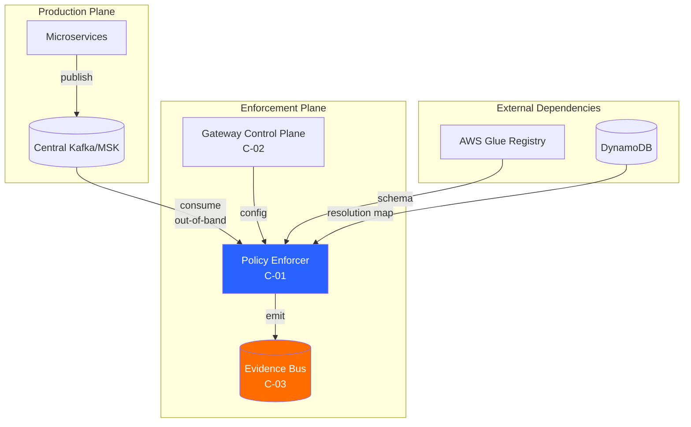
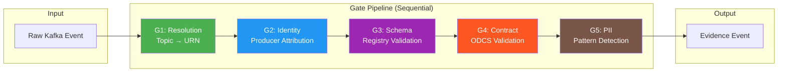
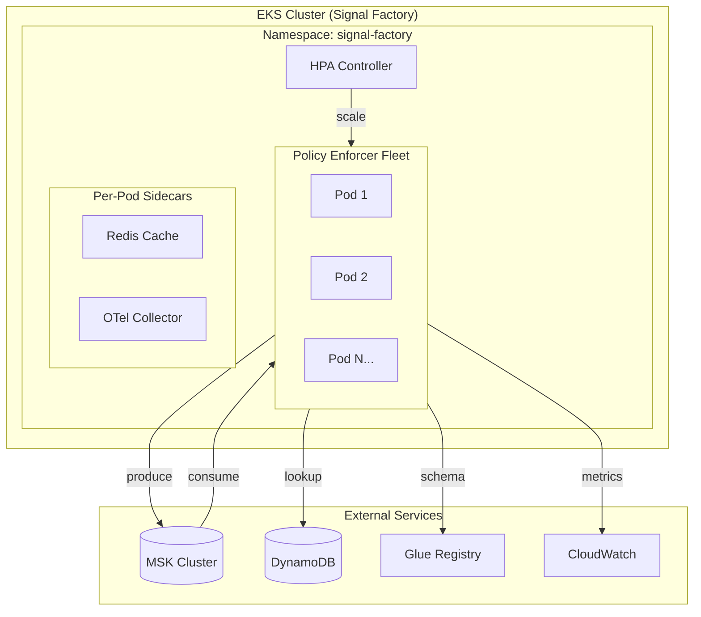

# C-01 Policy Enforcer - Low-Level Design (LLD)

**Data Observability Platform v2.0 - Signal Factory Architecture**

| Attribute | Value |
|-----------|-------|
| **Document Version** | 1.0 |
| **Component ID** | C-01 |
| **Owner Team** | Platform Core |
| **Status** | Draft |
| **Last Updated** | January 2026 |
| **Dependencies** | C-02 Gateway Control Plane, C-03 Evidence Bus, AWS Glue Schema Registry |

---

## 1. Executive Summary

### 1.1 Component Purpose

The Policy Enforcer is the **cornerstone of the Out-of-Band architecture**. It operates as a sidecar observer consuming events from the Central Streaming Platform (Kafka/MSK) after publication, running a deterministic pipeline of five validation gates to establish **per-record truth**. Every raw event produces exactly one Evidence event—this is a pure function enabling replay, debugging, and deterministic RCA.

### 1.2 Core Design Principles

| Principle | Description | Rationale |
|-----------|-------------|-----------|
| **Non-blocking** | NEVER blocks data flow; bad data flows through, Enforcer only creates evidence | Critical path isolation; observability failure ≠ production failure |
| **Deterministic** | Raw event → exactly one Evidence event (pure function) | Enables replay, debugging, and reproducible RCA |
| **Trace-Anchored** | All evidence preserves `trace_id` from source events | Deterministic causality for RCA Copilot |
| **Configuration-Driven** | All thresholds, SLOs, and policies from Gateway Control Plane | Zero hardcoded logic; dynamic policy updates |

### 1.3 Hidden Assumptions

Before diving into design, we must surface these critical assumptions:

1. **Zero Producer Changes**: The central streaming platform and producers cannot be modified
2. **Evidence Bus as Single Source of Truth**: Signal Engines MUST NOT consume raw business topics
3. **Bounded Event Sizes**: Average payload size ~2KB, max 1MB (configurable)
4. **Topic-Dataset Cardinality**: One topic may map to multiple datasets (schema-based resolution)
5. **Header Availability**: Not all producers inject observability headers (fallback required)

---

## 2. Architectural Context

### 2.1 Component Position in Signal Factory



### 2.2 Separation of Concerns

| Concern | Owner | Scope | Output |
|---------|-------|-------|--------|
| **Record Truth** | Policy Enforcer (C-01) | Atomic (one record) | Evidence (PASS/FAIL) |
| **System Health** | Signal Engines (C-04) | Aggregated (time windows) | Signals & Incidents |
| **Causal Analysis** | RCA Copilot (C-09) | Graph traversal | Root Cause Report |

### 2.3 Decision Matrix: Where Logic Belongs

| Logic | Policy Enforcer | Signal Engine |
|-------|:---------------:|:-------------:|
| JSON parsing / envelope normalization | ✓ | — |
| Schema validation against registry | ✓ | — |
| Contract validation (required fields, constraints) | ✓ | — |
| PII detection per record | ✓ | — |
| Emit PASS/FAIL evidence for each record | ✓ | — |
| Compute compliance rate over time windows | — | ✓ |
| Static threshold breach detection | — | ✓ |
| Dynamic anomaly detection (ML-based) | — | ✓ |
| Correlate multiple signals into incidents | — | ✓ |

---

## 3. Gate Pipeline Architecture

### 3.1 Gate Overview



### 3.2 Gate Specifications

| Gate | Name | Function | Output Example | P99 Latency Budget |
|------|------|----------|----------------|-------------------|
| **G1** | Resolution | Map (topic, headers, schema) → dataset URN | `urn:dp:orders:created` | 15ms |
| **G2** | Identity | Identify producer service + confidence | `orders-svc` (HIGH) | 5ms |
| **G3** | Schema | Validate vs Glue Registry + fingerprint | `glue:orders.created:17` → PASS | 50ms |
| **G4** | Contract | Validate vs ODCS contract | `dc:orders.created:3` → FAIL | 10ms |
| **G5** | PII | Scan for PII patterns | `PII_DETECTED` / `CLEAN` | 30ms |

**Total Pipeline Latency Budget: <150ms P99**

### 3.3 Gate 1: Resolution

**Purpose**: Map raw topic to canonical dataset URN.

**Resolution Algorithm**:

```python
class ResolutionGate:
    """
    Maps raw Kafka topic to canonical dataset URN.
    Resolution priority:
    1. Explicit header override (x-obs-dataset-urn)
    2. Topic + Schema combination
    3. Topic-only mapping (fallback)
    """
    
    def __init__(self, config_cache: ConfigCache):
        self.config_cache = config_cache
    
    def resolve(self, record: KafkaRecord) -> GateResult:
        # Priority 1: Explicit header
        if urn := record.headers.get('x-obs-dataset-urn'):
            return GateResult(
                gate='G1_RESOLUTION',
                result='PASS',
                dataset_urn=urn.decode('utf-8'),
                resolution_method='HEADER_EXPLICIT'
            )
        
        # Priority 2: Topic + Schema combination
        schema_id = self._extract_schema_id(record)
        if schema_id:
            resolution_key = f"{record.topic}:{schema_id}"
            if mapping := self.config_cache.get_resolution(resolution_key):
                return GateResult(
                    gate='G1_RESOLUTION',
                    result='PASS',
                    dataset_urn=mapping.dataset_urn,
                    resolution_method='TOPIC_SCHEMA'
                )
        
        # Priority 3: Topic-only fallback
        if mapping := self.config_cache.get_resolution(record.topic):
            return GateResult(
                gate='G1_RESOLUTION',
                result='PASS',
                dataset_urn=mapping.dataset_urn,
                resolution_method='TOPIC_ONLY'
            )
        
        # No mapping found - emit WARN but continue
        return GateResult(
            gate='G1_RESOLUTION',
            result='WARN',
            dataset_urn=f"urn:dp:unknown:{record.topic}",
            resolution_method='UNMAPPED',
            reason_code='UNMAPPED_TOPIC'
        )
```

**DynamoDB Schema for Resolution Map**:

```
Table: DatasetResolutionMap
PK: resolution_key (topic or topic:schema_id)
SK: priority (for multiple mappings)

Attributes:
- dataset_urn: string
- resolution_method: TOPIC_ONLY | TOPIC_SCHEMA | PATTERN
- pattern: string (optional, for regex matching)
- effective_from: timestamp
- effective_until: timestamp (null = current)
- created_by: string
- version: number
```

### 3.4 Gate 2: Identity

**Purpose**: Attribute the producer service with confidence scoring.

**Identity Resolution Hierarchy**:

```python
class IdentityGate:
    """
    Identifies producer with confidence scoring.
    Confidence levels:
    - HIGH: Explicit header present
    - MEDIUM: Inferred from topic mapping
    - LOW: Payload heuristics
    - NONE: Unknown
    """
    
    CONFIDENCE_WEIGHTS = {
        'HIGH': 1.0,
        'MEDIUM': 0.7,
        'LOW': 0.4,
        'NONE': 0.0
    }
    
    def resolve(self, record: KafkaRecord) -> GateResult:
        # Attempt 1: Check Kafka headers (HIGH confidence)
        if producer := record.headers.get('x-obs-producer-service'):
            version = record.headers.get('x-obs-producer-version', b'unknown')
            return GateResult(
                gate='G2_IDENTITY',
                result='PASS',
                producer_id=producer.decode('utf-8'),
                producer_version=version.decode('utf-8'),
                confidence='HIGH'
            )
        
        # Attempt 2: Topic-to-service mapping (MEDIUM confidence)
        if mapping := self.config_cache.get_producer_map(record.topic):
            return GateResult(
                gate='G2_IDENTITY',
                result='PASS',
                producer_id=mapping.service_id,
                producer_version='unknown',
                confidence='MEDIUM'
            )
        
        # Attempt 3: Payload heuristics (LOW confidence)
        if hint := self._extract_producer_hint(record.value):
            return GateResult(
                gate='G2_IDENTITY',
                result='PASS',
                producer_id=hint,
                producer_version='unknown',
                confidence='LOW'
            )
        
        # No identification possible
        return GateResult(
            gate='G2_IDENTITY',
            result='WARN',
            producer_id='UNKNOWN',
            producer_version='unknown',
            confidence='NONE',
            reason_code='UNIDENTIFIED_PRODUCER'
        )
    
    def _extract_producer_hint(self, payload: bytes) -> Optional[str]:
        """Extract producer hints from common payload patterns."""
        try:
            data = json.loads(payload)
            # Common patterns: _source, producer, service, origin
            for key in ['_source', 'producer', 'service', 'origin', 'app']:
                if value := data.get(key):
                    return str(value)
        except (json.JSONDecodeError, UnicodeDecodeError):
            pass
        return None
```

### 3.5 Gate 3: Schema Validation

**Purpose**: Validate payload against Glue Schema Registry and compute deterministic fingerprint.

**Schema Fingerprinting Algorithm**:

```python
import hashlib
import json
from typing import Dict, Any

class SchemaGate:
    """
    Validates against Glue Schema Registry.
    Computes deterministic schema fingerprint for drift detection.
    """
    
    def __init__(self, glue_client, schema_cache: SchemaCache):
        self.glue_client = glue_client
        self.schema_cache = schema_cache
    
    def validate(self, record: KafkaRecord, dataset_urn: str) -> GateResult:
        # Get schema binding for dataset
        binding = self.schema_cache.get_binding(dataset_urn)
        if not binding:
            return GateResult(
                gate='G3_SCHEMA',
                result='WARN',
                reason_code='NO_SCHEMA_BINDING',
                schema_id=None,
                schema_fingerprint=self._compute_payload_fingerprint(record.value)
            )
        
        # Fetch schema from Glue
        try:
            schema = self._get_schema(binding.registry, binding.subject)
        except SchemaNotFoundError:
            return GateResult(
                gate='G3_SCHEMA',
                result='WARN',
                reason_code='SCHEMA_NOT_FOUND',
                schema_id=binding.schema_id
            )
        
        # Validate payload against schema
        validation_result = self._validate_payload(record.value, schema)
        
        # Compute deterministic fingerprint
        payload_fingerprint = self._compute_payload_fingerprint(record.value)
        schema_fingerprint = self._compute_schema_fingerprint(schema)
        
        return GateResult(
            gate='G3_SCHEMA',
            result='PASS' if validation_result.valid else 'FAIL',
            schema_id=f"{binding.registry}:{binding.subject}:{schema.version}",
            schema_fingerprint=schema_fingerprint,
            payload_fingerprint=payload_fingerprint,
            reason_code=validation_result.error_code if not validation_result.valid else None,
            validation_errors=validation_result.errors
        )
    
    def _compute_schema_fingerprint(self, schema) -> str:
        """
        Compute deterministic fingerprint via JSON canonicalization.
        RFC 8785 (JCS) compliant for reproducibility.
        """
        # Canonicalize: sort keys, consistent separators, no whitespace
        canonical = json.dumps(
            schema.definition,
            sort_keys=True,
            separators=(',', ':'),
            ensure_ascii=True
        )
        return f"sha256:{hashlib.sha256(canonical.encode()).hexdigest()[:16]}"
    
    def _compute_payload_fingerprint(self, payload: bytes) -> str:
        """Compute payload fingerprint for deduplication."""
        return f"sha256:{hashlib.sha256(payload).hexdigest()[:16]}"
```

**Schema Cache Strategy**:

| Cache Level | TTL | Invalidation | Storage |
|-------------|-----|--------------|---------|
| L1 (In-memory) | 5 minutes | LRU eviction | Pod memory |
| L2 (Local Redis) | 30 minutes | Version change | EKS sidecar |
| L3 (Glue Registry) | Source of truth | N/A | AWS managed |

### 3.6 Gate 4: Contract Validation

**Purpose**: Validate against ODCS-compliant contract definitions.

**Contract Validation Logic**:

```python
class ContractGate:
    """
    Validates payload against ODCS contract definitions.
    Emits standardized reason codes for RCA.
    """
    
    # Standardized reason codes
    REASON_CODES = {
        'MISSING_FIELD': 'Required field is missing',
        'TYPE_MISMATCH': 'Field type does not match contract',
        'NULL_VIOLATION': 'Non-nullable field is null',
        'CONSTRAINT_VIOLATION': 'Business constraint violated',
        'ENUM_VIOLATION': 'Value not in allowed enum set',
        'RANGE_VIOLATION': 'Value outside allowed range'
    }
    
    def validate(self, payload: dict, dataset_urn: str) -> GateResult:
        # Fetch contract from cache
        contract = self.config_cache.get_contract(dataset_urn)
        if not contract:
            return GateResult(
                gate='G4_CONTRACT',
                result='WARN',
                reason_code='NO_CONTRACT_DEFINED',
                contract_id=None
            )
        
        violations = []
        
        # Validate required fields
        for field in contract.spec.fields.required:
            if field.name not in payload:
                violations.append(Violation(
                    field=field.name,
                    code=f"MISSING_FIELD:{field.name}",
                    constraint='required',
                    actual='absent'
                ))
            elif payload[field.name] is None:
                violations.append(Violation(
                    field=field.name,
                    code=f"NULL_VIOLATION:{field.name}",
                    constraint='non-null',
                    actual='null'
                ))
            elif not self._check_type(payload[field.name], field.type):
                violations.append(Violation(
                    field=field.name,
                    code=f"TYPE_MISMATCH:{field.name}",
                    constraint=f"type={field.type}",
                    actual=type(payload[field.name]).__name__
                ))
        
        # Validate business rules
        for rule in contract.spec.quality.rules:
            if not self._evaluate_rule(payload, rule):
                violations.append(Violation(
                    field=rule.target_field,
                    code=f"CONSTRAINT_VIOLATION:{rule.name}",
                    constraint=rule.expression,
                    actual=str(payload.get(rule.target_field))
                ))
        
        return GateResult(
            gate='G4_CONTRACT',
            result='FAIL' if violations else 'PASS',
            contract_id=f"dc:{contract.metadata.name}:{contract.metadata.version}",
            violations=violations,
            reason_codes=[v.code for v in violations]
        )
```

**ODCS Contract Schema**:

```yaml
# Example contract: contracts/orders/orders.created.yaml
apiVersion: odcs/v1
kind: DataContract
metadata:
  name: orders.created
  version: "3"
  owner: orders-team
  tier: 1

spec:
  dataset:
    urn: "urn:dp:orders:created"
    topic: "raw.orders.events"
    
  schema:
    registry: glue
    subject: orders-created
    compatibility: BACKWARD
    
  fields:
    required:
      - name: order_id
        type: string
        description: Unique order identifier
        pii: false
        
      - name: customer_id
        type: string
        description: Customer who placed the order
        pii: true
          
      - name: event_time
        type: timestamp
        description: When the order was created
      
    optional:
      - name: promo_code
        type: string
        nullable: true
    
  quality:
    rules:
      - name: order_id_not_empty
        expression: "LENGTH(order_id) > 0"
      - name: total_amount_positive
        expression: "total_amount > 0"
    
  slos:
    freshness:
      maxDelaySeconds: 900  # 15 minutes for Tier-1
    volume:
      minEventsPerHour: 100
```

### 3.7 Gate 5: PII Detection

**Purpose**: Scan payloads for PII patterns and flag evidence accordingly.

**PII Detection Patterns**:

```python
import re
from dataclasses import dataclass
from typing import List, Pattern

@dataclass
class PIIPattern:
    name: str
    pattern: Pattern
    category: str  # SSN, EMAIL, PHONE, CC, etc.
    severity: str  # HIGH, MEDIUM, LOW

class PIIGate:
    """
    Scans payload for PII patterns.
    Does NOT block; only annotates evidence.
    """
    
    # Pre-compiled patterns for performance
    PATTERNS: List[PIIPattern] = [
        PIIPattern(
            name='ssn',
            pattern=re.compile(r'\b\d{3}-\d{2}-\d{4}\b'),
            category='SSN',
            severity='HIGH'
        ),
        PIIPattern(
            name='email',
            pattern=re.compile(r'\b[A-Za-z0-9._%+-]+@[A-Za-z0-9.-]+\.[A-Z|a-z]{2,}\b'),
            category='EMAIL',
            severity='MEDIUM'
        ),
        PIIPattern(
            name='phone_us',
            pattern=re.compile(r'\b(?:\+1[-.\s]?)?\(?\d{3}\)?[-.\s]?\d{3}[-.\s]?\d{4}\b'),
            category='PHONE',
            severity='MEDIUM'
        ),
        PIIPattern(
            name='credit_card',
            pattern=re.compile(r'\b(?:\d{4}[-\s]?){3}\d{4}\b'),
            category='CREDIT_CARD',
            severity='HIGH'
        ),
        PIIPattern(
            name='ip_address',
            pattern=re.compile(r'\b(?:\d{1,3}\.){3}\d{1,3}\b'),
            category='IP_ADDRESS',
            severity='LOW'
        ),
    ]
    
    def __init__(self, config_cache: ConfigCache):
        self.config_cache = config_cache
        # Compile patterns once at startup
        self._compiled = [(p.name, p.pattern, p.category, p.severity) 
                          for p in self.PATTERNS]
    
    def scan(self, payload: bytes, dataset_urn: str) -> GateResult:
        # Check if PII scanning is enabled for this dataset
        policy = self.config_cache.get_pii_policy(dataset_urn)
        if not policy or not policy.enabled:
            return GateResult(
                gate='G5_PII',
                result='PASS',
                pii_detected=False,
                scan_enabled=False
            )
        
        # Convert payload to string for scanning
        try:
            text = payload.decode('utf-8')
        except UnicodeDecodeError:
            # Binary payload - skip PII scan
            return GateResult(
                gate='G5_PII',
                result='PASS',
                pii_detected=False,
                reason='BINARY_PAYLOAD'
            )
        
        # Scan for patterns
        detections = []
        for name, pattern, category, severity in self._compiled:
            # Check if this category should be scanned
            if category not in policy.scan_categories:
                continue
            
            matches = pattern.findall(text)
            if matches:
                detections.append({
                    'pattern': name,
                    'category': category,
                    'severity': severity,
                    'count': len(matches),
                    # Never log actual values - only counts
                    'fields': self._identify_fields(text, pattern)
                })
        
        return GateResult(
            gate='G5_PII',
            result='WARN' if detections else 'PASS',
            pii_detected=bool(detections),
            detections=detections,
            reason_code='PII_DETECTED' if detections else None
        )
```

**Performance Optimization**:

| Technique | Impact | Implementation |
|-----------|--------|----------------|
| Pre-compiled regex | 10x faster | Compile at startup, reuse |
| Short-circuit on policy | Skip if disabled | Check policy first |
| Field sampling | Reduce scan scope | Only scan configured fields |
| Binary detection | Skip binary payloads | Check content-type first |

---

## 4. Evidence Event Schema

### 4.1 Canonical Schema Definition

```json
{
  "$schema": "http://json-schema.org/draft-07/schema#",
  "$id": "urn:schema:evidence:2",
  "type": "object",
  "required": ["evidence_id", "timestamp", "dataset_urn", "validation", "source"],
  "properties": {
    "evidence_id": {
      "type": "string",
      "pattern": "^evd-[0-9A-HJKMNP-TV-Z]{26}$",
      "description": "ULID prefixed with evd-"
    },
    "timestamp": {
      "type": "string",
      "format": "date-time",
      "description": "ISO 8601 timestamp when evidence was created"
    },
    "dataset_urn": {
      "type": "string",
      "pattern": "^urn:dp:[a-z_]+:[a-z_]+$",
      "description": "Canonical dataset URN"
    },
    "producer": {
      "type": "object",
      "properties": {
        "id": { "type": "string" },
        "version": { "type": "string" },
        "confidence": { 
          "type": "string",
          "enum": ["HIGH", "MEDIUM", "LOW", "NONE"]
        }
      }
    },
    "validation": {
      "type": "object",
      "required": ["result"],
      "properties": {
        "result": {
          "type": "string",
          "enum": ["PASS", "FAIL", "WARN"]
        },
        "gates": {
          "type": "array",
          "items": {
            "type": "object",
            "properties": {
              "gate": { "type": "string" },
              "result": { "type": "string" },
              "reason_code": { "type": "string" },
              "details": { "type": "object" }
            }
          }
        },
        "failed_gates": {
          "type": "array",
          "items": { "type": "string" }
        },
        "reason_codes": {
          "type": "array",
          "items": { "type": "string" }
        }
      }
    },
    "schema": {
      "type": "object",
      "properties": {
        "schema_id": { "type": "string" },
        "schema_fingerprint": { "type": "string" }
      }
    },
    "contract": {
      "type": "object",
      "properties": {
        "contract_id": { "type": "string" },
        "violations": { "type": "array" }
      }
    },
    "fingerprints": {
      "type": "object",
      "properties": {
        "payload_hash": { "type": "string" },
        "schema_fingerprint": { "type": "string" }
      }
    },
    "pii": {
      "type": "object",
      "properties": {
        "detected": { "type": "boolean" },
        "categories": { "type": "array" }
      }
    },
    "source": {
      "type": "object",
      "required": ["topic", "partition", "offset"],
      "properties": {
        "topic": { "type": "string" },
        "partition": { "type": "integer" },
        "offset": { "type": "integer" },
        "timestamp_type": { "type": "string" }
      }
    },
    "otel": {
      "type": "object",
      "properties": {
        "trace_id": { "type": "string" },
        "span_id": { "type": "string" },
        "parent_span_id": { "type": "string" }
      }
    }
  }
}
```

### 4.2 Example Evidence Events

**Successful Validation (PASS)**:

```json
{
  "evidence_id": "evd-01HQXY8MNP4QR7ST9VW2XYZ123",
  "timestamp": "2026-01-15T09:58:02.312Z",
  "dataset_urn": "urn:dp:orders:created",
  "producer": {
    "id": "orders-svc",
    "version": "v3.17",
    "confidence": "HIGH"
  },
  "validation": {
    "result": "PASS",
    "gates": [
      {"gate": "G1_RESOLUTION", "result": "PASS"},
      {"gate": "G2_IDENTITY", "result": "PASS"},
      {"gate": "G3_SCHEMA", "result": "PASS"},
      {"gate": "G4_CONTRACT", "result": "PASS"},
      {"gate": "G5_PII", "result": "PASS"}
    ],
    "failed_gates": [],
    "reason_codes": []
  },
  "schema": {
    "schema_id": "glue:orders.created:17",
    "schema_fingerprint": "sha256:9f2c4a8b"
  },
  "contract": {
    "contract_id": "dc:orders.created:3"
  },
  "fingerprints": {
    "payload_hash": "sha256:a1b2c3d4",
    "schema_fingerprint": "sha256:9f2c4a8b"
  },
  "pii": {
    "detected": false
  },
  "source": {
    "topic": "raw.orders.events",
    "partition": 4,
    "offset": 9918273,
    "timestamp_type": "CREATE_TIME"
  },
  "otel": {
    "trace_id": "ab91f3c2d4e5f6a7b8c9d0e1f2a3b4c5"
  }
}
```

**Failed Validation (FAIL)**:

```json
{
  "evidence_id": "evd-01HQXY8MNP4QR7ST9VW2XYZ456",
  "timestamp": "2026-01-15T09:58:02.312Z",
  "dataset_urn": "urn:dp:orders:created",
  "producer": {
    "id": "orders-svc",
    "version": "v3.17",
    "confidence": "HIGH"
  },
  "validation": {
    "result": "FAIL",
    "gates": [
      {"gate": "G1_RESOLUTION", "result": "PASS"},
      {"gate": "G2_IDENTITY", "result": "PASS"},
      {"gate": "G3_SCHEMA", "result": "PASS"},
      {
        "gate": "G4_CONTRACT",
        "result": "FAIL",
        "reason_code": "MISSING_FIELD:customer_id",
        "details": {
          "contract_id": "dc:orders.created:3",
          "violated_rule": {
            "field": "customer_id",
            "constraint": "required",
            "actual": "null"
          }
        }
      },
      {"gate": "G5_PII", "result": "PASS"}
    ],
    "failed_gates": ["G4_CONTRACT"],
    "reason_codes": ["MISSING_FIELD:customer_id"]
  },
  "source": {
    "topic": "raw.orders.events",
    "partition": 4,
    "offset": 9918274
  },
  "otel": {
    "trace_id": "ab91f3c2d4e5f6a7b8c9d0e1f2a3b4c5"
  }
}
```

---

## 5. Deployment Architecture

### 5.1 EKS Deployment Topology



### 5.2 Kubernetes Manifests

**Deployment Specification**:

```yaml
apiVersion: apps/v1
kind: Deployment
metadata:
  name: policy-enforcer
  namespace: signal-factory
  labels:
    app: policy-enforcer
    component: c-01
spec:
  replicas: 4  # Minimum replicas
  selector:
    matchLabels:
      app: policy-enforcer
  template:
    metadata:
      labels:
        app: policy-enforcer
      annotations:
        prometheus.io/scrape: "true"
        prometheus.io/port: "9090"
    spec:
      serviceAccountName: policy-enforcer-sa
      containers:
        - name: enforcer
          image: signal-factory/policy-enforcer:latest
          resources:
            requests:
              memory: "2Gi"
              cpu: "1000m"
            limits:
              memory: "4Gi"
              cpu: "2000m"
          env:
            - name: KAFKA_BOOTSTRAP_SERVERS
              valueFrom:
                secretKeyRef:
                  name: msk-credentials
                  key: bootstrap_servers
            - name: CONSUMER_GROUP_ID
              value: "policy-enforcer"
            - name: EVIDENCE_TOPIC
              value: "signal_factory.evidence"
            - name: LOG_LEVEL
              value: "INFO"
            - name: OTEL_EXPORTER_OTLP_ENDPOINT
              value: "http://localhost:4317"
          ports:
            - name: metrics
              containerPort: 9090
            - name: health
              containerPort: 8080
          livenessProbe:
            httpGet:
              path: /health/live
              port: 8080
            initialDelaySeconds: 30
            periodSeconds: 10
          readinessProbe:
            httpGet:
              path: /health/ready
              port: 8080
            initialDelaySeconds: 10
            periodSeconds: 5
          
        - name: otel-collector
          image: otel/opentelemetry-collector:latest
          resources:
            requests:
              memory: "256Mi"
              cpu: "100m"
            limits:
              memory: "512Mi"
              cpu: "200m"
          ports:
            - containerPort: 4317
            - containerPort: 4318
```

**Horizontal Pod Autoscaler**:

```yaml
apiVersion: autoscaling/v2
kind: HorizontalPodAutoscaler
metadata:
  name: policy-enforcer-hpa
  namespace: signal-factory
spec:
  scaleTargetRef:
    apiVersion: apps/v1
    kind: Deployment
    name: policy-enforcer
  minReplicas: 4
  maxReplicas: 64
  metrics:
    # Primary: Kafka consumer lag
    - type: External
      external:
        metric:
          name: kafka_consumer_lag_seconds
          selector:
            matchLabels:
              consumer_group: policy-enforcer
        target:
          type: Value
          value: "30"  # Scale up if lag > 30s
    
    # Secondary: CPU utilization
    - type: Resource
      resource:
        name: cpu
        target:
          type: Utilization
          averageUtilization: 70
  
  behavior:
    scaleUp:
      stabilizationWindowSeconds: 60
      policies:
        - type: Percent
          value: 100
          periodSeconds: 60
    scaleDown:
      stabilizationWindowSeconds: 300
      policies:
        - type: Percent
          value: 10
          periodSeconds: 60
```

### 5.3 Consumer Group Management

**Partition Assignment Strategy**:

```python
class PartitionAssigner:
    """
    Custom partition assignment for Policy Enforcer fleet.
    Ensures even distribution and sticky assignments.
    """
    
    def __init__(self, config: ConsumerConfig):
        self.config = config
        self.assignment_strategy = 'cooperative-sticky'
    
    def configure_consumer(self) -> KafkaConsumer:
        return KafkaConsumer(
            bootstrap_servers=self.config.bootstrap_servers,
            group_id='policy-enforcer',
            
            # Sticky assignment for minimal rebalances
            partition_assignment_strategy=[
                CooperativeStickyAssignor
            ],
            
            # Consumer tuning
            max_poll_records=500,
            max_poll_interval_ms=300000,  # 5 minutes
            session_timeout_ms=45000,
            heartbeat_interval_ms=15000,
            
            # Performance tuning
            fetch_min_bytes=1,
            fetch_max_wait_ms=500,
            fetch_max_bytes=52428800,  # 50MB
            
            # Offset management
            enable_auto_commit=False,  # Manual commit for exactly-once
            auto_offset_reset='earliest',
            
            # Security
            security_protocol='SASL_SSL',
            sasl_mechanism='AWS_MSK_IAM',
        )
```

**Consumer Group Naming Convention**:

| Component | Consumer Group ID | Pattern |
|-----------|------------------|---------|
| Policy Enforcer | `policy-enforcer` | Single group for all enforcers |
| Freshness Engine | `signal_engines.freshness` | Per-engine type |
| Volume Engine | `signal_engines.volume` | Per-engine type |
| Contract Engine | `signal_engines.contract` | Per-engine type |

---

## 6. Scalability & Performance

### 6.1 Throughput Targets

| Metric | Day 1 Target | Scale Target (M12) | Autoscale Trigger |
|--------|--------------|-------------------|-------------------|
| Event Throughput | 10K events/sec | 50-500K events/sec | Kafka lag >30s OR CPU >70% |
| Evidence Latency | <2s P99 | <2s P99 (maintained) | N/A (latency SLO) |
| Evidence Bus Partitions | 64 | 64-256 | Partition fill >80% |

### 6.2 Backpressure Handling

```python
class BackpressureManager:
    """
    Manages backpressure when Evidence Bus or dependencies slow down.
    """
    
    def __init__(self, config: BackpressureConfig):
        self.config = config
        self.circuit_breaker = CircuitBreaker(
            failure_threshold=5,
            recovery_timeout=30
        )
        self.rate_limiter = TokenBucketRateLimiter(
            capacity=10000,
            refill_rate=1000
        )
    
    async def process_with_backpressure(
        self,
        batch: List[KafkaRecord]
    ) -> List[Evidence]:
        # Check circuit breaker state
        if self.circuit_breaker.is_open:
            self._emit_backpressure_metric('circuit_open')
            await asyncio.sleep(self.config.backoff_seconds)
            return self._create_degraded_evidence(batch)
        
        # Apply rate limiting
        if not self.rate_limiter.acquire(len(batch)):
            self._emit_backpressure_metric('rate_limited')
            await asyncio.sleep(0.1)  # Brief pause
        
        try:
            results = await self._process_batch(batch)
            self.circuit_breaker.record_success()
            return results
        except ProducerBufferFullError:
            self.circuit_breaker.record_failure()
            self._emit_backpressure_metric('producer_buffer_full')
            return self._create_degraded_evidence(batch)
    
    def _create_degraded_evidence(
        self,
        batch: List[KafkaRecord]
    ) -> List[Evidence]:
        """Create minimal evidence when under backpressure."""
        return [
            Evidence(
                evidence_id=generate_ulid(),
                dataset_urn='urn:dp:unknown:backpressure',
                validation=ValidationResult(
                    result='WARN',
                    reason_codes=['BACKPRESSURE_DEGRADED']
                ),
                source=SourceRef(
                    topic=record.topic,
                    partition=record.partition,
                    offset=record.offset
                )
            )
            for record in batch
        ]
```

### 6.3 Graceful Degradation

| Failure Mode | Impact | Mitigation | Recovery |
|--------------|--------|------------|----------|
| Glue Registry unavailable | Schema validation skipped | Emit WARN with `REGISTRY_UNAVAILABLE`; use cached schema | Auto-recover on registry return |
| DynamoDB throttling | Resolution/Contract lookup slow | Use local cache; extend TTL | Auto-recover; exponential backoff |
| Evidence Bus full | Cannot emit evidence | Circuit breaker; drop-and-count | Auto-recover when lag clears |
| Neptune down | No graph context | Continue processing; RCA degraded | N/A for Enforcer |

**Degradation Configuration**:

```yaml
degradation:
  glue_registry:
    fallback: WARN_AND_CONTINUE
    cache_extension_factor: 10  # 5min → 50min
    
  dynamodb:
    fallback: USE_STALE_CACHE
    max_staleness_seconds: 600
    
  evidence_bus:
    circuit_breaker:
      failure_threshold: 5
      recovery_timeout_seconds: 30
    dlq_topic: signal_factory.evidence.dlq
    
  metrics:
    emit_degradation_counter: true
    emit_fallback_reason: true
```

---

## 7. Error Handling & Dead Letter Queue

### 7.1 Error Classification

| Error Type | Category | Action | DLQ? |
|------------|----------|--------|------|
| Malformed JSON | Permanent | Skip, emit FAIL evidence | No |
| Schema not found | Transient | Retry 3x, then WARN | No |
| Contract not found | Transient | WARN and continue | No |
| Evidence produce failed | Transient | Retry with backoff | Yes |
| Unhandled exception | Permanent | Log, emit FAIL evidence | Yes |

### 7.2 DLQ Strategy

```python
class DLQHandler:
    """
    Handles records that cannot be processed after retries.
    """
    
    def __init__(self, dlq_producer: KafkaProducer, config: DLQConfig):
        self.dlq_producer = dlq_producer
        self.dlq_topic = config.dlq_topic
        self.max_retries = config.max_retries
    
    def send_to_dlq(
        self,
        record: KafkaRecord,
        error: Exception,
        attempt_count: int
    ):
        dlq_envelope = {
            'original_topic': record.topic,
            'original_partition': record.partition,
            'original_offset': record.offset,
            'original_timestamp': record.timestamp,
            'original_headers': dict(record.headers),
            'error_type': type(error).__name__,
            'error_message': str(error),
            'error_stacktrace': traceback.format_exc(),
            'attempt_count': attempt_count,
            'dlq_timestamp': datetime.utcnow().isoformat(),
            'enforcer_instance': os.environ.get('HOSTNAME'),
            # Include payload for replay
            'payload_base64': base64.b64encode(record.value).decode()
        }
        
        self.dlq_producer.send(
            topic=self.dlq_topic,
            key=f"{record.topic}:{record.partition}:{record.offset}".encode(),
            value=json.dumps(dlq_envelope).encode(),
            headers=[
                ('x-dlq-reason', error.__class__.__name__.encode()),
                ('x-original-topic', record.topic.encode())
            ]
        )
        
        # Emit metric
        metrics.counter(
            'enforcer.dlq.records',
            tags={
                'topic': record.topic,
                'error_type': type(error).__name__
            }
        ).increment()
```

### 7.3 Retry Logic

```python
class RetryHandler:
    """
    Implements exponential backoff retry for transient failures.
    """
    
    def __init__(self, config: RetryConfig):
        self.max_retries = config.max_retries
        self.base_delay_ms = config.base_delay_ms
        self.max_delay_ms = config.max_delay_ms
        self.jitter_factor = config.jitter_factor
    
    @retry(
        retry=retry_if_exception_type((TransientError, TimeoutError)),
        stop=stop_after_attempt(3),
        wait=wait_exponential(multiplier=1, min=1, max=10),
        before_sleep=before_sleep_log(logger, logging.WARNING)
    )
    async def execute_with_retry(
        self,
        operation: Callable,
        *args,
        **kwargs
    ):
        return await operation(*args, **kwargs)
    
    def calculate_backoff(self, attempt: int) -> float:
        """Calculate delay with exponential backoff and jitter."""
        delay = min(
            self.base_delay_ms * (2 ** attempt),
            self.max_delay_ms
        )
        jitter = random.uniform(0, delay * self.jitter_factor)
        return (delay + jitter) / 1000  # Convert to seconds
```

---

## 8. Observability (Self-Monitoring)

### 8.1 Metrics Specification

| Metric Name | Type | Labels | Description |
|-------------|------|--------|-------------|
| `enforcer.records.processed` | Counter | `topic`, `result` | Total records processed |
| `enforcer.records.failed` | Counter | `topic`, `gate`, `reason` | Records that failed validation |
| `enforcer.latency.seconds` | Histogram | `gate` | Per-gate processing latency |
| `enforcer.pipeline.latency.seconds` | Histogram | - | End-to-end pipeline latency |
| `enforcer.consumer.lag.seconds` | Gauge | `partition` | Kafka consumer lag |
| `enforcer.cache.hit_ratio` | Gauge | `cache_type` | Cache hit ratio |
| `enforcer.evidence.produced` | Counter | `dataset_urn`, `result` | Evidence events produced |
| `enforcer.dlq.records` | Counter | `topic`, `error_type` | Records sent to DLQ |
| `enforcer.circuit_breaker.state` | Gauge | `dependency` | Circuit breaker state (0=closed, 1=open) |

### 8.2 Structured Logging

```python
import structlog

logger = structlog.get_logger()

class EnforcerLogger:
    """
    Structured logging with correlation IDs.
    """
    
    def log_evidence_created(
        self,
        evidence: Evidence,
        processing_time_ms: float
    ):
        logger.info(
            "evidence_created",
            evidence_id=evidence.evidence_id,
            dataset_urn=evidence.dataset_urn,
            result=evidence.validation.result,
            failed_gates=evidence.validation.failed_gates,
            reason_codes=evidence.validation.reason_codes,
            processing_time_ms=processing_time_ms,
            trace_id=evidence.otel.trace_id if evidence.otel else None,
            source_topic=evidence.source.topic,
            source_partition=evidence.source.partition,
            source_offset=evidence.source.offset
        )
    
    def log_gate_result(
        self,
        gate: str,
        result: str,
        latency_ms: float,
        details: dict
    ):
        logger.debug(
            "gate_completed",
            gate=gate,
            result=result,
            latency_ms=latency_ms,
            **details
        )
    
    def log_error(
        self,
        error: Exception,
        context: dict
    ):
        logger.error(
            "processing_error",
            error_type=type(error).__name__,
            error_message=str(error),
            **context,
            exc_info=True
        )
```

### 8.3 Distributed Tracing

```python
from opentelemetry import trace
from opentelemetry.trace import SpanKind

tracer = trace.get_tracer("policy-enforcer")

class TracedPipeline:
    """
    Wraps gate pipeline with OpenTelemetry tracing.
    """
    
    def process(self, record: KafkaRecord) -> Evidence:
        # Extract trace context from Kafka headers
        ctx = self._extract_context(record.headers)
        
        with tracer.start_as_current_span(
            "enforcer.process",
            context=ctx,
            kind=SpanKind.CONSUMER,
            attributes={
                "kafka.topic": record.topic,
                "kafka.partition": record.partition,
                "kafka.offset": record.offset
            }
        ) as span:
            
            results = []
            
            for gate in self.gates:
                with tracer.start_as_current_span(
                    f"gate.{gate.name}",
                    attributes={"gate.name": gate.name}
                ) as gate_span:
                    result = gate.process(record)
                    gate_span.set_attribute("gate.result", result.result)
                    results.append(result)
            
            evidence = self._build_evidence(record, results)
            span.set_attribute("evidence.id", evidence.evidence_id)
            span.set_attribute("evidence.result", evidence.validation.result)
            
            return evidence
```

### 8.4 Health Check Endpoints

```python
from fastapi import FastAPI, Response
from enum import Enum

app = FastAPI()

class HealthStatus(Enum):
    HEALTHY = "healthy"
    DEGRADED = "degraded"
    UNHEALTHY = "unhealthy"

@app.get("/health/live")
async def liveness():
    """
    Kubernetes liveness probe.
    Returns 200 if process is running.
    """
    return {"status": "alive"}

@app.get("/health/ready")
async def readiness():
    """
    Kubernetes readiness probe.
    Returns 200 if ready to process traffic.
    """
    checks = {
        "kafka_consumer": await check_kafka_consumer(),
        "kafka_producer": await check_kafka_producer(),
        "config_cache": await check_config_cache(),
        "schema_cache": await check_schema_cache()
    }
    
    all_healthy = all(c["status"] == "healthy" for c in checks.values())
    
    if all_healthy:
        return {"status": "ready", "checks": checks}
    else:
        return Response(
            content=json.dumps({"status": "not_ready", "checks": checks}),
            status_code=503,
            media_type="application/json"
        )

@app.get("/health/detailed")
async def detailed_health():
    """
    Detailed health for dashboards.
    """
    return {
        "status": get_overall_status(),
        "uptime_seconds": get_uptime(),
        "version": get_version(),
        "metrics": {
            "records_processed": get_counter("records.processed"),
            "current_lag_seconds": get_gauge("consumer.lag"),
            "error_rate_1m": get_rate("records.failed", "1m")
        },
        "dependencies": {
            "kafka": await check_kafka_health(),
            "dynamodb": await check_dynamodb_health(),
            "glue": await check_glue_health()
        },
        "circuit_breakers": get_circuit_breaker_states()
    }
```

---

## 9. Security Architecture

### 9.1 Authentication & Authorization

| Domain | Approach | Implementation |
|--------|----------|----------------|
| **Service Identity** | IAM Roles | IRSA (IAM Roles for Service Accounts) |
| **Kafka Auth** | SASL/SCRAM or IAM | MSK IAM authentication |
| **DynamoDB Auth** | IAM Roles | Scoped policies per table |
| **Glue Auth** | IAM Roles | Read-only schema access |

**IAM Policy for Policy Enforcer**:

```json
{
  "Version": "2012-10-17",
  "Statement": [
    {
      "Sid": "KafkaConsume",
      "Effect": "Allow",
      "Action": [
        "kafka-cluster:Connect",
        "kafka-cluster:DescribeGroup",
        "kafka-cluster:ReadData"
      ],
      "Resource": [
        "arn:aws:kafka:*:*:cluster/signal-factory/*",
        "arn:aws:kafka:*:*:topic/signal-factory/*/raw.*",
        "arn:aws:kafka:*:*:group/signal-factory/*/policy-enforcer"
      ]
    },
    {
      "Sid": "KafkaProduce",
      "Effect": "Allow",
      "Action": [
        "kafka-cluster:Connect",
        "kafka-cluster:WriteData"
      ],
      "Resource": [
        "arn:aws:kafka:*:*:topic/signal-factory/*/signal_factory.evidence",
        "arn:aws:kafka:*:*:topic/signal-factory/*/signal_factory.evidence.dlq"
      ]
    },
    {
      "Sid": "DynamoDBRead",
      "Effect": "Allow",
      "Action": [
        "dynamodb:GetItem",
        "dynamodb:Query",
        "dynamodb:BatchGetItem"
      ],
      "Resource": [
        "arn:aws:dynamodb:*:*:table/DatasetResolutionMap",
        "arn:aws:dynamodb:*:*:table/DatasetRegistry",
        "arn:aws:dynamodb:*:*:table/DatasetRegistry/index/*"
      ]
    },
    {
      "Sid": "GlueSchemaRead",
      "Effect": "Allow",
      "Action": [
        "glue:GetSchema",
        "glue:GetSchemaVersion",
        "glue:GetRegistry"
      ],
      "Resource": [
        "arn:aws:glue:*:*:registry/*",
        "arn:aws:glue:*:*:schema/*"
      ]
    },
    {
      "Sid": "CloudWatchMetrics",
      "Effect": "Allow",
      "Action": [
        "cloudwatch:PutMetricData"
      ],
      "Resource": "*",
      "Condition": {
        "StringEquals": {
          "cloudwatch:namespace": "SignalFactory/PolicyEnforcer"
        }
      }
    }
  ]
}
```

### 9.2 Encryption

| Data State | Encryption | Key Management |
|------------|------------|----------------|
| **In Transit** | TLS 1.3 | ACM managed certificates |
| **At Rest (Kafka)** | AES-256 | MSK managed encryption |
| **At Rest (DynamoDB)** | AES-256 | AWS managed keys |
| **Evidence Payloads** | None (metadata only) | N/A |

### 9.3 PII Handling

The Policy Enforcer handles PII with the following safeguards:

1. **Detection Only**: G5 detects PII patterns but does NOT log actual values
2. **Flag in Evidence**: Evidence includes `pii.detected: true` flag only
3. **No Payload Storage**: Raw payloads are NOT stored in evidence
4. **Configurable Scanning**: PII scanning can be disabled per-dataset

```python
class PIISafeLogger:
    """
    Ensures PII is never logged.
    """
    
    REDACT_PATTERNS = [
        (re.compile(r'\b\d{3}-\d{2}-\d{4}\b'), '[SSN_REDACTED]'),
        (re.compile(r'\b[A-Za-z0-9._%+-]+@[A-Za-z0-9.-]+\.[A-Z|a-z]{2,}\b'), '[EMAIL_REDACTED]'),
    ]
    
    def safe_log(self, message: str, **kwargs) -> str:
        """Redact any PII before logging."""
        safe_message = message
        for pattern, replacement in self.REDACT_PATTERNS:
            safe_message = pattern.sub(replacement, safe_message)
        
        safe_kwargs = {
            k: self._redact_value(v) for k, v in kwargs.items()
        }
        
        return safe_message, safe_kwargs
```

---

## 10. Interface Contracts

### 10.1 Upstream Interfaces

| Interface | Type | Contract | Error Handling |
|-----------|------|----------|----------------|
| **Raw Kafka Topics** | Consumer | Consume from `raw.*` topics | Skip malformed; emit FAIL evidence |
| **Gateway Control Plane** | HTTP/gRPC | GET /datasets/{urn}/config | Cache with fallback |
| **Glue Schema Registry** | AWS API | GetSchemaVersion | Cache with extended TTL |
| **DynamoDB** | AWS API | GetItem, Query | Retry with exponential backoff |

### 10.2 Downstream Interfaces

| Interface | Type | Contract | SLA |
|-----------|------|----------|-----|
| **Evidence Bus** | Kafka Producer | Produce to `signal_factory.evidence` | <2s P99 latency |
| **DLQ** | Kafka Producer | Produce to `signal_factory.evidence.dlq` | Best effort |

### 10.3 API Contracts

**Internal Health API** (not exposed externally):

```yaml
openapi: 3.0.3
info:
  title: Policy Enforcer Internal API
  version: 1.0.0
paths:
  /health/live:
    get:
      summary: Liveness probe
      responses:
        '200':
          description: Process is alive
  
  /health/ready:
    get:
      summary: Readiness probe
      responses:
        '200':
          description: Ready to process
        '503':
          description: Not ready
  
  /metrics:
    get:
      summary: Prometheus metrics
      responses:
        '200':
          description: Metrics in Prometheus format
          content:
            text/plain:
              schema:
                type: string
```

---

## 11. Configuration Management

### 11.1 Configuration Sources

| Source | Content | Refresh |
|--------|---------|---------|
| **Environment Variables** | Bootstrap config, secrets references | Pod restart |
| **ConfigMap** | Static config (log levels, feature flags) | Pod restart |
| **DynamoDB** | Dynamic config (resolution maps, contracts) | TTL-based (5min) |
| **AWS Secrets Manager** | Credentials, API keys | On-demand |

### 11.2 Configuration Schema

```yaml
# ConfigMap: policy-enforcer-config
apiVersion: v1
kind: ConfigMap
metadata:
  name: policy-enforcer-config
  namespace: signal-factory
data:
  config.yaml: |
    kafka:
      consumer:
        group_id: policy-enforcer
        max_poll_records: 500
        max_poll_interval_ms: 300000
        session_timeout_ms: 45000
      producer:
        acks: all
        retries: 3
        batch_size: 16384
        linger_ms: 10
    
    gates:
      g1_resolution:
        enabled: true
        cache_ttl_seconds: 300
      g2_identity:
        enabled: true
        fallback_confidence: MEDIUM
      g3_schema:
        enabled: true
        cache_ttl_seconds: 300
        validation_mode: STRICT  # STRICT | LENIENT
      g4_contract:
        enabled: true
        cache_ttl_seconds: 300
      g5_pii:
        enabled: true
        scan_categories:
          - SSN
          - EMAIL
          - PHONE
          - CREDIT_CARD
    
    resilience:
      circuit_breaker:
        failure_threshold: 5
        recovery_timeout_seconds: 30
      retry:
        max_attempts: 3
        base_delay_ms: 100
        max_delay_ms: 5000
    
    observability:
      metrics:
        enabled: true
        port: 9090
      tracing:
        enabled: true
        sampling_rate: 0.1
      logging:
        level: INFO
        format: json
```

---

## 12. Testing Strategy

### 12.1 Test Pyramid

```
                    ┌─────────────┐
                    │   E2E (5%)  │
                    │  Steel Thread│
                    ├─────────────┤
                    │Integration  │
                    │   (20%)     │
                    │Kafka, DDB,  │
                    │   Glue      │
          ┌─────────┴─────────────┴─────────┐
          │      Unit Tests (75%)           │
          │  Gate logic, Evidence builder,  │
          │  Fingerprinting, PII detection  │
          └─────────────────────────────────┘
```

### 12.2 Test Categories

| Category | Scope | Tools | CI Stage |
|----------|-------|-------|----------|
| **Unit** | Gate logic, utils | pytest, pytest-cov | PR merge |
| **Integration** | Kafka, DynamoDB | testcontainers | PR merge |
| **Contract** | Evidence schema | pact, jsonschema | PR merge |
| **Performance** | Throughput, latency | locust, k6 | Nightly |
| **Chaos** | Failure injection | chaos-monkey | Weekly |

### 12.3 Key Test Scenarios

```python
# test_gate_pipeline.py

class TestResolutionGate:
    """Tests for G1 Resolution Gate."""
    
    def test_explicit_header_takes_priority(self):
        """Header override should take priority over topic mapping."""
        record = KafkaRecord(
            topic='raw.orders.events',
            headers={'x-obs-dataset-urn': b'urn:dp:custom:override'}
        )
        result = resolution_gate.resolve(record)
        assert result.dataset_urn == 'urn:dp:custom:override'
        assert result.resolution_method == 'HEADER_EXPLICIT'
    
    def test_unmapped_topic_returns_warn(self):
        """Unmapped topics should return WARN, not FAIL."""
        record = KafkaRecord(topic='unknown.topic')
        result = resolution_gate.resolve(record)
        assert result.result == 'WARN'
        assert result.reason_code == 'UNMAPPED_TOPIC'

class TestContractGate:
    """Tests for G4 Contract Gate."""
    
    def test_missing_required_field_fails(self):
        """Missing required field should produce FAIL with reason code."""
        payload = {'order_id': '123'}  # Missing customer_id
        result = contract_gate.validate(payload, 'urn:dp:orders:created')
        assert result.result == 'FAIL'
        assert 'MISSING_FIELD:customer_id' in result.reason_codes
    
    def test_null_required_field_fails(self):
        """Null required field should produce FAIL."""
        payload = {'order_id': '123', 'customer_id': None}
        result = contract_gate.validate(payload, 'urn:dp:orders:created')
        assert result.result == 'FAIL'
        assert 'NULL_VIOLATION:customer_id' in result.reason_codes

class TestSchemaFingerprinting:
    """Tests for deterministic schema fingerprinting."""
    
    def test_fingerprint_is_deterministic(self):
        """Same schema should always produce same fingerprint."""
        schema = {'type': 'object', 'properties': {'id': {'type': 'string'}}}
        fp1 = schema_gate._compute_schema_fingerprint(schema)
        fp2 = schema_gate._compute_schema_fingerprint(schema)
        assert fp1 == fp2
    
    def test_field_order_does_not_affect_fingerprint(self):
        """Field order should not affect fingerprint (canonicalization)."""
        schema1 = {'properties': {'a': {}, 'b': {}}, 'type': 'object'}
        schema2 = {'type': 'object', 'properties': {'b': {}, 'a': {}}}
        assert schema_gate._compute_schema_fingerprint(schema1) == \
               schema_gate._compute_schema_fingerprint(schema2)
```

---

## 13. Operational Runbooks

### 13.1 Runbook: High Consumer Lag

**Symptoms**: `enforcer.consumer.lag.seconds` > 30s

**Diagnosis Steps**:
1. Check HPA status: `kubectl get hpa policy-enforcer-hpa -n signal-factory`
2. Check pod count: `kubectl get pods -l app=policy-enforcer -n signal-factory`
3. Check for errors: `kubectl logs -l app=policy-enforcer --tail=100 | grep ERROR`
4. Check dependency health: Glue, DynamoDB, Evidence Bus

**Resolution**:
1. If HPA not scaling: Check metrics adapter connectivity
2. If pods pending: Check node capacity, request resources
3. If errors high: Check circuit breaker state, dependency health
4. Manual scale: `kubectl scale deployment policy-enforcer --replicas=20`

### 13.2 Runbook: Evidence Production Failures

**Symptoms**: `enforcer.dlq.records` increasing

**Diagnosis Steps**:
1. Check DLQ depth: `kafka-consumer-groups.sh --describe --group dlq-monitor`
2. Sample DLQ messages: Check `error_type` and `error_message`
3. Check Evidence Bus health: Partition leaders, ISR count

**Resolution**:
1. If transient (network): Wait for circuit breaker recovery
2. If schema issue: Check Glue Registry connectivity
3. If persistent: Check MSK cluster health, contact platform team

### 13.3 Runbook: Glue Registry Unavailable

**Symptoms**: `enforcer.cache.hit_ratio{cache_type="schema"}` dropping, WARN evidence increasing

**Diagnosis Steps**:
1. Check Glue API: `aws glue get-registries`
2. Check network: Pod → Glue endpoint connectivity
3. Check IAM: Verify IRSA role has Glue permissions

**Resolution**:
1. Short-term: Enforcer continues with cached schemas (extended TTL)
2. Long-term: File AWS support ticket if Glue service issue
3. Cache refresh: Restart pods to refresh stale cache (last resort)

---

## 14. Appendices

### Appendix A: Latency Budget Breakdown

```
Total End-to-End: <230ms P99

Producer → Kafka:          50ms P99
├── Kafka produce latency: 50ms
│
Enforcer Consumes:
├── Consumer poll + deserialize: 20ms P99
├── G1: Resolution (DynamoDB):   15ms P99
├── G2: Identity (header parse):  5ms P99
├── G3: Schema (Glue Registry):  50ms P99
├── G4: Contract (in-memory):    10ms P99
├── G5: PII (regex scan):        30ms P99
├── Evidence serialize + produce: 50ms P99
│
Evidence on Bus:                230ms P99 TOTAL
```

### Appendix B: URN Conventions

| Asset Type | URN Pattern | Example |
|------------|-------------|---------|
| Service | `urn:svc:<env>:<name>` | `urn:svc:prod:order-service` |
| Dataset | `urn:dp:<domain>:<name>` | `urn:dp:orders:created` |
| Kafka Topic | `urn:kafka:<env>:<cluster>:<topic>` | `urn:kafka:prod:main:orders-created` |
| Schema | `urn:schema:<registry>:<subject>:<ver>` | `urn:schema:glue:orders-created:42` |
| Evidence | `evd-<ulid>` | `evd-01HQXYZ123456789ABCDEF` |

### Appendix C: Reason Code Catalog

| Code | Gate | Description | Severity |
|------|------|-------------|----------|
| `UNMAPPED_TOPIC` | G1 | Topic has no resolution mapping | WARN |
| `UNIDENTIFIED_PRODUCER` | G2 | Cannot identify producer service | WARN |
| `NO_SCHEMA_BINDING` | G3 | Dataset has no schema binding | WARN |
| `SCHEMA_VALIDATION_FAILED` | G3 | Payload does not match schema | FAIL |
| `NO_CONTRACT_DEFINED` | G4 | Dataset has no contract | WARN |
| `MISSING_FIELD:<field>` | G4 | Required field is missing | FAIL |
| `NULL_VIOLATION:<field>` | G4 | Non-nullable field is null | FAIL |
| `TYPE_MISMATCH:<field>` | G4 | Field type mismatch | FAIL |
| `CONSTRAINT_VIOLATION:<rule>` | G4 | Business rule violated | FAIL |
| `PII_DETECTED` | G5 | PII patterns found in payload | WARN |
| `REGISTRY_UNAVAILABLE` | G3 | Glue Registry not accessible | WARN |
| `BACKPRESSURE_DEGRADED` | N/A | Evidence degraded due to backpressure | WARN |

---

## 15. Document History

| Version | Date | Author | Changes |
|---------|------|--------|---------|
| 1.0 | January 2026 | Platform Core | Initial LLD |

---

## 16. Self-Critique Against Rubric

### 16.1 Completeness ✓

| Requirement | Status | Location |
|-------------|--------|----------|
| API Specs | ✓ | Section 10.3 (Health API) |
| Database Schema | ✓ | Section 3.3 (DynamoDB), Section 4 (Evidence Schema) |
| Error Handling | ✓ | Section 7 (Error Handling & DLQ) |
| Logging Strategies | ✓ | Section 8.2 (Structured Logging) |

### 16.2 Scalability ✓

| Requirement | Status | Location |
|-------------|--------|----------|
| High-throughput handling | ✓ | Section 6 (50-500K events/sec targets) |
| Backpressure mechanisms | ✓ | Section 6.2 (Circuit breakers, rate limiting) |
| Autoscaling policies | ✓ | Section 5.2 (HPA configuration) |

### 16.3 Interoperability ✓

| Requirement | Status | Location |
|-------------|--------|----------|
| Upstream contracts | ✓ | Section 10.1 (Kafka, Control Plane, Glue, DynamoDB) |
| Downstream contracts | ✓ | Section 10.2 (Evidence Bus, DLQ) |
| Evidence schema | ✓ | Section 4 (Full JSON Schema) |

### 16.4 Observability ✓

| Requirement | Status | Location |
|-------------|--------|----------|
| Metrics | ✓ | Section 8.1 (18 metrics defined) |
| Distributed tracing | ✓ | Section 8.3 (OpenTelemetry integration) |
| Health checks | ✓ | Section 8.4 (Liveness, Readiness, Detailed) |

### 16.5 Security ✓

| Requirement | Status | Location |
|-------------|--------|----------|
| Authentication | ✓ | Section 9.1 (IRSA, MSK IAM) |
| Authorization | ✓ | Section 9.1 (Scoped IAM policies) |
| Encryption | ✓ | Section 9.2 (TLS, KMS) |
| PII Protection | ✓ | Section 9.3 (Detection-only, no storage) |

---

*End of Document*
