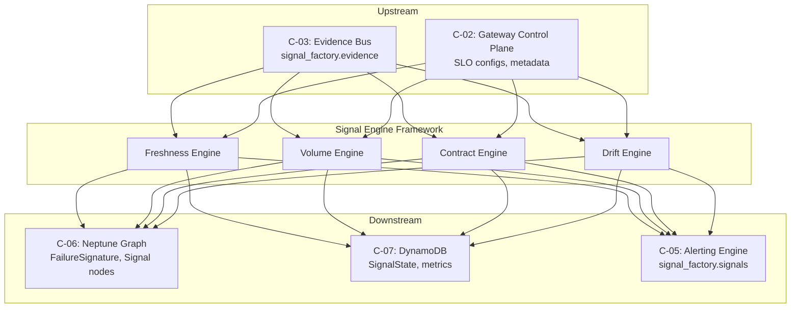
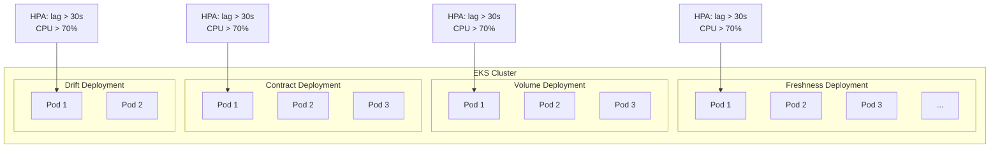
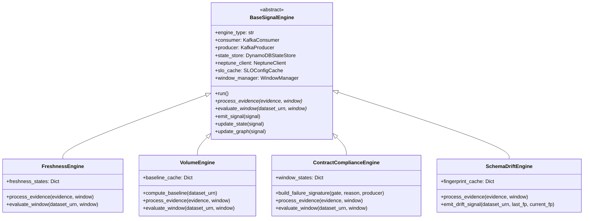
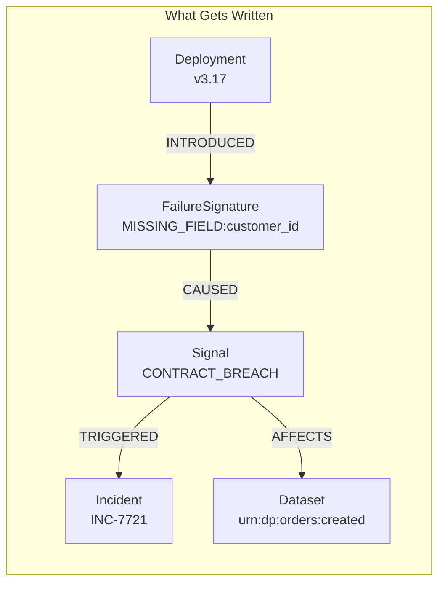
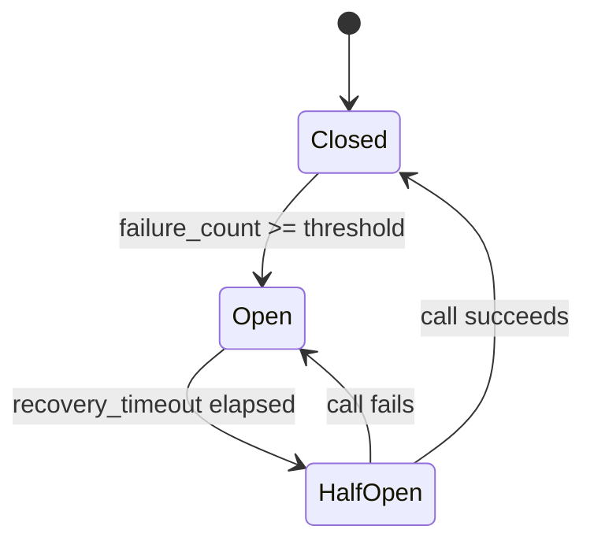

# C-04: Signal Engine Framework — Low-Level Design

**Data Observability Platform v2.0 | Processing Plane Component**

**Version:** 1.0 | **Date:** January 2026 | **Owner:** Signal Processing Team

---

## 1. Executive Summary

The Signal Engine Framework transforms the high-volume, per-record Evidence stream into aggregated, actionable signals about system health. Each engine type runs as an independent EKS deployment with its own Kafka consumer group, enabling isolated scaling, deployment, and fault isolation.

### 1.1 Core Design Principles

- **Separation of Concerns:** Enforcers establish per-record truth; Engines compute system health over time windows
- **Evidence-Only Consumption:** Engines MUST NOT consume raw business topics—they operate exclusively on validated Evidence
- **Independent Scaling:** Each engine type scales based on its specific workload characteristics
- **Bounded Graph Writes:** FailureSignature deduplication prevents Neptune explosion
- **Graceful Degradation:** Engine failures create signal gaps, not data path failures

### 1.2 Component Dependencies



---

## 2. Architecture Overview

### 2.1 Engine Types and MVP Scope

| Engine | Function | Output Signal | MVP |
|--------|----------|---------------|-----|
| **Freshness** | Monitors time since last valid evidence | `FRESHNESS_BREACH` | ✅ Yes |
| **Volume** | Detects anomalies in event throughput | `VOLUME_ANOMALY` | ✅ Yes |
| **Contract** | Computes compliance rate over windows | `CONTRACT_BREACH` | ✅ Yes |
| **Schema Drift** | Tracks schema_fingerprint changes | `DRIFT_DETECTED` | ✅ Yes |
| **DQ** | Aggregates Deequ/quality results | `DQ_BREACH` | Phase 2 |
| **Anomaly** | ML-based pattern detection | `ANOMALY_DETECTED` | Phase 3 |
| **Cost** | Tracks compute/storage costs | `COST_ANOMALY` | Phase 3 |

### 2.2 Window Semantics

| Engine | Window Type | Duration | Grace Period | Rationale |
|--------|-------------|----------|--------------|-----------|
| Freshness | Tumbling | 5 minutes | 2 minutes | Balance latency vs noise |
| Volume | Tumbling | 5 minutes | 2 minutes | Match freshness cadence |
| Contract | Tumbling | 5 minutes | 2 minutes | SLO evaluation window |
| Schema Drift | Event-driven | N/A | N/A | Triggered on fingerprint change |
| DQ | Tumbling | 1 hour | 5 minutes | Quality trends over time |

### 2.3 Deployment Architecture



### 2.4 Consumer Group Configuration

| Engine | Consumer Group | Initial Replicas | Partitions Assigned |
|--------|----------------|------------------|---------------------|
| Freshness | `signal_engines.freshness` | 6 | ~10-11 per pod |
| Volume | `signal_engines.volume` | 6 | ~10-11 per pod |
| Contract | `signal_engines.contract` | 6 | ~10-11 per pod |
| Schema Drift | `signal_engines.drift` | 3 | ~21 per pod |

---

## 3. Data Models

### 3.1 Input: Evidence Event Schema

Signal Engines consume Evidence events from the `signal_factory.evidence` Kafka topic:

```json
{
  "evidence_id": "evd-01HQXY8MNP4QR7ST9VW2XYZ456",
  "timestamp": "2024-01-15T09:58:02.312Z",
  "dataset_urn": "urn:dp:orders:created",
  "producer": {
    "id": "orders-svc",
    "confidence": "HIGH"
  },
  "validation": {
    "result": "FAIL",
    "failed_gates": ["CONTRACT"],
    "reason_codes": ["MISSING_FIELD:customer_id"]
  },
  "schema": {
    "schema_id": "orders_created_v1",
    "schema_fingerprint": "sha256:9f2c..."
  },
  "otel": {
    "trace_id": "ab91f3c2d4e5f6789"
  },
  "source": {
    "topic": "raw.orders.events",
    "partition": 12,
    "offset": 1882341
  }
}
```

### 3.2 Output: Signal Event Schema

```json
{
  "signal_id": "sig-01HQXZ2NPQ5RS8TU0VW3XYZ789",
  "signal_type": "CONTRACT_BREACH",
  "dataset_urn": "urn:dp:orders:created",
  "state": "CRITICAL",
  "window": {
    "start": "2024-01-15T09:55:00.000Z",
    "end": "2024-01-15T10:00:00.000Z",
    "type": "TUMBLING_5MIN"
  },
  "metrics": {
    "evidence_count": 1247,
    "pass_count": 127,
    "fail_count": 1120,
    "compliance_rate": 0.102,
    "slo_threshold": 0.95
  },
  "top_failures": [
    {
      "signature": "MISSING_FIELD:customer_id",
      "count": 1120,
      "first_seen": "2024-01-15T09:58:02.312Z"
    }
  ],
  "evidence_refs": [
    "evd-01HQXY8MNP4QR7ST9VW2XYZ456",
    "evd-01HQXY8MNP4QR7ST9VW2XYZ457"
  ]
}
```

### 3.3 DynamoDB Tables

#### 3.3.1 SignalState Table

| Attribute | Key Type | Data Type | Description |
|-----------|----------|-----------|-------------|
| `dataset_urn` | PK | String | Dataset identifier |
| `signal_type` | SK | String | Signal type enum |
| `state` | - | String | OK/WARNING/CRITICAL/UNKNOWN |
| `score` | - | Number | Computed metric value |
| `breach_start` | - | String | ISO8601 when breach began |
| `last_updated` | - | String | Last update timestamp |
| `failure_signature` | - | String | Top failure pattern |
| `top_producer` | - | String | Attributed service |
| `evidence_sample` | - | List | Sample evidence IDs |
| `ttl` | - | Number | TTL epoch (30 days) |

#### 3.3.2 BaselineMetrics Table

| Attribute | Key Type | Data Type | Description |
|-----------|----------|-----------|-------------|
| `dataset_urn` | PK | String | Dataset identifier |
| `metric_key` | SK | String | Metric identifier |
| `baseline_value` | - | Number | 7-day rolling average |
| `stddev` | - | Number | Standard deviation |
| `sample_count` | - | Number | Samples in baseline |
| `updated_at` | - | String | Last computation time |

---

## 4. API Specifications

### 4.1 Internal gRPC Service

```protobuf
service SignalEngineService {
  // Health and readiness
  rpc HealthCheck(HealthRequest) returns (HealthResponse);
  rpc ReadinessCheck(ReadinessRequest) returns (ReadinessResponse);
  
  // Administrative
  rpc GetEngineStatus(StatusRequest) returns (EngineStatusResponse);
  rpc ForceWindowClose(ForceCloseRequest) returns (ForceCloseResponse);
  rpc ResetDatasetState(ResetRequest) returns (ResetResponse);
}

message EngineStatusResponse {
  string engine_type = 1;
  int64 active_datasets = 2;
  int64 pending_windows = 3;
  double consumer_lag_seconds = 4;
  map<string, int64> signal_counts_by_state = 5;
}
```

### 4.2 Kafka Configuration

#### Consumer Configuration

| Configuration | Value | Rationale |
|---------------|-------|-----------|
| `group.id` | `signal_engines.${ENGINE_TYPE}` | Engine-specific consumer group |
| `auto.offset.reset` | `earliest` | Process all available evidence |
| `enable.auto.commit` | `false` | Manual commit after processing |
| `max.poll.records` | `500` | Batch size for window aggregation |
| `max.poll.interval.ms` | `300000` | 5 min max processing time |
| `isolation.level` | `read_committed` | Transactional reads only |

#### Producer Configuration

| Configuration | Value | Rationale |
|---------------|-------|-----------|
| `topic` | `signal_factory.signals` | Downstream signal topic |
| `acks` | `all` | Full durability |
| `compression.type` | `lz4` | Efficient compression |
| `key.serializer` | `StringSerializer` | dataset_urn as key |

### 4.3 Gateway Control Plane Integration

```http
GET /api/v1/datasets/{dataset_urn}/slos

Response 200:
{
  "dataset_urn": "urn:dp:orders:created",
  "tier": 1,
  "slos": {
    "freshness": {
      "max_delay_seconds": 900,
      "warning_delay_seconds": 600
    },
    "contract": {
      "min_compliance_rate": 0.95,
      "warning_compliance_rate": 0.98
    },
    "volume": {
      "anomaly_detection": true,
      "sensitivity": "medium",
      "min_events_per_hour": 1000
    }
  },
  "owner": "orders-team@company.com"
}
```

#### Caching Strategy

- **L1 Cache:** In-process LRU (1000 entries, 5-min TTL)
- **L2 Cache:** Redis cluster (shared across pods, 15-min TTL)
- **L3 Source:** Gateway Control Plane REST API
- **Invalidation:** SNS event-driven on config changes

---

## 5. Engine Implementations

### 5.1 Base Engine Framework



### 5.2 Freshness Engine

```python
class FreshnessEngine(BaseSignalEngine):
    MAX_OUT_OF_ORDER_SECONDS = 60
    WATERMARK_IDLE_TIMEOUT = 300
    
    def evaluate_window(self, dataset_urn: str, window: Window) -> Signal:
        state = self.state_store.get_freshness_state(dataset_urn)
        slo = self.slo_cache.get_slo(dataset_urn, "freshness")
        
        now = datetime.utcnow()
        time_since_last = (now - state.last_pass_ts).total_seconds()
        
        if time_since_last > slo.max_delay_seconds:
            new_state = SignalState.CRITICAL
        elif time_since_last > slo.warning_delay_seconds:
            new_state = SignalState.WARNING
        else:
            new_state = SignalState.OK
        
        return Signal(
            signal_type=SignalType.FRESHNESS_BREACH,
            dataset_urn=dataset_urn,
            state=new_state,
            metrics={
                "seconds_since_last_evidence": time_since_last,
                "slo_max_delay": slo.max_delay_seconds
            }
        )
```

### 5.3 Volume Engine

```python
class VolumeEngine(BaseSignalEngine):
    BASELINE_WINDOW_DAYS = 7
    STDDEV_MULTIPLIER = 2.5
    
    def compute_baseline(self, dataset_urn: str) -> Baseline:
        history = self.state_store.get_volume_history(
            dataset_urn=dataset_urn,
            days=self.BASELINE_WINDOW_DAYS
        )
        
        if len(history) < 24:
            return Baseline(value=None, stddev=None, insufficient_data=True)
        
        values = [h.event_count for h in history]
        return Baseline(
            value=statistics.mean(values),
            stddev=statistics.stdev(values),
            sample_count=len(values)
        )
    
    def evaluate_window(self, dataset_urn: str, window: Window) -> Signal:
        baseline = self.get_or_compute_baseline(dataset_urn)
        current_count = self.window_states[dataset_urn].evidence_count
        
        if baseline.insufficient_data:
            # Use static thresholds from SLO
            slo = self.slo_cache.get_slo(dataset_urn, "volume")
            state = self._evaluate_static_threshold(current_count, slo)
        else:
            # Use statistical anomaly detection
            z_score = (current_count - baseline.value) / baseline.stddev
            state = self._evaluate_z_score(z_score)
        
        return Signal(
            signal_type=SignalType.VOLUME_ANOMALY,
            dataset_urn=dataset_urn,
            state=state,
            metrics={"current_count": current_count, "baseline": baseline.value}
        )
```

### 5.4 Contract Compliance Engine

```python
class ContractComplianceEngine(BaseSignalEngine):
    
    def process_evidence(self, evidence: Evidence, window: Window) -> None:
        dataset_urn = evidence.dataset_urn
        state = self.window_states.setdefault(dataset_urn, ContractWindowState())
        
        state.total_count += 1
        if evidence.validation.result == "PASS":
            state.pass_count += 1
        else:
            state.fail_count += 1
            for reason in evidence.validation.reason_codes:
                signature = self.build_failure_signature(
                    gate=evidence.validation.failed_gates[0],
                    reason=reason,
                    producer=evidence.producer.id
                )
                state.failure_signatures[signature] += 1
    
    def evaluate_window(self, dataset_urn: str, window: Window) -> Signal:
        state = self.window_states[dataset_urn]
        slo = self.slo_cache.get_slo(dataset_urn, "contract")
        
        compliance_rate = state.pass_count / state.total_count if state.total_count > 0 else 1.0
        
        if compliance_rate < slo.min_compliance_rate:
            signal_state = SignalState.CRITICAL
        elif compliance_rate < slo.warning_compliance_rate:
            signal_state = SignalState.WARNING
        else:
            signal_state = SignalState.OK
        
        top_failures = sorted(
            state.failure_signatures.items(),
            key=lambda x: x[1],
            reverse=True
        )[:5]
        
        return Signal(
            signal_type=SignalType.CONTRACT_BREACH,
            dataset_urn=dataset_urn,
            state=signal_state,
            metrics={
                "evidence_count": state.total_count,
                "compliance_rate": compliance_rate,
                "slo_threshold": slo.min_compliance_rate
            },
            top_failures=[{"signature": sig, "count": cnt} for sig, cnt in top_failures]
        )
```

### 5.5 Schema Drift Engine

```python
class SchemaDriftEngine(BaseSignalEngine):
    
    def process_evidence(self, evidence: Evidence, window: Window) -> None:
        dataset_urn = evidence.dataset_urn
        current_fp = evidence.schema.schema_fingerprint
        
        if dataset_urn not in self.fingerprint_cache:
            stored = self.state_store.get_schema_state(dataset_urn)
            self.fingerprint_cache[dataset_urn] = stored.last_good_fingerprint if stored else current_fp
        
        last_fp = self.fingerprint_cache[dataset_urn]
        
        if current_fp != last_fp:
            # Drift detected - emit signal immediately
            self.emit_drift_signal(
                dataset_urn=dataset_urn,
                last_good_fingerprint=last_fp,
                current_fingerprint=current_fp,
                evidence=evidence
            )
            
            if evidence.validation.result == "PASS":
                self.fingerprint_cache[dataset_urn] = current_fp
```

---

## 6. Neptune Graph Integration

### 6.1 Graph Write Patterns



### 6.2 FailureSignature Deduplication

```python
class FailureSignatureManager:
    """
    Deduplication key: hash(dataset_urn + gate + reason_code)
    
    This ensures:
    - 1M evidence events with same failure = 1 FailureSignature node
    - Different failures = different nodes
    - Graph remains bounded and queryable
    """
    
    def get_or_create_signature(self, dataset_urn: str, gate: str, reason: str) -> str:
        full_id = f"{reason}:{dataset_urn}"
        
        self.neptune_client.execute(f"""
            MERGE (fs:FailureSignature {{id: '{full_id}'}})
            ON CREATE SET 
                fs.reason_code = '{reason}',
                fs.dataset_urn = '{dataset_urn}',
                fs.first_seen = datetime(),
                fs.occurrence_count = 1
            ON MATCH SET 
                fs.occurrence_count = fs.occurrence_count + 1,
                fs.last_seen = datetime()
            RETURN fs.id
        """)
        
        return full_id
```

### 6.3 Cardinality Controls

| Node Type | Cardinality Control | TTL | Cleanup |
|-----------|---------------------|-----|---------|
| Dataset | Stable (1000s) | Permanent | Manual |
| FailureSignature | Deduplicated by key | Long-lived | Archival at 180d |
| Signal | Per dataset/window | 7-30 days | TTL cleanup job |
| Deployment | ~500/day | 30-90 days | TTL cleanup job |

---

## 7. Scalability and Performance

### 7.1 HPA Configuration

```yaml
apiVersion: autoscaling/v2
kind: HorizontalPodAutoscaler
metadata:
  name: signal-engine-freshness-hpa
spec:
  scaleTargetRef:
    apiVersion: apps/v1
    kind: Deployment
    name: signal-engine-freshness
  minReplicas: 3
  maxReplicas: 24
  metrics:
  - type: External
    external:
      metric:
        name: kafka_consumer_lag_seconds
        selector:
          matchLabels:
            consumer_group: signal_engines.freshness
      target:
        type: Value
        value: "30"
  - type: Resource
    resource:
      name: cpu
      target:
        type: Utilization
        averageUtilization: 70
  behavior:
    scaleUp:
      stabilizationWindowSeconds: 60
      policies:
      - type: Percent
        value: 100
        periodSeconds: 60
    scaleDown:
      stabilizationWindowSeconds: 300
```

### 7.2 Backpressure Handling

| Condition | Detection | Response | Recovery |
|-----------|-----------|----------|----------|
| Consumer Lag > 30s | Kafka metrics | HPA scale-up | Auto scale-down at lag < 5s |
| Consumer Lag > 120s | Kafka metrics | Alert + emergency scaling | Manual intervention |
| DynamoDB throttling | 4xx response codes | Exponential backoff | Auto-retry with jitter |
| Neptune overload | Query timeout | Circuit breaker open | Gradual retry after 30s |

### 7.3 Capacity Planning

| Dimension | Day 1 Target | Scale Target (M12) | Autoscale Trigger |
|-----------|--------------|-------------------|-------------------|
| Evidence Throughput | 10K events/sec | 50-500K events/sec | Lag > 30s OR CPU > 70% |
| Signal Latency | < 5 minutes | < 5 minutes maintained | N/A (SLO) |
| Datasets Supported | 50 (Tier-1) | 10,000 total | Registration required |
| DynamoDB WCU | 3K WCU | 15K WCU | On-demand pricing |

---

## 8. Error Handling and Resilience

### 8.1 Failure Mode Matrix

| Failure | Impact | Mitigation | Recovery |
|---------|--------|------------|----------|
| Evidence Bus unavailable | No new signals | Alert + graceful shutdown | Auto-reconnect |
| DynamoDB unavailable | Stale state | Local state fallback + alert | Reconcile on recovery |
| Neptune unavailable | No graph updates | Queue writes + alert | Batch replay |
| Control Plane down | Stale SLO configs | Use cached configs | Cache refresh |
| Malformed evidence | Processing error | Skip + DLQ + alert | Manual review |

### 8.2 Dead Letter Queue Strategy

```python
class DeadLetterQueueHandler:
    DLQ_TOPIC = "signal_factory.evidence.dlq"
    
    def handle_processing_error(self, evidence: Evidence, error: Exception) -> None:
        dlq_message = {
            "original_evidence": evidence.to_dict(),
            "error_type": type(error).__name__,
            "error_message": str(error),
            "engine_type": self.engine_type,
            "failed_at": datetime.utcnow().isoformat(),
            "retry_count": evidence.metadata.get("retry_count", 0) + 1
        }
        
        self.dlq_producer.send(
            topic=self.DLQ_TOPIC,
            key=evidence.evidence_id,
            value=dlq_message
        )
```

### 8.3 Circuit Breaker Pattern



---

## 9. Observability

### 9.1 Metrics

| Metric Name | Type | Labels | Alert Threshold |
|-------------|------|--------|-----------------|
| `signal_engine.evidence.processed` | Counter | engine, result | Rate < 50% baseline |
| `signal_engine.consumer.lag_seconds` | Gauge | engine, partition | > 30s (warn), > 120s (crit) |
| `signal_engine.window.processing_ms` | Histogram | engine | p99 > 5000ms |
| `signal_engine.signals.emitted` | Counter | engine, state | Rate monitoring |
| `signal_engine.dynamodb.latency_ms` | Histogram | table, operation | p99 > 100ms |
| `signal_engine.neptune.latency_ms` | Histogram | query_type | p99 > 500ms |
| `signal_engine.dlq.messages` | Counter | engine, error_type | > 1000/hour |

### 9.2 Distributed Tracing

```python
class TracingMiddleware:
    def trace_evidence_processing(self, evidence: Evidence):
        ctx = extract(evidence.otel)
        
        with self.tracer.start_as_current_span(
            f"signal_engine.process.{self.engine_type}",
            context=ctx,
            attributes={
                "evidence.id": evidence.evidence_id,
                "dataset.urn": evidence.dataset_urn
            }
        ) as span:
            yield span
```

---

## 10. Security

### 10.1 Authentication and Authorization

| Domain | Approach | Implementation |
|--------|----------|----------------|
| Pod Identity | IRSA | IAM Roles for Service Accounts |
| Kafka Auth | IAM + SASL | MSK IAM authentication |
| DynamoDB | IAM policies | Least-privilege per table |
| Neptune | IAM auth | Gremlin over HTTPS with SigV4 |
| Control Plane | Service mesh | mTLS via Istio |

### 10.2 Data Protection

- **Encryption in Transit:** TLS 1.3 for all network communication
- **Encryption at Rest:** KMS encryption for DynamoDB, Neptune, Kafka
- **PII Handling:** Engines do not persist raw payloads; only metadata
- **Secrets Management:** AWS Secrets Manager (no credentials in code)

---

## 11. Operational Runbook

### 11.1 Deployment Checklist

1. Verify DynamoDB tables created with correct capacity
2. Confirm Kafka topics exist with proper partitioning (64 partitions)
3. Validate Neptune cluster endpoints and IAM authentication
4. Deploy engine pods and verify consumer group registration
5. Enable HPA and verify scaling behavior
6. Configure alerts in CloudWatch/Prometheus
7. Run integration tests with synthetic evidence

### 11.2 Common Issues and Resolutions

| Symptom | Likely Cause | Resolution |
|---------|--------------|------------|
| Consumer lag increasing | Insufficient replicas | Check HPA, increase maxReplicas |
| Signals not appearing | Kafka offset issue | Check consumer group, reset if needed |
| DynamoDB throttling | Hot partition | Check partition key, enable on-demand |
| Neptune query timeout | Large graph traversal | Check query patterns, add limits |

### 11.3 Emergency Procedures

```bash
# Emergency scale-up
kubectl scale deployment signal-engine-freshness --replicas=12

# Consumer group reset to latest
kafka-consumer-groups.sh --bootstrap-server $MSK_BOOTSTRAP \
  --group signal_engines.freshness \
  --reset-offsets --to-latest --execute \
  --topic signal_factory.evidence
```

---

## 12. Appendices

### A. Cost Estimation

| Resource | Day 1 | Scale (M12) | Notes |
|----------|-------|-------------|-------|
| EKS Compute (4 engines) | $1,200/mo | $4,800/mo | m5.xlarge |
| DynamoDB | $400/mo | $1,500/mo | On-demand |
| Neptune writes | $300/mo | $1,200/mo | Shared cluster |
| CloudWatch | $100/mo | $400/mo | Custom metrics |
| **Total** | **$2,000/mo** | **$7,900/mo** | |

### B. Glossary

| Term | Definition |
|------|------------|
| Evidence | Immutable record of per-event validation result |
| Signal | Aggregated health signal computed over time windows |
| FailureSignature | Unique pattern used for graph deduplication |
| Window | Time-bounded aggregation period |
| Watermark | Event-time threshold for late event handling |
| Baseline | Historical statistical reference for anomaly detection |

---

*Document generated: January 2026 | Version 1.0*
