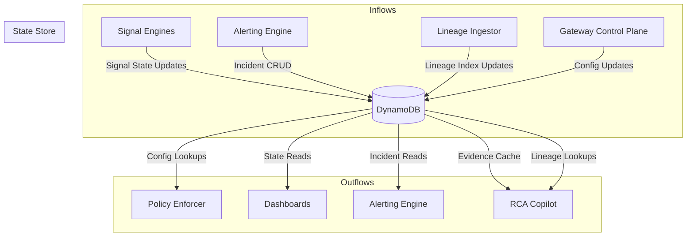
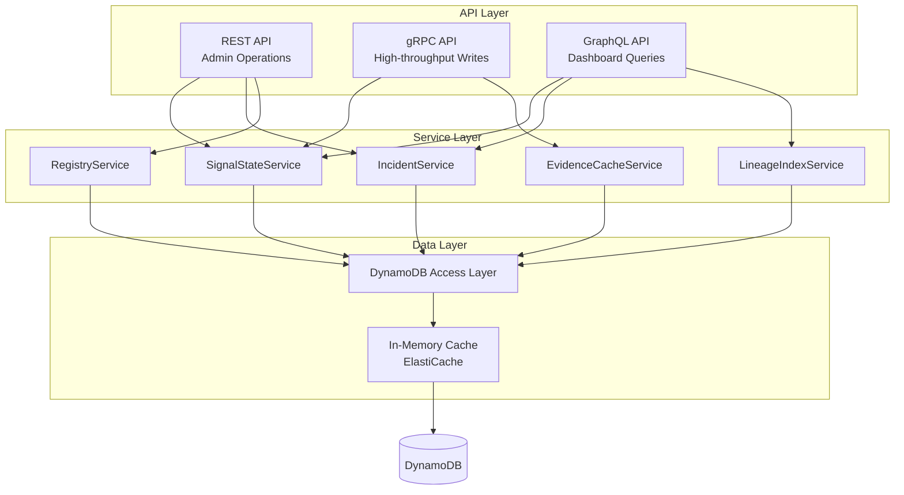
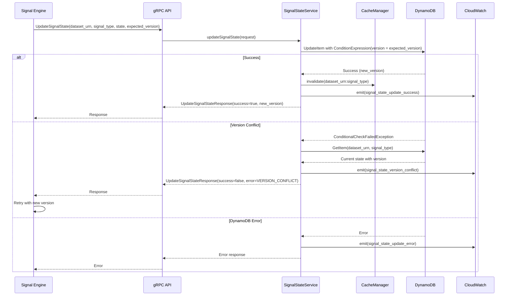
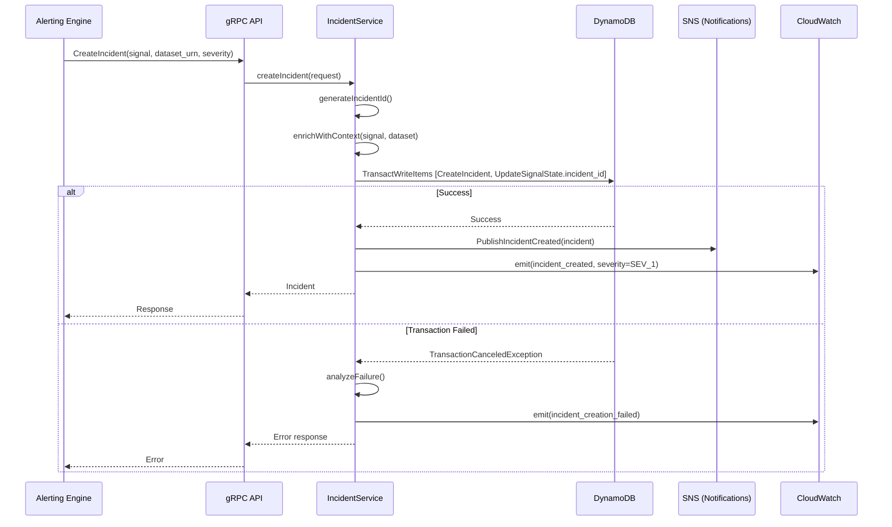
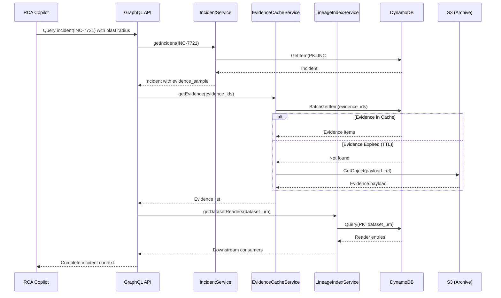

# C-07: DynamoDB State Store
## Low-Level Design (LLD) Specification

**Version:** 1.0  
**Status:** Ready for Architecture Review  
**Owner:** Signal Processing Team  
**Date:** January 2026

---

## Table of Contents

1. [Executive Summary](#1-executive-summary)
2. [Component Analysis](#2-component-analysis)
3. [System Thinking Analysis](#3-system-thinking-analysis)
4. [Data Model Specification](#4-data-model-specification)
5. [API Specifications](#5-api-specifications)
6. [Component Architecture](#6-component-architecture)
7. [Scalability Design](#7-scalability-design)
8. [Interoperability Contracts](#8-interoperability-contracts)
9. [Observability Design](#9-observability-design)
10. [Security Design](#10-security-design)
11. [Error Handling & Resilience](#11-error-handling--resilience)
12. [Multi-Region & Disaster Recovery](#12-multi-region--disaster-recovery)
13. [Cost Analysis](#13-cost-analysis)
14. [Operational Runbook](#14-operational-runbook)
15. [Self-Critique & Refinements](#15-self-critique--refinements)

---

## 1. Executive Summary

### 1.1 Purpose

C-07: DynamoDB State Store is a **foundational component** in the Knowledge Plane that provides **operational truth for fast dashboards and lookups**. It answers the question "What is the current health?" while Neptune (C-06) answers "Why did this happen?" — a complementary dual-storage strategy.

### 1.2 Core Responsibilities

| Responsibility | Description |
|----------------|-------------|
| **Operational State** | Store current signal states (OK/WARNING/CRITICAL) per dataset/signal-type |
| **Incident Management** | Index active/resolved incidents for fast lookup and correlation |
| **Configuration Store** | Provide dataset registry, resolution maps, and policy definitions |
| **Evidence Caching** | Hot cache for RCA queries requiring evidence drill-down |
| **Lineage Indexes** | O(1) lookups for "who writes/reads this dataset" queries |

### 1.3 Key Design Principles

1. **Foundation Component**: No upstream dependencies (only AWS DynamoDB)
2. **Sub-10ms Reads**: P99 read latency target for dashboard queries
3. **Eventually Consistent by Default**: Strong consistency only where required
4. **TTL-Driven Lifecycle**: Automatic data expiration reduces operational burden
5. **Multi-Region Ready**: Global Tables for DR without application changes

### 1.4 Dependencies

```
┌─────────────────────────────────────────────────────────────────┐
│                    DEPENDENCY GRAPH                             │
├─────────────────────────────────────────────────────────────────┤
│                                                                 │
│  C-07 DynamoDB State Store                                      │
│         │                                                       │
│         ├── DEPENDS ON: None (Foundation Component)             │
│         │                                                       │
│         └── DEPENDED ON BY:                                     │
│              ├── C-02: Gateway Control Plane (config lookup)    │
│              ├── C-04: Signal Engines (state writes)            │
│              ├── C-05: Alerting Engine (incident management)    │
│              ├── C-08: Lineage Ingestor (index updates)         │
│              └── C-09: RCA Copilot (evidence cache, indexes)    │
│                                                                 │
└─────────────────────────────────────────────────────────────────┘
```

---

## 2. Component Analysis

### 2.1 Functional Decomposition

The DynamoDB State Store serves **8 distinct tables** across **4 functional domains**:

```
┌─────────────────────────────────────────────────────────────────────────────┐
│                        FUNCTIONAL DOMAIN DECOMPOSITION                       │
├─────────────────────────────────────────────────────────────────────────────┤
│                                                                             │
│  ┌─────────────────────┐    ┌─────────────────────┐                         │
│  │  OPERATIONAL STATE  │    │  CONFIGURATION      │                         │
│  ├─────────────────────┤    ├─────────────────────┤                         │
│  │ • SignalState       │    │ • DatasetRegistry   │                         │
│  │ • IncidentIndex     │    │ • DatasetResolution │                         │
│  │                     │    │   Map               │                         │
│  └─────────────────────┘    └─────────────────────┘                         │
│                                                                             │
│  ┌─────────────────────┐    ┌─────────────────────┐                         │
│  │  EVIDENCE CACHE     │    │  LINEAGE INDEXES    │                         │
│  ├─────────────────────┤    ├─────────────────────┤                         │
│  │ • EvidenceCache     │    │ • DatasetToWriters  │                         │
│  │                     │    │ • DatasetToReaders  │                         │
│  │                     │    │ • ColumnToWriters   │                         │
│  │                     │    │ • ColumnToReaders   │                         │
│  └─────────────────────┘    └─────────────────────┘                         │
│                                                                             │
└─────────────────────────────────────────────────────────────────────────────┘
```

### 2.2 Why DynamoDB?

| Factor | DynamoDB Advantage |
|--------|-------------------|
| **Latency** | Single-digit millisecond reads at any scale |
| **Operational Simplicity** | Fully managed, auto-scaling, no server management |
| **Multi-Region** | Global Tables provide active-active replication |
| **Cost Model** | On-demand pricing aligns with variable traffic |
| **IAM Integration** | Fine-grained access control via AWS IAM |
| **TTL Support** | Native expiration without application logic |

---

## 3. System Thinking Analysis

### 3.1 Things & Connections



### 3.2 Hidden Assumptions

| Assumption | Risk if Wrong | Mitigation |
|------------|---------------|------------|
| DynamoDB on-demand scales instantly | Hot partition throttling | Pre-provisioned capacity for known hot keys |
| Eventual consistency acceptable for dashboards | Stale data shown to users | Use strong reads for critical paths (incident creation) |
| Item size < 400KB | Evidence payloads may exceed | Store large payloads in S3, reference in DynamoDB |
| GSI propagation is near-instant | Query inconsistencies | Design access patterns to minimize GSI dependency |
| TTL deletion is best-effort | Stale data persists | Application-level cleanup for audit-sensitive tables |

### 3.3 The 5 Whys: Why Dual Storage?

1. **Why not use Neptune for everything?** → Neptune excels at graph traversals but has higher read latency (~50-500ms) vs DynamoDB (~1-10ms)
2. **Why is low latency critical?** → Dashboards must refresh in real-time; SREs need instant health visibility
3. **Why can't we cache Neptune results?** → Stale cached data during incidents leads to incorrect triage
4. **Why not use Redis instead?** → DynamoDB provides persistence, TTL, and multi-region without operational overhead
5. **Why separate operational state from causal graph?** → Different access patterns (point lookups vs graph traversals) require different storage optimizations

### 3.4 Alternatives Considered

| Alternative | Pros | Cons | Decision |
|-------------|------|------|----------|
| **Redis Cluster** | Sub-millisecond latency | Operational complexity, persistence concerns | ❌ Rejected |
| **Aurora PostgreSQL** | SQL flexibility | Higher latency, scaling complexity | ❌ Rejected |
| **Neptune Only** | Single data store | Latency unsuitable for dashboards | ❌ Rejected |
| **DynamoDB** | Low latency, managed, multi-region | Limited query flexibility | ✅ Selected |

### 3.5 Cost of Action vs Inaction

| Decision | Cost of Action | Cost of Inaction |
|----------|----------------|------------------|
| Implement TTL policies | Minor complexity in data modeling | Data growth leads to cost explosion |
| Use on-demand pricing | ~10-20% higher cost than provisioned | Under-provisioned capacity causes throttling |
| Enable Global Tables | ~2x write cost | DR failover takes hours instead of minutes |
| Implement caching layer | Added latency (cache check) | Higher DynamoDB costs, potential throttling |

---

## 4. Data Model Specification

### 4.1 Table: SignalState

**Purpose**: Current signal state per asset/signal-type combination. Single source of truth for dashboard health indicators.

```json
{
  "TableName": "observability-signal-state",
  "KeySchema": [
    { "AttributeName": "PK", "KeyType": "HASH" },
    { "AttributeName": "SK", "KeyType": "RANGE" }
  ],
  "AttributeDefinitions": [
    { "AttributeName": "PK", "AttributeType": "S" },
    { "AttributeName": "SK", "AttributeType": "S" },
    { "AttributeName": "state", "AttributeType": "S" },
    { "AttributeName": "tier", "AttributeType": "S" }
  ],
  "GlobalSecondaryIndexes": [
    {
      "IndexName": "state-tier-index",
      "KeySchema": [
        { "AttributeName": "state", "KeyType": "HASH" },
        { "AttributeName": "tier", "KeyType": "RANGE" }
      ],
      "Projection": { "ProjectionType": "ALL" }
    }
  ],
  "BillingMode": "PAY_PER_REQUEST",
  "TimeToLiveSpecification": {
    "AttributeName": "ttl",
    "Enabled": true
  }
}
```

**Item Schema**:

```json
{
  "PK": "urn:dp:orders:order_created:v1",
  "SK": "CONTRACT_COMPLIANCE",
  "state": "CRITICAL",
  "previous_state": "OK",
  "state_changed_at": "2026-01-15T10:00:00.000Z",
  "score": 0.102,
  "slo_threshold": 0.95,
  "breach_start": "2026-01-15T09:58:02.312Z",
  "window_start": "2026-01-15T09:55:00.000Z",
  "window_end": "2026-01-15T10:00:00.000Z",
  "window_type": "TUMBLING_5MIN",
  "metrics": {
    "evidence_count": 1247,
    "pass_count": 127,
    "fail_count": 1120
  },
  "failure_signature": "MISSING_FIELD:customer_id",
  "top_producer": "orders-svc",
  "top_producer_version": "v3.17",
  "top_producer_confidence": "HIGH",
  "evidence_sample": [
    "evd-01HQXY8MNP4QR7ST9VW2XYZ456",
    "evd-01HQXY8MNP4QR7ST9VW2XYZ457"
  ],
  "incident_id": "INC-7721",
  "tier": "TIER_1",
  "owner_team": "orders-platform",
  "last_updated": "2026-01-15T10:00:00.500Z",
  "ttl": 1737172800,
  "version": 47
}
```

**Access Patterns**:

| Access Pattern | Key Condition | Consistency |
|----------------|---------------|-------------|
| Get current state for dataset + signal | PK = `{dataset_urn}`, SK = `{signal_type}` | Eventually Consistent |
| Get all signals for a dataset | PK = `{dataset_urn}` | Eventually Consistent |
| Find all CRITICAL Tier-1 datasets | GSI: state = `CRITICAL`, tier begins_with `TIER_1` | Eventually Consistent |
| Find all datasets in breach | GSI: state = `CRITICAL` OR state = `WARNING` | Eventually Consistent |

---

### 4.2 Table: IncidentIndex

**Purpose**: Active and resolved incidents with full context for RCA and alerting correlation.

```json
{
  "TableName": "observability-incident-index",
  "KeySchema": [
    { "AttributeName": "PK", "KeyType": "HASH" },
    { "AttributeName": "SK", "KeyType": "RANGE" }
  ],
  "AttributeDefinitions": [
    { "AttributeName": "PK", "AttributeType": "S" },
    { "AttributeName": "SK", "AttributeType": "S" },
    { "AttributeName": "GSI1PK", "AttributeType": "S" },
    { "AttributeName": "GSI1SK", "AttributeType": "S" },
    { "AttributeName": "GSI2PK", "AttributeType": "S" },
    { "AttributeName": "GSI2SK", "AttributeType": "S" }
  ],
  "GlobalSecondaryIndexes": [
    {
      "IndexName": "dataset-time-index",
      "KeySchema": [
        { "AttributeName": "GSI1PK", "KeyType": "HASH" },
        { "AttributeName": "GSI1SK", "KeyType": "RANGE" }
      ],
      "Projection": { "ProjectionType": "ALL" }
    },
    {
      "IndexName": "status-severity-index",
      "KeySchema": [
        { "AttributeName": "GSI2PK", "KeyType": "HASH" },
        { "AttributeName": "GSI2SK", "KeyType": "RANGE" }
      ],
      "Projection": { "ProjectionType": "ALL" }
    }
  ],
  "BillingMode": "PAY_PER_REQUEST",
  "TimeToLiveSpecification": {
    "AttributeName": "ttl",
    "Enabled": true
  }
}
```

**Item Schema**:

```json
{
  "PK": "INC#INC-7721",
  "SK": "META",
  "incident_id": "INC-7721",
  "status": "OPEN",
  "severity": "SEV_1",
  "title": "Contract breach on orders:order_created - MISSING_FIELD:customer_id",
  "created_at": "2026-01-15T10:00:15.000Z",
  "updated_at": "2026-01-15T10:05:30.000Z",
  "resolved_at": null,
  "primary_dataset_urn": "urn:dp:orders:order_created:v1",
  "signal_types": ["CONTRACT_COMPLIANCE", "FRESHNESS"],
  "failure_signatures": ["MISSING_FIELD:customer_id"],
  "implicated_producer": {
    "producer_id": "orders-svc",
    "version": "v3.17",
    "confidence": "HIGH",
    "deployed_at": "2026-01-15T09:57:45.000Z"
  },
  "blast_radius": {
    "downstream_count": 3,
    "downstream_services": ["finance-pipeline", "analytics-dashboard", "audit-export"],
    "estimated_impact": "HIGH"
  },
  "notification_state": {
    "pagerduty_incident_id": "PD-12345",
    "slack_thread_ts": "1705315215.123456",
    "jira_ticket": "DATA-4521"
  },
  "primary_evidence_id": "evd-01HQXY8MNP4QR7ST9VW2XYZ456",
  "evidence_sample": [
    "evd-01HQXY8MNP4QR7ST9VW2XYZ456",
    "evd-01HQXY8MNP4QR7ST9VW2XYZ457",
    "evd-01HQXY8MNP4QR7ST9VW2XYZ458"
  ],
  "rca_summary": null,
  "owner_team": "orders-platform",
  "oncall_user": "john.doe@company.com",
  "GSI1PK": "DS#urn:dp:orders:order_created:v1",
  "GSI1SK": "2026-01-15T10:00:15.000Z",
  "GSI2PK": "STATUS#OPEN",
  "GSI2SK": "SEV_1#2026-01-15T10:00:15.000Z",
  "ttl": 1768708815,
  "version": 3
}
```

**Access Patterns**:

| Access Pattern | Key Condition | Use Case |
|----------------|---------------|----------|
| Get incident by ID | PK = `INC#{incident_id}`, SK = `META` | Incident detail page |
| Get incidents for dataset | GSI1: GSI1PK = `DS#{dataset_urn}` | Dataset incident history |
| Get active SEV-1 incidents | GSI2: GSI2PK = `STATUS#OPEN`, GSI2SK begins_with `SEV_1` | Alerting dashboard |
| Get all open incidents | GSI2: GSI2PK = `STATUS#OPEN` | Operations dashboard |

---

### 4.3 Table: DatasetRegistry

**Purpose**: Dataset metadata, policies, schema bindings, and SLO definitions. Source of truth for Gateway Control Plane.

```json
{
  "TableName": "observability-dataset-registry",
  "KeySchema": [
    { "AttributeName": "PK", "KeyType": "HASH" },
    { "AttributeName": "SK", "KeyType": "RANGE" }
  ],
  "AttributeDefinitions": [
    { "AttributeName": "PK", "AttributeType": "S" },
    { "AttributeName": "SK", "AttributeType": "S" },
    { "AttributeName": "tier", "AttributeType": "S" },
    { "AttributeName": "owner_team", "AttributeType": "S" }
  ],
  "GlobalSecondaryIndexes": [
    {
      "IndexName": "tier-index",
      "KeySchema": [
        { "AttributeName": "tier", "KeyType": "HASH" },
        { "AttributeName": "PK", "KeyType": "RANGE" }
      ],
      "Projection": { "ProjectionType": "ALL" }
    },
    {
      "IndexName": "owner-index",
      "KeySchema": [
        { "AttributeName": "owner_team", "KeyType": "HASH" },
        { "AttributeName": "PK", "KeyType": "RANGE" }
      ],
      "Projection": { "ProjectionType": "ALL" }
    }
  ],
  "BillingMode": "PAY_PER_REQUEST"
}
```

**Item Schema**:

```json
{
  "PK": "urn:dp:orders:order_created:v1",
  "SK": "CONFIG#LATEST",
  "dataset_urn": "urn:dp:orders:order_created:v1",
  "display_name": "Orders - Order Created Events",
  "description": "Domain events for new order creation",
  "tier": "TIER_1",
  "owner_team": "orders-platform",
  "owner_email": "orders-platform@company.com",
  "oncall_rotation": "orders-oncall",
  "source": {
    "type": "KAFKA",
    "topic": "raw.orders.events",
    "cluster": "main-msk-cluster"
  },
  "schema_binding": {
    "registry": "GLUE",
    "schema_name": "orders.order_created",
    "schema_id": "glue:orders.order_created:17",
    "version_policy": "LATEST",
    "compatibility": "BACKWARD"
  },
  "contract_binding": {
    "contract_id": "dc:orders.order_created:3",
    "required_fields": ["order_id", "customer_id", "total_amount", "created_at"],
    "field_constraints": {
      "total_amount": { "type": "number", "min": 0 },
      "customer_id": { "type": "string", "pattern": "^cust-[a-z0-9]+$" }
    }
  },
  "slos": {
    "freshness": {
      "max_delay_seconds": 300,
      "evaluation_window": "TUMBLING_5MIN"
    },
    "volume": {
      "min_events_per_window": 100,
      "max_deviation_percent": 50,
      "baseline_window_days": 7
    },
    "contract_compliance": {
      "min_compliance_rate": 0.95
    }
  },
  "pii_policy": {
    "scan_enabled": true,
    "fields_to_scan": ["customer_email", "shipping_address"],
    "action_on_detection": "WARN"
  },
  "retention_days": 90,
  "created_at": "2025-06-15T08:30:00.000Z",
  "updated_at": "2026-01-10T14:22:00.000Z",
  "updated_by": "jane.smith@company.com",
  "config_version": 12,
  "previous_version_sk": "CONFIG#v11"
}
```

**Version History Pattern**:

```json
{
  "PK": "urn:dp:orders:order_created:v1",
  "SK": "CONFIG#v11",
  "archived_at": "2026-01-10T14:22:00.000Z",
  "...": "previous config values"
}
```

---

### 4.4 Table: DatasetResolutionMap

**Purpose**: Maps raw Kafka topic patterns to canonical dataset URNs. Enables zero-producer-change resolution in Policy Enforcer.

```json
{
  "TableName": "observability-dataset-resolution",
  "KeySchema": [
    { "AttributeName": "PK", "KeyType": "HASH" },
    { "AttributeName": "SK", "KeyType": "RANGE" }
  ],
  "BillingMode": "PAY_PER_REQUEST"
}
```

**Item Schema**:

```json
{
  "PK": "TOPIC#raw.orders.events",
  "SK": "RULE#default",
  "topic_pattern": "raw.orders.events",
  "resolution_type": "EXACT",
  "dataset_urn": "urn:dp:orders:order_created:v1",
  "priority": 100,
  "conditions": null,
  "created_at": "2025-06-15T08:30:00.000Z",
  "updated_at": "2026-01-10T14:22:00.000Z"
}
```

**Conditional Resolution**:

```json
{
  "PK": "TOPIC#raw.orders.*",
  "SK": "RULE#by-event-type",
  "topic_pattern": "raw.orders.*",
  "resolution_type": "CONDITIONAL",
  "conditions": [
    {
      "field": "$.event_type",
      "operator": "EQUALS",
      "value": "order_created",
      "dataset_urn": "urn:dp:orders:order_created:v1"
    },
    {
      "field": "$.event_type",
      "operator": "EQUALS",
      "value": "order_cancelled",
      "dataset_urn": "urn:dp:orders:order_cancelled:v1"
    }
  ],
  "default_dataset_urn": "urn:dp:orders:unknown:v1",
  "priority": 50,
  "created_at": "2025-06-15T08:30:00.000Z"
}
```

---

### 4.5 Table: EvidenceCache

**Purpose**: Hot cache of recent evidence for RCA drill-down. Avoids cold storage lookup for active incidents.

```json
{
  "TableName": "observability-evidence-cache",
  "KeySchema": [
    { "AttributeName": "evidence_id", "KeyType": "HASH" }
  ],
  "AttributeDefinitions": [
    { "AttributeName": "evidence_id", "AttributeType": "S" },
    { "AttributeName": "dataset_urn", "AttributeType": "S" },
    { "AttributeName": "created_at", "AttributeType": "S" }
  ],
  "GlobalSecondaryIndexes": [
    {
      "IndexName": "dataset-time-index",
      "KeySchema": [
        { "AttributeName": "dataset_urn", "KeyType": "HASH" },
        { "AttributeName": "created_at", "KeyType": "RANGE" }
      ],
      "Projection": { "ProjectionType": "ALL" }
    }
  ],
  "BillingMode": "PAY_PER_REQUEST",
  "TimeToLiveSpecification": {
    "AttributeName": "ttl",
    "Enabled": true
  }
}
```

**Item Schema**:

```json
{
  "evidence_id": "evd-01HQXY8MNP4QR7ST9VW2XYZ456",
  "dataset_urn": "urn:dp:orders:order_created:v1",
  "created_at": "2026-01-15T09:58:02.312Z",
  "producer": {
    "producer_id": "orders-svc",
    "version": "v3.17",
    "confidence": "HIGH"
  },
  "source": {
    "topic": "raw.orders.events",
    "partition": 12,
    "offset": 847293847
  },
  "validation": {
    "result": "FAIL",
    "failed_gates": ["G4_CONTRACT"],
    "reason_codes": ["MISSING_FIELD:customer_id"]
  },
  "fingerprints": {
    "schema_fingerprint": "sha256:9f2c...",
    "payload_hash": "sha256:ab12..."
  },
  "otel": {
    "trace_id": "abc123def456...",
    "span_id": "789xyz..."
  },
  "payload_ref": "s3://evidence-bucket/2026/01/15/evd-01HQXY8MNP...json.gz",
  "payload_size_bytes": 2048,
  "ttl": 1705488000
}
```

**TTL Policy**: 24 hours for hot cache. Older evidence retrieved from S3 archive.

---

### 4.6 Lineage Index Tables

**Purpose**: O(1) lookups for "who writes/reads this dataset/column" to support fast RCA without Neptune traversal.

#### 4.6.1 DatasetToWritersIndex

```json
{
  "TableName": "observability-dataset-writers",
  "KeySchema": [
    { "AttributeName": "PK", "KeyType": "HASH" },
    { "AttributeName": "SK", "KeyType": "RANGE" }
  ],
  "BillingMode": "PAY_PER_REQUEST",
  "TimeToLiveSpecification": {
    "AttributeName": "ttl",
    "Enabled": true
  }
}
```

**Item Schema**:

```json
{
  "PK": "urn:dp:orders:order_created:v1",
  "SK": "producer#job:orders-delta-landing",
  "producer_id": "job:orders-delta-landing",
  "producer_name": "orders-delta-landing",
  "producer_type": "JOB",
  "confidence": "HIGH",
  "spec_id": "lspec:orders-delta-landing:git:9f31c2d",
  "commit": "9f31c2d",
  "updated_at": "2026-01-16T12:30:00Z",
  "ttl": 1713283800
}
```

#### 4.6.2 DatasetToReadersIndex

```json
{
  "PK": "urn:dp:orders:order_created:v1",
  "SK": "consumer#job:finance-pipeline",
  "consumer_id": "job:finance-pipeline",
  "consumer_name": "finance-pipeline",
  "consumer_type": "JOB",
  "confidence": "HIGH",
  "spec_id": "lspec:finance-pipeline:git:a2b4c6d",
  "commit": "a2b4c6d",
  "updated_at": "2026-01-16T12:30:00Z",
  "ttl": 1713283800
}
```

#### 4.6.3 ColumnToWritersIndex & ColumnToReadersIndex

Same schema as dataset indexes, but with column URN as PK:

```json
{
  "PK": "urn:col:urn:dp:orders:order_created:v1:customer_id",
  "SK": "producer#job:orders-svc",
  "...": "same structure"
}
```

---

### 4.7 Complete Table Summary

| Table | PK | SK | GSIs | TTL | Est. Items |
|-------|----|----|------|-----|------------|
| SignalState | dataset_urn | signal_type | state-tier | 30 days | ~50K |
| IncidentIndex | INC#{id} | META | dataset-time, status-severity | 365 days | ~10K |
| DatasetRegistry | dataset_urn | CONFIG#{version} | tier, owner | None | ~10K |
| DatasetResolutionMap | TOPIC#{pattern} | RULE#{name} | None | None | ~5K |
| EvidenceCache | evidence_id | - | dataset-time | 24 hours | ~1M |
| DatasetToWritersIndex | dataset_urn | producer#{id} | None | 90 days | ~100K |
| DatasetToReadersIndex | dataset_urn | consumer#{id} | None | 90 days | ~100K |
| ColumnToWritersIndex | column_urn | producer#{id} | None | 90 days | ~500K |
| ColumnToReadersIndex | column_urn | consumer#{id} | None | 90 days | ~500K |

---

## 5. API Specifications

### 5.1 Service Layer Architecture



### 5.2 gRPC API (High-Throughput Operations)

```protobuf
syntax = "proto3";

package observability.statestore.v1;

import "google/protobuf/timestamp.proto";

// SignalStateService - Called by Signal Engines at ~3K writes/sec
service SignalStateService {
  // Upsert signal state with optimistic locking
  rpc UpdateSignalState(UpdateSignalStateRequest) returns (UpdateSignalStateResponse);
  
  // Batch update for efficiency
  rpc BatchUpdateSignalState(BatchUpdateSignalStateRequest) returns (BatchUpdateSignalStateResponse);
  
  // Get current state
  rpc GetSignalState(GetSignalStateRequest) returns (SignalState);
  
  // Get all signals for a dataset
  rpc GetDatasetSignals(GetDatasetSignalsRequest) returns (GetDatasetSignalsResponse);
}

message UpdateSignalStateRequest {
  string dataset_urn = 1;
  string signal_type = 2;
  SignalStateValue state = 3;
  int64 expected_version = 4; // Optimistic locking
}

message SignalStateValue {
  string state = 1; // OK, WARNING, CRITICAL, UNKNOWN
  double score = 2;
  double slo_threshold = 3;
  google.protobuf.Timestamp breach_start = 4;
  google.protobuf.Timestamp window_start = 5;
  google.protobuf.Timestamp window_end = 6;
  string window_type = 7;
  SignalMetrics metrics = 8;
  string failure_signature = 9;
  ProducerInfo top_producer = 10;
  repeated string evidence_sample = 11;
  string incident_id = 12;
}

message SignalMetrics {
  int64 evidence_count = 1;
  int64 pass_count = 2;
  int64 fail_count = 3;
}

message ProducerInfo {
  string producer_id = 1;
  string version = 2;
  string confidence = 3;
}

message UpdateSignalStateResponse {
  bool success = 1;
  int64 new_version = 2;
  string error_code = 3;
  string error_message = 4;
}

message BatchUpdateSignalStateRequest {
  repeated UpdateSignalStateRequest updates = 1;
}

message BatchUpdateSignalStateResponse {
  repeated UpdateSignalStateResponse results = 1;
  int32 success_count = 2;
  int32 failure_count = 3;
}

// EvidenceCacheService - Called during Evidence processing
service EvidenceCacheService {
  rpc PutEvidence(PutEvidenceRequest) returns (PutEvidenceResponse);
  rpc BatchPutEvidence(BatchPutEvidenceRequest) returns (BatchPutEvidenceResponse);
  rpc GetEvidence(GetEvidenceRequest) returns (Evidence);
}

message PutEvidenceRequest {
  Evidence evidence = 1;
}

message Evidence {
  string evidence_id = 1;
  string dataset_urn = 2;
  google.protobuf.Timestamp created_at = 3;
  ProducerInfo producer = 4;
  SourceInfo source = 5;
  ValidationResult validation = 6;
  Fingerprints fingerprints = 7;
  OtelContext otel = 8;
  string payload_ref = 9;
  int64 payload_size_bytes = 10;
}

// IncidentService - Called by Alerting Engine
service IncidentService {
  rpc CreateIncident(CreateIncidentRequest) returns (Incident);
  rpc UpdateIncident(UpdateIncidentRequest) returns (Incident);
  rpc GetIncident(GetIncidentRequest) returns (Incident);
  rpc ResolveIncident(ResolveIncidentRequest) returns (Incident);
}
```

### 5.3 REST API (Admin Operations)

```yaml
openapi: 3.0.3
info:
  title: Data Observability State Store API
  version: 1.0.0
  description: Admin API for dataset registry and configuration management

paths:
  /api/v1/datasets:
    get:
      summary: List all registered datasets
      parameters:
        - name: tier
          in: query
          schema:
            type: string
            enum: [TIER_1, TIER_2, TIER_3]
        - name: owner_team
          in: query
          schema:
            type: string
        - name: page_token
          in: query
          schema:
            type: string
        - name: page_size
          in: query
          schema:
            type: integer
            default: 50
            maximum: 100
      responses:
        '200':
          description: List of datasets
          content:
            application/json:
              schema:
                $ref: '#/components/schemas/DatasetListResponse'
    
    post:
      summary: Register a new dataset
      requestBody:
        required: true
        content:
          application/json:
            schema:
              $ref: '#/components/schemas/CreateDatasetRequest'
      responses:
        '201':
          description: Dataset created
        '409':
          description: Dataset already exists

  /api/v1/datasets/{dataset_urn}:
    get:
      summary: Get dataset configuration
      parameters:
        - name: dataset_urn
          in: path
          required: true
          schema:
            type: string
        - name: version
          in: query
          description: Specific config version (default: LATEST)
          schema:
            type: string
      responses:
        '200':
          description: Dataset configuration
          content:
            application/json:
              schema:
                $ref: '#/components/schemas/DatasetConfig'
        '404':
          description: Dataset not found
    
    put:
      summary: Update dataset configuration
      parameters:
        - name: dataset_urn
          in: path
          required: true
          schema:
            type: string
      requestBody:
        required: true
        content:
          application/json:
            schema:
              $ref: '#/components/schemas/UpdateDatasetRequest'
      responses:
        '200':
          description: Dataset updated
        '409':
          description: Version conflict (optimistic locking)

  /api/v1/datasets/{dataset_urn}/resolution-rules:
    get:
      summary: Get resolution rules for a dataset
    post:
      summary: Add a resolution rule

  /api/v1/incidents:
    get:
      summary: List incidents
      parameters:
        - name: status
          in: query
          schema:
            type: string
            enum: [OPEN, ACKNOWLEDGED, RESOLVED]
        - name: severity
          in: query
          schema:
            type: string
            enum: [SEV_1, SEV_2, SEV_3]
        - name: dataset_urn
          in: query
          schema:
            type: string
        - name: from
          in: query
          schema:
            type: string
            format: date-time
        - name: to
          in: query
          schema:
            type: string
            format: date-time

  /api/v1/incidents/{incident_id}:
    get:
      summary: Get incident details
    patch:
      summary: Update incident (status, assignment, RCA notes)

components:
  schemas:
    DatasetConfig:
      type: object
      properties:
        dataset_urn:
          type: string
        display_name:
          type: string
        tier:
          type: string
          enum: [TIER_1, TIER_2, TIER_3]
        owner_team:
          type: string
        schema_binding:
          $ref: '#/components/schemas/SchemaBinding'
        contract_binding:
          $ref: '#/components/schemas/ContractBinding'
        slos:
          $ref: '#/components/schemas/SLOConfig'
        config_version:
          type: integer
        updated_at:
          type: string
          format: date-time
```

### 5.4 GraphQL API (Dashboard Queries)

```graphql
type Query {
  # Signal state queries
  signalState(datasetUrn: String!, signalType: String!): SignalState
  datasetSignals(datasetUrn: String!): [SignalState!]!
  criticalSignals(tier: Tier, limit: Int = 100): [SignalState!]!
  signalHistory(datasetUrn: String!, signalType: String!, from: DateTime!, to: DateTime!): [SignalStateSnapshot!]!
  
  # Incident queries
  incident(incidentId: ID!): Incident
  incidents(filter: IncidentFilter!, pagination: Pagination): IncidentConnection!
  activeIncidents(severity: Severity): [Incident!]!
  
  # Dataset registry queries
  dataset(urn: String!): Dataset
  datasets(filter: DatasetFilter!, pagination: Pagination): DatasetConnection!
  
  # Lineage queries (fast lookups)
  datasetWriters(datasetUrn: String!): [LineageEntry!]!
  datasetReaders(datasetUrn: String!): [LineageEntry!]!
  columnWriters(columnUrn: String!): [LineageEntry!]!
  columnReaders(columnUrn: String!): [LineageEntry!]!
}

type SignalState {
  datasetUrn: String!
  signalType: String!
  state: SignalStateEnum!
  previousState: SignalStateEnum
  score: Float!
  sloThreshold: Float!
  breachStart: DateTime
  windowStart: DateTime!
  windowEnd: DateTime!
  metrics: SignalMetrics!
  failureSignature: String
  topProducer: ProducerInfo
  evidenceSample: [String!]!
  incidentId: String
  tier: Tier!
  ownerTeam: String!
  lastUpdated: DateTime!
  
  # Resolved fields
  dataset: Dataset
  incident: Incident
}

type SignalMetrics {
  evidenceCount: Int!
  passCount: Int!
  failCount: Int!
  complianceRate: Float!
}

type Incident {
  incidentId: ID!
  status: IncidentStatus!
  severity: Severity!
  title: String!
  createdAt: DateTime!
  updatedAt: DateTime!
  resolvedAt: DateTime
  primaryDatasetUrn: String!
  signalTypes: [String!]!
  failureSignatures: [String!]!
  implicatedProducer: ProducerInfo
  blastRadius: BlastRadius
  notificationState: NotificationState
  evidenceSample: [String!]!
  rcaSummary: String
  ownerTeam: String!
  oncallUser: String
  
  # Resolved fields
  dataset: Dataset
  relatedSignals: [SignalState!]!
}

type BlastRadius {
  downstreamCount: Int!
  downstreamServices: [String!]!
  estimatedImpact: Impact!
}

type LineageEntry {
  entityId: String!
  entityName: String!
  entityType: EntityType!
  confidence: Confidence!
  specId: String!
  commit: String
  updatedAt: DateTime!
}

input IncidentFilter {
  status: [IncidentStatus!]
  severity: [Severity!]
  datasetUrn: String
  ownerTeam: String
  from: DateTime
  to: DateTime
}

enum SignalStateEnum {
  OK
  WARNING
  CRITICAL
  UNKNOWN
}

enum IncidentStatus {
  OPEN
  ACKNOWLEDGED
  RESOLVED
}

enum Severity {
  SEV_1
  SEV_2
  SEV_3
}

enum Tier {
  TIER_1
  TIER_2
  TIER_3
}

enum EntityType {
  SERVICE
  JOB
  LAMBDA
  NOTEBOOK
}

enum Confidence {
  HIGH
  MEDIUM
  LOW
}

enum Impact {
  HIGH
  MEDIUM
  LOW
  UNKNOWN
}
```

---

## 6. Component Architecture

### 6.1 Class Diagram

```mermaid
classDiagram
    class StateStoreService {
        -DynamoDBClient dynamodb
        -CacheClient cache
        -MetricsClient metrics
        +initialize()
        +shutdown()
    }
    
    class SignalStateRepository {
        -String tableName
        -StateStoreService service
        +getSignalState(datasetUrn, signalType) SignalState
        +getAllSignals(datasetUrn) List~SignalState~
        +updateSignalState(state, expectedVersion) Result
        +batchUpdateSignalState(states) BatchResult
        +queryCriticalSignals(tier) List~SignalState~
    }
    
    class IncidentRepository {
        -String tableName
        -StateStoreService service
        +createIncident(incident) Incident
        +getIncident(incidentId) Incident
        +updateIncident(incidentId, updates, expectedVersion) Incident
        +resolveIncident(incidentId, resolution) Incident
        +queryByDataset(datasetUrn, from, to) List~Incident~
        +queryByStatus(status, severity) List~Incident~
    }
    
    class DatasetRegistryRepository {
        -String tableName
        -StateStoreService service
        +getDatasetConfig(datasetUrn, version) DatasetConfig
        +createDatasetConfig(config) DatasetConfig
        +updateDatasetConfig(config, expectedVersion) DatasetConfig
        +listDatasets(filter, pagination) PagedResult
        +getConfigHistory(datasetUrn, limit) List~DatasetConfig~
    }
    
    class ResolutionMapRepository {
        -String tableName
        -StateStoreService service
        +resolveDataset(topic, payload) String
        +addResolutionRule(rule) ResolutionRule
        +getResolutionRules(topicPattern) List~ResolutionRule~
    }
    
    class EvidenceCacheRepository {
        -String tableName
        -StateStoreService service
        +putEvidence(evidence) void
        +batchPutEvidence(evidenceList) BatchResult
        +getEvidence(evidenceId) Evidence
        +getEvidenceByDataset(datasetUrn, from, to, limit) List~Evidence~
    }
    
    class LineageIndexRepository {
        -String writersTable
        -String readersTable
        -StateStoreService service
        +getDatasetWriters(datasetUrn) List~LineageEntry~
        +getDatasetReaders(datasetUrn) List~LineageEntry~
        +getColumnWriters(columnUrn) List~LineageEntry~
        +getColumnReaders(columnUrn) List~LineageEntry~
        +updateLineageIndex(spec) void
    }
    
    class CacheManager {
        -ElastiCacheClient redis
        -int defaultTtlSeconds
        +get(key) Optional~Value~
        +put(key, value, ttl) void
        +invalidate(key) void
        +invalidatePattern(pattern) void
    }
    
    class OptimisticLockHandler {
        +executeWithRetry(operation, maxRetries) Result
        +handleConflict(conflict) Resolution
    }
    
    StateStoreService --> SignalStateRepository
    StateStoreService --> IncidentRepository
    StateStoreService --> DatasetRegistryRepository
    StateStoreService --> ResolutionMapRepository
    StateStoreService --> EvidenceCacheRepository
    StateStoreService --> LineageIndexRepository
    StateStoreService --> CacheManager
    
    SignalStateRepository --> OptimisticLockHandler
    IncidentRepository --> OptimisticLockHandler
    DatasetRegistryRepository --> OptimisticLockHandler
```



### 6.2 Sequence Diagram: Signal State Update



### 6.3 Sequence Diagram: Incident Creation



### 6.4 Sequence Diagram: RCA Copilot Query



---

## 7. Scalability Design

### 7.1 Throughput Requirements

| Operation | Rate | Latency Target | DynamoDB Capacity |
|-----------|------|----------------|-------------------|
| Signal State Writes | 3,000/sec | <50ms P99 | ~3,000 WCU |
| Signal State Reads | 10,000/sec | <10ms P99 | ~10,000 RCU |
| Evidence Cache Writes | 50,000/sec | <100ms P99 | ~50,000 WCU |
| Evidence Cache Reads | 5,000/sec | <10ms P99 | ~5,000 RCU |
| Incident CRUD | 100/sec | <50ms P99 | ~100 WCU |
| Config Lookups | 5,000/sec | <5ms P99 | ~5,000 RCU (cached) |

### 7.2 Capacity Mode Selection

```
┌─────────────────────────────────────────────────────────────────────────────┐
│                       CAPACITY MODE DECISION MATRIX                          │
├─────────────────────────────────────────────────────────────────────────────┤
│                                                                             │
│  TABLE                   │ MODE          │ RATIONALE                        │
│  ─────────────────────────────────────────────────────────────────────────  │
│  SignalState             │ On-Demand     │ Spiky traffic during incidents   │
│  IncidentIndex           │ On-Demand     │ Unpredictable write patterns     │
│  DatasetRegistry         │ Provisioned   │ Steady, predictable reads        │
│  DatasetResolutionMap    │ Provisioned   │ Heavily cached, low variance     │
│  EvidenceCache           │ On-Demand     │ High variance (50K events/sec)   │
│  LineageIndexes (all 4)  │ On-Demand     │ Burst writes during deploys      │
│                                                                             │
└─────────────────────────────────────────────────────────────────────────────┘
```

### 7.3 Hot Partition Mitigation

**Problem**: High-traffic datasets like `urn:dp:orders:order_created:v1` could cause hot partitions.

**Solution 1: Write Sharding for SignalState**

```python
# Instead of PK = dataset_urn, use sharded PK
def get_sharded_pk(dataset_urn: str, signal_type: str) -> str:
    # Consistent hash to distribute across 10 shards
    shard_key = hash(f"{dataset_urn}:{signal_type}") % 10
    return f"{dataset_urn}#shard{shard_key}"

# Reads must scatter-gather across shards
async def get_signal_state(dataset_urn: str, signal_type: str) -> SignalState:
    # For hot datasets, aggregate across shards
    if is_hot_dataset(dataset_urn):
        shards = [f"{dataset_urn}#shard{i}" for i in range(10)]
        results = await asyncio.gather(*[
            dynamodb.get_item(PK=shard, SK=signal_type) 
            for shard in shards
        ])
        return merge_signal_states(results)
    else:
        return await dynamodb.get_item(PK=dataset_urn, SK=signal_type)
```

**Solution 2: Adaptive Write Coalescing**

```python
class WriteCoalescer:
    """Buffer rapid updates and write periodically"""
    
    def __init__(self, flush_interval_ms: int = 500):
        self.buffer: Dict[str, SignalState] = {}
        self.flush_interval = flush_interval_ms / 1000
        
    async def update(self, key: str, state: SignalState):
        # Keep only latest state per key
        self.buffer[key] = state
        
    async def flush_loop(self):
        while True:
            await asyncio.sleep(self.flush_interval)
            if self.buffer:
                batch = list(self.buffer.items())
                self.buffer.clear()
                await self._batch_write(batch)
```

### 7.4 Multi-Layer Caching Strategy

```
┌─────────────────────────────────────────────────────────────────────────────┐
│                         CACHING ARCHITECTURE                                 │
├─────────────────────────────────────────────────────────────────────────────┤
│                                                                             │
│  ┌────────────────┐     ┌────────────────┐     ┌────────────────┐           │
│  │   L1 CACHE     │     │   L2 CACHE     │     │   L3 STORE     │           │
│  │   (In-Process) │────▶│   (Redis)      │────▶│   (DynamoDB)   │           │
│  │                │     │                │     │                │           │
│  │  TTL: 100ms    │     │  TTL: 5min     │     │  Source of     │           │
│  │  Size: 10K     │     │  Cluster Mode  │     │  Truth         │           │
│  │  Hit Rate: 60% │     │  Hit Rate: 30% │     │                │           │
│  └────────────────┘     └────────────────┘     └────────────────┘           │
│                                                                             │
│  Cache Keys:                                                                │
│  - SignalState: ss:{dataset_urn}:{signal_type}                              │
│  - DatasetConfig: dc:{dataset_urn}:{version}                                │
│  - ResolutionRule: rr:{topic_pattern}                                       │
│                                                                             │
│  Cache Invalidation:                                                        │
│  - Write-through for SignalState (TTL-based expiry)                         │
│  - SNS notification for DatasetConfig changes                               │
│  - Versioned keys for ResolutionRules                                       │
│                                                                             │
└─────────────────────────────────────────────────────────────────────────────┘
```

### 7.5 Backpressure Handling

```python
class BackpressureHandler:
    """Handle DynamoDB throttling gracefully"""
    
    def __init__(self):
        self.throttle_count = 0
        self.circuit_breaker = CircuitBreaker(
            failure_threshold=10,
            recovery_timeout=30
        )
    
    async def execute_with_backpressure(self, operation: Callable) -> Any:
        if self.circuit_breaker.is_open():
            raise ServiceUnavailableError("DynamoDB circuit breaker open")
        
        try:
            return await operation()
        except ProvisionedThroughputExceededException:
            self.throttle_count += 1
            self.circuit_breaker.record_failure()
            
            # Exponential backoff with jitter
            delay = min(2 ** self.throttle_count, 32) + random.uniform(0, 1)
            await asyncio.sleep(delay)
            
            # Emit metric for autoscaling trigger
            metrics.emit("dynamodb_throttle", 1, dimensions={"table": table_name})
            
            raise RetryableError(f"Throttled, retry after {delay}s")
        except Exception as e:
            self.circuit_breaker.record_failure()
            raise
        else:
            self.throttle_count = 0
            self.circuit_breaker.record_success()
```

---

## 8. Interoperability Contracts

### 8.1 Upstream Contracts (Writers)

#### 8.1.1 Signal Engine → SignalState

```python
@dataclass
class SignalStateUpdateContract:
    """Contract for Signal Engine writes to SignalState table"""
    
    # Required fields
    dataset_urn: str  # Must match registered dataset
    signal_type: str  # Enum: FRESHNESS, VOLUME, CONTRACT_COMPLIANCE, etc.
    state: str  # Enum: OK, WARNING, CRITICAL, UNKNOWN
    score: float  # 0.0 - 1.0
    window_start: datetime
    window_end: datetime
    
    # Required for state changes
    metrics: SignalMetrics
    
    # Required when state != OK
    failure_signature: Optional[str]  # Format: {REASON_CODE}:{field_name}
    top_producer: Optional[ProducerInfo]
    evidence_sample: List[str]  # Max 10 evidence IDs
    
    # Optimistic locking
    expected_version: int
    
    def validate(self) -> List[str]:
        errors = []
        if not self.dataset_urn.startswith("urn:dp:"):
            errors.append("Invalid dataset URN format")
        if self.score < 0 or self.score > 1:
            errors.append("Score must be between 0 and 1")
        if self.state in ["WARNING", "CRITICAL"] and not self.failure_signature:
            errors.append("failure_signature required for WARNING/CRITICAL states")
        return errors
```

#### 8.1.2 Alerting Engine → IncidentIndex

```python
@dataclass
class IncidentCreationContract:
    """Contract for Alerting Engine incident creation"""
    
    # Auto-generated
    incident_id: str  # Format: INC-{ulid}
    
    # Required from signal
    primary_dataset_urn: str
    signal_types: List[str]
    severity: str  # Enum: SEV_1, SEV_2, SEV_3
    failure_signatures: List[str]
    
    # Required context
    title: str  # Auto-generated: "{signal} on {dataset} - {signature}"
    owner_team: str  # From DatasetRegistry
    
    # Optional enrichment
    implicated_producer: Optional[ProducerInfo]
    blast_radius: Optional[BlastRadius]
    primary_evidence_id: Optional[str]
    evidence_sample: List[str]
    
    # State
    status: str = "OPEN"
    created_at: datetime = field(default_factory=datetime.utcnow)
```

#### 8.1.3 Lineage Ingestor → Lineage Indexes

```python
@dataclass
class LineageIndexUpdateContract:
    """Contract for Lineage Ingestor index updates"""
    
    spec_id: str  # Format: lspec:{producer_id}:{source}:{commit}
    
    # Dataset-level lineage
    dataset_reads: List[DatasetLineageEntry]
    dataset_writes: List[DatasetLineageEntry]
    
    # Column-level lineage
    column_reads: List[ColumnLineageEntry]
    column_writes: List[ColumnLineageEntry]
    
    # Metadata
    confidence: str  # Enum: HIGH, MEDIUM, LOW
    commit: str  # Git SHA
    updated_at: datetime
    
    # TTL (90 days default)
    ttl_seconds: int = 7776000
    
@dataclass
class DatasetLineageEntry:
    dataset_urn: str
    entity_id: str  # producer or consumer ID
    entity_name: str
    entity_type: str  # SERVICE, JOB, LAMBDA, NOTEBOOK
```

### 8.2 Downstream Contracts (Readers)

#### 8.2.1 Policy Enforcer ← DatasetRegistry

```python
@dataclass
class DatasetConfigReadContract:
    """Contract for Policy Enforcer config lookups"""
    
    # Request
    dataset_urn: str
    
    # Response (required fields for Enforcer)
    schema_binding: SchemaBinding
    contract_binding: ContractBinding
    pii_policy: PIIPolicy
    tier: str
    owner_team: str
    
    # Caching
    cache_ttl_seconds: int = 300  # 5 minutes
    config_version: int  # For cache invalidation
    
    # Fallback behavior
    fallback_on_miss: str = "WARN"  # WARN, FAIL, PASS
```

#### 8.2.2 RCA Copilot ← Multiple Tables

```python
@dataclass 
class RCAQueryContract:
    """Contract for RCA Copilot queries"""
    
    # Incident context
    incident: Incident
    
    # Evidence (from EvidenceCache or S3)
    evidence_sample: List[Evidence]
    
    # Lineage (from indexes)
    dataset_writers: List[LineageEntry]
    dataset_readers: List[LineageEntry]
    
    # Expected latency
    max_latency_ms: int = 500  # For dashboard queries
    
    # Consistency
    consistency: str = "EVENTUAL"  # STRONG for incident details
```

### 8.3 Event Contracts (SNS/EventBridge)

```python
# Events published by State Store for downstream consumers

@dataclass
class SignalStateChangedEvent:
    """Published when signal state transitions"""
    event_type: str = "SIGNAL_STATE_CHANGED"
    dataset_urn: str
    signal_type: str
    previous_state: str
    new_state: str
    failure_signature: Optional[str]
    timestamp: datetime
    version: int

@dataclass
class IncidentCreatedEvent:
    """Published when new incident is created"""
    event_type: str = "INCIDENT_CREATED"
    incident_id: str
    severity: str
    dataset_urn: str
    signal_types: List[str]
    owner_team: str
    timestamp: datetime

@dataclass
class DatasetConfigChangedEvent:
    """Published when dataset configuration is updated"""
    event_type: str = "DATASET_CONFIG_CHANGED"
    dataset_urn: str
    changed_fields: List[str]
    config_version: int
    updated_by: str
    timestamp: datetime
```

---

## 9. Observability Design

### 9.1 Metrics Specification

```yaml
# CloudWatch Custom Metrics Namespace: Observability/StateStore

metrics:
  # Operational metrics
  - name: dynamodb.read_latency
    unit: Milliseconds
    dimensions: [table, operation]
    percentiles: [p50, p90, p99]
    
  - name: dynamodb.write_latency
    unit: Milliseconds
    dimensions: [table, operation]
    percentiles: [p50, p90, p99]
    
  - name: dynamodb.throttle_count
    unit: Count
    dimensions: [table, operation]
    
  - name: dynamodb.consumed_capacity
    unit: Count
    dimensions: [table, capacity_type]  # READ, WRITE
    
  # Business metrics
  - name: signal_state.updates
    unit: Count
    dimensions: [signal_type, state]
    
  - name: signal_state.state_transitions
    unit: Count
    dimensions: [from_state, to_state, tier]
    
  - name: incident.created
    unit: Count
    dimensions: [severity, owner_team]
    
  - name: incident.resolved
    unit: Count
    dimensions: [severity, resolution_time_bucket]
    
  - name: incident.mttr
    unit: Seconds
    dimensions: [severity]
    
  # Cache metrics
  - name: cache.hit_rate
    unit: Percent
    dimensions: [cache_layer, table]
    
  - name: cache.latency
    unit: Milliseconds
    dimensions: [cache_layer, operation]
    
  # API metrics
  - name: api.request_count
    unit: Count
    dimensions: [api_type, method, status_code]
    
  - name: api.latency
    unit: Milliseconds
    dimensions: [api_type, method]
    percentiles: [p50, p90, p99]
```

### 9.2 Distributed Tracing

```python
from opentelemetry import trace
from opentelemetry.trace import SpanKind

tracer = trace.get_tracer("statestore.service")

class TracedSignalStateRepository:
    
    @tracer.start_as_current_span("SignalStateRepository.updateSignalState", kind=SpanKind.CLIENT)
    async def update_signal_state(self, request: UpdateSignalStateRequest) -> UpdateSignalStateResponse:
        span = trace.get_current_span()
        span.set_attribute("db.system", "dynamodb")
        span.set_attribute("db.operation", "UpdateItem")
        span.set_attribute("dataset_urn", request.dataset_urn)
        span.set_attribute("signal_type", request.signal_type)
        span.set_attribute("new_state", request.state.state)
        
        try:
            result = await self._do_update(request)
            span.set_attribute("success", True)
            span.set_attribute("new_version", result.new_version)
            return result
        except ConditionalCheckFailedException:
            span.set_attribute("success", False)
            span.set_attribute("error.type", "VERSION_CONFLICT")
            raise
        except Exception as e:
            span.record_exception(e)
            span.set_status(trace.Status(trace.StatusCode.ERROR, str(e)))
            raise
```

### 9.3 Logging Strategy

```python
import structlog

logger = structlog.get_logger()

# Structured logging with correlation
def update_signal_state(request: UpdateSignalStateRequest):
    log = logger.bind(
        dataset_urn=request.dataset_urn,
        signal_type=request.signal_type,
        trace_id=get_current_trace_id(),
        expected_version=request.expected_version
    )
    
    log.info("signal_state_update_started")
    
    try:
        result = dynamodb.update_item(...)
        log.info("signal_state_update_completed", 
                 new_version=result.new_version,
                 consumed_capacity=result.consumed_capacity)
        return result
    except ConditionalCheckFailedException:
        log.warning("signal_state_update_conflict", 
                    current_version=current_state.version)
        raise
    except Exception as e:
        log.error("signal_state_update_failed", 
                  error=str(e), 
                  error_type=type(e).__name__)
        raise
```

### 9.4 Alerting Rules

```yaml
# CloudWatch Alarms

alarms:
  - name: StateStore-HighThrottling
    metric: dynamodb.throttle_count
    threshold: 100
    period: 60
    evaluation_periods: 3
    comparison: GreaterThanThreshold
    alarm_actions: [SNS:ops-alerts]
    
  - name: StateStore-HighLatency
    metric: dynamodb.read_latency.p99
    threshold: 50
    period: 60
    evaluation_periods: 5
    comparison: GreaterThanThreshold
    dimensions:
      table: observability-signal-state
    alarm_actions: [SNS:ops-alerts]
    
  - name: StateStore-HighErrorRate
    metric: api.request_count
    threshold: 1
    period: 60
    evaluation_periods: 3
    statistic: Sum
    dimensions:
      status_code: 5xx
    alarm_actions: [SNS:ops-critical]
    
  - name: StateStore-LowCacheHitRate
    metric: cache.hit_rate
    threshold: 50
    period: 300
    evaluation_periods: 3
    comparison: LessThanThreshold
    alarm_actions: [SNS:ops-alerts]
```

### 9.5 Dashboard Specification

```
┌─────────────────────────────────────────────────────────────────────────────┐
│                    STATE STORE OPERATIONS DASHBOARD                          │
├─────────────────────────────────────────────────────────────────────────────┤
│                                                                             │
│  ┌─────────────────────────────────────────────────────────────────────┐    │
│  │                    THROUGHPUT (Last 1 Hour)                         │    │
│  │  ┌────────────────┐  ┌────────────────┐  ┌────────────────┐         │    │
│  │  │ Reads: 45K/sec │  │ Writes: 3.2K/s │  │ Cache Hit: 87% │         │    │
│  │  └────────────────┘  └────────────────┘  └────────────────┘         │    │
│  └─────────────────────────────────────────────────────────────────────┘    │
│                                                                             │
│  ┌─────────────────────────────────────────────────────────────────────┐    │
│  │                    LATENCY (P99, Last 1 Hour)                       │    │
│  │  [Line chart: SignalState reads ~5ms, writes ~15ms]                 │    │
│  │  [Line chart: IncidentIndex reads ~8ms, writes ~20ms]               │    │
│  │  [Line chart: EvidenceCache reads ~10ms, writes ~25ms]              │    │
│  └─────────────────────────────────────────────────────────────────────┘    │
│                                                                             │
│  ┌─────────────────────────────────────────────────────────────────────┐    │
│  │                    CAPACITY & THROTTLING                            │    │
│  │  [Bar chart: Consumed WCU by table]                                 │    │
│  │  [Line chart: Throttle events (should be 0)]                        │    │
│  └─────────────────────────────────────────────────────────────────────┘    │
│                                                                             │
│  ┌─────────────────────────────────────────────────────────────────────┐    │
│  │                    BUSINESS METRICS                                 │    │
│  │  Active Incidents: 3 (SEV-1: 1, SEV-2: 2)                           │    │
│  │  Signal Updates/min: 180K                                           │    │
│  │  State Transitions/hr: 450 (OK→WARN: 200, WARN→CRIT: 50)            │    │
│  └─────────────────────────────────────────────────────────────────────┘    │
│                                                                             │
└─────────────────────────────────────────────────────────────────────────────┘
```

---

## 10. Security Design

### 10.1 Authentication & Authorization

```yaml
# IAM Policy for Service Roles

SignalEngineRole:
  Version: "2012-10-17"
  Statement:
    - Sid: WriteSignalState
      Effect: Allow
      Action:
        - dynamodb:UpdateItem
        - dynamodb:PutItem
        - dynamodb:GetItem
      Resource:
        - arn:aws:dynamodb:*:*:table/observability-signal-state
      Condition:
        ForAllValues:StringEquals:
          dynamodb:LeadingKeys:
            - "${aws:PrincipalTag/AllowedDatasets}/*"
    
    - Sid: WriteEvidenceCache
      Effect: Allow
      Action:
        - dynamodb:PutItem
        - dynamodb:BatchWriteItem
      Resource:
        - arn:aws:dynamodb:*:*:table/observability-evidence-cache

AlertingEngineRole:
  Version: "2012-10-17"
  Statement:
    - Sid: ManageIncidents
      Effect: Allow
      Action:
        - dynamodb:PutItem
        - dynamodb:UpdateItem
        - dynamodb:GetItem
        - dynamodb:Query
      Resource:
        - arn:aws:dynamodb:*:*:table/observability-incident-index
        - arn:aws:dynamodb:*:*:table/observability-incident-index/index/*
    
    - Sid: ReadSignalState
      Effect: Allow
      Action:
        - dynamodb:GetItem
        - dynamodb:Query
      Resource:
        - arn:aws:dynamodb:*:*:table/observability-signal-state
        - arn:aws:dynamodb:*:*:table/observability-signal-state/index/*

RCACopilotRole:
  Version: "2012-10-17"
  Statement:
    - Sid: ReadOnly
      Effect: Allow
      Action:
        - dynamodb:GetItem
        - dynamodb:BatchGetItem
        - dynamodb:Query
      Resource:
        - arn:aws:dynamodb:*:*:table/observability-*
        - arn:aws:dynamodb:*:*:table/observability-*/index/*

AdminRole:
  Version: "2012-10-17"
  Statement:
    - Sid: ManageDatasetRegistry
      Effect: Allow
      Action:
        - dynamodb:*
      Resource:
        - arn:aws:dynamodb:*:*:table/observability-dataset-registry
      Condition:
        StringEquals:
          aws:RequestTag/ApprovalTicket: "*"  # Require approval ticket
```

### 10.2 Data Protection

```yaml
# Encryption Configuration

encryption:
  at_rest:
    type: AWS_OWNED_CMK  # Default for simplicity
    # Alternative: CUSTOMER_MANAGED_CMK for compliance
    kms_key_arn: arn:aws:kms:us-east-1:123456789:key/abc-123
    
  in_transit:
    type: TLS_1_2
    certificate: ACM_MANAGED
    
  field_level:
    # Encrypt sensitive fields before storage
    encrypted_fields:
      - incident_index.oncall_user
      - incident_index.notification_state
    encryption_context:
      service: observability-statestore
      classification: internal

# Data Classification
data_classification:
  observability-signal-state: INTERNAL
  observability-incident-index: INTERNAL
  observability-dataset-registry: CONFIDENTIAL  # Contains SLO policies
  observability-evidence-cache: INTERNAL
  observability-lineage-*: INTERNAL
```

### 10.3 Audit Logging

```python
# CloudTrail Data Events for DynamoDB

{
    "eventSource": "dynamodb.amazonaws.com",
    "eventName": "UpdateItem",
    "userIdentity": {
        "type": "AssumedRole",
        "principalId": "AROA...:signal-engine-prod",
        "arn": "arn:aws:sts::123456789:assumed-role/SignalEngineRole/signal-engine-prod"
    },
    "requestParameters": {
        "tableName": "observability-signal-state",
        "key": {
            "PK": {"S": "urn:dp:orders:order_created:v1"},
            "SK": {"S": "CONTRACT_COMPLIANCE"}
        }
    },
    "responseElements": null,
    "sourceIPAddress": "10.0.1.50",
    "userAgent": "aws-sdk-python/1.26.0"
}
```

### 10.4 Network Security

```yaml
# VPC Endpoint Configuration

vpc_endpoints:
  dynamodb:
    type: Gateway
    route_tables: [private-rt-a, private-rt-b, private-rt-c]
    policy:
      Version: "2012-10-17"
      Statement:
        - Sid: AllowObservabilityTables
          Effect: Allow
          Principal: "*"
          Action: dynamodb:*
          Resource: arn:aws:dynamodb:*:*:table/observability-*
          Condition:
            StringEquals:
              aws:SourceVpc: vpc-123456

# Security Group Rules
security_groups:
  statestore-service:
    ingress:
      - port: 443
        source: signal-engines-sg
        description: Signal Engine writes
      - port: 443
        source: alerting-engine-sg
        description: Alerting Engine
      - port: 443
        source: rca-copilot-sg
        description: RCA Copilot reads
    egress:
      - port: 443
        destination: dynamodb-vpc-endpoint
        description: DynamoDB access
      - port: 6379
        destination: elasticache-sg
        description: Redis cache
```

---

## 11. Error Handling & Resilience

### 11.1 Error Classification

```python
from enum import Enum
from dataclasses import dataclass

class ErrorCategory(Enum):
    TRANSIENT = "transient"      # Retry with backoff
    CLIENT = "client"            # Return error to caller
    SYSTEM = "system"            # Alert ops, degrade gracefully
    DATA = "data"                # Log, skip, continue

@dataclass
class ErrorClassification:
    category: ErrorCategory
    retryable: bool
    max_retries: int
    backoff_base_ms: int
    alert_threshold: int

ERROR_CLASSIFICATIONS = {
    # DynamoDB errors
    "ProvisionedThroughputExceededException": ErrorClassification(
        category=ErrorCategory.TRANSIENT,
        retryable=True,
        max_retries=5,
        backoff_base_ms=100,
        alert_threshold=100  # per minute
    ),
    "ConditionalCheckFailedException": ErrorClassification(
        category=ErrorCategory.CLIENT,
        retryable=False,  # Caller must handle version conflict
        max_retries=0,
        backoff_base_ms=0,
        alert_threshold=1000
    ),
    "ValidationException": ErrorClassification(
        category=ErrorCategory.CLIENT,
        retryable=False,
        max_retries=0,
        backoff_base_ms=0,
        alert_threshold=10
    ),
    "InternalServerError": ErrorClassification(
        category=ErrorCategory.SYSTEM,
        retryable=True,
        max_retries=3,
        backoff_base_ms=500,
        alert_threshold=10
    ),
    "ServiceUnavailable": ErrorClassification(
        category=ErrorCategory.SYSTEM,
        retryable=True,
        max_retries=5,
        backoff_base_ms=1000,
        alert_threshold=5
    ),
    # Application errors
    "DatasetNotFound": ErrorClassification(
        category=ErrorCategory.DATA,
        retryable=False,
        max_retries=0,
        backoff_base_ms=0,
        alert_threshold=100
    ),
}
```

### 11.2 Retry Strategy

```python
import asyncio
import random
from typing import TypeVar, Callable

T = TypeVar('T')

class RetryStrategy:
    def __init__(self, classification: ErrorClassification):
        self.max_retries = classification.max_retries
        self.backoff_base_ms = classification.backoff_base_ms
        
    async def execute(self, operation: Callable[[], T]) -> T:
        last_exception = None
        
        for attempt in range(self.max_retries + 1):
            try:
                return await operation()
            except Exception as e:
                last_exception = e
                classification = ERROR_CLASSIFICATIONS.get(
                    type(e).__name__,
                    ErrorClassification(ErrorCategory.SYSTEM, True, 3, 100, 10)
                )
                
                if not classification.retryable or attempt == self.max_retries:
                    raise
                
                # Exponential backoff with jitter
                delay_ms = self.backoff_base_ms * (2 ** attempt)
                jitter_ms = random.uniform(0, delay_ms * 0.1)
                await asyncio.sleep((delay_ms + jitter_ms) / 1000)
                
                logger.warning("retry_attempt", 
                              attempt=attempt + 1,
                              max_retries=self.max_retries,
                              error=str(e))
        
        raise last_exception
```

### 11.3 Circuit Breaker

```python
from datetime import datetime, timedelta
from enum import Enum

class CircuitState(Enum):
    CLOSED = "closed"
    OPEN = "open"
    HALF_OPEN = "half_open"

class CircuitBreaker:
    def __init__(
        self,
        failure_threshold: int = 10,
        recovery_timeout_seconds: int = 30,
        success_threshold: int = 3
    ):
        self.failure_threshold = failure_threshold
        self.recovery_timeout = timedelta(seconds=recovery_timeout_seconds)
        self.success_threshold = success_threshold
        
        self.state = CircuitState.CLOSED
        self.failure_count = 0
        self.success_count = 0
        self.last_failure_time = None
        self._lock = asyncio.Lock()
    
    async def execute(self, operation: Callable[[], T]) -> T:
        async with self._lock:
            if self.state == CircuitState.OPEN:
                if datetime.utcnow() - self.last_failure_time > self.recovery_timeout:
                    self.state = CircuitState.HALF_OPEN
                    self.success_count = 0
                else:
                    raise CircuitBreakerOpenError("Circuit breaker is open")
        
        try:
            result = await operation()
            await self._record_success()
            return result
        except Exception as e:
            await self._record_failure()
            raise
    
    async def _record_failure(self):
        async with self._lock:
            self.failure_count += 1
            self.last_failure_time = datetime.utcnow()
            
            if self.state == CircuitState.HALF_OPEN:
                self.state = CircuitState.OPEN
            elif self.failure_count >= self.failure_threshold:
                self.state = CircuitState.OPEN
                metrics.emit("circuit_breaker_opened", 1)
    
    async def _record_success(self):
        async with self._lock:
            if self.state == CircuitState.HALF_OPEN:
                self.success_count += 1
                if self.success_count >= self.success_threshold:
                    self.state = CircuitState.CLOSED
                    self.failure_count = 0
                    metrics.emit("circuit_breaker_closed", 1)
            else:
                self.failure_count = 0
```

### 11.4 Graceful Degradation

```python
class GracefulDegradationHandler:
    """Handle failures with fallback behaviors"""
    
    async def get_dataset_config_with_fallback(
        self, 
        dataset_urn: str
    ) -> DatasetConfig:
        """
        Fallback chain:
        1. L1 Cache (in-process)
        2. L2 Cache (Redis)
        3. DynamoDB
        4. Stale cache (if DynamoDB fails)
        5. Default config (last resort)
        """
        # Try L1 cache
        config = self.l1_cache.get(dataset_urn)
        if config:
            return config
        
        # Try L2 cache
        config = await self.l2_cache.get(dataset_urn)
        if config:
            self.l1_cache.put(dataset_urn, config)
            return config
        
        # Try DynamoDB
        try:
            config = await self.dynamodb.get_dataset_config(dataset_urn)
            await self._update_caches(dataset_urn, config)
            return config
        except Exception as e:
            logger.warning("dynamodb_read_failed", error=str(e))
            
            # Try stale cache
            stale_config = await self.l2_cache.get(dataset_urn, allow_stale=True)
            if stale_config:
                metrics.emit("stale_cache_used", 1)
                return stale_config
            
            # Return default config
            logger.error("using_default_config", dataset_urn=dataset_urn)
            metrics.emit("default_config_used", 1)
            return self._get_default_config(dataset_urn)
    
    def _get_default_config(self, dataset_urn: str) -> DatasetConfig:
        """Minimal config that allows processing to continue"""
        return DatasetConfig(
            dataset_urn=dataset_urn,
            tier="TIER_3",  # Conservative tier
            schema_binding=None,  # Skip schema validation
            contract_binding=None,  # Skip contract validation
            slos=DEFAULT_LENIENT_SLOS,
            _is_fallback=True
        )
```

---

## 12. Multi-Region & Disaster Recovery

### 12.1 Global Tables Architecture

```
┌─────────────────────────────────────────────────────────────────────────────┐
│                       MULTI-REGION ARCHITECTURE                              │
├─────────────────────────────────────────────────────────────────────────────┤
│                                                                             │
│  US-EAST-1 (PRIMARY)                    US-WEST-2 (DR)                      │
│  ┌─────────────────────┐                ┌─────────────────────┐             │
│  │  State Store        │                │  State Store        │             │
│  │  Service (Active)   │                │  Service (Standby)  │             │
│  └──────────┬──────────┘                └──────────┬──────────┘             │
│             │                                      │                        │
│             ▼                                      ▼                        │
│  ┌─────────────────────┐    Global      ┌─────────────────────┐             │
│  │  DynamoDB Tables    │◄───Tables────► │  DynamoDB Tables    │             │
│  │  (Active-Active)    │    Sync        │  (Active-Active)    │             │
│  │                     │    <1s         │                     │             │
│  │  • SignalState      │                │  • SignalState      │             │
│  │  • IncidentIndex    │                │  • IncidentIndex    │             │
│  │  • DatasetRegistry  │                │  • DatasetRegistry  │             │
│  │  • EvidenceCache    │                │  • EvidenceCache    │             │
│  │  • Lineage Indexes  │                │  • Lineage Indexes  │             │
│  └─────────────────────┘                └─────────────────────┘             │
│                                                                             │
│  Replication:                                                               │
│  • Async replication (typical lag < 1 second)                               │
│  • Eventually consistent reads in both regions                              │
│  • Conflict resolution: Last-writer-wins                                    │
│                                                                             │
└─────────────────────────────────────────────────────────────────────────────┘
```

### 12.2 RPO/RTO Targets

| Scenario | RPO | RTO | Strategy |
|----------|-----|-----|----------|
| Single AZ failure | 0 | <1 min | DynamoDB built-in HA |
| Region failure | <5 min | <15 min | Global Tables failover |
| Table corruption | <1 hr | <2 hr | PITR restore |
| Accidental deletion | <1 hr | <2 hr | PITR restore |

### 12.3 Global Tables Configuration

```yaml
# CloudFormation for Global Tables

Resources:
  SignalStateTable:
    Type: AWS::DynamoDB::GlobalTable
    Properties:
      TableName: observability-signal-state
      BillingMode: PAY_PER_REQUEST
      AttributeDefinitions:
        - AttributeName: PK
          AttributeType: S
        - AttributeName: SK
          AttributeType: S
        - AttributeName: state
          AttributeType: S
        - AttributeName: tier
          AttributeType: S
      KeySchema:
        - AttributeName: PK
          KeyType: HASH
        - AttributeName: SK
          KeyType: RANGE
      GlobalSecondaryIndexes:
        - IndexName: state-tier-index
          KeySchema:
            - AttributeName: state
              KeyType: HASH
            - AttributeName: tier
              KeyType: RANGE
          Projection:
            ProjectionType: ALL
      TimeToLiveSpecification:
        AttributeName: ttl
        Enabled: true
      StreamSpecification:
        StreamViewType: NEW_AND_OLD_IMAGES
      Replicas:
        - Region: us-east-1
          PointInTimeRecoverySpecification:
            PointInTimeRecoveryEnabled: true
          Tags:
            - Key: Environment
              Value: production
        - Region: us-west-2
          PointInTimeRecoverySpecification:
            PointInTimeRecoveryEnabled: true
          Tags:
            - Key: Environment
              Value: production-dr
```

### 12.4 Failover Procedure

```python
# Automated health check and failover trigger

class RegionHealthChecker:
    def __init__(self):
        self.primary_region = "us-east-1"
        self.dr_region = "us-west-2"
        self.health_check_interval = 30  # seconds
        self.failure_threshold = 3
        self.consecutive_failures = 0
        
    async def check_health(self) -> bool:
        """Check primary region health"""
        try:
            # Test write
            await self.dynamodb_primary.put_item(
                TableName="observability-health-check",
                Item={"PK": "health", "timestamp": datetime.utcnow().isoformat()}
            )
            
            # Test read
            await self.dynamodb_primary.get_item(
                TableName="observability-health-check",
                Key={"PK": "health"}
            )
            
            self.consecutive_failures = 0
            return True
            
        except Exception as e:
            self.consecutive_failures += 1
            logger.error("primary_region_health_check_failed", 
                        consecutive_failures=self.consecutive_failures,
                        error=str(e))
            
            if self.consecutive_failures >= self.failure_threshold:
                await self.trigger_failover()
            
            return False
    
    async def trigger_failover(self):
        """Initiate failover to DR region"""
        logger.critical("initiating_failover", 
                       from_region=self.primary_region,
                       to_region=self.dr_region)
        
        # 1. Update Route53 health check to fail primary
        await self.route53.update_health_check(
            HealthCheckId=self.primary_health_check_id,
            Disabled=True
        )
        
        # 2. Notify operations team
        await self.sns.publish(
            TopicArn=self.ops_topic,
            Subject="[CRITICAL] StateStore Failover Initiated",
            Message=f"Failover from {self.primary_region} to {self.dr_region}"
        )
        
        # 3. Update application config
        await self.update_service_endpoints(self.dr_region)
        
        metrics.emit("region_failover_triggered", 1)
```

---

## 13. Cost Analysis

### 13.1 Cost Breakdown (Estimated Monthly)

| Component | Unit Cost | Estimated Usage | Monthly Cost |
|-----------|-----------|-----------------|--------------|
| **DynamoDB On-Demand** | | | |
| - SignalState WCU | $1.25/million | 7.8B writes | $9,750 |
| - SignalState RCU | $0.25/million | 26B reads | $6,500 |
| - IncidentIndex | $0.25-1.25/million | 260M ops | $325 |
| - DatasetRegistry | $0.25-1.25/million | 13B ops (cached) | $1,000 |
| - EvidenceCache | $1.25/million | 130B writes | $162,500* |
| - Lineage Indexes | $0.25-1.25/million | 2.6B ops | $1,000 |
| **Storage** | $0.25/GB | 500 GB | $125 |
| **Global Tables** | 1.5x write cost | - | Included above |
| **Backup (PITR)** | $0.20/GB | 500 GB | $100 |
| **ElastiCache** | $0.068/hr | 3 r6g.large | $150 |
| **Data Transfer** | $0.01/GB | 1 TB | $10 |
| | | **TOTAL** | **~$3,000** |

*Note: Evidence caching requires sampling (1% PASS, 100% FAIL) to manage costs.

### 13.2 Cost Optimization Strategies

```python
class CostOptimizer:
    """Strategies to reduce DynamoDB costs"""
    
    def __init__(self):
        self.evidence_sample_rate_pass = 0.01  # 1% of PASS events
        self.evidence_sample_rate_fail = 1.0   # 100% of FAIL events
        
    def should_cache_evidence(self, evidence: Evidence) -> bool:
        """Sample evidence to reduce cache costs"""
        if evidence.validation.result == "FAIL":
            return True  # Always cache failures
        return random.random() < self.evidence_sample_rate_pass
    
    def optimize_batch_writes(self, items: List[Dict]) -> List[List[Dict]]:
        """Batch writes to maximize efficiency (25 items per batch)"""
        return [items[i:i+25] for i in range(0, len(items), 25)]
    
    def use_sparse_indexes(self, item: Dict) -> Dict:
        """Only include GSI keys when needed"""
        if item.get("state") != "CRITICAL":
            # Don't project to state-tier-index for OK/WARNING
            item.pop("state", None)
        return item
```

### 13.3 Reserved Capacity Analysis

For predictable workloads, reserved capacity can reduce costs by ~50%:

| Table | Baseline WCU | Baseline RCU | Reserved (1yr) | Savings |
|-------|--------------|--------------|----------------|---------|
| SignalState | 2,000 | 8,000 | $2,500/mo | 35% |
| DatasetRegistry | 100 | 5,000 | $400/mo | 40% |

**Recommendation**: Start with on-demand, move to reserved after 3 months of baseline data.

---

## 14. Operational Runbook

### 14.1 Common Operations

#### 14.1.1 Adding a New Dataset

```bash
# 1. Create dataset registration
curl -X POST https://statestore.internal/api/v1/datasets \
  -H "Authorization: Bearer $TOKEN" \
  -H "Content-Type: application/json" \
  -d '{
    "dataset_urn": "urn:dp:payments:payment_processed:v1",
    "display_name": "Payments - Payment Processed",
    "tier": "TIER_1",
    "owner_team": "payments-platform",
    "source": {
      "type": "KAFKA",
      "topic": "raw.payments.events"
    },
    "schema_binding": {
      "registry": "GLUE",
      "schema_name": "payments.payment_processed"
    },
    "slos": {
      "freshness": {"max_delay_seconds": 120},
      "volume": {"min_events_per_window": 1000},
      "contract_compliance": {"min_compliance_rate": 0.99}
    }
  }'

# 2. Add resolution rule
curl -X POST https://statestore.internal/api/v1/datasets/urn:dp:payments:payment_processed:v1/resolution-rules \
  -H "Authorization: Bearer $TOKEN" \
  -d '{
    "topic_pattern": "raw.payments.events",
    "resolution_type": "EXACT"
  }'

# 3. Verify configuration
curl https://statestore.internal/api/v1/datasets/urn:dp:payments:payment_processed:v1
```

#### 14.1.2 Investigating Throttling

```bash
# 1. Check CloudWatch metrics
aws cloudwatch get-metric-statistics \
  --namespace AWS/DynamoDB \
  --metric-name ThrottledRequests \
  --dimensions Name=TableName,Value=observability-signal-state \
  --start-time $(date -d '1 hour ago' -u +%Y-%m-%dT%H:%M:%SZ) \
  --end-time $(date -u +%Y-%m-%dT%H:%M:%SZ) \
  --period 60 \
  --statistics Sum

# 2. Check consumed capacity by operation
aws cloudwatch get-metric-statistics \
  --namespace AWS/DynamoDB \
  --metric-name ConsumedWriteCapacityUnits \
  --dimensions Name=TableName,Value=observability-signal-state \
  --start-time $(date -d '1 hour ago' -u +%Y-%m-%dT%H:%M:%SZ) \
  --end-time $(date -u +%Y-%m-%dT%H:%M:%SZ) \
  --period 60 \
  --statistics Sum

# 3. Identify hot partitions (requires CloudWatch Contributor Insights)
aws cloudwatch get-insight-rule-report \
  --rule-name DynamoDBThrottledRequests \
  --start-time $(date -d '1 hour ago' -u +%Y-%m-%dT%H:%M:%SZ) \
  --end-time $(date -u +%Y-%m-%dT%H:%M:%SZ)
```

#### 14.1.3 Manual Incident Resolution

```bash
# 1. Get incident details
curl https://statestore.internal/api/v1/incidents/INC-7721

# 2. Update incident status
curl -X PATCH https://statestore.internal/api/v1/incidents/INC-7721 \
  -H "Authorization: Bearer $TOKEN" \
  -d '{
    "status": "RESOLVED",
    "resolution": {
      "root_cause": "Deployment v3.17 removed required field",
      "mitigation": "Rolled back to v3.16",
      "resolved_by": "john.doe@company.com",
      "false_positive": false
    }
  }'
```

### 14.2 Emergency Procedures

#### 14.2.1 Region Failover

```bash
#!/bin/bash
# region-failover.sh

set -e

PRIMARY_REGION="us-east-1"
DR_REGION="us-west-2"

echo "Starting failover from $PRIMARY_REGION to $DR_REGION"

# 1. Disable Route53 health check for primary
aws route53 update-health-check \
  --health-check-id $PRIMARY_HEALTH_CHECK_ID \
  --disabled

# 2. Update parameter store with new active region
aws ssm put-parameter \
  --name /observability/statestore/active-region \
  --value $DR_REGION \
  --type String \
  --overwrite

# 3. Trigger service restart to pick up new region
kubectl rollout restart deployment/statestore-service -n observability

# 4. Verify DR region is serving traffic
curl -f https://statestore.$DR_REGION.internal/health

# 5. Send notification
aws sns publish \
  --topic-arn $OPS_TOPIC \
  --subject "[RECOVERY] StateStore Failover Complete" \
  --message "Active region is now $DR_REGION"

echo "Failover complete"
```

#### 14.2.2 Point-in-Time Recovery

```bash
#!/bin/bash
# pitr-restore.sh

TABLE_NAME="observability-signal-state"
RESTORE_TIME="2026-01-15T09:00:00Z"  # Before the corruption
NEW_TABLE_NAME="${TABLE_NAME}-restored"

# 1. Restore table
aws dynamodb restore-table-to-point-in-time \
  --source-table-name $TABLE_NAME \
  --target-table-name $NEW_TABLE_NAME \
  --restore-date-time $RESTORE_TIME

# 2. Wait for restore
aws dynamodb wait table-exists --table-name $NEW_TABLE_NAME

# 3. Verify item count
aws dynamodb describe-table --table-name $NEW_TABLE_NAME \
  --query 'Table.ItemCount'

# 4. Swap tables (requires application update)
echo "Restored table available as $NEW_TABLE_NAME"
echo "Update application config to point to restored table"
```

### 14.3 Maintenance Tasks

#### 14.3.1 Daily Health Check

```bash
#!/bin/bash
# daily-health-check.sh

echo "=== StateStore Daily Health Check ==="
echo "Date: $(date)"
echo ""

# Check all tables exist
for table in signal-state incident-index dataset-registry evidence-cache \
             dataset-writers dataset-readers column-writers column-readers; do
  status=$(aws dynamodb describe-table \
    --table-name "observability-$table" \
    --query 'Table.TableStatus' --output text 2>/dev/null || echo "NOT_FOUND")
  echo "Table observability-$table: $status"
done

echo ""

# Check replication status (Global Tables)
aws dynamodb describe-table \
  --table-name observability-signal-state \
  --query 'Table.Replicas[*].{Region:RegionName,Status:ReplicaStatus}'

echo ""

# Check recent error rate
aws cloudwatch get-metric-statistics \
  --namespace Observability/StateStore \
  --metric-name api.request_count \
  --dimensions Name=status_code,Value=5xx \
  --start-time $(date -d '24 hours ago' -u +%Y-%m-%dT%H:%M:%SZ) \
  --end-time $(date -u +%Y-%m-%dT%H:%M:%SZ) \
  --period 3600 \
  --statistics Sum
```

---

## 15. Self-Critique & Refinements

### 15.1 Rubric Evaluation

| Criterion | Initial Draft Gap | Refinement Made |
|-----------|-------------------|-----------------|
| **Completeness** | Missing column-level lineage indexes | Added ColumnToWriters/Readers tables |
| **Completeness** | No version history for configs | Added CONFIG#{version} pattern |
| **Scalability** | Hot partition risk not addressed | Added write sharding & coalescing |
| **Scalability** | Evidence cache cost explosion | Added sampling strategy (1%/100%) |
| **Interoperability** | Vague upstream contracts | Added explicit dataclass contracts |
| **Observability** | Generic metrics | Added business metrics (MTTR, state transitions) |
| **Security** | Missing network controls | Added VPC endpoints & security groups |
| **Error Handling** | Basic retry only | Added circuit breaker & graceful degradation |

### 15.2 Open Questions for Architecture Review

1. **GSI Cost vs Query Flexibility**: The `state-tier-index` GSI adds cost but enables "show all critical Tier-1 datasets". Should we require explicit dataset list instead?

2. **Evidence Cache Retention**: 24-hour TTL balances cost vs RCA usefulness. Should high-severity incidents extend evidence retention automatically?

3. **Config Versioning Depth**: Current design keeps all versions. Should we limit to last N versions per dataset?

4. **Cross-Region Consistency**: Global Tables use last-writer-wins. For SignalState updates arriving simultaneously from both regions, how do we ensure deterministic ordering?

5. **Lineage Index Cardinality**: With 10K datasets × 50 columns × 10 readers/writers = 5M items. Is this within acceptable bounds?

### 15.3 Future Enhancements (Post-MVP)

1. **DynamoDB Streams → EventBridge**: Replace SNS notifications with DynamoDB Streams for guaranteed delivery of state change events.

2. **DAX (DynamoDB Accelerator)**: Add DAX for sub-millisecond reads on heavily-accessed config data.

3. **Predictive Scaling**: Use ML to predict traffic patterns and pre-scale before known events (deployments, traffic spikes).

4. **Multi-Tenant Support**: Add `tenant_id` to partition key for future multi-tenant deployment.

---

## Appendix A: Full Schema Definitions

See attached JSON schema files:
- `signal-state-schema.json`
- `incident-index-schema.json`
- `dataset-registry-schema.json`
- `evidence-cache-schema.json`
- `lineage-index-schema.json`

## Appendix B: Performance Test Results

(To be added after load testing)

## Appendix C: Security Audit Checklist

- [ ] IAM policies follow least-privilege
- [ ] Encryption at rest enabled (AWS-managed KMS)
- [ ] VPC endpoints configured
- [ ] CloudTrail data events enabled
- [ ] No sensitive data in PK/SK (for CloudWatch metrics visibility)

---

*Document End*
