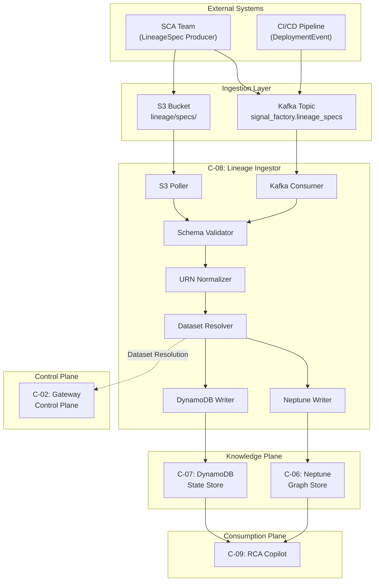
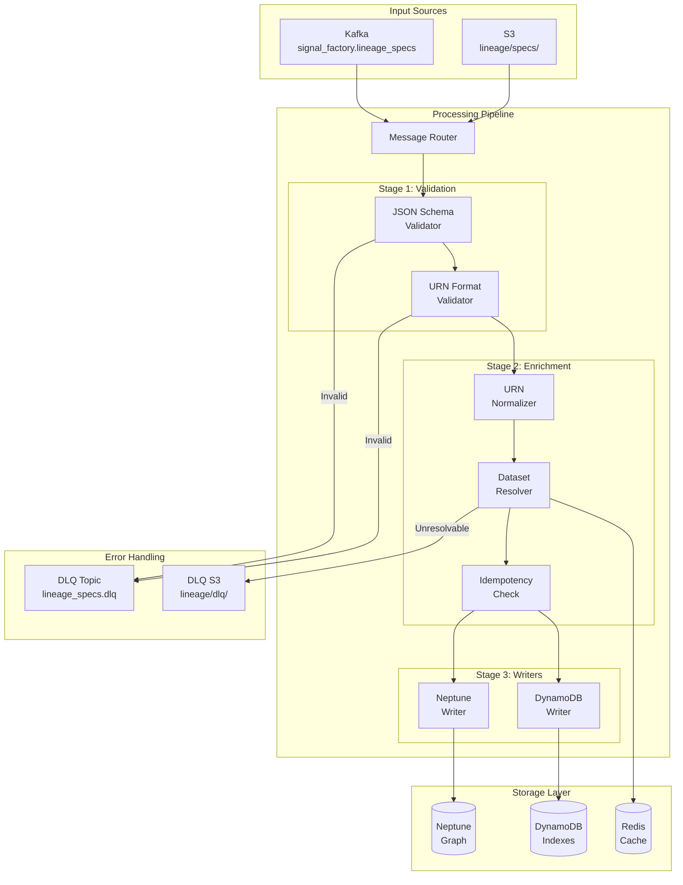
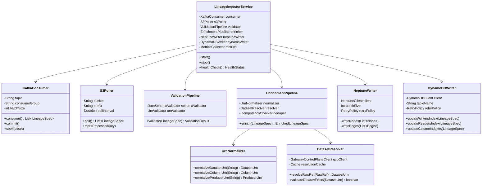
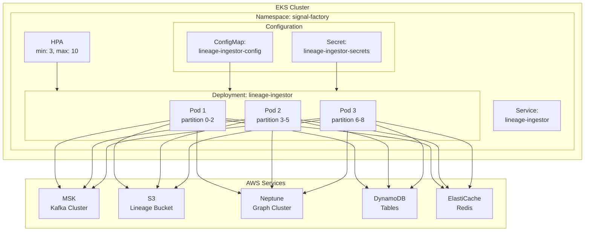
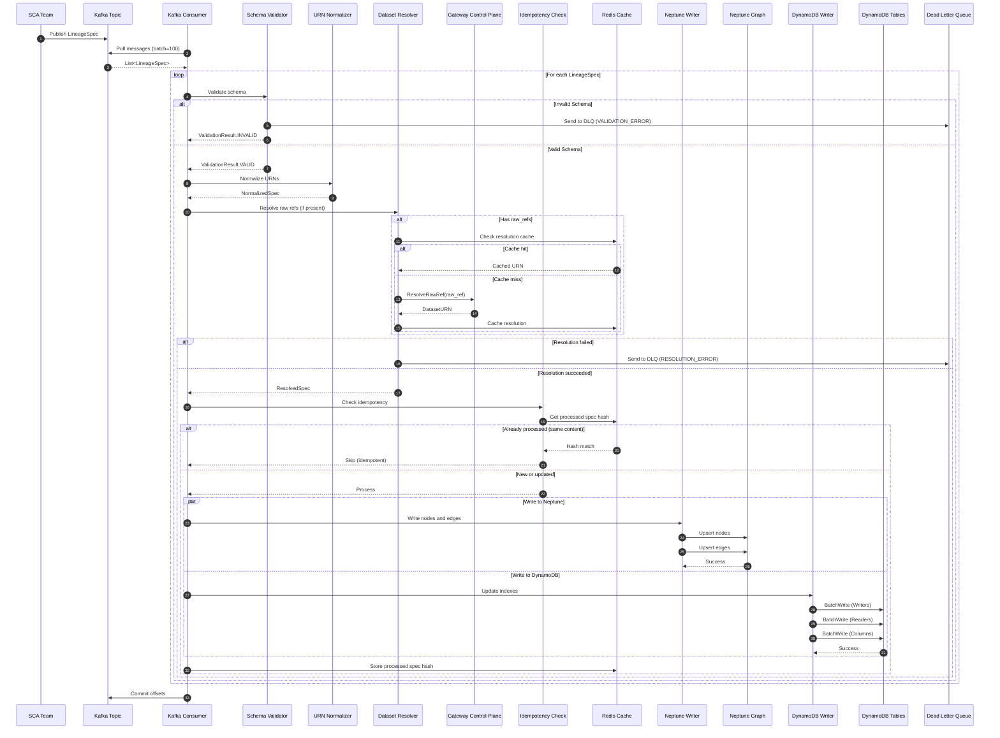
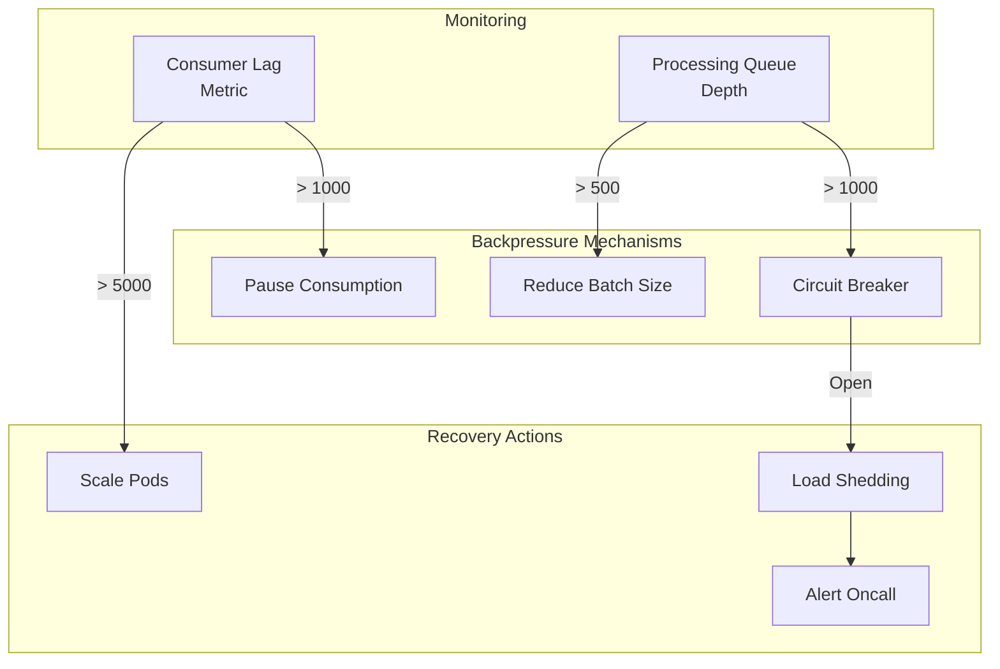

# C-08: Lineage Ingestor - Low-Level Design

**Data Observability Platform v2.0**  
**Signal Factory Architecture - Knowledge Plane Component**

| Attribute | Value |
|-----------|-------|
| Document Status | LLD Complete - Ready for Review |
| Version | 1.0 |
| Last Updated | January 2026 |
| Component Owner | AI & Intelligence Team |
| Primary Author | Enterprise Data Platform Architecture |

---

## Table of Contents

1. [Executive Summary](#1-executive-summary)
2. [Component Overview](#2-component-overview)
3. [Architecture](#3-architecture)
4. [Data Models](#4-data-models)
5. [API Specifications](#5-api-specifications)
6. [Processing Pipeline](#6-processing-pipeline)
7. [Storage Integration](#7-storage-integration)
8. [Scalability & Performance](#8-scalability--performance)
9. [Observability](#9-observability)
10. [Security](#10-security)
11. [Error Handling & DLQ Strategy](#11-error-handling--dlq-strategy)
12. [Operational Runbook](#12-operational-runbook)
13. [Capacity Planning & Cost Analysis](#13-capacity-planning--cost-analysis)
14. [Appendices](#14-appendices)

---

## 1. Executive Summary

### 1.1 Purpose

The Lineage Ingestor is a thin, well-bounded service that bridges the gap between static code analysis (design-time intent) and the Signal Factory's runtime observability platform. It consumes LineageSpec artifacts produced by the SCA team and writes bounded topology edges to Neptune, enabling the RCA Copilot to answer critical blast radius questions during incidents.

### 1.2 Key Design Decisions

| Decision | Rationale |
|----------|-----------|
| **Separate from Enforcer** | Lineage is design-time metadata with different cadence than runtime validation |
| **Asynchronous processing** | Stale lineage must never block alerting or incident creation |
| **Append-only storage** | LineageSpecs are immutable and versioned by commit SHA |
| **Bounded cardinality** | Only topology edges written, never per-run or per-record lineage |
| **Dual-storage strategy** | Neptune for graph traversal, DynamoDB for O(1) lookups |

### 1.3 Success Metrics

| Metric | Target | Measurement |
|--------|--------|-------------|
| Ingestion latency (P99) | < 30 seconds | From Kafka publish to Neptune/DynamoDB commit |
| Throughput | 1,000 specs/day | With headroom for burst |
| Data freshness | < 1 hour for Tier-1 | From SCA emission to availability |
| Query latency | < 50ms | DynamoDB index lookups |
| Availability | 99.9% | Monthly uptime |

---

## 2. Component Overview

### 2.1 Functional Scope

```
┌─────────────────────────────────────────────────────────────────────────────┐
│                        LINEAGE INGESTOR SCOPE                               │
├─────────────────────────────────────────────────────────────────────────────┤
│                                                                             │
│  ┌─────────────────┐     ┌──────────────────────────────────────────────┐  │
│  │  SCA Team       │     │           Lineage Ingestor                   │  │
│  │  (External)     │     │  ┌────────────────────────────────────────┐  │  │
│  │                 │     │  │  1. Schema Validation                  │  │  │
│  │ ┌─────────────┐ │     │  │  2. URN Normalization                  │  │  │
│  │ │ LineageSpec │─┼─────┼─▶│  3. Dataset Resolution                 │  │  │
│  │ │   Events    │ │     │  │  4. Neptune Edge Writer                │  │  │
│  │ └─────────────┘ │     │  │  5. DynamoDB Index Updater             │  │  │
│  └─────────────────┘     │  └────────────────────────────────────────┘  │  │
│                          └──────────────────────────────────────────────┘  │
│                                         │                                   │
│                          ┌──────────────┴───────────────┐                  │
│                          ▼                              ▼                  │
│                   ┌─────────────┐              ┌─────────────────┐         │
│                   │  Neptune    │              │    DynamoDB     │         │
│                   │  (C-06)     │              │    (C-07)       │         │
│                   │             │              │                 │         │
│                   │ • Job nodes │              │ • Writers Index │         │
│                   │ • Dataset   │              │ • Readers Index │         │
│                   │ • Column    │              │ • Column Index  │         │
│                   │ • Edges     │              │                 │         │
│                   └─────────────┘              └─────────────────┘         │
│                                                                             │
└─────────────────────────────────────────────────────────────────────────────┘
```

### 2.2 Responsibilities

**IN SCOPE:**
- Consuming LineageSpec events from Kafka topic `signal_factory.lineage_specs`
- Polling S3 for LineageSpec manifests (alternative ingestion path)
- Validating LineageSpec JSON schema (v1.0)
- Normalizing URNs to canonical format
- Resolving raw references to dataset URNs via resolution service
- Creating/updating Neptune topology nodes and edges
- Maintaining DynamoDB lookup indexes
- Handling confidence thresholds (marking LOW confidence edges)
- Managing TTL and versioning for LineageSpec records
- Emitting processing metrics and traces

**OUT OF SCOPE:**
- Generating LineageSpec (SCA team responsibility)
- Per-run execution edges (would cause cardinality explosion)
- Per-record lineage tracking
- Runtime validation or blocking
- Dataset URN assignment (Gateway Control Plane responsibility)

### 2.3 Interaction with Upstream/Downstream Components



---

## 3. Architecture

### 3.1 High-Level Architecture



### 3.2 Component Decomposition



### 3.3 Deployment Architecture



---

## 4. Data Models

### 4.1 LineageSpec Input Schema (v1.0)

```json
{
  "$schema": "http://json-schema.org/draft-07/schema#",
  "title": "LineageSpec",
  "type": "object",
  "required": ["spec_version", "lineage_spec_id", "emitted_at", "producer", "lineage", "confidence"],
  "properties": {
    "spec_version": {
      "type": "string",
      "const": "1.0"
    },
    "lineage_spec_id": {
      "type": "string",
      "pattern": "^lspec:[a-zA-Z0-9_-]+:(git|tag|branch):[a-fA-F0-9]+$",
      "description": "Unique identifier: lspec:<producer>:<ref_type>:<ref_value>"
    },
    "emitted_at": {
      "type": "string",
      "format": "date-time",
      "description": "ISO8601 timestamp when spec was generated"
    },
    "producer": {
      "type": "object",
      "required": ["type", "name", "platform", "runtime", "owner_team", "repo", "ref"],
      "properties": {
        "type": {
          "type": "string",
          "enum": ["JOB", "SERVICE"]
        },
        "name": {
          "type": "string",
          "minLength": 1,
          "maxLength": 256
        },
        "platform": {
          "type": "string",
          "enum": ["SPARK", "AIRFLOW", "DBT", "FLINK", "KAFKA_STREAMS", "CUSTOM"]
        },
        "runtime": {
          "type": "string",
          "enum": ["EMR", "EKS", "GLUE", "DATABRICKS", "SNOWFLAKE", "LAMBDA", "OTHER"]
        },
        "owner_team": {
          "type": "string",
          "minLength": 1,
          "maxLength": 128
        },
        "repo": {
          "type": "string",
          "pattern": "^(github|gitlab|bitbucket):[a-zA-Z0-9_-]+/[a-zA-Z0-9_-]+$"
        },
        "ref": {
          "type": "object",
          "required": ["ref_type", "ref_value"],
          "properties": {
            "ref_type": {
              "type": "string",
              "enum": ["GIT_SHA", "TAG", "BRANCH"]
            },
            "ref_value": {
              "type": "string",
              "minLength": 1,
              "maxLength": 256
            }
          }
        }
      }
    },
    "lineage": {
      "type": "object",
      "required": ["inputs", "outputs"],
      "properties": {
        "inputs": {
          "type": "array",
          "items": {
            "$ref": "#/definitions/DatasetLineage"
          },
          "minItems": 0
        },
        "outputs": {
          "type": "array",
          "items": {
            "$ref": "#/definitions/DatasetLineage"
          },
          "minItems": 1
        }
      }
    },
    "confidence": {
      "type": "object",
      "required": ["overall", "reasons", "coverage"],
      "properties": {
        "overall": {
          "type": "string",
          "enum": ["HIGH", "MEDIUM", "LOW"]
        },
        "reasons": {
          "type": "array",
          "items": {
            "type": "string",
            "enum": [
              "STATIC_SQL",
              "SPARK_DF_ANALYSIS",
              "DBT_MANIFEST",
              "DYNAMIC_SQL_DETECTED",
              "STAR_EXPANSION",
              "REFLECTION_DETECTED",
              "UDF_OPAQUE",
              "CONFIG_DRIVEN"
            ]
          }
        },
        "coverage": {
          "type": "object",
          "required": ["input_columns_pct", "output_columns_pct"],
          "properties": {
            "input_columns_pct": {
              "type": "number",
              "minimum": 0,
              "maximum": 1
            },
            "output_columns_pct": {
              "type": "number",
              "minimum": 0,
              "maximum": 1
            }
          }
        }
      }
    },
    "transforms": {
      "type": "array",
      "items": {
        "type": "object",
        "properties": {
          "output_column": {"type": "string"},
          "input_columns": {"type": "array", "items": {"type": "string"}},
          "operation": {"type": "string"},
          "details_ref": {"type": "string", "format": "uri"}
        }
      }
    },
    "raw_refs": {
      "type": "object",
      "description": "Fallback when URNs cannot be resolved by SCA",
      "properties": {
        "inputs": {
          "type": "array",
          "items": {
            "type": "object",
            "properties": {
              "type": {"type": "string", "enum": ["KAFKA_TOPIC", "DELTA_TABLE", "S3_PATH", "JDBC_TABLE"]},
              "value": {"type": "string"}
            }
          }
        },
        "outputs": {
          "type": "array",
          "items": {
            "type": "object",
            "properties": {
              "type": {"type": "string", "enum": ["KAFKA_TOPIC", "DELTA_TABLE", "S3_PATH", "JDBC_TABLE"]},
              "value": {"type": "string"}
            }
          }
        }
      }
    },
    "deployment_linkage": {
      "type": "object",
      "properties": {
        "job_version": {"type": "string"},
        "deployed_at": {"type": "string", "format": "date-time"}
      }
    },
    "tags": {
      "type": "array",
      "items": {"type": "string"},
      "description": "Optional tags like PII_TOUCHING, TIER1, REVENUE_CRITICAL"
    }
  },
  "definitions": {
    "DatasetLineage": {
      "type": "object",
      "required": ["dataset_urn"],
      "properties": {
        "dataset_urn": {
          "type": "string",
          "pattern": "^urn:dp:[a-zA-Z0-9_-]+:[a-zA-Z0-9_-]+:v[0-9]+$"
        },
        "columns": {
          "type": "array",
          "items": {"type": "string"}
        },
        "column_urns": {
          "type": "array",
          "items": {
            "type": "string",
            "pattern": "^urn:col:urn:dp:[a-zA-Z0-9_-]+:[a-zA-Z0-9_-]+:v[0-9]+:[a-zA-Z0-9_-]+$"
          }
        }
      }
    }
  }
}
```

### 4.2 URN Formats

| Type | Format | Example |
|------|--------|---------|
| Dataset URN | `urn:dp:<domain>:<dataset>:v<major>` | `urn:dp:orders:order_created:v1` |
| Column URN | `urn:col:<dataset_urn>:<column>` | `urn:col:urn:dp:orders:order_created:v1:payment_method` |
| LineageSpec ID | `lspec:<producer>:<ref_type>:<ref_value>` | `lspec:orders-delta-landing:git:9f31c2d` |
| Job ID | `job:<name>` | `job:orders-delta-landing` |
| Service ID | `svc:<name>` | `svc:order-service` |
| Deployment ID | `deploy:<job>@<version>` | `deploy:orders-delta-landing@2026.01.16.1` |

### 4.3 Neptune Graph Schema

#### Node Types

```
┌─────────────────────────────────────────────────────────────────────────────┐
│                          NEPTUNE NODE TYPES                                 │
├─────────────────┬─────────────────────┬─────────────────┬───────────────────┤
│ Node Type       │ ID Format           │ Properties      │ TTL               │
├─────────────────┼─────────────────────┼─────────────────┼───────────────────┤
│ Job             │ job:<name>          │ name, platform, │ Permanent         │
│                 │                     │ runtime,        │                   │
│                 │                     │ owner_team      │                   │
├─────────────────┼─────────────────────┼─────────────────┼───────────────────┤
│ Service         │ svc:<name>          │ name,           │ Permanent         │
│                 │                     │ owner_team      │                   │
├─────────────────┼─────────────────────┼─────────────────┼───────────────────┤
│ Dataset         │ <dataset_urn>       │ urn, domain,    │ Permanent         │
│                 │                     │ name, tier      │                   │
├─────────────────┼─────────────────────┼─────────────────┼───────────────────┤
│ Column          │ <column_urn>        │ urn, name,      │ Permanent         │
│                 │                     │ dataset_urn     │                   │
├─────────────────┼─────────────────────┼─────────────────┼───────────────────┤
│ LineageSpec     │ <lineage_spec_id>   │ commit,         │ Indefinite        │
│                 │                     │ confidence,     │ (historical)      │
│                 │                     │ emitted_at      │                   │
├─────────────────┼─────────────────────┼─────────────────┼───────────────────┤
│ Deployment      │ deploy:<job>@<ver>  │ version,        │ 90 days           │
│                 │                     │ commit,         │                   │
│                 │                     │ deployed_at     │                   │
└─────────────────┴─────────────────────┴─────────────────┴───────────────────┘
```

#### Edge Types

```
┌─────────────────────────────────────────────────────────────────────────────┐
│                          NEPTUNE EDGE TYPES                                 │
├─────────────────┬──────────────────────┬─────────────────┬──────────────────┤
│ Edge            │ From → To            │ Properties      │ Cardinality      │
├─────────────────┼──────────────────────┼─────────────────┼──────────────────┤
│ READS           │ Job/Service →Dataset │ confidence,     │ O(producers ×    │
│                 │                      │ spec_id,        │ datasets)        │
│                 │                      │ updated_at      │                  │
├─────────────────┼──────────────────────┼─────────────────┼──────────────────┤
│ WRITES          │ Job/Service →Dataset │ confidence,     │ O(producers ×    │
│                 │                      │ spec_id,        │ datasets)        │
│                 │                      │ updated_at      │                  │
├─────────────────┼──────────────────────┼─────────────────┼──────────────────┤
│ READS_COL       │ Job/Service → Column │ confidence,     │ O(producers ×    │
│                 │                      │ spec_id,        │ columns)         │
│                 │                      │ updated_at      │                  │
├─────────────────┼──────────────────────┼─────────────────┼──────────────────┤
│ WRITES_COL      │ Job/Service → Column │ confidence,     │ O(producers ×    │
│                 │                      │ spec_id,        │ columns)         │
│                 │                      │ updated_at      │                  │
├─────────────────┼──────────────────────┼─────────────────┼──────────────────┤
│ DESCRIBES       │ LineageSpec → Job/   │ -               │ O(specs ×        │
│                 │ Service              │                 │ producers)       │
├─────────────────┼──────────────────────┼─────────────────┼──────────────────┤
│ HAS_COLUMN      │ Dataset → Column     │ -               │ O(datasets ×     │
│                 │                      │                 │ columns)         │
├─────────────────┼──────────────────────┼─────────────────┼──────────────────┤
│ DEPLOYS         │ Deployment →Job/Svc  │ version         │ O(deployments)   │
└─────────────────┴──────────────────────┴─────────────────┴──────────────────┘
```

### 4.4 DynamoDB Table Schemas

#### DatasetToWritersIndex

```
Table: LineageDatasetToWritersIndex
├── Partition Key: dataset_urn (String)
├── Sort Key: producer#<producer_id> (String)
├── Attributes:
│   ├── producer_name (String)
│   ├── producer_type (String) - JOB | SERVICE
│   ├── confidence (String) - HIGH | MEDIUM | LOW
│   ├── spec_id (String)
│   ├── commit (String)
│   ├── updated_at (String - ISO8601)
│   └── ttl (Number - epoch seconds)
├── GSI: ProducerIndex
│   ├── Partition Key: producer_name
│   └── Sort Key: dataset_urn
└── TTL: 90 days from updated_at
```

#### DatasetToReadersIndex

```
Table: LineageDatasetToReadersIndex
├── Partition Key: dataset_urn (String)
├── Sort Key: consumer#<consumer_id> (String)
├── Attributes:
│   ├── consumer_name (String)
│   ├── consumer_type (String) - JOB | SERVICE
│   ├── confidence (String) - HIGH | MEDIUM | LOW
│   ├── spec_id (String)
│   ├── commit (String)
│   ├── updated_at (String - ISO8601)
│   └── ttl (Number - epoch seconds)
├── GSI: ConsumerIndex
│   ├── Partition Key: consumer_name
│   └── Sort Key: dataset_urn
└── TTL: 90 days from updated_at
```

#### ColumnToWritersIndex

```
Table: LineageColumnToWritersIndex
├── Partition Key: column_urn (String)
├── Sort Key: producer#<producer_id> (String)
├── Attributes:
│   ├── producer_name (String)
│   ├── producer_type (String)
│   ├── confidence (String)
│   ├── spec_id (String)
│   ├── updated_at (String - ISO8601)
│   └── ttl (Number)
└── TTL: 90 days
```

#### ColumnToReadersIndex

```
Table: LineageColumnToReadersIndex
├── Partition Key: column_urn (String)
├── Sort Key: consumer#<consumer_id> (String)
├── Attributes:
│   ├── consumer_name (String)
│   ├── consumer_type (String)
│   ├── confidence (String)
│   ├── spec_id (String)
│   ├── updated_at (String - ISO8601)
│   └── ttl (Number)
└── TTL: 90 days
```

#### LineageSpecRegistry

```
Table: LineageSpecRegistry
├── Partition Key: lineage_spec_id (String)
├── Sort Key: - (none, single item per spec)
├── Attributes:
│   ├── producer_name (String)
│   ├── producer_type (String)
│   ├── commit (String)
│   ├── confidence (String)
│   ├── emitted_at (String - ISO8601)
│   ├── processed_at (String - ISO8601)
│   ├── status (String) - PROCESSED | FAILED | PARTIAL
│   ├── input_datasets (List<String>)
│   ├── output_datasets (List<String>)
│   └── ttl (Number)
├── GSI: CommitIndex
│   ├── Partition Key: commit
│   └── Sort Key: emitted_at
├── GSI: ProducerSpecIndex
│   ├── Partition Key: producer_name
│   └── Sort Key: emitted_at
└── TTL: Indefinite (or 365 days for audit)
```

---

## 5. API Specifications

### 5.1 Internal gRPC API

```protobuf
syntax = "proto3";

package signalFactory.lineageIngestor.v1;

import "google/protobuf/timestamp.proto";

// LineageIngestor internal service for manual operations
service LineageIngestorService {
  // Health check
  rpc HealthCheck(HealthCheckRequest) returns (HealthCheckResponse);
  
  // Manually trigger reprocessing of a LineageSpec
  rpc ReprocessSpec(ReprocessSpecRequest) returns (ReprocessSpecResponse);
  
  // Get processing status of a LineageSpec
  rpc GetSpecStatus(GetSpecStatusRequest) returns (GetSpecStatusResponse);
  
  // Backfill lineage for a producer
  rpc TriggerBackfill(BackfillRequest) returns (BackfillResponse);
  
  // Query lineage (for debugging/admin)
  rpc QueryLineage(QueryLineageRequest) returns (QueryLineageResponse);
}

message HealthCheckRequest {}

message HealthCheckResponse {
  enum Status {
    UNKNOWN = 0;
    HEALTHY = 1;
    DEGRADED = 2;
    UNHEALTHY = 3;
  }
  Status status = 1;
  map<string, ComponentHealth> components = 2;
  google.protobuf.Timestamp checked_at = 3;
}

message ComponentHealth {
  bool healthy = 1;
  string message = 2;
  int64 latency_ms = 3;
}

message ReprocessSpecRequest {
  string lineage_spec_id = 1;
  bool force = 2; // Skip idempotency check
}

message ReprocessSpecResponse {
  bool success = 1;
  string message = 2;
  ProcessingResult result = 3;
}

message ProcessingResult {
  int32 nodes_created = 1;
  int32 nodes_updated = 2;
  int32 edges_created = 3;
  int32 edges_updated = 4;
  int32 indexes_updated = 5;
  repeated string errors = 6;
}

message GetSpecStatusRequest {
  string lineage_spec_id = 1;
}

message GetSpecStatusResponse {
  string lineage_spec_id = 1;
  enum Status {
    NOT_FOUND = 0;
    PENDING = 1;
    PROCESSING = 2;
    PROCESSED = 3;
    FAILED = 4;
    PARTIAL = 5;
  }
  Status status = 2;
  google.protobuf.Timestamp processed_at = 3;
  ProcessingResult result = 4;
  string error_message = 5;
}

message BackfillRequest {
  string producer_name = 1;
  string commit_range_start = 2; // Inclusive
  string commit_range_end = 3;   // Inclusive
  bool dry_run = 4;
}

message BackfillResponse {
  int32 specs_found = 1;
  int32 specs_processed = 2;
  int32 specs_skipped = 3;
  repeated string errors = 4;
}

message QueryLineageRequest {
  oneof query {
    DatasetLineageQuery dataset_query = 1;
    ColumnLineageQuery column_query = 2;
    ProducerLineageQuery producer_query = 3;
  }
}

message DatasetLineageQuery {
  string dataset_urn = 1;
  bool include_writers = 2;
  bool include_readers = 3;
}

message ColumnLineageQuery {
  string column_urn = 1;
  bool include_writers = 2;
  bool include_readers = 3;
}

message ProducerLineageQuery {
  string producer_name = 1;
  bool include_inputs = 2;
  bool include_outputs = 3;
}

message QueryLineageResponse {
  repeated LineageEntry entries = 1;
}

message LineageEntry {
  string source = 1;
  string target = 2;
  string relationship = 3;
  string confidence = 4;
  string spec_id = 5;
  google.protobuf.Timestamp updated_at = 6;
}
```

### 5.2 REST Admin API

```yaml
openapi: 3.0.3
info:
  title: Lineage Ingestor Admin API
  version: 1.0.0
  description: Administrative endpoints for Lineage Ingestor operations

servers:
  - url: https://lineage-ingestor.signal-factory.internal/api/v1

paths:
  /health:
    get:
      summary: Health check
      responses:
        '200':
          description: Service is healthy
          content:
            application/json:
              schema:
                $ref: '#/components/schemas/HealthResponse'
        '503':
          description: Service is unhealthy

  /specs/{lineage_spec_id}:
    get:
      summary: Get LineageSpec processing status
      parameters:
        - name: lineage_spec_id
          in: path
          required: true
          schema:
            type: string
      responses:
        '200':
          description: Spec status
          content:
            application/json:
              schema:
                $ref: '#/components/schemas/SpecStatus'
        '404':
          description: Spec not found

  /specs/{lineage_spec_id}/reprocess:
    post:
      summary: Trigger reprocessing of a spec
      parameters:
        - name: lineage_spec_id
          in: path
          required: true
          schema:
            type: string
      requestBody:
        content:
          application/json:
            schema:
              type: object
              properties:
                force:
                  type: boolean
                  default: false
      responses:
        '202':
          description: Reprocessing triggered
        '404':
          description: Spec not found

  /lineage/dataset/{dataset_urn}:
    get:
      summary: Query lineage for a dataset
      parameters:
        - name: dataset_urn
          in: path
          required: true
          schema:
            type: string
        - name: include_writers
          in: query
          schema:
            type: boolean
            default: true
        - name: include_readers
          in: query
          schema:
            type: boolean
            default: true
      responses:
        '200':
          description: Lineage entries
          content:
            application/json:
              schema:
                $ref: '#/components/schemas/LineageResponse'

  /lineage/column/{column_urn}:
    get:
      summary: Query lineage for a column
      parameters:
        - name: column_urn
          in: path
          required: true
          schema:
            type: string
            example: urn:col:urn:dp:orders:order_created:v1:payment_method
      responses:
        '200':
          description: Column lineage
          content:
            application/json:
              schema:
                $ref: '#/components/schemas/LineageResponse'

  /metrics:
    get:
      summary: Prometheus metrics endpoint
      responses:
        '200':
          description: Metrics in Prometheus format
          content:
            text/plain:
              schema:
                type: string

components:
  schemas:
    HealthResponse:
      type: object
      properties:
        status:
          type: string
          enum: [HEALTHY, DEGRADED, UNHEALTHY]
        components:
          type: object
          additionalProperties:
            $ref: '#/components/schemas/ComponentHealth'
        checked_at:
          type: string
          format: date-time

    ComponentHealth:
      type: object
      properties:
        healthy:
          type: boolean
        message:
          type: string
        latency_ms:
          type: integer

    SpecStatus:
      type: object
      properties:
        lineage_spec_id:
          type: string
        status:
          type: string
          enum: [PENDING, PROCESSING, PROCESSED, FAILED, PARTIAL]
        processed_at:
          type: string
          format: date-time
        result:
          $ref: '#/components/schemas/ProcessingResult'
        error_message:
          type: string

    ProcessingResult:
      type: object
      properties:
        nodes_created:
          type: integer
        nodes_updated:
          type: integer
        edges_created:
          type: integer
        edges_updated:
          type: integer
        indexes_updated:
          type: integer
        errors:
          type: array
          items:
            type: string

    LineageResponse:
      type: object
      properties:
        writers:
          type: array
          items:
            $ref: '#/components/schemas/LineageEntry'
        readers:
          type: array
          items:
            $ref: '#/components/schemas/LineageEntry'

    LineageEntry:
      type: object
      properties:
        producer_name:
          type: string
        producer_type:
          type: string
          enum: [JOB, SERVICE]
        confidence:
          type: string
          enum: [HIGH, MEDIUM, LOW]
        spec_id:
          type: string
        commit:
          type: string
        updated_at:
          type: string
          format: date-time
```

---

## 6. Processing Pipeline

### 6.1 End-to-End Sequence Diagram



### 6.2 Validation Pipeline

```python
# Pseudocode for validation pipeline

class ValidationPipeline:
    def __init__(self):
        self.schema_validator = JsonSchemaValidator(LINEAGE_SPEC_SCHEMA)
        self.urn_validator = UrnValidator()
    
    def validate(self, spec: LineageSpec) -> ValidationResult:
        errors = []
        
        # Stage 1: JSON Schema validation
        schema_result = self.schema_validator.validate(spec.raw_json)
        if not schema_result.valid:
            return ValidationResult(
                valid=False,
                error_code="SCHEMA_VALIDATION_FAILED",
                errors=schema_result.errors,
                dlq_category="PERMANENT"  # Won't succeed on retry
            )
        
        # Stage 2: URN format validation
        for input_ds in spec.lineage.inputs:
            if not self.urn_validator.is_valid_dataset_urn(input_ds.dataset_urn):
                errors.append(f"Invalid dataset URN: {input_ds.dataset_urn}")
            
            for col_urn in input_ds.column_urns or []:
                if not self.urn_validator.is_valid_column_urn(col_urn):
                    errors.append(f"Invalid column URN: {col_urn}")
        
        for output_ds in spec.lineage.outputs:
            if not self.urn_validator.is_valid_dataset_urn(output_ds.dataset_urn):
                errors.append(f"Invalid dataset URN: {output_ds.dataset_urn}")
            
            for col_urn in output_ds.column_urns or []:
                if not self.urn_validator.is_valid_column_urn(col_urn):
                    errors.append(f"Invalid column URN: {col_urn}")
        
        if errors:
            return ValidationResult(
                valid=False,
                error_code="URN_VALIDATION_FAILED",
                errors=errors,
                dlq_category="PERMANENT"
            )
        
        # Stage 3: Business rule validation
        if not spec.lineage.outputs:
            return ValidationResult(
                valid=False,
                error_code="NO_OUTPUTS",
                errors=["LineageSpec must have at least one output dataset"],
                dlq_category="PERMANENT"
            )
        
        # Stage 4: Confidence validation
        if spec.confidence.overall == "LOW" and not spec.confidence.reasons:
            errors.append("LOW confidence must include reasons")
        
        if errors:
            return ValidationResult(
                valid=False,
                error_code="BUSINESS_RULE_FAILED",
                errors=errors,
                dlq_category="PERMANENT"
            )
        
        return ValidationResult(valid=True)
```

### 6.3 URN Normalization Rules

```python
class UrnNormalizer:
    """
    Normalizes URNs to canonical format for consistent storage and lookup.
    """
    
    DATASET_URN_PATTERN = r"^urn:dp:([a-zA-Z0-9_-]+):([a-zA-Z0-9_-]+):v(\d+)$"
    COLUMN_URN_PATTERN = r"^urn:col:(urn:dp:[^:]+:[^:]+:v\d+):([a-zA-Z0-9_-]+)$"
    
    def normalize_dataset_urn(self, urn: str) -> str:
        """
        Normalize dataset URN:
        - Lowercase domain and dataset names
        - Ensure v prefix for version
        """
        match = re.match(self.DATASET_URN_PATTERN, urn)
        if not match:
            raise ValueError(f"Invalid dataset URN format: {urn}")
        
        domain, dataset, version = match.groups()
        return f"urn:dp:{domain.lower()}:{dataset.lower()}:v{version}"
    
    def normalize_column_urn(self, urn: str) -> str:
        """
        Normalize column URN:
        - Normalize embedded dataset URN
        - Lowercase column name
        """
        match = re.match(self.COLUMN_URN_PATTERN, urn)
        if not match:
            raise ValueError(f"Invalid column URN format: {urn}")
        
        dataset_urn, column_name = match.groups()
        normalized_dataset_urn = self.normalize_dataset_urn(dataset_urn)
        return f"urn:col:{normalized_dataset_urn}:{column_name.lower()}"
    
    def normalize_producer_id(self, producer: Producer) -> str:
        """
        Generate normalized producer ID.
        """
        prefix = "job" if producer.type == "JOB" else "svc"
        return f"{prefix}:{producer.name.lower()}"
    
    def normalize_lineage_spec_id(self, spec_id: str) -> str:
        """
        Ensure consistent lineage spec ID format.
        """
        # lspec:<producer>:<ref_type>:<ref_value>
        parts = spec_id.split(":")
        if len(parts) != 4 or parts[0] != "lspec":
            raise ValueError(f"Invalid lineage spec ID: {spec_id}")
        
        return f"lspec:{parts[1].lower()}:{parts[2].lower()}:{parts[3].lower()}"
```

### 6.4 Neptune Writer Logic

```python
class NeptuneWriter:
    def __init__(self, neptune_client: NeptuneClient):
        self.client = neptune_client
        self.batch_size = 50  # Neptune optimal batch size
    
    def write_lineage_spec(self, spec: EnrichedLineageSpec) -> WriteResult:
        """
        Write all nodes and edges for a LineageSpec to Neptune.
        Uses upsert semantics - creates if not exists, updates if exists.
        """
        result = WriteResult()
        
        try:
            # Phase 1: Write/Update Producer Node
            producer_node = self._create_producer_node(spec.producer)
            self.client.upsert_vertex(producer_node)
            result.nodes_created += 1
            
            # Phase 2: Write LineageSpec Node
            spec_node = self._create_lineage_spec_node(spec)
            self.client.upsert_vertex(spec_node)
            result.nodes_created += 1
            
            # Phase 3: Write DESCRIBES edge
            self.client.upsert_edge(
                source_id=spec.normalized_spec_id,
                target_id=spec.producer_id,
                label="DESCRIBES"
            )
            result.edges_created += 1
            
            # Phase 4: Process inputs (READS edges)
            for input_ds in spec.lineage.inputs:
                # Ensure Dataset node exists
                self._ensure_dataset_node(input_ds.dataset_urn)
                
                # Create READS edge
                self.client.upsert_edge(
                    source_id=spec.producer_id,
                    target_id=input_ds.dataset_urn,
                    label="READS",
                    properties={
                        "confidence": spec.confidence.overall,
                        "spec_id": spec.normalized_spec_id,
                        "updated_at": datetime.utcnow().isoformat()
                    }
                )
                result.edges_created += 1
                
                # Process column-level lineage
                for col_urn in input_ds.column_urns or []:
                    self._ensure_column_node(col_urn, input_ds.dataset_urn)
                    
                    self.client.upsert_edge(
                        source_id=spec.producer_id,
                        target_id=col_urn,
                        label="READS_COL",
                        properties={
                            "confidence": spec.confidence.overall,
                            "spec_id": spec.normalized_spec_id,
                            "updated_at": datetime.utcnow().isoformat()
                        }
                    )
                    result.edges_created += 1
            
            # Phase 5: Process outputs (WRITES edges)
            for output_ds in spec.lineage.outputs:
                self._ensure_dataset_node(output_ds.dataset_urn)
                
                self.client.upsert_edge(
                    source_id=spec.producer_id,
                    target_id=output_ds.dataset_urn,
                    label="WRITES",
                    properties={
                        "confidence": spec.confidence.overall,
                        "spec_id": spec.normalized_spec_id,
                        "updated_at": datetime.utcnow().isoformat()
                    }
                )
                result.edges_created += 1
                
                for col_urn in output_ds.column_urns or []:
                    self._ensure_column_node(col_urn, output_ds.dataset_urn)
                    
                    self.client.upsert_edge(
                        source_id=spec.producer_id,
                        target_id=col_urn,
                        label="WRITES_COL",
                        properties={
                            "confidence": spec.confidence.overall,
                            "spec_id": spec.normalized_spec_id,
                            "updated_at": datetime.utcnow().isoformat()
                        }
                    )
                    result.edges_created += 1
            
            result.success = True
            
        except NeptuneException as e:
            result.success = False
            result.errors.append(str(e))
        
        return result
    
    def _create_producer_node(self, producer: Producer) -> dict:
        prefix = "job" if producer.type == "JOB" else "svc"
        return {
            "id": f"{prefix}:{producer.name}",
            "label": producer.type,
            "properties": {
                "name": producer.name,
                "platform": producer.platform,
                "runtime": producer.runtime,
                "owner_team": producer.owner_team,
                "repo": producer.repo
            }
        }
    
    def _ensure_dataset_node(self, dataset_urn: str):
        """Create Dataset node if it doesn't exist."""
        parts = dataset_urn.split(":")
        self.client.upsert_vertex({
            "id": dataset_urn,
            "label": "Dataset",
            "properties": {
                "urn": dataset_urn,
                "domain": parts[2],
                "name": parts[3]
            }
        })
    
    def _ensure_column_node(self, column_urn: str, dataset_urn: str):
        """Create Column node and HAS_COLUMN edge if they don't exist."""
        column_name = column_urn.split(":")[-1]
        
        self.client.upsert_vertex({
            "id": column_urn,
            "label": "Column",
            "properties": {
                "urn": column_urn,
                "name": column_name,
                "dataset_urn": dataset_urn
            }
        })
        
        self.client.upsert_edge(
            source_id=dataset_urn,
            target_id=column_urn,
            label="HAS_COLUMN"
        )
```

### 6.5 DynamoDB Writer Logic

```python
class DynamoDBWriter:
    def __init__(self, dynamodb_client):
        self.client = dynamodb_client
        self.writers_table = "LineageDatasetToWritersIndex"
        self.readers_table = "LineageDatasetToReadersIndex"
        self.col_writers_table = "LineageColumnToWritersIndex"
        self.col_readers_table = "LineageColumnToReadersIndex"
        self.spec_registry_table = "LineageSpecRegistry"
    
    def update_indexes(self, spec: EnrichedLineageSpec) -> WriteResult:
        """
        Update all DynamoDB indexes for a LineageSpec.
        """
        result = WriteResult()
        now = datetime.utcnow()
        ttl_epoch = int((now + timedelta(days=90)).timestamp())
        
        try:
            # Update writers indexes (for outputs)
            for output_ds in spec.lineage.outputs:
                self._update_writers_index(
                    dataset_urn=output_ds.dataset_urn,
                    producer=spec.producer,
                    spec=spec,
                    ttl=ttl_epoch
                )
                result.indexes_updated += 1
                
                for col_urn in output_ds.column_urns or []:
                    self._update_column_writers_index(
                        column_urn=col_urn,
                        producer=spec.producer,
                        spec=spec,
                        ttl=ttl_epoch
                    )
                    result.indexes_updated += 1
            
            # Update readers indexes (for inputs)
            for input_ds in spec.lineage.inputs:
                self._update_readers_index(
                    dataset_urn=input_ds.dataset_urn,
                    consumer=spec.producer,  # Producer reads = consumer
                    spec=spec,
                    ttl=ttl_epoch
                )
                result.indexes_updated += 1
                
                for col_urn in input_ds.column_urns or []:
                    self._update_column_readers_index(
                        column_urn=col_urn,
                        consumer=spec.producer,
                        spec=spec,
                        ttl=ttl_epoch
                    )
                    result.indexes_updated += 1
            
            # Update spec registry
            self._update_spec_registry(spec, now, ttl_epoch)
            result.indexes_updated += 1
            
            result.success = True
            
        except ClientError as e:
            result.success = False
            result.errors.append(str(e))
        
        return result
    
    def _update_writers_index(self, dataset_urn: str, producer: Producer, 
                               spec: EnrichedLineageSpec, ttl: int):
        producer_id = f"producer#{spec.producer_id}"
        
        self.client.put_item(
            TableName=self.writers_table,
            Item={
                "dataset_urn": {"S": dataset_urn},
                "producer_id": {"S": producer_id},
                "producer_name": {"S": producer.name},
                "producer_type": {"S": producer.type},
                "confidence": {"S": spec.confidence.overall},
                "spec_id": {"S": spec.normalized_spec_id},
                "commit": {"S": producer.ref.ref_value},
                "updated_at": {"S": datetime.utcnow().isoformat()},
                "ttl": {"N": str(ttl)}
            }
        )
    
    def _update_readers_index(self, dataset_urn: str, consumer: Producer,
                               spec: EnrichedLineageSpec, ttl: int):
        consumer_id = f"consumer#{spec.producer_id}"
        
        self.client.put_item(
            TableName=self.readers_table,
            Item={
                "dataset_urn": {"S": dataset_urn},
                "consumer_id": {"S": consumer_id},
                "consumer_name": {"S": consumer.name},
                "consumer_type": {"S": consumer.type},
                "confidence": {"S": spec.confidence.overall},
                "spec_id": {"S": spec.normalized_spec_id},
                "commit": {"S": consumer.ref.ref_value},
                "updated_at": {"S": datetime.utcnow().isoformat()},
                "ttl": {"N": str(ttl)}
            }
        )
```

---

## 7. Storage Integration

### 7.1 Neptune Gremlin Query Patterns

```groovy
// Query 1: Find all writers of a dataset
g.V().has('Dataset', 'urn', 'urn:dp:orders:order_created:v1')
  .in('WRITES')
  .project('producer', 'type', 'confidence', 'spec_id')
    .by('name')
    .by('type')
    .by(inE('WRITES').values('confidence'))
    .by(inE('WRITES').values('spec_id'))

// Query 2: Find all readers of a dataset
g.V().has('Dataset', 'urn', 'urn:dp:orders:order_created:v1')
  .in('READS')
  .project('consumer', 'type', 'confidence')
    .by('name')
    .by('type')
    .by(inE('READS').values('confidence'))

// Query 3: Find all consumers of a specific column
g.V().has('Column', 'urn', 'urn:col:urn:dp:orders:order_created:v1:payment_method')
  .in('READS_COL')
  .project('consumer', 'type', 'confidence')
    .by('name')
    .by(label())
    .by(inE('READS_COL').values('confidence'))

// Query 4: RCA Blast radius for schema change
g.V().has('Column', 'urn', $column_urn)
  .in('READS_COL').as('consumer')
  .project('name', 'type', 'confidence', 'owner_team')
    .by('name')
    .by(label())
    .by(inE('READS_COL').values('confidence'))
    .by('owner_team')
  .order().by(select('confidence'), desc)

// Query 5: Get LineageSpec for a producer
g.V().has('Job', 'name', 'orders-delta-landing')
  .in('DESCRIBES')
  .order().by('emitted_at', desc)
  .limit(1)
  .project('spec_id', 'commit', 'confidence', 'emitted_at')
    .by('id')
    .by('commit')
    .by('confidence')
    .by('emitted_at')

// Query 6: Validate deployment has lineage
g.V().has('Deployment', 'commit', '9f31c2d')
  .out('DEPLOYS').as('producer')
  .in('DESCRIBES').as('spec')
  .select('producer', 'spec')
    .by('name')
    .by('id')
```

### 7.2 DynamoDB Access Patterns

| Access Pattern | Table | Key Condition | Use Case |
|----------------|-------|---------------|----------|
| Who writes dataset X? | DatasetToWritersIndex | PK = `dataset_urn` | RCA blast radius |
| Who reads dataset X? | DatasetToReadersIndex | PK = `dataset_urn` | Downstream impact |
| Who writes column Y? | ColumnToWritersIndex | PK = `column_urn` | Column-level RCA |
| Who reads column Y? | ColumnToReadersIndex | PK = `column_urn` | Precision impact |
| What does producer P write? | DatasetToWritersIndex (GSI) | PK = `producer_name` | Producer audit |
| Specs for commit C? | LineageSpecRegistry (GSI) | PK = `commit` | Deployment correlation |

---

## 8. Scalability & Performance

### 8.1 Throughput Design

| Metric | Target | Design Approach |
|--------|--------|-----------------|
| LineageSpec ingestion | 1,000/day (burst: 100/min) | Kafka consumer with batch processing |
| Neptune writes | 50 ops/sec | Batched upserts, connection pooling |
| DynamoDB writes | 200 WCU | On-demand capacity, batch writes |
| DynamoDB reads | 500 RCU | DAX cache for hot paths |

### 8.2 Kafka Consumer Configuration

```yaml
consumer:
  bootstrap.servers: ${MSK_BOOTSTRAP_SERVERS}
  group.id: lineage-ingestor
  auto.offset.reset: earliest
  enable.auto.commit: false
  max.poll.records: 100
  max.poll.interval.ms: 300000
  session.timeout.ms: 30000
  heartbeat.interval.ms: 10000
  
# Partition assignment: 
# - Topic has 9 partitions
# - 3 pods = 3 partitions each
# - Ensures ordered processing per producer
```

### 8.3 Backpressure Handling



### 8.4 Horizontal Scaling Strategy

```yaml
# HPA Configuration
apiVersion: autoscaling/v2
kind: HorizontalPodAutoscaler
metadata:
  name: lineage-ingestor-hpa
spec:
  scaleTargetRef:
    apiVersion: apps/v1
    kind: Deployment
    name: lineage-ingestor
  minReplicas: 3
  maxReplicas: 10
  metrics:
    - type: External
      external:
        metric:
          name: kafka_consumer_lag
          selector:
            matchLabels:
              consumer_group: lineage-ingestor
        target:
          type: AverageValue
          averageValue: "500"
    - type: Resource
      resource:
        name: cpu
        target:
          type: Utilization
          averageUtilization: 70
```

---

## 9. Observability

### 9.1 Metrics (Prometheus)

```yaml
# Counter metrics
lineage_ingestor_specs_received_total:
  type: counter
  labels: [source, producer_type, confidence]
  description: Total LineageSpecs received

lineage_ingestor_specs_processed_total:
  type: counter
  labels: [status, producer_type]  # status: success, failed, skipped
  description: Total LineageSpecs processed

lineage_ingestor_validation_errors_total:
  type: counter
  labels: [error_code]
  description: Validation errors by type

lineage_ingestor_neptune_writes_total:
  type: counter
  labels: [operation, status]  # operation: node, edge
  description: Neptune write operations

lineage_ingestor_dynamodb_writes_total:
  type: counter
  labels: [table, status]
  description: DynamoDB write operations

lineage_ingestor_dlq_messages_total:
  type: counter
  labels: [reason, dlq_category]
  description: Messages sent to DLQ

# Histogram metrics
lineage_ingestor_processing_duration_seconds:
  type: histogram
  labels: [stage]  # stage: validation, enrichment, neptune_write, dynamo_write
  buckets: [0.01, 0.05, 0.1, 0.25, 0.5, 1, 2.5, 5, 10]
  description: Processing duration by stage

lineage_ingestor_batch_size:
  type: histogram
  buckets: [1, 5, 10, 25, 50, 100]
  description: Kafka batch sizes

# Gauge metrics
lineage_ingestor_kafka_lag:
  type: gauge
  labels: [partition]
  description: Consumer lag per partition

lineage_ingestor_active_connections:
  type: gauge
  labels: [target]  # target: neptune, dynamodb, redis
  description: Active connections to external systems

lineage_ingestor_circuit_breaker_state:
  type: gauge
  labels: [target]
  description: Circuit breaker state (0=closed, 1=open, 0.5=half-open)
```

### 9.2 Distributed Tracing (OpenTelemetry)

```python
from opentelemetry import trace
from opentelemetry.trace import SpanKind

tracer = trace.get_tracer("lineage-ingestor")

class LineageIngestorService:
    def process_spec(self, spec: LineageSpec):
        with tracer.start_as_current_span(
            "process_lineage_spec",
            kind=SpanKind.CONSUMER,
            attributes={
                "lineage.spec_id": spec.lineage_spec_id,
                "lineage.producer": spec.producer.name,
                "lineage.confidence": spec.confidence.overall
            }
        ) as span:
            # Validation
            with tracer.start_as_current_span("validate") as val_span:
                result = self.validator.validate(spec)
                val_span.set_attribute("validation.result", result.valid)
            
            # Normalization
            with tracer.start_as_current_span("normalize"):
                normalized = self.normalizer.normalize(spec)
            
            # Resolution
            with tracer.start_as_current_span("resolve") as res_span:
                resolved = self.resolver.resolve(normalized)
                res_span.set_attribute("resolution.cache_hit", resolved.cache_hit)
            
            # Neptune write
            with tracer.start_as_current_span(
                "neptune_write",
                kind=SpanKind.CLIENT
            ) as nep_span:
                neptune_result = self.neptune_writer.write(resolved)
                nep_span.set_attribute("neptune.nodes_written", neptune_result.nodes_created)
                nep_span.set_attribute("neptune.edges_written", neptune_result.edges_created)
            
            # DynamoDB write
            with tracer.start_as_current_span(
                "dynamodb_write",
                kind=SpanKind.CLIENT
            ) as ddb_span:
                dynamo_result = self.dynamo_writer.update_indexes(resolved)
                ddb_span.set_attribute("dynamodb.indexes_updated", dynamo_result.indexes_updated)
            
            span.set_status(trace.StatusCode.OK)
```

### 9.3 Logging Strategy

```python
import structlog

logger = structlog.get_logger()

# Log levels and examples

# INFO: Normal operations
logger.info(
    "lineage_spec_processed",
    lineage_spec_id=spec.lineage_spec_id,
    producer=spec.producer.name,
    inputs_count=len(spec.lineage.inputs),
    outputs_count=len(spec.lineage.outputs),
    processing_time_ms=elapsed_ms
)

# WARN: Degraded operations
logger.warning(
    "neptune_write_retry",
    lineage_spec_id=spec.lineage_spec_id,
    retry_count=retry_count,
    error=str(e)
)

# ERROR: Failed operations
logger.error(
    "lineage_spec_failed",
    lineage_spec_id=spec.lineage_spec_id,
    error_code=result.error_code,
    dlq_category=result.dlq_category,
    exc_info=True
)
```

### 9.4 Alerting Rules

```yaml
groups:
  - name: lineage-ingestor-alerts
    rules:
      - alert: LineageIngestorHighLag
        expr: sum(lineage_ingestor_kafka_lag) > 1000
        for: 5m
        labels:
          severity: warning
          team: signal-factory
        annotations:
          summary: "Lineage Ingestor consumer lag is high"
          description: "Consumer lag {{ $value }} exceeds threshold"
      
      - alert: LineageIngestorProcessingErrors
        expr: rate(lineage_ingestor_specs_processed_total{status="failed"}[5m]) > 0.1
        for: 5m
        labels:
          severity: critical
          team: signal-factory
        annotations:
          summary: "High failure rate in Lineage Ingestor"
          description: "Failure rate {{ $value | humanizePercentage }}"
      
      - alert: LineageIngestorCircuitOpen
        expr: lineage_ingestor_circuit_breaker_state{target=~"neptune|dynamodb"} == 1
        for: 1m
        labels:
          severity: critical
          team: signal-factory
        annotations:
          summary: "Circuit breaker open for {{ $labels.target }}"
      
      - alert: LineageIngestorDLQGrowing
        expr: rate(lineage_ingestor_dlq_messages_total[15m]) > 1
        for: 15m
        labels:
          severity: warning
          team: signal-factory
        annotations:
          summary: "DLQ is accumulating messages"
```

---

## 10. Security

### 10.1 Authentication & Authorization

```yaml
# IAM Role for Lineage Ingestor pods
apiVersion: v1
kind: ServiceAccount
metadata:
  name: lineage-ingestor
  annotations:
    eks.amazonaws.com/role-arn: arn:aws:iam::ACCOUNT:role/LineageIngestorRole

---
# IAM Policy
{
  "Version": "2012-10-17",
  "Statement": [
    {
      "Sid": "KafkaAccess",
      "Effect": "Allow",
      "Action": [
        "kafka-cluster:Connect",
        "kafka-cluster:DescribeTopic",
        "kafka-cluster:ReadData"
      ],
      "Resource": [
        "arn:aws:kafka:*:*:cluster/signal-factory-cluster/*",
        "arn:aws:kafka:*:*:topic/signal-factory-cluster/*/signal_factory.lineage_specs",
        "arn:aws:kafka:*:*:topic/signal-factory-cluster/*/signal_factory.lineage_specs.dlq"
      ]
    },
    {
      "Sid": "S3Access",
      "Effect": "Allow",
      "Action": [
        "s3:GetObject",
        "s3:ListBucket"
      ],
      "Resource": [
        "arn:aws:s3:::signal-factory-lineage/*"
      ]
    },
    {
      "Sid": "NeptuneAccess",
      "Effect": "Allow",
      "Action": [
        "neptune-db:connect",
        "neptune-db:ReadDataViaQuery",
        "neptune-db:WriteDataViaQuery"
      ],
      "Resource": [
        "arn:aws:neptune-db:*:*:cluster/signal-factory-neptune/*"
      ]
    },
    {
      "Sid": "DynamoDBAccess",
      "Effect": "Allow",
      "Action": [
        "dynamodb:GetItem",
        "dynamodb:PutItem",
        "dynamodb:UpdateItem",
        "dynamodb:Query",
        "dynamodb:BatchWriteItem"
      ],
      "Resource": [
        "arn:aws:dynamodb:*:*:table/Lineage*"
      ]
    },
    {
      "Sid": "SecretsAccess",
      "Effect": "Allow",
      "Action": [
        "secretsmanager:GetSecretValue"
      ],
      "Resource": [
        "arn:aws:secretsmanager:*:*:secret:signal-factory/lineage-ingestor/*"
      ]
    }
  ]
}
```

### 10.2 Network Security

```yaml
# Network Policy
apiVersion: networking.k8s.io/v1
kind: NetworkPolicy
metadata:
  name: lineage-ingestor-network-policy
spec:
  podSelector:
    matchLabels:
      app: lineage-ingestor
  policyTypes:
    - Ingress
    - Egress
  ingress:
    - from:
        - namespaceSelector:
            matchLabels:
              name: monitoring
      ports:
        - protocol: TCP
          port: 8080  # Metrics endpoint
    - from:
        - namespaceSelector:
            matchLabels:
              name: signal-factory
      ports:
        - protocol: TCP
          port: 9090  # Admin API
  egress:
    - to:
        - namespaceSelector: {}
      ports:
        - protocol: TCP
          port: 9092  # Kafka
    - to:
        - ipBlock:
            cidr: 10.0.0.0/8  # VPC CIDR
      ports:
        - protocol: TCP
          port: 8182  # Neptune
        - protocol: TCP
          port: 443   # DynamoDB, S3
        - protocol: TCP
          port: 6379  # Redis
```

### 10.3 Data Protection

| Data Type | Classification | Protection |
|-----------|----------------|------------|
| LineageSpec content | Internal | TLS in transit, no PII in payload |
| Producer metadata | Internal | Stored in Neptune/DynamoDB |
| Dataset URNs | Internal | No sensitive data in URNs |
| Commit SHAs | Public | Git references |
| Credentials | Secret | AWS Secrets Manager |

---

## 11. Error Handling & DLQ Strategy

### 11.1 Error Classification

| Error Type | Category | Retry Strategy | DLQ Action |
|------------|----------|----------------|------------|
| Schema validation failed | PERMANENT | No retry | DLQ + alert |
| Invalid URN format | PERMANENT | No retry | DLQ + alert |
| Dataset not resolvable | TRANSIENT | 3 retries, exponential backoff | DLQ after retries |
| Neptune timeout | TRANSIENT | 5 retries, exponential backoff | DLQ after retries |
| DynamoDB throttling | TRANSIENT | Exponential backoff with jitter | Auto-retry |
| Neptune capacity exceeded | TRANSIENT | Circuit breaker + retry | DLQ after circuit open |

### 11.2 DLQ Message Format

```json
{
  "dlq_envelope": {
    "original_topic": "signal_factory.lineage_specs",
    "original_partition": 3,
    "original_offset": 12345,
    "dlq_timestamp": "2026-01-16T12:30:00Z",
    "error_code": "RESOLUTION_ERROR",
    "error_message": "Dataset URN not found in registry",
    "retry_count": 3,
    "dlq_category": "TRANSIENT",
    "trace_id": "abc123def456"
  },
  "original_payload": {
    "lineage_spec_id": "lspec:orders-delta-landing:git:9f31c2d",
    ...
  }
}
```

### 11.3 Retry Logic

```python
class RetryableProcessor:
    def __init__(self):
        self.retry_config = {
            "TRANSIENT": {
                "max_retries": 3,
                "base_delay_ms": 1000,
                "max_delay_ms": 30000,
                "exponential_base": 2
            },
            "PERMANENT": {
                "max_retries": 0
            }
        }
    
    async def process_with_retry(self, spec: LineageSpec) -> ProcessResult:
        last_error = None
        
        for attempt in range(self.retry_config["TRANSIENT"]["max_retries"] + 1):
            try:
                return await self._process(spec)
            except TransientError as e:
                last_error = e
                if attempt < self.retry_config["TRANSIENT"]["max_retries"]:
                    delay = self._calculate_delay(attempt)
                    await asyncio.sleep(delay / 1000)
                    continue
                break
            except PermanentError as e:
                # No retry for permanent errors
                return ProcessResult(
                    success=False,
                    error=e,
                    dlq_category="PERMANENT"
                )
        
        return ProcessResult(
            success=False,
            error=last_error,
            dlq_category="TRANSIENT",
            retry_exhausted=True
        )
    
    def _calculate_delay(self, attempt: int) -> int:
        config = self.retry_config["TRANSIENT"]
        delay = config["base_delay_ms"] * (config["exponential_base"] ** attempt)
        jitter = random.uniform(0, delay * 0.1)
        return min(delay + jitter, config["max_delay_ms"])
```

### 11.4 Circuit Breaker Configuration

```python
from circuitbreaker import circuit

class NeptuneWriter:
    @circuit(
        failure_threshold=5,
        recovery_timeout=30,
        expected_exception=NeptuneException
    )
    def write_nodes(self, nodes: List[Node]):
        ...
    
    @circuit(
        failure_threshold=5,
        recovery_timeout=30,
        expected_exception=NeptuneException
    )
    def write_edges(self, edges: List[Edge]):
        ...
```

---

## 12. Operational Runbook

### 12.1 Deployment Procedure

```bash
# 1. Pre-deployment checks
kubectl get pods -n signal-factory -l app=lineage-ingestor
kubectl top pods -n signal-factory -l app=lineage-ingestor

# 2. Check consumer lag
kafka-consumer-groups.sh --bootstrap-server $KAFKA_BROKERS \
  --group lineage-ingestor --describe

# 3. Deploy new version (rolling update)
kubectl set image deployment/lineage-ingestor \
  lineage-ingestor=ecr.aws/signal-factory/lineage-ingestor:v1.2.0 \
  -n signal-factory

# 4. Monitor rollout
kubectl rollout status deployment/lineage-ingestor -n signal-factory

# 5. Verify health
curl -s http://lineage-ingestor.signal-factory:8080/health | jq

# 6. Rollback if needed
kubectl rollout undo deployment/lineage-ingestor -n signal-factory
```

### 12.2 Common Issues and Resolutions

| Issue | Symptoms | Resolution |
|-------|----------|------------|
| High consumer lag | Lag metric > 1000 | Scale pods, check Neptune latency |
| DLQ accumulation | DLQ metric increasing | Check error codes, fix upstream |
| Neptune timeout | P99 latency > 5s | Check Neptune CPU, scale cluster |
| DynamoDB throttling | ThrottledRequests > 0 | Switch to on-demand, check hot keys |
| Memory pressure | OOMKilled pods | Increase memory limits, check batch size |

### 12.3 Manual Reprocessing

```bash
# Reprocess a specific spec
grpcurl -d '{"lineage_spec_id":"lspec:orders-delta-landing:git:9f31c2d","force":true}' \
  lineage-ingestor.signal-factory:9090 \
  signalFactory.lineageIngestor.v1.LineageIngestorService/ReprocessSpec

# Trigger backfill for a producer
grpcurl -d '{"producer_name":"orders-delta-landing","commit_range_start":"abc123","commit_range_end":"def456"}' \
  lineage-ingestor.signal-factory:9090 \
  signalFactory.lineageIngestor.v1.LineageIngestorService/TriggerBackfill

# Query lineage for debugging
curl -s "http://lineage-ingestor.signal-factory:9090/api/v1/lineage/dataset/urn:dp:orders:order_created:v1" | jq
```

### 12.4 DLQ Processing

```bash
# View DLQ messages
kafka-console-consumer.sh --bootstrap-server $KAFKA_BROKERS \
  --topic signal_factory.lineage_specs.dlq \
  --from-beginning --max-messages 10 | jq

# Replay DLQ messages (after fixing issue)
kafka-consumer-groups.sh --bootstrap-server $KAFKA_BROKERS \
  --group lineage-ingestor-dlq-replay \
  --topic signal_factory.lineage_specs.dlq \
  --reset-offsets --to-earliest --execute
```

---

## 13. Capacity Planning & Cost Analysis

### 13.1 Sizing Estimates

| Resource | Sizing | Rationale |
|----------|--------|-----------|
| EKS Pods | 3-10 pods, 1 vCPU, 2GB each | 3 partitions per pod, HPA scaling |
| Neptune | db.r5.large (2 vCPU, 16GB) | ~10K nodes, ~50K edges |
| DynamoDB | On-demand, ~500 WCU avg | Bursty writes during CI/CD |
| Redis | cache.r5.large | Resolution cache, 10GB |
| Kafka | 9 partitions, 7-day retention | Low volume topic |

### 13.2 Monthly Cost Estimate

| Component | Configuration | Monthly Cost |
|-----------|---------------|--------------|
| EKS Compute | 3 pods x m5.large | $200 |
| Neptune | db.r5.large (single instance) | $460 |
| DynamoDB | On-demand, ~500 WCU | $300 |
| ElastiCache | cache.r5.large | $200 |
| MSK (shared) | Allocated partition cost | $50 |
| S3 | Lineage specs storage | $10 |
| CloudWatch | Logs and metrics | $30 |
| **Total** | | **~$1,250/month** |

### 13.3 Scaling Triggers

| Metric | Threshold | Action |
|--------|-----------|--------|
| Consumer lag | > 500 sustained | Add pod |
| CPU utilization | > 70% for 5m | Add pod |
| Neptune connections | > 80% | Consider Multi-AZ |
| DynamoDB WCU | > 80% provisioned | Already on-demand |
| Processing latency P99 | > 30s | Investigate bottleneck |

---

## 14. Appendices

### 14.1 Configuration Reference

```yaml
# lineage-ingestor-config.yaml
service:
  name: lineage-ingestor
  version: 1.0.0

kafka:
  bootstrap_servers: ${MSK_BOOTSTRAP_SERVERS}
  topic: signal_factory.lineage_specs
  dlq_topic: signal_factory.lineage_specs.dlq
  consumer_group: lineage-ingestor
  batch_size: 100
  poll_timeout_ms: 5000

s3:
  bucket: signal-factory-lineage
  prefix: lineage/specs/
  poll_interval_seconds: 60

neptune:
  endpoint: ${NEPTUNE_ENDPOINT}
  port: 8182
  connection_pool_size: 10
  timeout_ms: 30000
  retry_attempts: 3

dynamodb:
  region: ${AWS_REGION}
  writers_table: LineageDatasetToWritersIndex
  readers_table: LineageDatasetToReadersIndex
  col_writers_table: LineageColumnToWritersIndex
  col_readers_table: LineageColumnToReadersIndex
  spec_registry_table: LineageSpecRegistry
  ttl_days: 90

redis:
  host: ${REDIS_HOST}
  port: 6379
  db: 0
  ttl_seconds: 3600

gateway_control_plane:
  endpoint: http://gateway-control-plane.signal-factory:8080
  timeout_ms: 5000

observability:
  metrics_port: 8080
  admin_port: 9090
  log_level: INFO
  trace_sampling_rate: 0.1
```

### 14.2 Example LineageSpec

```json
{
  "spec_version": "1.0",
  "lineage_spec_id": "lspec:orders-delta-landing:git:9f31c2d",
  "emitted_at": "2026-01-16T12:30:00Z",
  "producer": {
    "type": "JOB",
    "name": "orders-delta-landing",
    "platform": "SPARK",
    "runtime": "EMR",
    "owner_team": "checkout-platform",
    "repo": "github:acme/orders-analytics",
    "ref": {
      "ref_type": "GIT_SHA",
      "ref_value": "9f31c2d"
    }
  },
  "lineage": {
    "inputs": [
      {
        "dataset_urn": "urn:dp:orders:order_created:v1",
        "columns": ["customer_id", "order_id", "payment_method"],
        "column_urns": [
          "urn:col:urn:dp:orders:order_created:v1:customer_id",
          "urn:col:urn:dp:orders:order_created:v1:order_id",
          "urn:col:urn:dp:orders:order_created:v1:payment_method"
        ]
      }
    ],
    "outputs": [
      {
        "dataset_urn": "urn:dp:orders:order_created_curated:v1",
        "columns": ["customer_id", "order_id", "payment_method_norm"],
        "column_urns": [
          "urn:col:urn:dp:orders:order_created_curated:v1:customer_id",
          "urn:col:urn:dp:orders:order_created_curated:v1:order_id",
          "urn:col:urn:dp:orders:order_created_curated:v1:payment_method_norm"
        ]
      }
    ]
  },
  "confidence": {
    "overall": "HIGH",
    "reasons": ["STATIC_SQL", "SPARK_DF_ANALYSIS"],
    "coverage": {
      "input_columns_pct": 0.92,
      "output_columns_pct": 0.88
    }
  },
  "transforms": [
    {
      "output_column": "payment_method_norm",
      "input_columns": ["payment_method"],
      "operation": "CASE_NORMALIZE"
    }
  ],
  "tags": ["TIER1", "REVENUE_CRITICAL"]
}
```

### 14.3 Glossary

| Term | Definition |
|------|------------|
| LineageSpec | Immutable artifact describing data flow for a producer |
| URN | Uniform Resource Name - stable identifier for datasets/columns |
| SCA | Static Code Analysis - source of LineageSpec artifacts |
| Topology Edge | Graph relationship between producer and dataset/column |
| Blast Radius | Set of downstream consumers impacted by an incident |
| Confidence | SCA's certainty level for extracted lineage |

---

## Document History

| Version | Date | Author | Changes |
|---------|------|--------|---------|
| 1.0 | January 2026 | Enterprise Data Platform Architecture | Initial LLD |

---

*End of Document*
