# Production-Ready Code Lineage Extractor Implementation Plan

**Plan file:** `docs/plans/2026-04-29-lineage-extractor-production-ready.md`  
**Status:** Review-ready replacement plan  
**Date:** 2026-04-29  
**Primary goal:** Build a production-safe multi-language code lineage extractor for Java, Python, and Go that performs assessment, extraction, robust joining, and OpenLineage NDJSON emission with strong TDD discipline and operator-ready behavior.

---

## 0. Executive Summary

This plan replaces the initial implementation plan with the production-readiness improvements identified during review.

The original concept remains valid:

1. **Assessment** — scan each repo using Tree-sitter, detect language/framework patterns, compute confidence, and generate gap reports for repos below threshold.
2. **Extraction** — extract service-level edges using Tree-sitter and element-level data flows using Joern.
3. **Emission** — combine service edges and element flows into OpenLineage NDJSON events with column lineage facets.

The major changes in this version are:

- Add explicit **service registry** implementation instead of leaving `service_registry.py` as dead architecture.
- Add **production data contracts and golden outputs** before coding.
- Add **hard confidence gates** so a repo with zero sources or zero sinks cannot pass only because it has many attributes.
- Replace fragile `(file, line)` joins with a normalized **CallSiteId** model.
- Add real **Joern compatibility smoke tests** and language-specific CPG validation.
- Add `go.mod` and more realistic fixtures for Go.
- Add **OpenLineage schema validation** instead of only shape-based JSON tests.
- Add safe cache keys that include repo identity, config hash, extractor version, and content hash for non-git repos.
- Add atomic output writes and run manifests to prevent partial or corrupt artifacts.
- Add CLI exit-code semantics, `--allow-partial`, `--verbose`, `--quiet`, and machine-readable JSON logs.
- Split large tasks into smaller TDD units.

---

## 1. Design Principles

### 1.1 Accuracy over false confidence

The tool must prefer explicit partial output over silent, misleading “complete” output. If Joern fails, element-level lineage must be marked `FAILED`, not silently omitted.

### 1.2 Lineage is enrichment, not a runtime gate

This extractor produces design-time lineage artifacts for impact analysis and RCA enrichment. It must not be positioned as runtime truth or as a blocker for production data paths.

### 1.3 Every stage emits status

Each repo must produce a status object:

```json
{
  "repo": "order-service",
  "language": "java",
  "assessment_status": "PASSED",
  "service_edge_status": "SUCCESS",
  "element_lineage_status": "SUCCESS|SKIPPED|FAILED",
  "openlineage_status": "SUCCESS|FAILED",
  "warnings": [],
  "errors": []
}
```

### 1.4 No unvalidated catalog artifacts

Every emitted OpenLineage line must be schema-valid before the final artifact is published.

### 1.5 CI-friendly by default

The tool must be non-interactive, deterministic, and exit with meaningful codes.

---

## 2. Non-Goals

This plan does **not** attempt to solve:

- Runtime OTel trace collection.
- Full semantic transformation reconstruction for all dynamic code.
- Runtime per-record lineage.
- Automatic remediation or producer code modification.
- Perfect lineage for reflection, generated code, dynamic SQL, or dynamic URLs.

These cases should be reported with explicit confidence and gap reasons.

---

## 3. Revised Architecture

```mermaid
flowchart LR
    CLI[CLI Orchestrator] --> DISC[Repo Discovery]
    DISC --> REG[Service Registry]
    DISC --> CFG[lineage.yml Config Loader]

    REG --> ASSESS[Tree-sitter Assessment]
    CFG --> ASSESS

    ASSESS --> SCORE[Confidence Scorer]
    SCORE -->|Fail| GAP[Detector Gap Report]
    SCORE -->|Pass| TSE[Tree-sitter Service Edge Extractor]

    TSE --> EDGE[ServiceEdge JSON]
    SCORE --> CACHE[Assessment Cache]

    EDGE --> NORM[CallSite Normalizer]

    NORM --> JOERN[Joern Runner]
    JOERN --> JPARSE[Joern Flow Parser]
    JPARSE --> FLOW[ElementFlow JSON]

    EDGE --> COMB[Combiner]
    FLOW --> COMB
    NORM --> COMB

    COMB --> MODEL[CombinedLineage Model]
    MODEL --> OLEMIT[OpenLineage Emitter]
    OLEMIT --> VALID[OpenLineage Schema Validator]
    VALID --> OUT[Atomic Output Publisher]
```



---

## 4. Revised Project Structure

```text
src/
  lineage_extractor/
    __init__.py
    version.py
    cli.py

    config/
      lineage_config.py          # parse lineage.yml and CLI overrides
      defaults.py

    discovery/
      repo_scanner.py            # language/build/framework detection
      service_registry.py        # canonical repo/service identity
      repo_identity.py           # repo ID, git SHA, content hash

    assessment/
      patterns/
        java_patterns.py
        python_patterns.py
        go_patterns.py
      scorer.py                  # hard gates + weighted scoring
      cache.py                   # safe cache key and cache store
      report.py                  # gap report

    treesitter/
      extractor.py               # service edge extraction
      queries/
        python.scm
        java.scm
        go.scm

    joern/
      runner.py                  # subprocess execution and CPG generation
      parser.py                  # parse Joern JSON output
      scripts/
        element_flows.sc
      compatibility.py           # smoke checks for Joern and frontends

    model/
      contracts.py               # dataclasses / pydantic models
      callsite.py                # CallSiteId and path normalization
      status.py                  # repo/run status models

    combiner/
      combiner.py
      orphan_report.py

    openlineage/
      emitter.py
      validator.py
      schemas.py

    output/
      publisher.py               # atomic writes, manifests, latest pointer

    logging/
      setup.py                   # quiet/verbose/json logs

tests/
  fixtures/
    sample_python/
    sample_java/
    sample_go/
    sample_multiline/
    sample_dynamic_url/
    sample_no_git/
    sample_missing_sink/
    sample_orphan_joern/
  golden/
    service_edges/
    element_flows/
    combined/
    openlineage/
  integration/
    test_joern_integration.py
```

---

## 5. Core Data Contracts

### 5.1 `ServiceIdentity`

```json
{
  "service_name": "order-service",
  "service_urn": "urn:svc:dev:order-service",
  "repo_path": "/repos/order-service",
  "repo_id": "github:org/order-service",
  "source": "lineage.yml|service_registry|spring_config|docker_compose|directory_name",
  "confidence": "HIGH|MEDIUM|LOW"
}
```

### 5.2 `AssessmentResult`

```json
{
  "repo_id": "github:org/order-service",
  "git_sha": "9f31c2d",
  "language": "java",
  "sources_found": 3,
  "sinks_found": 2,
  "attributes_found": 4,
  "framework": "spring",
  "framework_recognized": true,
  "hard_gate_result": "PASS",
  "score": 0.82,
  "threshold": 0.65,
  "passed": true,
  "reasons": []
}
```

### 5.3 `ServiceEdge`

```json
{
  "edge_id": "edge:order-service:OrderController.java:11:resttemplate.getForObject",
  "source_service": "order-service",
  "source_route": "POST /api/orders",
  "target_service": "user-service",
  "target_endpoint": "GET /api/users/{user_id}",
  "transport": "HTTP",
  "call_site": {
    "repo_relative_path": "src/main/java/com/example/OrderController.java",
    "start_line": 11,
    "end_line": 13,
    "start_byte": 410,
    "end_byte": 520,
    "callee": "RestTemplate.getForObject"
  },
  "resolution": {
    "status": "RESOLVED|DYNAMIC_UNRESOLVED|UNKNOWN",
    "reason": "literal_url|service_registry|dynamic_url|not_supported"
  }
}
```

### 5.4 `CallSiteId`

Exact `(file, line)` is not sufficient. Use normalized call-site identity:

```json
{
  "repo_id": "github:org/order-service",
  "repo_root_hash": "sha256:...",
  "repo_relative_path": "src/main/java/com/example/OrderController.java",
  "start_line": 11,
  "end_line": 13,
  "callee_normalized": "resttemplate.getforobject",
  "language": "java"
}
```

The canonical key is:

```text
sha256(repo_id + repo_relative_path + start_line + end_line + callee_normalized + language)
```

### 5.5 `ElementFlow`

```json
{
  "flow_id": "flow:...",
  "sink_call_site_id": "sha256:...",
  "sink_file": "src/main/java/com/example/OrderController.java",
  "sink_line": 11,
  "sink_callee": "RestTemplate.getForObject",
  "input_fields": [
    {
      "name": "userId",
      "source": "request.body.userId",
      "confidence": "HIGH"
    }
  ],
  "output_fields": [
    {
      "name": "user_id",
      "target": "http.path.user_id",
      "confidence": "MEDIUM"
    }
  ],
  "steps": ["request.getUserId", "string_concat", "getForObject"],
  "confidence": "HIGH|MEDIUM|LOW",
  "limitations": []
}
```

### 5.6 `CombinedLineage`

```json
{
  "service_edge": {},
  "element_flows": [],
  "join_status": "MATCHED|SERVICE_EDGE_ONLY|ELEMENT_FLOW_ORPHANED",
  "join_confidence": "HIGH|MEDIUM|LOW|NONE",
  "warnings": []
}
```

### 5.7 `RunManifest`

```json
{
  "run_id": "uuid",
  "started_at": "2026-04-29T12:00:00Z",
  "completed_at": "2026-04-29T12:01:22Z",
  "tool_version": "0.1.0",
  "repos": [],
  "artifact_paths": {
    "openlineage_ndjson": "runs/<run_id>/combined/openlineage_events.ndjson",
    "status": "runs/<run_id>/run_status.json"
  },
  "exit_code": 0
}
```

---

## 6. CLI Contract

### 6.1 Command

```bash
lineage run \
  --repos /path/to/order-service \
  --repos /path/to/user-service \
  --output ./lineage-output \
  --cache-dir ./.lineage_cache \
  --joern-bin ~/bin/joern/joern-cli/joern \
  --joern-timeout-seconds 900 \
  --openlineage-spec-version 1.0.5 \
  --allow-partial \
  --json-logs \
  --verbose
```

### 6.2 Flags

| Flag | Required | Description |
|---|---:|---|
| `--repos` | Yes | Repeatable repo paths |
| `--output` | No | Output directory |
| `--cache-dir` | No | Assessment cache directory |
| `--assess-only` | No | Run only assessment and gap reports |
| `--skip-joern` | No | Emit service edges only, with explicit `element_lineage_status=SKIPPED` |
| `--allow-partial` | No | Continue if one repo fails Joern; exit with warning code |
| `--joern-bin` | No | Joern executable path |
| `--joern-timeout-seconds` | No | Default 900, configurable |
| `--verbose` | No | Detailed stage logs |
| `--quiet` | No | Only errors and final summary |
| `--json-logs` | No | Machine-readable logs for CI |
| `--fail-on-warning` | No | Treat warnings as CI failures |

### 6.3 Exit Codes

| Code | Meaning |
|---:|---|
| `0` | Full success |
| `1` | Invalid user input or config |
| `2` | One or more repos failed assessment |
| `3` | Extraction failed |
| `4` | OpenLineage validation failed |
| `5` | Partial success with `--allow-partial` |
| `6` | Internal error |

---

## 7. Implementation Tasks

Every task follows this order:

1. Write failing tests.
2. Run tests and confirm failure.
3. Implement minimal code.
4. Run tests and confirm pass.
5. Commit.

Commit messages should be scoped and small.

---

## Task 0: Production Contracts and Golden Outputs

**Purpose:** Define expected artifacts before implementation begins.

**Files:**

- Create: `docs/contracts/service_edge.schema.json`
- Create: `docs/contracts/element_flow.schema.json`
- Create: `docs/contracts/combined_lineage.schema.json`
- Create: `docs/contracts/run_status.schema.json`
- Create: `tests/golden/openlineage/sample_python_event.ndjson`
- Create: `tests/golden/combined/sample_python_combined.json`

**Tests to write:**

- `test_contracts_are_valid_json_schema`
- `test_golden_openlineage_is_parseable_ndjson`
- `test_golden_combined_lineage_has_join_status`
- `test_run_status_has_stage_statuses`

**Acceptance criteria:**

- JSON schemas load.
- Golden examples validate against local models.
- Golden OpenLineage line contains `eventType`, `eventTime`, `run`, `job`, `inputs`, and `outputs`.

**Commit:**

```bash
git commit -m "test: define lineage artifact contracts and golden outputs"
```

---

## Task 1: Project Setup

**Files:**

- Create: `pyproject.toml`
- Create: `.gitignore`
- Create: `src/lineage_extractor/__init__.py`
- Create: `src/lineage_extractor/version.py`

**Dependencies:**

```toml
dependencies = [
  "tree-sitter>=0.23.0",
  "tree-sitter-python>=0.23.0",
  "tree-sitter-java>=0.23.0",
  "tree-sitter-go>=0.23.0",
  "openlineage-python>=1.0.0",
  "jsonschema>=4.0.0",
  "pydantic>=2.0.0",
  "pyyaml>=6.0",
  "click>=8.0",
  "gitpython>=3.1.0",
]
```

**Tests to write:**

- CLI imports.
- Package version exists.
- `lineage --help` returns 0.

**Acceptance criteria:**

- `pip install -e ".[dev]"` succeeds.
- `pytest tests/test_project_setup.py -v` passes.

**Commit:**

```bash
git commit -m "feat: scaffold lineage extractor project"
```

---

## Task 2: Realistic Test Fixtures

**Files:**

- Create: `tests/fixtures/sample_python/app.py`
- Create: `tests/fixtures/sample_java/pom.xml`
- Create: `tests/fixtures/sample_java/src/main/java/.../OrderController.java`
- Create: `tests/fixtures/sample_go/go.mod`
- Create: `tests/fixtures/sample_go/main.go`
- Create: `tests/fixtures/sample_multiline/...`
- Create: `tests/fixtures/sample_dynamic_url/...`
- Create: `tests/fixtures/sample_missing_sink/...`

**Required fixture scenarios:**

| Fixture | Scenario |
|---|---|
| `sample_python` | FastAPI route + `requests.get` |
| `sample_java` | Spring controller + `RestTemplate.getForObject` |
| `sample_go` | Gin route + `http.Get`, with `go.mod` |
| `sample_multiline` | HTTP call spans multiple lines |
| `sample_dynamic_url` | URL cannot be resolved to service |
| `sample_missing_sink` | Sources and attributes but zero sinks |
| `sample_orphan_joern` | Joern flow with no matching Tree-sitter edge |
| `sample_no_git` | Non-git directory for cache behavior |

**Tests to write:**

- Fixtures contain expected files.
- Go fixture has valid `go.mod`.
- Dynamic URL fixture contains no literal service hostname.

**Commit:**

```bash
git commit -m "test: add realistic fixtures for lineage extraction"
```

---

## Task 3: Repo Scanner

**Files:**

- Create: `src/lineage_extractor/discovery/repo_scanner.py`
- Create: `tests/test_repo_scanner.py`

**Behavior:**

- Detect dominant language: Python, Java, Go, or unknown.
- Detect build system: Maven/Gradle, Go modules, Python project metadata.
- Exclude vendor/generated directories.
- Detect frameworks: FastAPI, Flask, Django, Spring, Gin, Echo, net/http.

**Tests to write:**

- Detect language for each fixture.
- Unknown language returns `unknown`.
- Mixed repo chooses dominant language and returns warnings.
- Generated/vendor files do not dominate detection.
- Go module detection returns `go_mod_present=true`.

**Commit:**

```bash
git commit -m "feat: detect repo language, framework, and build metadata"
```

---

## Task 4: Service Registry and Service Identity

**Files:**

- Create: `src/lineage_extractor/discovery/service_registry.py`
- Create: `tests/test_service_registry.py`

**Behavior:**

Resolve canonical service identity using this precedence:

1. CLI override.
2. `lineage.yml`.
3. Explicit service registry file.
4. Framework config, such as Spring `application.yml`.
5. Docker Compose service.
6. Directory name fallback.

**Service registry example:**

```yaml
services:
  - repo: github:org/order-service
    service_name: order-service
    service_urn: urn:svc:prod:order-service
    owner: checkout-platform
```

**Tests to write:**

- `lineage.yml` overrides directory name.
- CLI override wins over `lineage.yml`.
- Duplicate service names across multiple repos fail unless explicitly allowed.
- Missing registry falls back safely.
- Service URN is stable.

**Acceptance criteria:**

- `service_registry.py` is implemented and used by CLI.
- No dead architecture remains.

**Commit:**

```bash
git commit -m "feat: add canonical service registry and identity resolution"
```

---

## Task 5: `lineage.yml` Config Loader

**Files:**

- Create: `src/lineage_extractor/config/lineage_config.py`
- Create: `tests/test_lineage_config.py`

**Supported config:**

```yaml
lineage:
  service_name: order-service
  service_urn: urn:svc:prod:order-service
  threshold: 0.72
  language: java
  exclude:
    - "**/generated/**"
    - "**/vendor/**"
  joern:
    timeout_seconds: 1200
  openlineage:
    namespace: code-lineage
```

**Tests to write:**

- Valid config loads.
- Malformed YAML returns a clear error.
- Invalid threshold fails.
- Threshold override is passed to scorer.
- Exclude patterns are honored by repo scanning and extraction.

**Commit:**

```bash
git commit -m "feat: load per-repo lineage.yml configuration"
```

---

## Task 6: Pattern Library

**Files:**

- Create: `src/lineage_extractor/assessment/patterns/*.py`
- Create: `tests/test_patterns.py`

**Behavior:**

Define source, sink, attribute, and framework patterns by language.

**Tests to write:**

- Each supported language has sources and sinks.
- Unknown language returns an empty pattern set.
- Sink patterns include HTTP and Kafka basics.
- Pattern metadata includes severity/confidence where applicable.

**Commit:**

```bash
git commit -m "feat: add source sink attribute pattern library"
```

---

## Task 7: Tree-sitter Assessment Scanner

**Files:**

- Create: `src/lineage_extractor/treesitter/extractor.py`
- Create: `src/lineage_extractor/treesitter/queries/*.scm`
- Create: `tests/test_treesitter_assessment.py`

**Behavior:**

- Use Tree-sitter queries where practical.
- Decode file once.
- Skip generated/vendor directories.
- Track sources, sinks, attributes, framework hints.
- Emit source locations.

**Tests to write:**

- Python fixture finds route source, sink, attribute.
- Java fixture finds Spring source and RestTemplate sink.
- Go fixture finds Gin source and HTTP sink.
- Missing-sink fixture returns `sinks_found=0`.
- Large generated file is skipped.
- Performance test does not recurse pathologically.

**Commit:**

```bash
git commit -m "feat: implement Tree-sitter assessment scanner"
```

---

## Task 8: Confidence Scorer with Hard Gates

**Files:**

- Create: `src/lineage_extractor/assessment/scorer.py`
- Create: `tests/test_scorer.py`

**Rules:**

Hard gates:

- Zero sources → fail.
- Zero sinks → fail.
- Unknown language → fail.
- Unsupported framework with low pattern match → fail or warn depending on config.

Weighted score applies only after hard gates pass.

**Tests to write:**

- Zero sources fails.
- Zero sinks fails.
- Many attributes cannot compensate for zero sinks.
- Framework bonus cannot pass a repo that fails hard gates.
- Per-repo threshold override works.
- Language default thresholds work.
- Reasons include actionable codes: `NO_SOURCES`, `NO_SINKS`, `UNKNOWN_LANGUAGE`.

**Commit:**

```bash
git commit -m "feat: add hard-gated confidence scoring"
```

---

## Task 9: Safe Assessment Cache

**Files:**

- Create: `src/lineage_extractor/discovery/repo_identity.py`
- Create: `src/lineage_extractor/assessment/cache.py`
- Create: `tests/test_cache.py`

**Cache key inputs:**

- Repo identity.
- Git SHA if present.
- Content hash if non-git.
- Language.
- `lineage.yml` config hash.
- Pattern library version.
- Extractor version.
- Python package version.

**Tests to write:**

- Different non-git repos do not collide.
- Same git SHA but different `lineage.yml` invalidates cache.
- Pattern version change invalidates cache.
- `--cache-dir` is wired into `AssessmentCache`.
- Corrupt cache entry is ignored and rewritten.

**Commit:**

```bash
git commit -m "feat: implement safe versioned assessment cache"
```

---

## Task 10: Detector Gap Report

**Files:**

- Create: `src/lineage_extractor/assessment/report.py`
- Create: `tests/test_report.py`

**Behavior:**

Generate actionable report for failed or low-confidence repos.

**Report example:**

```json
{
  "repo": "sample_missing_sink",
  "passed": false,
  "score": 0.41,
  "reasons": [
    {
      "code": "NO_SINKS",
      "message": "No outbound service/database/message sink detected",
      "suggested_action": "Add sink pattern or mark repo as inbound-only in lineage.yml"
    }
  ]
}
```

**Tests to write:**

- Zero sink report includes `NO_SINKS`.
- Dynamic URL report includes `DYNAMIC_URL_UNRESOLVED`.
- Unknown language report includes supported language list.
- Report is written even when extraction is skipped.

**Commit:**

```bash
git commit -m "feat: produce actionable detector gap reports"
```

---

## Task 11: Tree-sitter Service Edge Extractor

**Files:**

- Update: `src/lineage_extractor/treesitter/extractor.py`
- Create: `tests/test_service_edge_extractor.py`

**Behavior:**

- Extract inbound route/source handlers.
- Extract outbound calls/sinks.
- Resolve literal URLs to target service when possible.
- Mark dynamic URLs as unresolved instead of dropping them.
- Emit normalized call-site metadata.

**Tests to write:**

- Python service edge extracted.
- Java service edge extracted.
- Go service edge extracted.
- Dynamic URL produces `resolution.status=DYNAMIC_UNRESOLVED`.
- Multiline call captures `start_line` and `end_line`.
- Same-line multiple calls produce distinct call-site keys.

**Commit:**

```bash
git commit -m "feat: extract service edges with normalized call sites"
```

---

## Task 12: CallSite Normalizer

**Files:**

- Create: `src/lineage_extractor/model/callsite.py`
- Create: `tests/test_callsite.py`

**Behavior:**

Normalize paths and call-site identity for Joern and Tree-sitter joins.

**Tests to write:**

- Absolute Joern path matches relative Tree-sitter path.
- Windows path separators normalize.
- Symlink-resolved path can be normalized to repo-relative path.
- Java annotation line offset can match a bounded line window.
- Multiline calls match if Joern reports any line within the call span.
- Callee normalization ignores case and common receiver differences.

**Commit:**

```bash
git commit -m "feat: normalize call-site identities for robust joins"
```

---

## Task 13: Joern Compatibility Preflight

**Files:**

- Create: `src/lineage_extractor/joern/compatibility.py`
- Create: `tests/test_joern_compatibility.py`
- Create: `tests/integration/test_joern_preflight.py`

**Behavior:**

- Detect Joern binary.
- Print Joern version.
- Verify frontend support for Java, Python, Go.
- Detect missing Go module file and return a clear diagnostic.
- Support skip behavior when Joern is not installed for unit tests.

**Tests to write:**

Unit tests:

- Missing binary returns `JOERN_NOT_FOUND`.
- Non-executable binary returns `JOERN_NOT_EXECUTABLE`.
- Missing `go.mod` returns `GO_MOD_MISSING`.

Integration tests:

- Joern can parse fixture Java repo.
- Joern can parse fixture Python repo.
- Joern can parse fixture Go repo with `go.mod`.

**Commit:**

```bash
git commit -m "feat: add Joern compatibility preflight checks"
```

---

## Task 14: Joern Runner

**Files:**

- Create: `src/lineage_extractor/joern/runner.py`
- Create: `tests/test_joern_runner.py`

**Behavior:**

- Generate CPG per repo.
- Run Scala script with repo path, language, and output path.
- Capture stdout/stderr.
- Enforce configurable timeout.
- Emit structured failure object.
- Do not hide failure as empty lineage.

**Tests to write:**

- Successful subprocess writes output file.
- Timeout returns `JOERN_TIMEOUT`.
- Non-zero exit returns `JOERN_FAILED`.
- stderr is written to diagnostics file.
- `--joern-timeout-seconds` is honored.
- Runner does not use a hardcoded unused CPG path.

**Commit:**

```bash
git commit -m "feat: run Joern with structured diagnostics"
```

---

## Task 15: Joern Element Flow Script and Parser

**Files:**

- Create: `src/lineage_extractor/joern/scripts/element_flows.sc`
- Create: `src/lineage_extractor/joern/parser.py`
- Create: `tests/test_joern_parser.py`
- Create: `tests/integration/test_joern_element_flows.py`

**Behavior:**

- Use Joern dataflow API intentionally and verify it returns expected flows for golden fixtures.
- Emit JSON with sink path, sink line, callee, field names, steps, and confidence.
- Parser rejects malformed JSON with clear error.

**Tests to write:**

- Parser handles valid Joern JSON.
- Parser rejects malformed JSON.
- Orphaned flow is preserved for orphan report.
- Integration test verifies at least one expected field flow for each supported language.
- Dynamic/unsupported flows are marked `LOW` confidence.

**Commit:**

```bash
git commit -m "feat: extract and parse Joern element-level flows"
```

---

## Task 16: Combiner and Orphan Reporting

**Files:**

- Create: `src/lineage_extractor/combiner/combiner.py`
- Create: `src/lineage_extractor/combiner/orphan_report.py`
- Create: `tests/test_combiner.py`

**Behavior:**

- Join service edges and element flows using `CallSiteId`.
- If Tree-sitter edge exists but no Joern flow, emit `SERVICE_EDGE_ONLY`.
- If Joern flow exists but no Tree-sitter edge, emit orphan report.
- If target service is unresolved due to dynamic URL, preserve field flows with unresolved target.
- Never silently drop flows.

**Tests to write:**

- Exact call-site match joins.
- Absolute vs relative path joins.
- Multiline call joins.
- Dynamic URL edge keeps element flow.
- Orphaned Joern flow appears in orphan report.
- Multiple flows for one service edge are preserved.

**Commit:**

```bash
git commit -m "feat: combine service edges and element flows robustly"
```

---

## Task 17: OpenLineage Model and Schema Validator

**Files:**

- Create: `src/lineage_extractor/openlineage/schemas.py`
- Create: `src/lineage_extractor/openlineage/validator.py`
- Create: `tests/test_openlineage_validator.py`

**Behavior:**

- Pin OpenLineage spec version.
- Validate RunEvent JSON against bundled schema.
- Validate ColumnLineageDatasetFacet schema URL.
- Validate `inputs[]` and `outputs[]` semantics.
- Fail emission if validation fails.

**Tests to write:**

- Valid golden event passes schema validation.
- Missing `job.name` fails.
- Missing `run.runId` fails.
- Invalid column lineage facet fails.
- Empty `inputs[]` with non-empty `inputFields` fails.
- Schema URL mismatch fails.

**Commit:**

```bash
git commit -m "feat: validate OpenLineage events against pinned schema"
```

---

## Task 18: OpenLineage Emitter

**Files:**

- Create: `src/lineage_extractor/openlineage/emitter.py`
- Create: `tests/test_emitter.py`

**Behavior:**

- Emit one or more RunEvents in NDJSON.
- Use meaningful job name:

```text
code-lineage:<source_service>:<route_or_operation>
```

- Populate `inputs[]` for inbound datasets/routes when known.
- Populate `outputs[]` for outbound calls and datasets.
- Attach column lineage facet on the output dataset when element flow is available.
- Attach custom extraction status facet or run facet with extraction statuses.

**Tests to write:**

- Emits valid NDJSON.
- `job.name` is meaningful and stable.
- `inputs[]` populated when inbound route/source exists.
- `outputs[]` populated for outbound calls.
- Column lineage field maps input fields to output fields.
- Service-edge-only output includes explicit status, not fake column lineage.
- Dynamic URL output uses unresolved namespace or warning facet.

**Commit:**

```bash
git commit -m "feat: emit schema-valid OpenLineage NDJSON"
```

---

## Task 19: Atomic Output Publisher

**Files:**

- Create: `src/lineage_extractor/output/publisher.py`
- Create: `tests/test_output_publisher.py`

**Behavior:**

Write to temp directory and atomically publish.

Output layout:

```text
output/
  runs/
    <run_id>/
      run_manifest.json
      run_status.json
      repos/
        <repo_name>/
          assessment.json
          detector_gap_report.json
          service_edges.json
          element_flows.json
          orphan_flows.json
      combined/
        combined_lineage.json
        openlineage_events.ndjson
  latest -> runs/<run_id>
```

**Tests to write:**

- Temp files are not exposed as final artifacts.
- Successful run creates `runs/<run_id>`.
- Failed run does not overwrite `latest`.
- Partial run writes manifest with status.
- Output directory can be consumed by CI.

**Commit:**

```bash
git commit -m "feat: publish lineage artifacts atomically"
```

---

## Task 20: Logging and Operator Observability

**Files:**

- Create: `src/lineage_extractor/logging/setup.py`
- Create: `tests/test_logging.py`

**Behavior:**

- Support human logs by default.
- Support JSON logs with `--json-logs`.
- Support `--verbose` and `--quiet`.
- Emit per-stage durations.
- Emit Joern diagnostics path.
- Emit final summary.

**Tests to write:**

- Quiet mode suppresses info logs.
- Verbose mode includes stage details.
- JSON logs are parseable.
- Final summary includes counts of passed, failed, skipped, partial.

**Commit:**

```bash
git commit -m "feat: add operator logging and run summaries"
```

---

## Task 21: Hardened CLI Orchestrator

**Files:**

- Create/update: `src/lineage_extractor/cli.py`
- Create: `tests/test_cli.py`

**Behavior:**

- Orchestrate all components.
- Wire `--cache-dir` to `AssessmentCache`.
- Wire `--joern-timeout-seconds` to `JoernRunner`.
- Respect `--allow-partial`.
- Write explicit stage statuses.
- Return correct exit codes.
- Non-interactive execution only.

**Tests to write:**

- `--help` succeeds.
- Missing repo fails with code 1.
- `--assess-only` writes assessment and gap report.
- `--skip-joern` writes service edges and status `SKIPPED`.
- `--cache-dir` causes cache hit on second run.
- Joern failure without `--allow-partial` exits 3.
- Joern failure with `--allow-partial` exits 5 and writes partial output.
- Unknown language exits 2 and writes gap report.
- Malformed `lineage.yml` exits 1.
- Atomic output publisher is used.

**Commit:**

```bash
git commit -m "feat: orchestrate production-ready lineage extraction CLI"
```

---

## Task 22: End-to-End Smoke Tests

**Files:**

- Create: `tests/test_e2e.py`

**Fast E2E tests:**

- Assess-only Python repo.
- Skip-Joern service-edge-only repo.
- Multi-repo run.
- Unknown-language repo produces gap report.
- Dynamic URL repo produces unresolved edge.
- Non-git repo cache is safe.

**Tests to write:**

- `test_e2e_assess_only`
- `test_e2e_service_edges_skip_joern`
- `test_e2e_multiple_repos`
- `test_e2e_dynamic_url_not_dropped`
- `test_e2e_non_git_cache_no_collision`
- `test_e2e_openlineage_ndjson_schema_valid`

**Commit:**

```bash
git commit -m "test: add fast end-to-end smoke tests"
```

---

## Task 23: Joern Integration Test Suite

**Files:**

- Create: `tests/integration/test_joern_integration.py`

**Behavior:**

Integration tests should be skipped unless `JOERN_BIN` is configured.

**Tests to write:**

- Java fixture produces at least one element flow.
- Python fixture produces at least one element flow.
- Go fixture produces at least one element flow.
- Large Java fixture respects timeout override.
- Joern output path normalization matches Tree-sitter call-site normalization.

**Run command:**

```bash
JOERN_BIN=~/bin/joern/joern-cli/joern pytest tests/integration -v
```

**Commit:**

```bash
git commit -m "test: add Joern integration coverage"
```

---

## Task 24: CI Workflow

**Files:**

- Create: `.github/workflows/ci.yml`
- Create: `.github/workflows/integration.yml`

**Behavior:**

- Unit tests run on every PR.
- Integration tests run on schedule or when Joern is installed in CI image.
- Coverage threshold enforced.
- Linting and type checks run.

**CI steps:**

```bash
python -m pip install -e ".[dev]"
pytest tests/ -v --tb=short
pytest tests/integration -v --tb=short
```

**Tests / validation:**

- CI config parses.
- Unit job does not require Joern.
- Integration job can be manually triggered.

**Commit:**

```bash
git commit -m "ci: add unit and integration validation workflows"
```

---

## Task 25: Documentation and Runbook

**Files:**

- Create: `README.md`
- Create: `docs/runbook.md`
- Create: `docs/troubleshooting.md`
- Create: `docs/openlineage_contract.md`
- Create: `docs/joern_setup.md`

**Documentation must cover:**

- Tool purpose.
- Installation.
- Running assessment only.
- Running full extraction.
- Running without Joern.
- Understanding gap reports.
- Understanding partial runs.
- Exit codes.
- Output directory layout.
- Joern setup and known limitations.
- OpenLineage ingestion notes.
- Known unsupported cases: reflection, generated code, dynamic URLs, dynamic SQL.

**Commit:**

```bash
git commit -m "docs: add usage runbook and troubleshooting guide"
```

---

## 8. Production Acceptance Criteria

The implementation is production-ready only when all criteria below pass.

### 8.1 Functional Criteria

| Criterion | Required |
|---|---:|
| Supports Python, Java, Go fixtures | Yes |
| Unknown languages produce gap report | Yes |
| Assessment cache is safe for git and non-git repos | Yes |
| Zero sources fails assessment | Yes |
| Zero sinks fails assessment | Yes |
| Dynamic URLs are preserved with unresolved status | Yes |
| Orphan Joern flows are reported | Yes |
| OpenLineage NDJSON validates against pinned schema | Yes |
| CLI supports multi-repo runs | Yes |
| Atomic output publishing implemented | Yes |

### 8.2 Operator Criteria

| Criterion | Required |
|---|---:|
| Non-interactive CI execution | Yes |
| Meaningful exit codes | Yes |
| `--verbose` / `--quiet` | Yes |
| JSON logs | Yes |
| Joern timeout configurable | Yes |
| Partial success explicit | Yes |
| Run manifest produced | Yes |
| Diagnostics for Joern failure | Yes |

### 8.3 Quality Criteria

| Criterion | Required |
|---|---:|
| Unit tests pass | 100% |
| Integration tests pass when Joern available | 100% |
| Golden OpenLineage validation | 100% |
| Coverage for edge cases in review checklist | 100% |
| No dead files in project structure | Yes |
| No silent lineage drops | Yes |

---

## 9. Execution Order

Use this order to reduce risk:

1. **Contracts and golden outputs** — prevent ambiguous implementation.
2. **Discovery, config, service registry** — stabilize identity.
3. **Assessment and scoring** — prevent false confidence.
4. **Cache and reports** — stabilize repeatability.
5. **Tree-sitter service edges** — produce useful service topology early.
6. **CallSiteId normalizer** — de-risk Joern joins before Joern extraction.
7. **Joern preflight and runner** — validate real tool behavior early.
8. **Joern parser and integration tests** — validate element-level claims.
9. **Combiner and orphan reporting** — prevent silent data loss.
10. **OpenLineage validation and emitter** — ensure catalog-ready output.
11. **Atomic output, logging, CLI** — make it CI/operator-ready.
12. **E2E, CI, docs** — finalize execution readiness.

---

## 10. Risk Register

| Risk | Impact | Mitigation |
|---|---|---|
| Joern cannot parse target repos reliably | Element lineage unreliable | Add preflight, integration tests, clear fallback status |
| File/line joins miss due to path differences | Silent column lineage loss | Use CallSiteId and orphan reports |
| Dynamic URLs cannot resolve services | Incomplete topology | Preserve unresolved edge and annotate confidence |
| Non-git repos share cache | Wrong assessment reuse | Content-hash cache key |
| OpenLineage event shape is invalid | Catalog ingestion failure | Schema validation before publishing |
| Large Java repos exceed timeout | Failed extraction | Configurable timeout and diagnostics |
| Tree-sitter recursive scan too slow | Poor CI performance | Query-based extraction, skip generated/vendor |
| Partial output consumed as success | Misleading downstream state | Atomic output + explicit run status + exit code |
| Service identity fragmented | Catalog fragmentation | Canonical service registry and stable URNs |

---

## 11. Definition of Done

The plan is complete when:

- All tasks are implemented using failing-test → implementation → passing-test discipline.
- `pytest tests/ -v --tb=short` passes.
- `JOERN_BIN=... pytest tests/integration -v --tb=short` passes in an integration-capable environment.
- Fast E2E run produces:
  - `assessment.json`
  - `service_edges.json`
  - `element_flows.json` or explicit skip/failure status
  - `combined_lineage.json`
  - `openlineage_events.ndjson`
  - `run_manifest.json`
  - `run_status.json`
- OpenLineage NDJSON validates against the pinned schema.
- Partial failure behavior is explicit and tested.
- The README and runbook explain all major operator workflows.

---

## 12. Recommended First Implementation Slice

For the first steel-thread implementation, build only:

1. Python FastAPI fixture.
2. Service identity from `lineage.yml`.
3. Assessment with hard gates.
4. Tree-sitter service edge extraction.
5. CallSiteId normalization.
6. `--skip-joern` OpenLineage emission with schema validation.
7. Atomic output publisher.
8. CLI run status.

Then add Joern integration as the second slice.

This gives a useful, catalog-valid service-lineage artifact early while reducing the risk of spending too much effort before Joern compatibility is proven.

---

## 13. Notes for Implementers

- Do not treat missing element-level lineage as empty lineage. It is a status.
- Do not let framework bonuses override hard gates.
- Do not publish OpenLineage events that are not schema-validated.
- Do not assume Joern and Tree-sitter paths match.
- Do not write final output directly. Always use temp directory + atomic publish.
- Do not skip tests for `lineage.yml`, `--cache-dir`, dynamic URLs, zero sinks, unknown languages, orphaned flows, and non-git repos.

