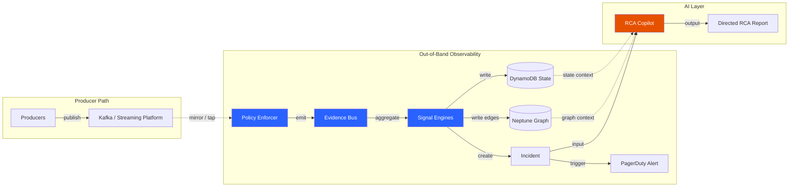
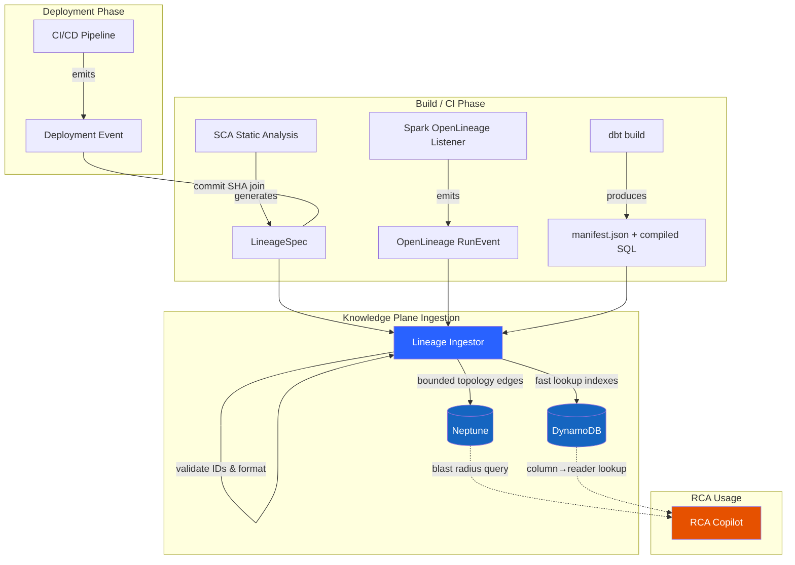
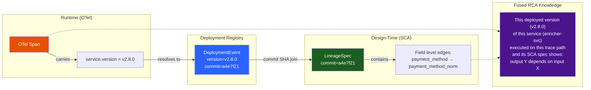
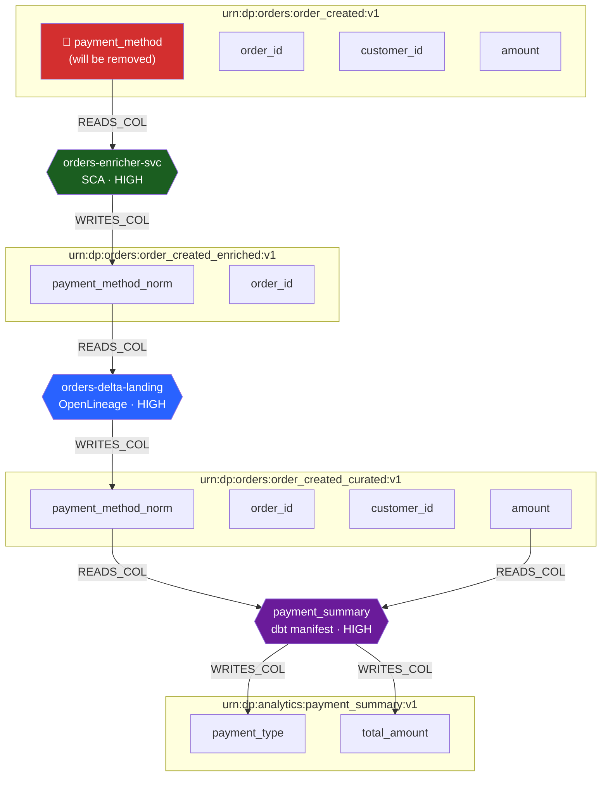
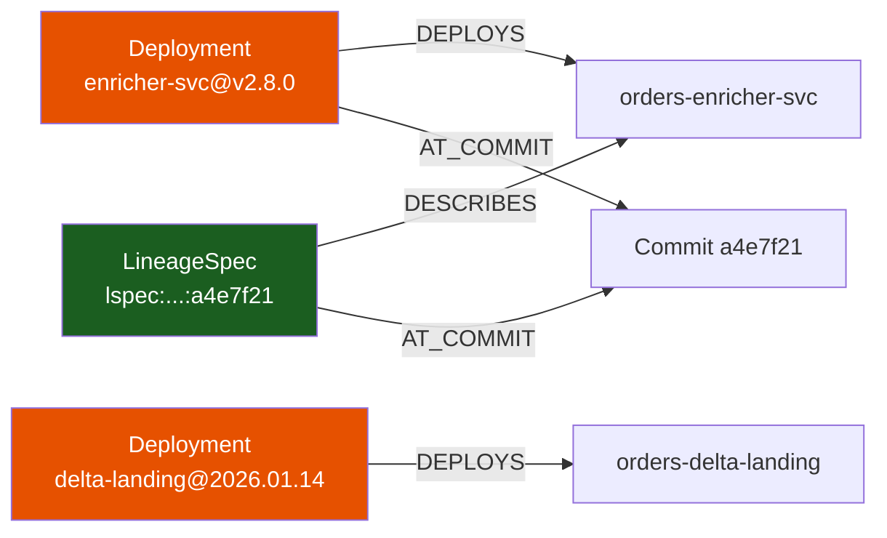
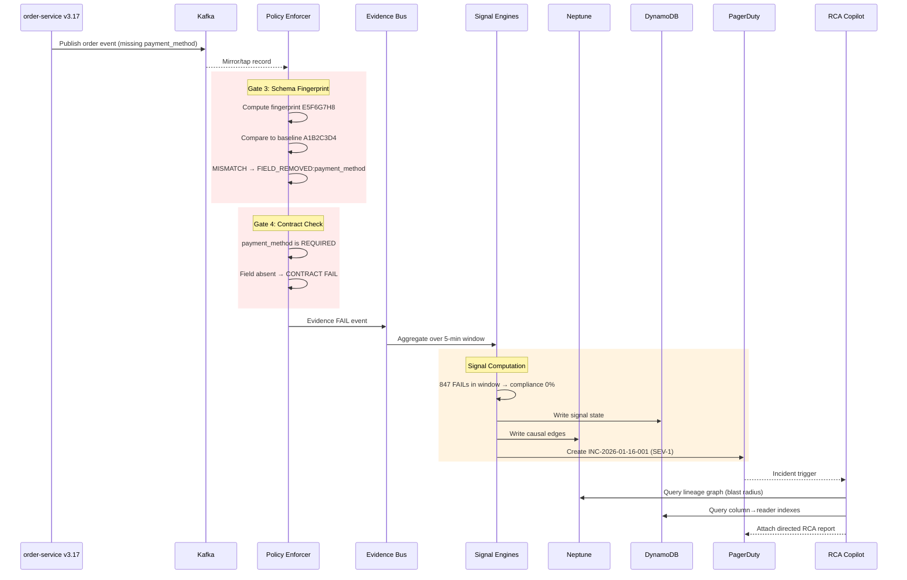
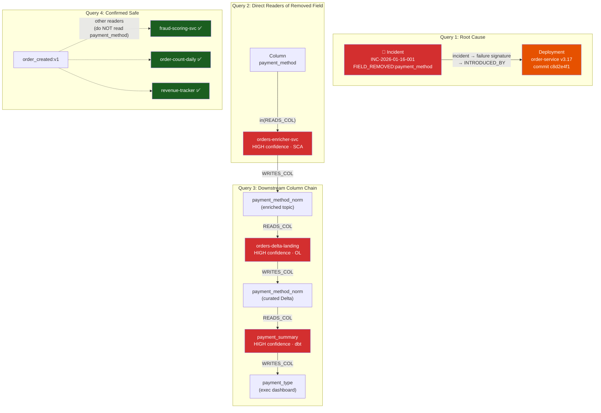
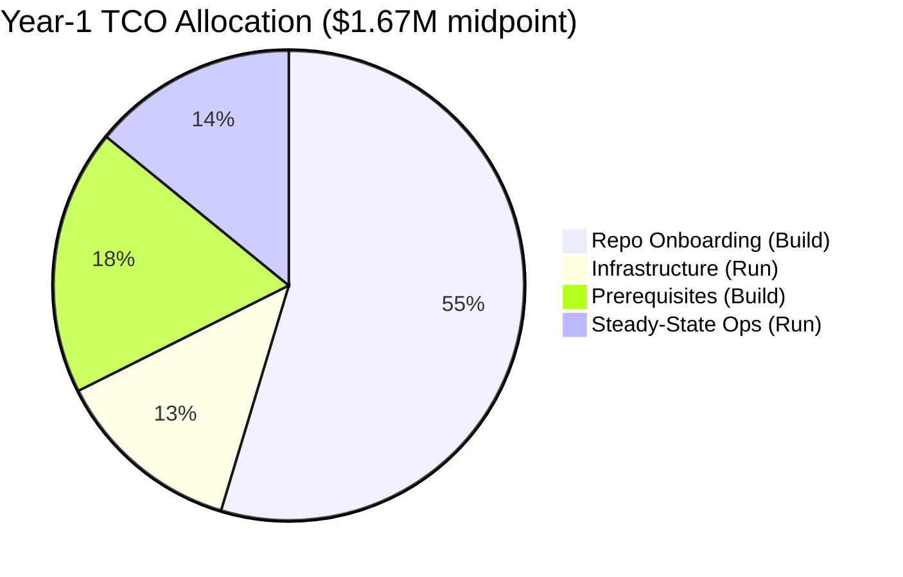
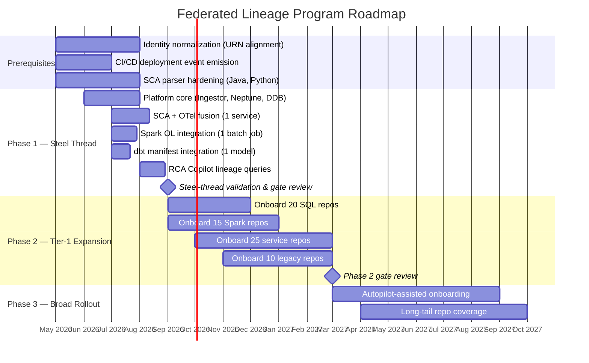

# Leadership Case for Adopting the Federated Element-Level Lineage Approach

**Version:** 2.0  
**Date:** April 6, 2026  
**Status:** Draft for Leadership Review  
**Owner:** Data Platform Architecture Team

---

## Executive Summary

**Recommendation:** Approve a phased investment in a **federated element-level lineage approach** that combines:

- **SCA + OTel fusion** for service and custom-code paths
- **Plan-based lineage for Spark**
- **Declarative lineage for SQL / dbt-like transformations**
- A **central OpenLineage-aligned knowledge plane** for impact analysis and RCA

This approach is the strongest practical path to achieve the program's stated goals of:

- **RCA query latency under 2 minutes**
- **MTTR under 2 hours**
- **100% Tier-1 lineage coverage**
- **Reduced false positives and lower engineering toil**

It is superior to any single-method lineage strategy because it uses the best extraction method per substrate while preserving the platform's core architectural constraint: **runtime truth is established out-of-band by Evidence, and lineage enriches RCA without blocking the producer path**.

---

## 1. The Leadership Problem We Are Solving

Today, when a Tier-1 data issue occurs, engineering often knows **something broke**, but not:

- which **field** changed
- which **service or job** introduced it
- which **downstream assets** are impacted
- which **deployment** likely caused it
- what the fastest mitigation path is

The project's strategy documents quantify the current pain:

- MTTR can exceed **12 hours**
- false positive rates are **60–80%**
- engineers lose roughly **20% sprint velocity** to firefighting
- element-level lineage is effectively **0%** today

This is not just a tooling problem. It is a business problem:

- delayed decisions from stale dashboards
- erosion of trust in data
- high on-call toil
- slower product and platform delivery
- repeated incidents without cumulative learning

---

## 2. Decision Framework: Three Strategic Options

Leadership should evaluate this recommendation against two alternatives. The following framework makes the cost of inaction explicit and the cost of partial investment visible.

### Option A — Do Nothing (Status Quo)

Maintain current alert-and-escalate posture with no lineage investment.

| Dimension | Assessment |
|---|---|
| Year-1 investment | $0 new spend |
| Ongoing cost of current state | ~$2.5M–$4M/yr in engineering toil, delayed MTTR, repeat incidents, false-positive triage (estimated from 20% sprint velocity loss across impacted teams) |
| RCA capability | Manual correlation across 6+ systems; no field-level attribution |
| Blast radius visibility | None; downstream impact discovered reactively |
| Risk | Continued trust erosion, on-call burnout, executive dashboard reliability gaps |

**Hidden assumption:** The cost of the status quo is often invisible because it is distributed across teams as "firefighting overhead" rather than appearing as a line item. The 20% sprint velocity figure from the program's own analysis translates to roughly $50K–$80K per engineer per year in lost capacity.

### Option B — Dataset-Level Lineage Only

Invest in dataset-level topology (which job reads/writes which dataset) without field-level detail.

| Dimension | Assessment |
|---|---|
| Year-1 investment | ~$300K–$450K (platform + onboarding) |
| RCA improvement | Moderate: can identify which jobs are downstream of a failing dataset |
| Blast radius | Dataset-granularity only; cannot distinguish "all consumers impacted" from "only consumers of field X impacted" |
| False positive reduction | Minimal: still cannot attribute failures to specific field changes |
| Coverage effort | Lower per repo (no column extraction, no confidence model) |
| Risk | Delivers partial value but does not close the core gap: "which field changed and who reads it?" |

**Why this falls short:** The most common Tier-1 incident pattern is a schema drift affecting one or two fields — not a full dataset outage. Dataset-level lineage cannot distinguish between a benign column addition and a breaking column removal for specific consumers.

### Option C — Federated Element-Level Lineage (Recommended)

Full federated approach with field-level lineage per substrate.

| Dimension | Assessment |
|---|---|
| Year-1 investment | ~$2.6M TCO (Build $1.68M + Run $0.95M); break-even Month 30–36 |
| RCA improvement | Significant: field-level blast radius, deploy-correlated RCA, prioritized consumer impact |
| Blast radius | Column-granularity: "these 4 consumers read `payment_method`; these 12 do not" |
| False positive reduction | High: lineage-informed triage distinguishes relevant from irrelevant consumers |
| Coverage effort | Higher per repo, but archetype model makes cost predictable |
| Risk | Identity normalization and parser maturity are prerequisites (addressed in Section 11) |

**Why this is recommended:** It is the only option that closes the gap between "we detected an issue" and "we know what changed, who is affected, and what to do next."

---

## 3. Why This Approach

### 3.1 Why not pick a single lineage method

No single lineage mechanism is sufficient across the estate:

- **SCA alone** gives design-time mappings but not runtime proof
- **OTel alone** gives runtime causality but not field-level transformation mapping
- **Spark plan lineage alone** is strong for Spark but does not cover services
- **Declarative SQL lineage alone** is excellent for SQL models but not for custom code

A large enterprise has heterogeneous execution models. A scalable lineage strategy must therefore be **federated**, not monolithic.

### 3.2 Why this combined approach is the right fit

This approach uses the strongest source per substrate:

- **Services / custom code:** SCA + OTel fusion
- **Spark batch:** Spark logical plan / OpenLineage
- **Declarative SQL:** dbt-like manifests / compiled SQL / SQL lineage
- **Shared knowledge plane:** normalized graph + indexes for RCA and blast radius

This aligns with the project's documented architecture:

- Evidence is the runtime system of record
- Signal Engines compute health truth from Evidence
- Lineage is ingested asynchronously into the knowledge plane
- RCA uses both runtime evidence and lineage context to explain incidents

---

## 4. The Strategic Value Proposition

### 4.1 Business outcomes

This investment improves four outcomes leadership already cares about:

1. **Faster incident resolution** — Move from "manual correlation across systems" to evidence-backed RCA. Identify source deployment, affected field, and downstream blast radius quickly.

2. **Higher trust in data** — Detect and explain field-level breaks before they silently spread downstream.

3. **Improved team productivity** — Less time spent reconstructing lineage during incidents. More reusable operational intelligence after each incident.

4. **Leadership visibility and ROI** — Show avoided incidents, reduced MTTR, prevented consumer impact, and coverage progress in a measurable way.

### 4.2 Why the timing is right

The program has already converged on out-of-band enforcement, a central Evidence Bus, a knowledge plane, RCA Copilot, and progressive adoption instead of hard-inline control of the producer path.

The federated lineage model is the natural next layer that turns "we detected an issue" into "we know what changed and who is affected."

---

## 5. Complete Architecture Picture

### 5.1 Runtime truth remains unchanged

The current platform architecture should remain intact:



This is important for leadership:

- **No business-path latency added** — the producer path (solid arrows) is never blocked
- **No requirement to replatform producers**
- **Failures in observability create an observability gap, not data path downtime**

### 5.2 Lineage ingestion path

The new lineage layer operates asynchronously, entirely separate from the runtime path:



### 5.3 Design principle

**Lineage is RCA enrichment, not a gate.**

This principle is explicitly called out in the project lineage specs and should remain non-negotiable:

- Runtime gates remain deterministic
- Lineage can be stale or low-confidence without breaking incident detection
- RCA can degrade gracefully when lineage is missing or weak

---

## 6. How the SCA + OTel Fusion Works

For service and custom-code paths, SCA and OTel are used **together**, not as alternatives.

### 6.1 What each system provides

**SCA provides:** Which fields a code path reads and writes, which transform function is involved, which commit / build produced that mapping, confidence and coverage metadata.

**OTel provides:** Which service / span / operation actually executed, which request or event path was active at runtime, which version was running, causal path across boundaries.

### 6.2 The concrete join path

The fusion is not aspirational — it relies on a specific, mechanical join:



The four-step resolution is:

1. An OTel span carries `service.name` and `service.version` (or `deployment.environment` + version tag) at runtime.
2. The platform's deployment event links `service.version` → `commit SHA` → `deployment timestamp`.
3. The LineageSpec is keyed by `commit SHA` (immutable, versioned per build).
4. The knowledge plane resolves: **span → service version → deployment event → commit SHA → LineageSpec → field-level edges**.

This join gives the RCA Copilot the ability to say: this deployed version, of this service, executed on this trace path, and its matching SCA spec shows that output field `Y` depends on input field `X`.

### 6.3 What OTel adds beyond the Evidence Bus

The Evidence Bus already captures causal edges at the dataset level (producer → enforcer → signal → incident). OTel's incremental contribution is narrowly scoped but critical:

- **Version resolution at runtime:** OTel spans carry the service version that was actually running when a failure occurred, enabling the commit SHA join described above.
- **Cross-service request correlation:** For request-path flows (HTTP → internal transform → Kafka produce), OTel trace context propagation links the full path, which SCA alone cannot observe at runtime.

OTel is best understood here as a **version resolution and cross-boundary correlation mechanism**, not a full lineage source in its own right.

---

## 7. Spark and Declarative SQL Substrate Strategies

The SCA + OTel fusion path has detailed interface specs, confidence models, and acceptance criteria. The Spark and SQL substrate strategies require equivalent rigor. The following sections provide that.

### 7.1 Spark batch — Plan-based lineage

**Extraction mechanism:** Spark logical plan capture via OpenLineage Spark listener or custom `QueryExecutionListener` attached to the Spark session.

**What it captures:** Input datasets and columns resolved from the logical plan, output dataset and columns written, column-level derivation edges (which output column depends on which input columns), UDF boundaries (marked as LOW confidence where column pass-through cannot be resolved).

**Interface contract:**

| Field | Description |
|---|---|
| `job_name` | Airflow DAG + task or equivalent scheduler identity |
| `run_id` | Unique execution ID (OpenLineage RunEvent UUID) |
| `inputs[]` | Dataset URNs + column URNs resolved from plan |
| `outputs[]` | Dataset URNs + column URNs from write plan |
| `column_lineage[]` | Input column → output column derivation edges |
| `confidence` | HIGH for resolvable SQL/DataFrame plans; LOW for opaque UDFs, dynamic DataFrame construction, custom readers/writers |
| `plan_snapshot` | Serialized logical plan hash for audit |

**Confidence model:**

- **HIGH:** Pure SQL or DataFrame API with resolvable column references
- **MEDIUM:** Partial UDF usage, star-expansion resolved, some dynamic partitioning
- **LOW:** Heavy UDF usage, custom SerDe, runtime-constructed DataFrames

**Acceptance criteria for Spark substrate:**

- Column-level lineage emitted for ≥80% of Tier-1 Spark jobs
- UDF boundaries correctly marked LOW confidence (not omitted)
- Run-level lineage linked to Airflow DAG run ID or equivalent
- OpenLineage events validate against OpenLineage JSON schema v2

### 7.2 Declarative SQL / dbt-like repos

**Extraction mechanism:** dbt manifest.json + compiled SQL parsing, or equivalent model metadata from other declarative SQL frameworks.

**What it captures:** Model-to-model dependencies (ref graph), column-level lineage from compiled SQL (SELECT field mappings), source-to-model column mappings, test and constraint metadata.

**Interface contract:**

| Field | Description |
|---|---|
| `model_name` | Fully qualified model identifier |
| `materialization` | table / view / incremental / ephemeral |
| `inputs[]` | Upstream model or source URNs + column URNs |
| `outputs[]` | This model's dataset URN + column URNs |
| `column_lineage[]` | Input column → output column derivation edges |
| `confidence` | HIGH for explicit SELECT; MEDIUM for `select *` or Jinja macro expansion; LOW for dynamic SQL or run-time ref resolution |

**Confidence model:**

- **HIGH:** Explicit column list in SELECT, no macros
- **MEDIUM:** `select *` (resolved via schema catalog), Jinja macros with deterministic expansion
- **LOW:** Dynamic SQL generation, environment-conditional refs, external table functions

**Acceptance criteria for SQL substrate:**

- Column-level lineage emitted for ≥90% of Tier-1 dbt/SQL models
- `select *` correctly resolved against schema catalog or marked MEDIUM
- Macro-generated SQL parsed from compiled output, not raw Jinja
- Model identity aligned to Signal Factory Dataset URN

---

## 8. Lineage Staleness and Graceful Degradation

### 8.1 The operational failure mode

The confidence model addresses static quality of lineage extraction. A separate concern is **temporal staleness**: a LineageSpec was correct when emitted, but the code has since changed, or a deployment occurred without triggering a new spec.

If RCA Copilot presents a blast radius based on stale lineage and an engineer acts on it, the mitigation may target the wrong consumers. This is the most likely source of distrust in the lineage system.

### 8.2 Staleness policy

Each LineageSpec is immutable and keyed by commit SHA. The knowledge plane must enforce:

| Staleness condition | RCA behavior |
|---|---|
| LineageSpec commit SHA matches currently deployed version | Full confidence — use for blast radius ranking |
| LineageSpec exists but commit SHA is ≤ 2 versions behind deployed | Reduced confidence — use with advisory label: "Lineage may be outdated (2 deploys behind)" |
| LineageSpec commit SHA is > 2 versions behind, or age > 30 days since last matching deploy | Suppressed — do not include in blast radius. Show: "Lineage unavailable for this service (last spec: 47 days ago)" |
| No LineageSpec exists for this service/job | Absent — RCA degrades to dataset-level topology only. Show: "No element-level lineage available" |

### 8.3 UX signal requirements

The RCA Copilot UI must visually distinguish lineage confidence:

- **Fresh + HIGH confidence:** Solid edges in blast radius graph, prioritized in ranking
- **Stale or MEDIUM confidence:** Dashed edges, deprioritized with advisory text
- **Suppressed or absent:** Omitted from graph, noted in RCA narrative as a coverage gap

This prevents the worst failure mode: engineers treating stale lineage as current truth.

---

## 9. Concrete End-to-End Example: From Deploy to Actionable RCA

This section walks through a realistic incident scenario step by step, showing the exact data schemas at each stage, what each component produces, and how lineage transforms a generic alert into a directed, actionable RCA. The scenario spans all three substrates (service, Spark, SQL) to demonstrate the federated model end to end.

### 9.1 The data flow under normal operation

Before the incident, the following data chain is healthy:

```mermaid
flowchart LR
    subgraph Producer
        OS[order-service\nv3.16]
    end

    subgraph Streaming
        KT[Kafka topic:\norders.created]
    end

    subgraph Service Layer ["Service (SCA Substrate)"]
        ENR[orders-enricher-svc\nv2.8.0]
    end

    subgraph Enriched
        KTE[Kafka topic:\norders.created.enriched]
    end

    subgraph Batch Layer ["Spark (OpenLineage Substrate)"]
        SDL[orders-delta-landing\nSpark batch job]
    end

    subgraph Curated
        DT[(Delta table:\norder_created_curated)]
    end

    subgraph SQL Layer ["SQL (dbt Substrate)"]
        PS[dbt model:\npayment_summary]
    end

    subgraph Consumer
        DASH[Exec Dashboard]
    end

    OS -->|"order_id, customer_id,\npayment_method, amount"| KT
    KT --> ENR
    ENR -->|"order_id,\npayment_method_norm"| KTE
    KTE --> SDL
    SDL -->|"order_id, customer_id,\npayment_method_norm, amount"| DT
    DT --> PS
    PS -->|"payment_type,\ntotal_amount"| DASH

    style OS fill:#E65100,color:#fff
    style ENR fill:#1B5E20,color:#fff
    style SDL fill:#2962FF,color:#fff
    style PS fill:#6A1B9A,color:#fff
```



**Dataset URNs in the chain:**

| Asset | Dataset URN |
|---|---|
| Raw orders topic | `urn:dp:orders:order_created:v1` |
| Enriched orders topic | `urn:dp:orders:order_created_enriched:v1` |
| Curated Delta table | `urn:dp:orders:order_created_curated:v1` |
| Payment summary model | `urn:dp:analytics:payment_summary:v1` |

---

### 9.2 Step 1 — Lineage is registered at build time (before any incident)

Each component in the chain has its lineage registered through the appropriate substrate method during its most recent deployment.

**9.2.1 — SCA LineageSpec for `orders-enricher-svc` (service substrate)**

Generated at deploy time by SCA static analysis of the service code:

```json
{
  "lineage_spec_id": "lspec:orders-enricher-svc:git:a4e7f21",
  "emitted_at": "2026-01-14T08:30:00Z",
  "producer": {
    "type": "SERVICE",
    "name": "orders-enricher-svc",
    "repo": "github.com/acme/orders-enricher-svc",
    "commit": "a4e7f21",
    "language": "java",
    "framework": "spring-boot"
  },
  "lineage": {
    "inputs": [
      {
        "dataset_urn": "urn:dp:orders:order_created:v1",
        "column_urns": [
          "urn:col:urn:dp:orders:order_created:v1:order_id",
          "urn:col:urn:dp:orders:order_created:v1:payment_method"
        ]
      }
    ],
    "outputs": [
      {
        "dataset_urn": "urn:dp:orders:order_created_enriched:v1",
        "column_urns": [
          "urn:col:urn:dp:orders:order_created_enriched:v1:order_id",
          "urn:col:urn:dp:orders:order_created_enriched:v1:payment_method_norm"
        ]
      }
    ],
    "transforms": [
      {
        "input_col": "urn:col:urn:dp:orders:order_created:v1:payment_method",
        "output_col": "urn:col:urn:dp:orders:order_created_enriched:v1:payment_method_norm",
        "transform_type": "NORMALIZE",
        "description": "Lowercases and maps payment method aliases to canonical enum"
      }
    ]
  },
  "confidence": {
    "overall": "HIGH",
    "input_columns_pct": 100,
    "output_columns_pct": 100,
    "reasons": ["Explicit Spring @KafkaListener with typed deserializer; output via KafkaTemplate with Avro schema"]
  }
}
```

**9.2.2 — OpenLineage RunEvent for `orders-delta-landing` (Spark substrate)**

Emitted by the Spark OpenLineage listener at the end of each Airflow DAG run:

```json
{
  "eventType": "COMPLETE",
  "eventTime": "2026-01-14T02:15:00Z",
  "run": {
    "runId": "run:orders-delta-landing:2026-01-14",
    "facets": {
      "spark.logicalPlan": { "plan_hash": "b7c3d9e2" }
    }
  },
  "job": {
    "namespace": "airflow:prod",
    "name": "orders_daily_pipeline.orders_delta_landing"
  },
  "inputs": [
    {
      "namespace": "kafka:prod",
      "name": "urn:dp:orders:order_created_enriched:v1",
      "facets": {
        "columnLineage": {
          "fields": {
            "order_id": { "inputFields": [{"namespace": "kafka:prod", "name": "urn:dp:orders:order_created_enriched:v1", "field": "order_id"}] },
            "payment_method_norm": { "inputFields": [{"namespace": "kafka:prod", "name": "urn:dp:orders:order_created_enriched:v1", "field": "payment_method_norm"}] },
            "customer_id": { "inputFields": [{"namespace": "kafka:prod", "name": "urn:dp:orders:order_created_enriched:v1", "field": "customer_id"}] }
          }
        }
      }
    }
  ],
  "outputs": [
    {
      "namespace": "s3:prod",
      "name": "urn:dp:orders:order_created_curated:v1"
    }
  ]
}
```

**9.2.3 — dbt manifest lineage for `payment_summary` (SQL substrate)**

Extracted from `manifest.json` at dbt build time:

```json
{
  "model": "analytics.payment_summary",
  "materialization": "table",
  "dataset_urn": "urn:dp:analytics:payment_summary:v1",
  "depends_on": ["urn:dp:orders:order_created_curated:v1"],
  "column_lineage": [
    {
      "output_column": "payment_type",
      "input_refs": [
        {
          "dataset_urn": "urn:dp:orders:order_created_curated:v1",
          "column": "payment_method_norm"
        }
      ],
      "transform": "CASE WHEN ... END AS payment_type"
    },
    {
      "output_column": "total_amount",
      "input_refs": [
        {
          "dataset_urn": "urn:dp:orders:order_created_curated:v1",
          "column": "amount"
        }
      ],
      "transform": "SUM(amount)"
    }
  ],
  "confidence": {
    "overall": "HIGH",
    "reasons": ["Explicit SELECT with no macros or dynamic SQL"]
  }
}
```

---

### 9.3 Step 2 — Neptune knowledge graph state (pre-incident)

After the Lineage Ingestor processes all three specs, Neptune contains the following topology:

**Column-level lineage graph (the chain that RCA will traverse):**



**Deployment and spec linkage (how RCA correlates versions):**



This graph exists in Neptune before any incident occurs. It is the pre-positioned knowledge that makes fast RCA possible.

---

### 9.4 Step 3 — The breaking change (T=0)

At **2026-01-16 09:57:45 UTC**, the `order-service` team deploys version `v3.17`. This deploy contains a refactoring that renames `payment_method` to `payment_details` (a STRUCT), removing the original STRING field.

**Before deploy (v3.16) — last good payload:**

```json
{
  "order_id": "ORD-98234",
  "customer_id": "CUST-1129",
  "payment_method": "credit_card",
  "amount": 149.99
}
```

**After deploy (v3.17) — first bad payload:**

```json
{
  "order_id": "ORD-98235",
  "customer_id": "CUST-1130",
  "payment_details": {
    "type": "credit_card",
    "provider": "stripe",
    "last_four": "4242"
  },
  "amount": 89.50
}
```

The field `payment_method` is absent. The new field `payment_details` is a STRUCT — an incompatible type change from the consumer perspective.

---

### 9.5 Step 4 — Runtime detection (T+15 seconds)

The Policy Enforcer processes the first bad record out-of-band. The following sequence shows the full detection chain:



**Gate 3 (Schema fingerprint) fires:**

The Enforcer computes a schema fingerprint from the record's field names and types:

```
Previous fingerprint: A1B2C3D4  (order_id, customer_id, payment_method:STRING, amount:DECIMAL)
Current fingerprint:  E5F6G7H8  (order_id, customer_id, payment_details:STRUCT, amount:DECIMAL)
```

Fingerprints do not match → schema drift detected.

**Gate 4 (Contract) fires:**

The contract-lite check identifies that `payment_method` is a required field per the registered ODCS contract. It is missing.

**Evidence event emitted:**

```json
{
  "evidence_id": "evd-01HQ-XYZ-20260116-001",
  "dataset_urn": "urn:dp:orders:order_created:v1",
  "trace_id": "ab91f3c2-d4e5-f6a7-b8c9-d0e1f2a3b4c5",
  "timestamp": "2026-01-16T09:58:02.312Z",
  "validation": {
    "result": "FAIL",
    "gates": {
      "schema": {
        "result": "FAIL",
        "schema_fingerprint_prev": "A1B2C3D4",
        "schema_fingerprint_curr": "E5F6G7H8",
        "reason_code": "FIELD_REMOVED:payment_method"
      },
      "contract": {
        "result": "FAIL",
        "reason_code": "MISSING_REQUIRED_FIELD:payment_method"
      }
    }
  },
  "producer_identity": {
    "service": "order-service",
    "version": "v3.17"
  }
}
```

**Key point:** This evidence event is a hard fact about the payload. It does not use lineage. It does not need lineage. The Enforcer is a deterministic truth machine.

---

### 9.6 Step 5 — Signal aggregation (T+2 minutes)

The Contract Signal Engine aggregates evidence over its 5-minute tumbling window.

**Signal computed:**

```json
{
  "signal_type": "CONTRACT_BREACH",
  "dataset_urn": "urn:dp:orders:order_created:v1",
  "severity": "CRITICAL",
  "compliance_rate": 0.0,
  "failure_count": 847,
  "failure_signature": "FIELD_REMOVED:payment_method",
  "first_bad_ts": "2026-01-16T09:58:02.312Z",
  "last_good_ts": "2026-01-16T09:57:44.891Z",
  "window": "2026-01-16T09:55:00Z / 2026-01-16T10:00:00Z"
}
```

The Schema Drift Signal Engine also fires:

```json
{
  "signal_type": "SCHEMA_DRIFT",
  "dataset_urn": "urn:dp:orders:order_created:v1",
  "severity": "HIGH",
  "fingerprint_delta": "A1B2C3D4 → E5F6G7H8",
  "fields_removed": ["payment_method"],
  "fields_added": ["payment_details"]
}
```

**Incident created:**

```json
{
  "incident_id": "INC-2026-01-16-001",
  "severity": "SEV-1",
  "status": "OPEN",
  "dataset_urn": "urn:dp:orders:order_created:v1",
  "signals": ["CONTRACT_BREACH", "SCHEMA_DRIFT"],
  "primary_failure_signature": "FIELD_REMOVED:payment_method",
  "deploy_correlation": {
    "service": "order-service",
    "version": "v3.17",
    "deployed_at": "2026-01-16T09:57:45Z",
    "commit": "c8d2e4f1"
  },
  "created_at": "2026-01-16T10:00:01.200Z"
}
```

**Neptune causal edges written:**

```
(Deployment:order-service@v3.17) ──INTRODUCED──> (FailureSignature:FIELD_REMOVED:payment_method)
(FailureSignature)               ──CAUSED──>     (Signal:CONTRACT_BREACH)
(Signal:CONTRACT_BREACH)         ──TRIGGERED──>  (Incident:INC-2026-01-16-001)
```

At this point, the on-call engineer receives a PagerDuty alert. **Total time from deploy to alert: ~2 minutes 15 seconds.**

---

### 9.7 Step 6 — RCA Copilot traversal (T+2 minutes 30 seconds)

This is where lineage transforms the incident from an alert into a directed action plan. The RCA Copilot performs four queries against Neptune.

**RCA traversal flow:**



**Query 1: What is the root cause?**

Traversal: `Incident → FailureSignature → INTRODUCED_BY → Deployment`

```
Result:
  Root cause: Deployment order-service@v3.17 (commit c8d2e4f1)
  Deployed at: 2026-01-16T09:57:45Z
  Change: Field 'payment_method' removed, replaced by 'payment_details' (STRUCT)
```

**Query 2: Who directly reads the removed field?**

This is the first lineage query. Traversal: find all services/jobs with a `READS_COL` edge to `urn:col:...:order_created:v1:payment_method`.

```gremlin
g.V().has('Column', 'urn', 'urn:col:urn:dp:orders:order_created:v1:payment_method')
  .in('READS_COL')
  .project('name', 'type', 'deployment', 'confidence')
```

```
Result:
  ┌─────────────────────────┬──────────┬──────────────────┬────────────┐
  │ Consumer                │ Type     │ Active Deploy    │ Confidence │
  ├─────────────────────────┼──────────┼──────────────────┼────────────┤
  │ orders-enricher-svc     │ SERVICE  │ v2.8.0 (a4e7f21) │ HIGH       │
  └─────────────────────────┴──────────┴──────────────────┴────────────┘
```

`orders-enricher-svc` is the first-hop consumer. It directly reads the removed field.

**Query 3: What does the first-hop consumer write, and who reads that?**

Traversal: follow the column derivation chain forward through `WRITES_COL` → `READS_COL`.

```
orders-enricher-svc  ──WRITES_COL──>  payment_method_norm (enriched topic)
                                              │
                                     ──READS_COL── orders-delta-landing
                                              │
orders-delta-landing ──WRITES_COL──>  payment_method_norm (curated Delta)
                                              │
                                     ──READS_COL── payment_summary (dbt)
                                              │
payment_summary      ──WRITES_COL──>  payment_type (analytics model)
```

**Full blast radius result:**

```
  ┌─────────────────────────┬──────────┬──────────┬────────────┬────────────────────────────┐
  │ Impacted Asset          │ Type     │ Hop      │ Confidence │ Column Affected            │
  ├─────────────────────────┼──────────┼──────────┼────────────┼────────────────────────────┤
  │ orders-enricher-svc     │ SERVICE  │ 1        │ HIGH (SCA) │ reads: payment_method      │
  │ enriched topic          │ DATASET  │ 1        │ HIGH (SCA) │ writes: payment_method_norm│
  │ orders-delta-landing    │ SPARK    │ 2        │ HIGH (OL)  │ reads: payment_method_norm │
  │ curated Delta table     │ DATASET  │ 2        │ HIGH (OL)  │ writes: payment_method_norm│
  │ payment_summary (dbt)   │ SQL      │ 3        │ HIGH (dbt) │ reads: payment_method_norm │
  │ payment_type (output)   │ COLUMN   │ 3        │ HIGH (dbt) │ writes: payment_type       │
  └─────────────────────────┴──────────┴──────────┴────────────┴────────────────────────────┘
```

**Query 4: Who is NOT impacted?**

The same dataset `urn:dp:orders:order_created:v1` has other consumers that read different columns (e.g., `order_id`, `amount`) but do NOT read `payment_method`:

```
  ┌─────────────────────────┬──────────┬────────────────────────────┬──────────────┐
  │ Consumer                │ Type     │ Columns Read               │ Impacted?    │
  ├─────────────────────────┼──────────┼────────────────────────────┼──────────────┤
  │ fraud-scoring-svc       │ SERVICE  │ order_id, amount           │ NOT IMPACTED │
  │ order-count-daily       │ SPARK    │ order_id (COUNT only)      │ NOT IMPACTED │
  │ revenue-tracker (dbt)   │ SQL      │ amount, customer_id        │ NOT IMPACTED │
  └─────────────────────────┴──────────┴────────────────────────────┴──────────────┘
```

This is the critical value of **element-level** lineage: it distinguishes between "all consumers of this dataset are impacted" (dataset-level) and "only these 3 consumers are impacted; these 3 are safe" (column-level). Without column-level lineage, all 6 consumers would be flagged, doubling the triage surface and generating false escalations.

---

### 9.8 Step 7 — RCA Copilot output (what the on-call engineer sees)

```
┌──────────────────────────────────────────────────────────────────────────────────────┐
│  RCA COPILOT ANALYSIS                                                                │
│  Incident: INC-2026-01-16-001  │  Severity: SEV-1  │  Status: OPEN                  │
├──────────────────────────────────────────────────────────────────────────────────────┤
│                                                                                      │
│  ROOT CAUSE (Confidence: 96% — HIGH)                                                 │
│  ─────────────────────────────────────                                                │
│  Deployment order-service v3.17 (commit c8d2e4f1) at 09:57:45 removed the           │
│  required field 'payment_method' from orders.created events, replacing it with       │
│  'payment_details' (STRUCT). This is an incompatible schema change.                  │
│                                                                                      │
│  BLAST RADIUS (3 consumers impacted, 3 confirmed safe)                               │
│  ─────────────────────────────────────────────────────                                │
│                                                                                      │
│  IMPACTED (read payment_method or its derivatives):                                  │
│                                                                                      │
│    Hop 1: orders-enricher-svc (v2.8.0)                                               │
│           Reads payment_method → writes payment_method_norm                          │
│           Lineage: SCA, HIGH confidence, spec from current deploy                    │
│           Status: WILL FAIL — input field missing                                    │
│                                                                                      │
│    Hop 2: orders-delta-landing (Spark, daily batch)                                  │
│           Reads payment_method_norm from enriched topic                               │
│           Lineage: OpenLineage, HIGH confidence                                      │
│           Status: WILL FAIL — upstream field will be null/missing                    │
│           Next scheduled run: 2026-01-17T02:00:00Z                                   │
│                                                                                      │
│    Hop 3: analytics.payment_summary (dbt model)                                      │
│           Reads payment_method_norm → writes payment_type                            │
│           Lineage: dbt manifest, HIGH confidence                                     │
│           Status: WILL PRODUCE INCORRECT RESULTS                                     │
│           Downstream: Executive payments dashboard                                   │
│                                                                                      │
│  NOT IMPACTED (do not read payment_method chain):                                    │
│    • fraud-scoring-svc — reads order_id, amount only                                 │
│    • order-count-daily — reads order_id only                                         │
│    • revenue-tracker   — reads amount, customer_id only                              │
│                                                                                      │
│  RECOMMENDED ACTIONS                                                                 │
│  ─────────────────────                                                               │
│  1. Rollback order-service to v3.16 immediately                                      │
│  2. After rollback, verify evidence shows PASS for new events                        │
│  3. Before re-deploying v3.17: add backward-compat transform                         │
│     (emit both payment_method and payment_details during migration window)           │
│  4. Coordinate with orders-enricher-svc team to update consumer                      │
│     to read payment_details.type as payment_method_norm source                       │
│                                                                                      │
│  TIMELINE                                                                            │
│  ────────                                                                            │
│  09:57:45  order-service v3.17 deployed                                              │
│  09:58:02  First bad record detected by Enforcer                                     │
│  10:00:01  Incident INC-2026-01-16-001 created (SEV-1)                               │
│  10:00:15  This RCA analysis completed                                               │
│                                                                                      │
│  Total time from breaking deploy to actionable RCA: 2 minutes 30 seconds             │
│                                                                                      │
│  ────────────────────────────────────────────────────────────────────────────────── │
│  Analysis completed in 14 seconds │ Graph traversal: 23ms │ LLM reasoning: 1.8s     │
└──────────────────────────────────────────────────────────────────────────────────────┘
```

---

### 9.9 The responsibility split (why this works)

The example above demonstrates a clean separation that is fundamental to the architecture's correctness:

| Question | Answered By | Uses Lineage? |
|---|---|---|
| Did the schema change? | Enforcer (Gate 3) | No |
| Which field is missing? | Enforcer (Gate 4) | No |
| Is the change compatible? | Contract-lite check | No |
| Should we emit FAIL evidence? | Enforcer | No |
| Which deployment introduced it? | Signal Engine + deploy correlation | No |
| **Who reads the removed field?** | **RCA Copilot via Neptune lineage** | **Yes** |
| **What is the downstream blast radius?** | **RCA Copilot via column-level chain** | **Yes** |
| **Who is safe and should NOT be paged?** | **RCA Copilot via column-level chain** | **Yes** |

**The one-sentence rule:** Contract-lite gates answer "Is this data valid?" Lineage answers "Who cares if it isn't?"

That boundary is what keeps the system both correct (runtime truth is deterministic, never depends on stale lineage) and valuable (RCA is directed, not a broadcast alarm).

---

### 9.10 What this looks like without lineage (the counterfactual)

To appreciate the value, consider what the same incident looks like with the current state (no element-level lineage):

```
┌──────────────────────────────────────────────────────────────────────────────────────┐
│  CURRENT STATE ALERT (no lineage)                                                    │
├──────────────────────────────────────────────────────────────────────────────────────┤
│                                                                                      │
│  ALERT: Schema drift on urn:dp:orders:order_created:v1                               │
│  Field removed: payment_method                                                       │
│  Likely cause: order-service v3.17 deployment                                        │
│                                                                                      │
│  Impact: UNKNOWN                                                                     │
│  Downstream consumers: UNKNOWN (manual investigation required)                       │
│  Safe consumers: UNKNOWN                                                             │
│  Recommended action: UNKNOWN (escalate to domain team)                               │
│                                                                                      │
│  On-call engineer must now:                                                          │
│  1. Search Confluence for data flow diagrams (15 min)                                │
│  2. Query Kafka consumer groups to find readers (10 min)                              │
│  3. Grep across 6+ repos to find payment_method usage (30 min)                       │
│  4. Slack 4 team channels to ask if they're impacted (60+ min waiting)               │
│  5. Manually assess Spark job dependencies (20 min)                                  │
│  6. Check dbt model dependencies (15 min)                                            │
│  7. Compile blast radius and decide on rollback (15 min)                             │
│                                                                                      │
│  Estimated MTTR: 3–12 hours                                                          │
│  False escalations: 3 teams paged who were not impacted                              │
└──────────────────────────────────────────────────────────────────────────────────────┘
```

**The difference:** 2 minutes 30 seconds with directed actions vs. 3–12 hours of manual investigation. Three teams correctly excluded from escalation vs. three false pages. That is the business case for element-level lineage in a single incident.

---

## 10. Level of Effort Model (PERT Three-Point Estimation)

All effort estimates in this section use the **PERT (Program Evaluation and Review Technique) three-point estimation** method, which is a standard project management framework for sizing uncertainty in novel engineering work. Each estimate uses three inputs:

- **O** = Optimistic (best case, minimal complexity drivers)
- **M** = Most Likely (typical case, expected complexity)
- **P** = Pessimistic (worst case, all complexity drivers present)

The PERT expected value is: **E = (O + 4M + P) / 6**

The standard deviation is: **σ = (P − O) / 6**, giving a confidence range of E ± σ for ~68% probability.

### 10.1 Archetype sizing (PERT)

**Archetype A — Declarative SQL / dbt-like repo**

Characteristics: Models and dependencies are explicit. Lineage extraction mostly leverages manifests and compiled SQL. Limited custom parsing.

Complexity drivers: macro usage, `select *`, config-driven table resolution, environment-specific references.

| Activity | O (days) | M (days) | P (days) | PERT E | σ |
|---|---:|---:|---:|---:|---:|
| Onboarding & parsing | 1.0 | 1.5 | 3.0 | 1.7 | 0.33 |
| Validation & normalization | 0.5 | 0.75 | 1.5 | 0.8 | 0.17 |
| **Total per repo** | **1.5** | **2.25** | **4.5** | **2.5** | **0.50** |

**Archetype B — Spark batch repo with plan lineage**

Characteristics: Strong native plan extraction possible. OpenLineage / Spark listener integration required. Some work to normalize datasets, columns, and runtime identifiers.

Complexity drivers: UDF opacity, custom readers/writers, partial OpenLineage coverage, dynamic DataFrame construction.

| Activity | O (days) | M (days) | P (days) | PERT E | σ |
|---|---:|---:|---:|---:|---:|
| OpenLineage listener setup | 1.5 | 3.0 | 5.0 | 3.1 | 0.58 |
| Column lineage validation | 1.0 | 2.0 | 3.0 | 2.0 | 0.33 |
| Run-linkage hardening | 0.5 | 1.0 | 2.0 | 1.1 | 0.25 |
| **Total per repo** | **3.0** | **6.0** | **10.0** | **6.2** | **1.17** |

**Archetype C — Service / custom-code repo (SCA + OTel fusion)**

Characteristics: Highest variability. Requires deploy linkage, runtime spans, and static analysis quality checks.

Complexity drivers: dynamic payload construction, reflection / generated code, polymorphic schemas, missing OTel propagation, weak deployment metadata.

| Activity | O (days) | M (days) | P (days) | PERT E | σ |
|---|---:|---:|---:|---:|---:|
| SCA parser integration | 3.0 | 6.0 | 12.0 | 6.5 | 1.50 |
| OTel / deploy linkage | 1.5 | 3.0 | 5.0 | 3.1 | 0.58 |
| Confidence calibration | 1.0 | 2.5 | 4.0 | 2.5 | 0.50 |
| Validation & hardening | 1.0 | 2.0 | 4.0 | 2.2 | 0.50 |
| **Total per repo** | **6.5** | **13.5** | **25.0** | **14.3** | **3.08** |

**Archetype D — Legacy / mixed / low-confidence repo**

Characteristics: Partial observability, weak code patterns, custom integrations, may require manual overrides or narrow-scope coverage.

| Activity | O (days) | M (days) | P (days) | PERT E | σ |
|---|---:|---:|---:|---:|---:|
| Triage & pattern analysis | 3.0 | 5.0 | 10.0 | 5.5 | 1.17 |
| Parser customization | 3.0 | 6.0 | 12.0 | 6.5 | 1.50 |
| Manual overrides & hardening | 2.0 | 4.0 | 6.0 | 4.0 | 0.67 |
| **Total per repo** | **8.0** | **15.0** | **28.0** | **16.0** | **3.33** |

### 10.2 Repo-level unit cost model

Using a fully loaded engineering cost of $1,500/engineer-day (midpoint of $1,200–$1,800 range based on location and seniority mix):

| Repo archetype | PERT E (days) | ±1σ range (days) | Unit cost (E) | ±1σ cost range |
|---|---:|---:|---:|---:|
| Declarative SQL / dbt-like | 2.5 | 2.0–3.0 | $3,750 | $3,000–$4,500 |
| Spark batch | 6.2 | 5.0–7.3 | $9,250 | $7,500–$11,000 |
| Service / custom code | 14.3 | 11.2–17.3 | $21,400 | $16,800–$26,000 |
| Legacy / mixed | 16.0 | 12.7–19.3 | $24,000 | $19,000–$29,000 |

### 10.3 Ongoing run cost per repo (steady state)

After onboarding, recurring cost is driven by lineage freshness monitoring, deployment linkage maintenance, occasional parser/spec fixes, and confidence recalibration.

| Activity | O (days/mo) | M (days/mo) | P (days/mo) | PERT E |
|---|---:|---:|---:|---:|
| Lineage freshness monitoring | 0.05 | 0.1 | 0.2 | 0.1 |
| Parser / spec maintenance | 0.02 | 0.1 | 0.3 | 0.1 |
| Confidence recalibration | 0.0 | 0.05 | 0.15 | 0.06 |
| **Total per repo per month** | **0.07** | **0.25** | **0.65** | **0.27** |

Steady-state cost: **~$400/repo/month** at $1,500/day.

---

## 11. Prerequisites and Readiness Gates

The following items are not part of the lineage program itself but are **hard prerequisites**. If any is not met, Phase 1 will stall.

### 11.1 Identity normalization (cross-substrate URN alignment)

**Why this matters:** Lineage from SCA, Spark OpenLineage, and dbt manifests must join on the same Dataset URNs and Column URNs in Neptune. If each substrate produces its own naming conventions, the knowledge plane cannot correlate them.

**Current state assessment needed:** Is the Signal Factory Dataset URN registry authoritative and complete for Tier-1 assets? Do Spark jobs, dbt models, and services all resolve to the same URN namespace?

**PERT estimate:**

| Activity | O (wks) | M (wks) | P (wks) | PERT E | Cost at $15K/wk |
|---|---:|---:|---:|---:|---:|
| URN registry audit & gap analysis | 1 | 2 | 4 | 2.2 | $33K |
| Cross-substrate mapping tooling | 3 | 5 | 10 | 5.5 | $83K |
| Validation & remediation | 2 | 4 | 8 | 4.3 | $65K |
| **Total** | **6** | **11** | **22** | **12.0** | **$180K** |

**Owner:** Must be jointly owned by Signal Factory platform team and domain data teams.

### 11.2 CI/CD deployment event emission

**Why this matters:** The SCA + OTel fusion join path depends on deployment events carrying `commit SHA`, `service version`, and `deployment timestamp`. Without this, LineageSpecs cannot be correlated to what is actually running.

**PERT estimate:** 3–5 engineer-weeks. ~$45K–$75K.

**Owner:** Platform engineering / CI-CD team.

### 11.3 SCA parser maturity

**Why this matters:** The services lineage spec acknowledges that Spring, Go, Node.js, and Python each require distinct parsers with framework-specific pattern recognition. Parser maturity directly determines the confidence level achievable for service repos.

**PERT estimate:** 4–8 engineer-weeks per language. ~$60K–$120K per language.

**Owner:** SCA team.

### 11.4 Neptune column-level edge cardinality

**Why this matters:** Adding column-level edges (READS_COL, WRITES_COL) to Neptune significantly increases graph density. The current specs state "bounded topology edges" but do not quantify the bound.

**Sizing estimate:** For 70 onboarded repos with an average of 30 columns per dataset and 2–3 datasets per repo, expect ~6,000–12,000 column-level edges. This is well within Neptune's capacity but should be validated against current graph size and query latency SLAs.

**Owner:** Signal Factory platform team.

---

## 12. Total Cost of Ownership (TCO) Model

This section uses the standard **TCO framework** with three cost categories — **Build (CapEx)**, **Run (OpEx)**, and **Change (ongoing enablement)** — consistent with Gartner IT cost classification.

### 12.1 TCO summary (Year 1 — 12-month horizon)



### 12.2 Build costs (one-time)

**A. Prerequisites**

| Item | PERT E | Cost |
|---|---|---:|
| Identity normalization | 12 engineer-weeks | $180,000 |
| CI/CD deployment event emission | 4 engineer-weeks | $60,000 |
| SCA parser hardening (2 languages) | 12 engineer-weeks | $180,000 |
| Neptune cardinality validation | 1 engineer-week | $15,000 |
| **Prerequisites subtotal** | | **$435,000** |

Note: Parser hardening for additional languages (Go, Node.js) deferred to Phase 3. Phase 1–2 targets Java and Python.

**B. Repo onboarding (70 repos over 9–12 months)**

| Archetype | Count | PERT E/repo (days) | Subtotal (days) | Cost |
|---|---:|---:|---:|---:|
| Declarative SQL | 20 | 2.5 | 50 | $75,000 |
| Spark batch | 15 | 6.2 | 93 | $139,500 |
| Service / custom code | 25 | 14.3 | 357.5 | $536,250 |
| Legacy / mixed | 10 | 16.0 | 160 | $240,000 |
| **Onboarding subtotal** | **70** | | **660.5** | **$990,750** |

**C. Platform build (Lineage Ingestor, RCA query layer, DDB indexes)**

| Component | Estimate | Cost |
|---|---|---:|
| Lineage Ingestor service | 8 engineer-weeks | $120,000 |
| RCA Copilot lineage integration | 6 engineer-weeks | $90,000 |
| DDB index design & build | 3 engineer-weeks | $45,000 |
| **Platform build subtotal** | | **$255,000** |

**Total Build Cost:** **~$1,680,750**

### 12.3 Run costs (annual recurring)

| Item | Monthly | Annual |
|---|---:|---:|
| Infrastructure (Neptune, DDB, EKS, Kafka) | $15K–$21K | $180K–$252K |
| Steady-state repo maintenance (70 repos × $400/mo) | $28K | $336K |
| Platform operations staffing (2 FTE) | $33K | $400K |
| **Run cost subtotal** | **$76K–$82K** | **$916K–$988K** |

### 12.4 Year-1 total cost of ownership

| Cost category | Amount | Type |
|---|---:|---|
| Build: Prerequisites | $435,000 | One-time (CapEx) |
| Build: Repo onboarding | $990,750 | One-time (CapEx) |
| Build: Platform | $255,000 | One-time (CapEx) |
| Run: Infrastructure | $216,000 | Recurring (OpEx) |
| Run: Steady-state ops | $736,000 | Recurring (OpEx) |
| **Year-1 TCO** | **~$2.63M** | |

### 12.5 Year-2+ steady-state TCO

After build costs are absorbed, ongoing annual cost stabilizes:

| Item | Annual |
|---|---:|
| Infrastructure | $216,000 |
| Steady-state repo maintenance (growing to 120 repos) | $576,000 |
| Platform operations (2 FTE) | $400,000 |
| Incremental onboarding (50 repos/year) | $400,000 |
| **Year-2 TCO** | **~$1.59M** |

---

## 13. ROI Model and Cost Justification

### 13.1 Cost of inaction (the baseline)

The architecture docs explicitly call out: long MTTR, lost engineering velocity, repeated incidents, trust erosion, burnout and coordination overhead.

**Quantified annual cost of the status quo:**

| Impact category | Calculation | Annual cost |
|---|---|---:|
| Engineering toil (20% velocity loss) | 50 impacted engineers × $200K avg × 20% | $2,000,000 |
| Incident MTTR cost (direct) | 24 Tier-1 incidents/yr × 12 hrs avg × 4 engineers × $100/hr | $115,200 |
| False positive triage | 60% false positive rate × 500 alerts/yr × 2 hrs × $100/hr | $60,000 |
| Downstream business impact (conservative) | 6 executive dashboard outages/yr × $50K estimated impact | $300,000 |
| **Total annual cost of inaction** | | **~$2.48M** |

### 13.2 Expected benefit (conservative)

| Benefit | Assumption | Annual value |
|---|---|---:|
| MTTR reduction (12 hrs → 2 hrs) | 83% reduction on 24 incidents | $95,700 saved |
| Engineering velocity recovery | 25% of toil recovered in Year 1 | $500,000 |
| False positive reduction (80% → 30%) | 62.5% fewer false triage cycles | $37,500 |
| Avoided downstream impact | 50% of dashboard outages prevented | $150,000 |
| **Total annual benefit (Year 1)** | | **~$783,200** |
| **Total annual benefit (Year 2, matured)** | 50% of toil recovered, 75% FP reduction | **~$1,250,000** |

### 13.3 ROI calculation

| Metric | Value |
|---|---:|
| Year-1 build investment | $1,680,750 |
| Year-1 run cost | $952,000 |
| Year-1 benefit | $783,200 |
| **Year-1 net** | **($1,849,550)** |
| Year-2 incremental cost | $1,590,000 |
| Year-2 benefit (matured) | $1,250,000 |
| **Year-2 net** | **($340,000)** |
| **Cumulative break-even** | **Month 30–36 (Year 3)** |

**Break-even context:** This is consistent with infrastructure platform investments of this class. The non-financial benefits (trust, reduced burnout, executive dashboard reliability, institutional RCA knowledge) accelerate the perceived payback period for leadership.

### 13.4 Sensitivity analysis

| If this changes... | Impact on break-even |
|---|---|
| MTTR reduction is only 50% (not 83%) | Break-even extends to Month 38 |
| Engineering velocity recovery is 15% (not 25%) | Break-even extends to Month 40 |
| Repo onboarding is 20% faster than PERT E | Break-even accelerates to Month 26 |
| Infrastructure costs are 30% higher | Break-even extends to Month 34 |
| 100 repos onboarded in Year 1 (not 70) | Higher build cost but earlier benefit; break-even at Month 28 |

The investment is robust across reasonable assumption ranges. Even in pessimistic scenarios, break-even occurs within 40 months — well within the expected lifetime of this platform.

---

## 14. Risks and Pitfalls Leadership Should Know Up Front

### 14.1 Biggest risks

1. **Identity normalization risk** — Dataset and field IDs must join consistently across systems. This is the #1 program risk and is addressed as a prerequisite in Section 11.

2. **False precision risk** — Different lineage sources have different confidence levels. Mitigated by the confidence model and staleness policy in Section 8.

3. **Temporal/version risk** — Lineage must align to deployed versions, not just latest specs. Mitigated by commit SHA linkage and staleness SLA.

4. **Graph scale risk** — Must keep topology bounded and avoid per-run / per-record explosion. Quantified in Section 11.4.

5. **Service SCA variability** — Custom code paths can be low-confidence. Mitigated by parser maturity prerequisite and graceful degradation UX.

6. **Organizational ownership drift** — Unclear handoff between SCA producers and knowledge plane consumers. Mitigated by explicit ownership model (SCA team owns spec generation; Signal Factory owns ingestion and RCA usage).

7. **Stale lineage acting as false truth** — Engineer acts on outdated blast radius. Mitigated by staleness policy and UX signals in Section 8.

### 14.2 Why these are manageable

The project documents already contain the right guardrails: immutable, versioned LineageSpec; commit linkage; bounded Neptune edges; asynchronous ingestion; confidence scoring; lineage as RCA enrichment only.

Leadership should fund the approach with those guardrails enforced.

---

## 15. Recommended Rollout Strategy



### Phase 1 — Steel-thread proof (8–12 weeks)

Prove end-to-end value on a narrow but meaningful flow:

- One producer service with SCA + OTel fusion
- One Spark batch consumer
- One declarative SQL downstream model
- One field-level break (synthetic or production)
- One RCA demonstration with deploy-aware blast radius

**Hard exit criteria for Phase 1:**

| Criterion | Target |
|---|---|
| RCA Copilot surfaces correct blast radius for a field-removal incident | Within 90 seconds, zero manual graph traversal |
| Blast radius covers ≥3 substrates in a single RCA query | Service → Spark → SQL model chain |
| Lineage staleness correctly detected and surfaced | Stale spec triggers advisory label, not silent inclusion |
| Identity join succeeds across all 3 substrates | Same Dataset URN resolves in SCA spec, OpenLineage event, and dbt manifest |
| False positive blast radius entries | ≤ 10% of surfaced consumers are irrelevant |

**Phase 1 is successful if and only if all five criteria are met.** Partial success triggers a scope review before Phase 2 funding.

### Phase 2 — Tier-1 expansion (6–9 months)

Expand to Tier-1 domains first: revenue-critical datasets, executive dashboards, regulated or customer-facing flows.

**Goal:** Maximize business impact per dollar invested. Target 70 repos across all four archetypes.

**Gating criteria for Phase 2 start:** Phase 1 exit criteria met; identity normalization prerequisite complete for Tier-1 domain; CI/CD deployment event emission confirmed for Tier-1 pipelines.

### Phase 3 — Broader estate rollout

Use the archetype model and Autopilot-style enablement to drive cheaper, repeatable onboarding across the long tail. The broader project docs already support a phased, value-led rollout model.

---

## 16. Success Metrics Program

Leadership should expect a quarterly metrics report covering:

| Metric | Baseline (today) | Phase 1 target | Phase 2 target |
|---|---|---|---|
| MTTR for Tier-1 incidents | 12+ hours | < 4 hours (steel thread) | < 2 hours |
| False positive rate | 60–80% | Measured on steel thread | < 30% |
| Element-level lineage coverage (Tier-1) | 0% | 1 flow proven | ≥ 70% |
| RCA blast radius accuracy | N/A | ≥ 90% on steel thread | ≥ 85% across Tier-1 |
| Lineage staleness incidents | N/A | 0 (staleness policy enforced) | 0 |
| Incidents with lineage-assisted resolution | 0 | ≥ 1 demonstrated | ≥ 50% of Tier-1 incidents |

---

## 17. What Leadership Should Approve Now

Leadership should approve:

1. **A phased federated lineage program** with explicit prerequisites and readiness gates
2. **A steel-thread validation with hard success criteria** (Section 15)
3. **Initial staffing for platform + lineage ingestion + RCA enablement** (6–8 engineers)
4. **Identity normalization as a funded prerequisite**, not an assumed dependency ($180K PERT estimate)
5. **A repo-archetype-based funding model** using PERT three-point estimation, not a one-size-fits-all estimate
6. **Year-1 TCO of ~$2.63M** with break-even at Month 30–36 (Section 12–13)
7. **Tier-1-first rollout** with gating criteria between phases
8. **A metrics program** tied to MTTR, false positives, coverage, and incident prevention (Section 16)

Leadership should **not** require:

- Universal producer changes
- Universal perfect field lineage everywhere
- Lineage in the critical path
- A single extraction strategy across all substrates
- Phase 2 funding commitment before Phase 1 results

---

## 18. Final Recommendation

Approve the federated lineage strategy because it offers the best combination of technical realism, enterprise scalability, measurable business value, and architectural alignment with the existing Signal Factory direction.

The investment is justified because it transforms observability from "we detected a problem" into "we know what changed, where it came from, what it impacts, and what to do next."

The decision framework in Section 2 makes the alternatives explicit: doing nothing costs more than this program in lost engineering capacity alone. Dataset-level lineage delivers partial value but cannot close the core gap. Federated element-level lineage is the only option that delivers the RCA capability this platform needs at enterprise scale.

That is the level of operational intelligence required for a trusted data platform.
