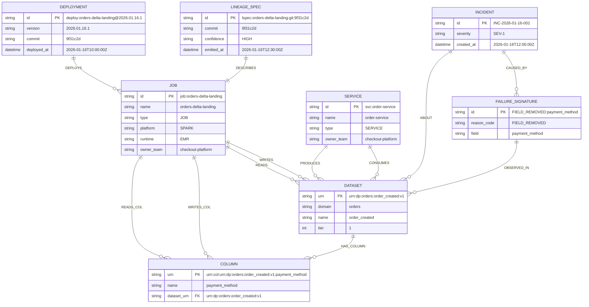

# Neptune Graph Data Model - SCA Element-Level Lineage

## Overview

This document defines the Neptune graph schema for storing SCA-generated element-level lineage alongside runtime incident data. The model supports RCA Copilot queries for blast radius analysis.

---

## Entity Relationship Diagram



---

## Node Types

### Topology Nodes (Low Churn)

| Node Label | Description | Primary Key Format |
|------------|-------------|-------------------|
| `Job` | Batch processing job | `job:<name>` |
| `Service` | Real-time service | `svc:<name>` |
| `Dataset` | Data product | `urn:dp:<domain>:<dataset>:v<major>` |
| `Column` | Column within dataset | `urn:col:<dataset_urn>:<column_name>` |
| `Team` | Owner team | `team:<name>` |

### Lineage Nodes (Per Deployment)

| Node Label | Description | Primary Key Format |
|------------|-------------|-------------------|
| `LineageSpec` | SCA-generated lineage artifact | `lspec:<producer>:git:<commit>` |
| `Deployment` | Specific version deployment | `deploy:<producer>@<version>` |

### RCA Nodes (Bounded + Deduped)

| Node Label | Description | Primary Key Format |
|------------|-------------|-------------------|
| `Incident` | SEV-1/2/3 incident | `INC-<date>-<seq>` |
| `FailureSignature` | Unique failure pattern | `<type>:<detail>` |
| `Signal` | Aggregated health signal | `sig:<type>:<dataset>:<window>` |

---

## Node Properties

### Job Node

```json
{
  "id": "job:orders-delta-landing",
  "name": "orders-delta-landing",
  "type": "JOB",
  "platform": "SPARK",
  "runtime": "EMR",
  "owner_team": "checkout-platform",
  "repo": "github:org/orders-analytics"
}
```

### Service Node

```json
{
  "id": "svc:order-service",
  "name": "order-service",
  "type": "SERVICE",
  "owner_team": "checkout-platform"
}
```

### Dataset Node

```json
{
  "urn": "urn:dp:orders:order_created:v1",
  "domain": "orders",
  "name": "order_created",
  "major_version": 1,
  "tier": 1,
  "classification": "revenue-critical"
}
```

### Column Node

```json
{
  "urn": "urn:col:urn:dp:orders:order_created:v1:payment_method",
  "name": "payment_method",
  "dataset_urn": "urn:dp:orders:order_created:v1",
  "data_type": "STRING"
}
```

### LineageSpec Node

```json
{
  "id": "lspec:orders-delta-landing:git:9f31c2d",
  "commit": "9f31c2d",
  "confidence": "HIGH",
  "coverage_input_pct": 0.92,
  "coverage_output_pct": 0.88,
  "emitted_at": "2026-01-16T12:30:00Z"
}
```

### Deployment Node

```json
{
  "id": "deploy:orders-delta-landing@2026.01.16.1",
  "producer": "orders-delta-landing",
  "version": "2026.01.16.1",
  "commit": "9f31c2d",
  "deployed_at": "2026-01-16T10:00:00Z"
}
```

### Incident Node

```json
{
  "id": "INC-2026-01-16-001",
  "severity": "SEV-1",
  "status": "OPEN",
  "title": "Contract Violation - orders:created",
  "created_at": "2026-01-16T12:00:00Z",
  "primary_evidence_id": "evd-01HQXY8MNP4QR7ST9VW2XYZ456"
}
```

### FailureSignature Node

```json
{
  "id": "FIELD_REMOVED:payment_method",
  "reason_code": "FIELD_REMOVED",
  "field": "payment_method",
  "first_seen": "2026-01-16T11:58:02Z",
  "occurrence_count": 1120
}
```

---

## Edge Types

### Lineage Edges (SCA-Generated)

| Edge Label | From | To | Properties |
|------------|------|-----|------------|
| `READS` | Job/Service | Dataset | `confidence`, `spec_id` |
| `WRITES` | Job/Service | Dataset | `confidence`, `spec_id` |
| `READS_COL` | Job/Service | Column | `confidence`, `spec_id` |
| `WRITES_COL` | Job/Service | Column | `confidence`, `spec_id` |
| `DESCRIBES` | LineageSpec | Job/Service | - |
| `AT_COMMIT` | LineageSpec | Commit | - |

### Deployment Edges

| Edge Label | From | To | Properties |
|------------|------|-----|------------|
| `DEPLOYS` | Deployment | Job/Service | `version` |

### Topology Edges

| Edge Label | From | To | Properties |
|------------|------|-----|------------|
| `HAS_COLUMN` | Dataset | Column | - |
| `OWNED_BY` | Job/Service/Dataset | Team | - |
| `PRODUCES` | Service | Dataset | - |

### RCA Edges (Runtime-Generated)

| Edge Label | From | To | Properties |
|------------|------|-----|------------|
| `CAUSED_BY` | Incident | FailureSignature | - |
| `ABOUT` | Incident | Dataset | - |
| `OBSERVED_IN` | FailureSignature | Dataset | - |
| `INTRODUCED` | Deployment | FailureSignature | `first_evidence`, `timestamp` |
| `TRIGGERED` | Signal | Incident | - |
| `CORRELATED_WITH` | Incident | Deployment | `confidence` |

---

## Graph Visualization

```
                         ┌────────────────────┐
                         │    LineageSpec     │
                         │ lspec:...:9f31c2d  │
                         └─────────┬──────────┘
                                   │ [DESCRIBES]
                                   ▼
┌────────────────────┐   ┌────────────────────┐   ┌────────────────────┐
│    Deployment      │   │        Job         │   │       Team         │
│ @2026.01.16.1      │──▶│ orders-delta-      │──▶│ checkout-platform  │
│                    │   │ landing            │   │                    │
└────────────────────┘   └─────────┬──────────┘   └────────────────────┘
      [DEPLOYS]                    │
                    ┌──────────────┼──────────────┐
                    │ [READS]      │              │ [WRITES]
                    ▼              │              ▼
         ┌──────────────────┐     │    ┌──────────────────────┐
         │     Dataset      │     │    │       Dataset        │
         │  order_created   │     │    │ order_created_curated│
         │       v1         │     │    │         v1           │
         └────────┬─────────┘     │    └──────────┬───────────┘
                  │               │               │
                  │ [HAS_COLUMN]  │ [READS_COL]   │ [HAS_COLUMN]
                  ▼               │               ▼
         ┌──────────────────┐     │    ┌──────────────────────┐
         │     Column       │◀────┘    │       Column         │
         │ payment_method   │          │ payment_method_norm  │
         └──────────────────┘          └──────────────────────┘
                  ▲
                  │ [OBSERVED_IN]
         ┌──────────────────┐          ┌──────────────────┐
         │ FailureSignature │◀─────────│     Incident     │
         │ FIELD_REMOVED:   │ [CAUSED_ │  INC-2026-01-16  │
         │ payment_method   │   BY]    │       -001       │
         └──────────────────┘          └──────────────────┘
```

---

## Gremlin Query Patterns

### Find Consumers of a Dataset

```groovy
g.V().has('Dataset', 'urn', 'urn:dp:orders:order_created:v1')
  .in('READS')
  .project('name', 'type', 'confidence')
    .by('name')
    .by('type')
    .by(inE('READS').values('confidence'))
```

### Find Consumers of a Specific Column

```groovy
g.V().has('Column', 'urn', 'urn:col:urn:dp:orders:order_created:v1:payment_method')
  .in('READS_COL')
  .project('name', 'type', 'confidence')
    .by('name')
    .by('type')
    .by(inE('READS_COL').values('confidence'))
```

### RCA: Blast Radius for Schema Change

```groovy
// Starting from incident, find impacted consumers
g.V().has('Incident', 'id', 'INC-2026-01-16-001')
  .out('CAUSED_BY')                    // → FailureSignature
  .out('OBSERVED_IN')                  // → Dataset
  .in('READS')                         // → Consumers (Job/Service)
  .project('consumer', 'owner')
    .by('name')
    .by(out('OWNED_BY').values('name'))
```

### RCA: Column-Level Blast Radius

```groovy
// Find all jobs reading a specific column at incident time
g.V().has('Column', 'urn', $column_urn)
  .in('READS_COL').as('consumer')
  .in('DEPLOYS')
    .has('deployed_at', lt($incident_time))
    .order().by('deployed_at', desc)
    .limit(1).as('deployment')
  .select('consumer', 'deployment')
    .by(valueMap('name', 'type'))
    .by('version')
```

### Find Deployment That Introduced Failure

```groovy
g.V().has('FailureSignature', 'id', 'FIELD_REMOVED:payment_method')
  .in('INTRODUCED')
  .project('service', 'version', 'deployed_at')
    .by(out('DEPLOYS').values('name'))
    .by('version')
    .by('deployed_at')
```

### Trace Full Causal Chain

```groovy
g.V().has('Incident', 'id', $incident_id)
  .out('CAUSED_BY').as('failure')
  .in('INTRODUCED').as('deployment')
  .out('DEPLOYS').as('producer')
  .out('OWNED_BY').as('team')
  .select('failure', 'deployment', 'producer', 'team')
    .by('id')
    .by('version')
    .by('name')
    .by('name')
```

---

## Cardinality Rules

### What to Write

| Entity | Cardinality | TTL |
|--------|-------------|-----|
| Dataset nodes | O(datasets) | Permanent |
| Column nodes | O(datasets × columns) | Permanent |
| Job/Service nodes | O(producers) | Permanent |
| READS/WRITES edges | O(producers × datasets) | Permanent |
| READS_COL/WRITES_COL edges | O(producers × columns) | Permanent |
| Deployment nodes | O(deployments/day) | 30-90 days |
| LineageSpec nodes | O(commits) | Permanent |
| FailureSignature nodes | O(unique failures) | Permanent |
| Incident nodes | O(incidents) | 180-365 days |

### What NOT to Write

| Anti-Pattern | Why |
|--------------|-----|
| Per-run execution edges | Cardinality explosion |
| Every evidence event | Wrong tool (use Kafka/S3) |
| Every schema version as nodes | Use registry + fingerprints |
| Per-record lineage | Wrong granularity |
| Full transform AST | Too detailed (use S3 refs) |

---

## DynamoDB Lookup Indexes

To avoid expensive graph traversals for common queries:

### DatasetToWritersIndex

| PK | SK | Attributes |
|----|-----|------------|
| `dataset_urn` | `producer#<id>` | name, type, confidence, spec_id, commit |

### DatasetToReadersIndex

| PK | SK | Attributes |
|----|-----|------------|
| `dataset_urn` | `consumer#<id>` | name, type, confidence, spec_id, commit |

### ColumnToWritersIndex

| PK | SK | Attributes |
|----|-----|------------|
| `column_urn` | `producer#<id>` | name, type, confidence, spec_id |

### ColumnToReadersIndex

| PK | SK | Attributes |
|----|-----|------------|
| `column_urn` | `consumer#<id>` | name, type, confidence, spec_id |

---

## Index Maintenance

### On LineageSpec Ingestion

1. Parse `lineage.inputs[]`:
   - Update `DatasetToReadersIndex` for each input dataset
   - Update `ColumnToReadersIndex` for each input column

2. Parse `lineage.outputs[]`:
   - Update `DatasetToWritersIndex` for each output dataset
   - Update `ColumnToWritersIndex` for each output column

3. Set TTL based on retention policy (default: 90 days)

### On Deployment Event

1. Create/update Deployment node
2. Create `DEPLOYS` edge to Job/Service
3. If LineageSpec exists for commit, create `DESCRIBES` edge

---

## Best Practices

1. **Dedupe by stable keys** - FailureSignature keyed by normalized reason code
2. **Store references, not data** - Evidence IDs, not full payloads
3. **Use TTL for ephemeral nodes** - Deployments, Incidents
4. **Index common queries** - DynamoDB for O(1) lookups
5. **Bound samples** - Max 50 evidence IDs per incident
