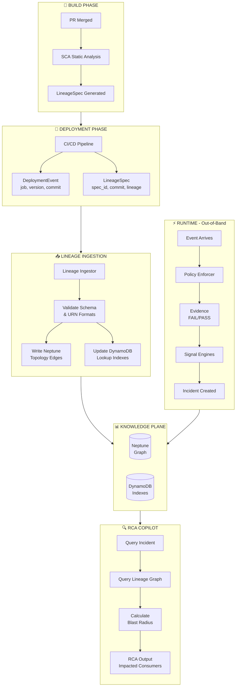

# SCA Element-Level Lineage - Process Flow

## Overview

This document illustrates the end-to-end flow of how SCA-generated lineage integrates with the Signal Factory platform for RCA enrichment.

---

## Architecture Flow Diagram



---

## Phase Descriptions

### Phase 1: Build (SCA Runs)

| Step | Action | Output |
|------|--------|--------|
| 1 | PR merged to main branch | Trigger for SCA analysis |
| 2 | SCA analyzes code statically | Extracts input/output datasets and columns |
| 3 | LineageSpec generated | JSON artifact with URNs and confidence |

**Key Extractions:**
- Input datasets + columns read
- Output datasets + columns written
- Transform mappings (input → output column relationships)
- Confidence scoring based on analysis quality

---

### Phase 2: Deployment (LineageSpec Published)

| Artifact | Contents | Purpose |
|----------|----------|---------|
| **DeploymentEvent** | job, version, commit, timestamp | Track what's deployed |
| **LineageSpec** | spec_id, commit, lineage, confidence | Design-time intent |

**Critical Join:** Both artifacts share the same `commit SHA`, enabling correlation between what was deployed and what lineage describes.

```
DeploymentEvent.commit = LineageSpec.ref.ref_value
```

---

### Phase 3: Lineage Ingestion (Asynchronous)

The Lineage Ingestor service:

1. **Consumes** LineageSpec from Kafka topic `signal_factory.lineage_specs`
2. **Validates** schema compliance and URN formats
3. **Writes Neptune** topology edges (bounded cardinality)
4. **Updates DynamoDB** lookup indexes for fast queries

**What Gets Written:**

| Storage | Content | Cardinality |
|---------|---------|-------------|
| Neptune | Dataset/Column nodes, READS/WRITES edges | Bounded (topology only) |
| DynamoDB | DatasetToReaders, ColumnToWriters indexes | O(producers × datasets) |

**What Does NOT Get Written:**
- Per-run execution edges
- Per-record lineage
- Full transform AST

---

### Phase 4: Runtime (Out-of-Band Enforcement)

The runtime path operates **independently of lineage**:

```
Event → Enforcer → Evidence → Signal Engine → Incident
```

| Component | Action | Uses Lineage? |
|-----------|--------|---------------|
| Policy Enforcer | Validates schema, contract | ❌ No |
| Evidence Emission | Records PASS/FAIL | ❌ No |
| Signal Engines | Computes health signals | ❌ No |
| Incident Creation | Creates SEV-1/2/3 | ❌ No |

**Why Lineage is Not Used Here:**
- Lineage describes *intent*, not *reality*
- Contract validation must be deterministic
- Lineage can be stale or incomplete
- Runtime gates cannot depend on design-time data

---

### Phase 5: RCA Copilot (Lineage Used Here)

When an incident occurs, RCA Copilot:

1. **Queries Incident** → Gets failure signature (e.g., `FIELD_REMOVED:payment_method`)
2. **Queries Lineage Graph** → Finds consumers of affected column
3. **Calculates Blast Radius** → Ranks impacted jobs by confidence
4. **Produces RCA Output** → Human-readable impact assessment

**Example Traversal:**
```
Incident(INC-001)
  → FailureSignature(FIELD_REMOVED:payment_method)
    → Column(payment_method)
      ← READS_COL ← Job(orders-delta-landing)
        → Deployment(@2026.01.16.1)
```

---

## Data Flow Summary

```
┌─────────────────────────────────────────────────────────────────────────────┐
│                                                                             │
│  ┌─────────┐    ┌─────────┐    ┌─────────┐    ┌─────────┐    ┌─────────┐   │
│  │  BUILD  │───▶│ DEPLOY  │───▶│ INGEST  │───▶│KNOWLEDGE│◀───│ RUNTIME │   │
│  │         │    │         │    │         │    │  PLANE  │    │         │   │
│  │ SCA     │    │ CI/CD   │    │ Lineage │    │         │    │Enforcer │   │
│  │ runs    │    │ emits   │    │ Ingestor│    │ Neptune │    │ Engines │   │
│  │         │    │ both    │    │ writes  │    │ DynamoDB│    │         │   │
│  └─────────┘    └─────────┘    └─────────┘    └────┬────┘    └─────────┘   │
│                                                    │                        │
│                                                    ▼                        │
│                                              ┌─────────┐                    │
│                                              │   RCA   │                    │
│                                              │ COPILOT │                    │
│                                              │         │                    │
│                                              │ Queries │                    │
│                                              │ graph   │                    │
│                                              └─────────┘                    │
│                                                                             │
└─────────────────────────────────────────────────────────────────────────────┘
```

---

## Key Principles

### The Golden Rule

> **Contract-lite gates answer:** "Is this data valid?"  
> **Lineage answers:** "Who cares if it isn't?"

### Separation of Concerns

| System | Truth Type | Timing |
|--------|------------|--------|
| Signal Factory | Runtime truth | Real-time |
| SCA Lineage | Design-time intent | Per-deployment |
| Knowledge Plane | Combined | Queryable |

### Why This Architecture Works

1. **Decoupled** - Lineage failures don't block runtime
2. **Scalable** - Bounded cardinality in graph
3. **Correct** - Runtime truth unaffected by stale lineage
4. **Valuable** - RCA gets blast radius without runtime coupling
